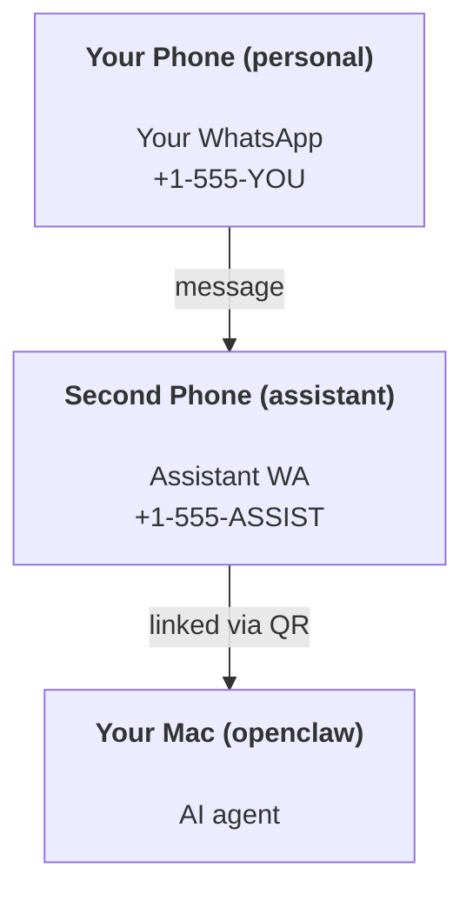

---
read_when:
    - 新しいアシスタントインスタンスのオンボーディング
    - 安全性と権限への影響を確認中
summary: 安全上の注意事項を含む、OpenClaw を個人アシスタントとして実行するためのエンドツーエンドガイド
title: 個人アシスタントのセットアップ
x-i18n:
    generated_at: "2026-05-02T22:22:40Z"
    model: gpt-5.5
    provider: openai
    source_hash: 9f6087d0756c98741166135df8b915eb5a0803b23e68e486d2d25ec98d4dca79
    source_path: start/openclaw.md
    workflow: 16
---

# OpenClaw でパーソナルアシスタントを構築する

OpenClaw は、Discord、Google Chat、iMessage、Matrix、Microsoft Teams、Signal、Slack、Telegram、WhatsApp、Zalo などを AI エージェントに接続するセルフホスト型 Gateway です。このガイドでは「パーソナルアシスタント」設定、つまり常時稼働の AI アシスタントのように動作する専用の WhatsApp 番号について説明します。

## ⚠️ まず安全性

エージェントには次のような権限を与えることになります。

- マシン上でコマンドを実行する（ツールポリシーによる）
- ワークスペース内のファイルを読み書きする
- WhatsApp/Telegram/Discord/Mattermost やその他の同梱チャンネル経由でメッセージを送り返す

保守的に始めてください。

- 必ず `channels.whatsapp.allowFrom` を設定する（個人用 Mac で世界中に開いた状態で実行しない）。
- アシスタント用に専用の WhatsApp 番号を使う。
- Heartbeat は現在、デフォルトで 30 分ごとです。設定を信頼できるまで、`agents.defaults.heartbeat.every: "0m"` を設定して無効化してください。

## 前提条件

- OpenClaw がインストール済みでオンボーディング済みであること — まだの場合は [はじめに](/ja-JP/start/getting-started) を参照
- アシスタント用の 2 つ目の電話番号（SIM/eSIM/プリペイド）

## 2 台の電話設定（推奨）

目指す構成はこれです。



個人用 WhatsApp を OpenClaw にリンクすると、あなた宛てのすべてのメッセージが「エージェント入力」になります。多くの場合、それは望む動作ではありません。

## 5 分のクイックスタート

1. WhatsApp Web をペアリングする（QR が表示されるので、アシスタント用の電話でスキャンします）。

```bash
openclaw channels login
```

2. Gateway を起動する（実行したままにします）。

```bash
openclaw gateway --port 18789
```

3. `~/.openclaw/openclaw.json` に最小構成を入れる。

```json5
{
  gateway: { mode: "local" },
  channels: { whatsapp: { allowFrom: ["+15555550123"] } },
}
```

これで、許可リストに入れた電話からアシスタント番号にメッセージを送れます。

オンボーディングが完了すると、OpenClaw はダッシュボードを自動で開き、クリーンな（トークン化されていない）リンクを出力します。ダッシュボードで認証を求められた場合は、設定済みの共有シークレットを Control UI 設定に貼り付けてください。オンボーディングはデフォルトでトークン（`gateway.auth.token`）を使いますが、`gateway.auth.mode` を `password` に切り替えている場合はパスワード認証も使えます。後で再度開くには `openclaw dashboard` を実行します。

## エージェントにワークスペースを与える（AGENTS）

OpenClaw は、ワークスペースディレクトリから運用指示と「メモリ」を読み取ります。

デフォルトでは、OpenClaw は `~/.openclaw/workspace` をエージェントワークスペースとして使い、セットアップ時または最初のエージェント実行時に、それとスターター用の `AGENTS.md`、`SOUL.md`、`TOOLS.md`、`IDENTITY.md`、`USER.md`、`HEARTBEAT.md` を自動作成します。`BOOTSTRAP.md` はワークスペースが完全に新規の場合にのみ作成されます（一度削除した後に戻ってくるべきではありません）。`MEMORY.md` は任意です（自動作成されません）。存在する場合は通常セッションで読み込まれます。サブエージェントセッションでは `AGENTS.md` と `TOOLS.md` のみが注入されます。

<Tip>
このフォルダを OpenClaw のメモリのように扱い、`AGENTS.md` とメモリファイルをバックアップできるように git リポジトリ（理想的には private）にしてください。git がインストールされている場合、新規ワークスペースは自動で初期化されます。
</Tip>

```bash
openclaw setup
```

完全なワークスペースレイアウトとバックアップガイド: [エージェントワークスペース](/ja-JP/concepts/agent-workspace)
メモリワークフロー: [メモリ](/ja-JP/concepts/memory)

任意: `agents.defaults.workspace` で別のワークスペースを選択できます（`~` 対応）。

```json5
{
  agents: {
    defaults: {
      workspace: "~/.openclaw/workspace",
    },
  },
}
```

リポジトリから独自のワークスペースファイルをすでに配布している場合は、ブートストラップファイルの作成を完全に無効化できます。

```json5
{
  agents: {
    defaults: {
      skipBootstrap: true,
    },
  },
}
```

## 「アシスタント」にするための設定

OpenClaw のデフォルトは良好なアシスタント設定ですが、通常は次を調整します。

- [`SOUL.md`](/ja-JP/concepts/soul) のペルソナ/指示
- 思考のデフォルト（必要な場合）
- Heartbeat（信頼できるようになった後）

例:

```json5
{
  logging: { level: "info" },
  agent: {
    model: "anthropic/claude-opus-4-6",
    workspace: "~/.openclaw/workspace",
    thinkingDefault: "high",
    timeoutSeconds: 1800,
    // Start with 0; enable later.
    heartbeat: { every: "0m" },
  },
  channels: {
    whatsapp: {
      allowFrom: ["+15555550123"],
      groups: {
        "*": { requireMention: true },
      },
    },
  },
  routing: {
    groupChat: {
      mentionPatterns: ["@openclaw", "openclaw"],
    },
  },
  session: {
    scope: "per-sender",
    resetTriggers: ["/new", "/reset"],
    reset: {
      mode: "daily",
      atHour: 4,
      idleMinutes: 10080,
    },
  },
}
```

## セッションとメモリ

- セッションファイル: `~/.openclaw/agents/<agentId>/sessions/{{SessionId}}.jsonl`
- セッションメタデータ（トークン使用量、最後のルートなど）: `~/.openclaw/agents/<agentId>/sessions/sessions.json`（レガシー: `~/.openclaw/sessions/sessions.json`）
- `/new` または `/reset` は、そのチャットの新しいセッションを開始します（`resetTriggers` で設定可能）。単独で送信された場合、OpenClaw はモデルを呼び出さずにリセットを確認します。
- `/compact [instructions]` はセッションコンテキストを compact し、残りのコンテキスト予算を報告します。

## Heartbeat（プロアクティブモード）

デフォルトでは、OpenClaw は 30 分ごとに次のプロンプトで Heartbeat を実行します。
`Read HEARTBEAT.md if it exists (workspace context). Follow it strictly. Do not infer or repeat old tasks from prior chats. If nothing needs attention, reply HEARTBEAT_OK.`
無効化するには `agents.defaults.heartbeat.every: "0m"` を設定します。

- `HEARTBEAT.md` が存在していても実質的に空（空行と `# Heading` のような Markdown 見出しのみ）の場合、OpenClaw は API 呼び出しを節約するために Heartbeat 実行をスキップします。
- ファイルがない場合でも Heartbeat は実行され、モデルが何をするかを決めます。
- エージェントが `HEARTBEAT_OK` と返信した場合（短い余白付きでも可。`agents.defaults.heartbeat.ackMaxChars` を参照）、OpenClaw はその Heartbeat の外向き配信を抑制します。
- デフォルトでは、DM 形式の `user:<id>` ターゲットへの Heartbeat 配信は許可されています。Heartbeat 実行を有効にしたまま直接ターゲット配信を抑制するには、`agents.defaults.heartbeat.directPolicy: "block"` を設定します。
- Heartbeat は完全なエージェントターンとして実行されます。間隔を短くすると、より多くのトークンを消費します。

```json5
{
  agent: {
    heartbeat: { every: "30m" },
  },
}
```

## メディアの入出力

受信添付ファイル（画像/音声/ドキュメント）は、テンプレート経由でコマンドに提示できます。

- `{{MediaPath}}`（ローカル一時ファイルパス）
- `{{MediaUrl}}`（疑似 URL）
- `{{Transcript}}`（音声文字起こしが有効な場合）

エージェントからの送信添付ファイル: `MEDIA:<path-or-url>` を独立した行に含めます（スペースなし）。例:

```
Here’s the screenshot.
MEDIA:https://example.com/screenshot.png
```

OpenClaw はこれらを抽出し、テキストと一緒にメディアとして送信します。

ローカルパスの動作は、エージェントと同じファイル読み取り信頼モデルに従います。

- `tools.fs.workspaceOnly` が `true` の場合、送信 `MEDIA:` のローカルパスは、OpenClaw 一時ルート、メディアキャッシュ、エージェントワークスペースパス、サンドボックス生成ファイルに制限されたままです。
- `tools.fs.workspaceOnly` が `false` の場合、送信 `MEDIA:` は、エージェントがすでに読み取りを許可されているホストローカルファイルを使用できます。
- ローカルパスは絶対パス、ワークスペース相対パス、または `~/` を使ったホーム相対パスにできます。
- ホストローカル送信でも、メディアと安全なドキュメントタイプ（画像、音声、動画、PDF、Office ドキュメント）のみが許可されます。プレーンテキストやシークレットのようなファイルは、送信可能なメディアとして扱われません。

つまり、ワークスペース外で生成された画像やファイルも、fs ポリシーがそれらの読み取りをすでに許可していれば送信できるようになり、任意のホストテキスト添付ファイルの外部流出を再び開くことはありません。

## 運用チェックリスト

```bash
openclaw status          # local status (creds, sessions, queued events)
openclaw status --all    # full diagnosis (read-only, pasteable)
openclaw status --deep   # asks the gateway for a live health probe with channel probes when supported
openclaw health --json   # gateway health snapshot (WS; default can return a fresh cached snapshot)
```

ログは `/tmp/openclaw/` 配下にあります（デフォルト: `openclaw-YYYY-MM-DD.log`）。

## 次のステップ

- WebChat: [WebChat](/ja-JP/web/webchat)
- Gateway 運用: [Gateway ランブック](/ja-JP/gateway)
- Cron + ウェイクアップ: [Cron ジョブ](/ja-JP/automation/cron-jobs)
- macOS メニューバーコンパニオン: [OpenClaw macOS アプリ](/ja-JP/platforms/macos)
- iOS ノードアプリ: [iOS アプリ](/ja-JP/platforms/ios)
- Android ノードアプリ: [Android アプリ](/ja-JP/platforms/android)
- Windows の状態: [Windows (WSL2)](/ja-JP/platforms/windows)
- Linux の状態: [Linux アプリ](/ja-JP/platforms/linux)
- セキュリティ: [セキュリティ](/ja-JP/gateway/security)

## 関連

- [はじめに](/ja-JP/start/getting-started)
- [セットアップ](/ja-JP/start/setup)
- [チャンネル概要](/ja-JP/channels)
