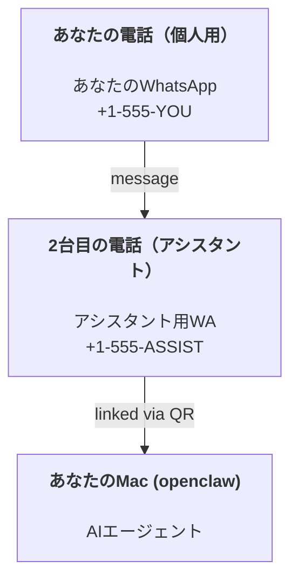

---
read_when:
    - 新しいアシスタントインスタンスのオンボーディング
    - 安全性/権限への影響の確認
summary: 安全上の注意を含む、OpenClawを個人用アシスタントとして実行するためのエンドツーエンドガイド
title: 個人用アシスタントのセットアップ
x-i18n:
  refreshed_at: '2026-04-28T05:23:26Z'
  generated_at: "2026-04-25T13:59:20Z"
  model: gpt-5.4
  provider: openai
  source_hash: 1647b78e8cf23a3a025969c52fbd8a73aed78df27698abf36bbf62045dc30e3b
  source_path: start/openclaw.md
  workflow: 15
---

# OpenClawで個人用アシスタントを構築する

OpenClawは、Discord、Google Chat、iMessage、Matrix、Microsoft Teams、Signal、Slack、Telegram、WhatsApp、ZaloなどをAIエージェントに接続するセルフホスト型Gatewayです。このガイドでは「個人用アシスタント」構成を扱います。つまり、常時稼働のAIアシスタントとして振る舞う専用のWhatsApp番号です。

## ⚠️ まず安全第一

エージェントに次のような権限を与えることになります:

- マシン上でコマンドを実行する
- workspace内のファイルを読み書きする
- WhatsApp/Telegram/Discord/Mattermostやその他のバンドル済みチャネル経由で外部へメッセージを送る

最初は保守的に始めてください:

- 必ず `channels.whatsapp.allowFrom` を設定してください（個人用Macで誰でも使える状態にしないでください）。
- アシスタント専用のWhatsApp番号を使ってください。
- Heartbeatは現在デフォルトで30分ごとです。セットアップを信頼できるまでは、`agents.defaults.heartbeat.every: "0m"` を設定して無効にしてください。

## 前提条件

- OpenClawがインストール済みでオンボーディング済みであること — まだなら [はじめに](/ja-JP/start/getting-started) を参照してください
- アシスタント用の2つ目の電話番号（SIM/eSIM/プリペイド）

## 2台の電話による構成（推奨）

目指す構成はこれです:



個人用WhatsAppをOpenClawにリンクすると、あなた宛てのすべてのメッセージが「エージェント入力」になります。これはたいてい望ましい構成ではありません。

## 5分でできるクイックスタート

1. WhatsApp Webをペアリングします（QRが表示されるので、アシスタント用の電話でスキャンします）:

```bash
openclaw channels login
```

2. Gatewayを起動します（起動したままにします）:

```bash
openclaw gateway --port 18789
```

3. 最小構成を `~/.openclaw/openclaw.json` に置きます:

```json5
{
  gateway: { mode: "local" },
  channels: { whatsapp: { allowFrom: ["+15555550123"] } },
}
```

これで、許可リストに入っているあなたの電話からアシスタント番号へメッセージを送れます。

オンボーディングが完了すると、OpenClawは自動でダッシュボードを開き、きれいな（トークン化されていない）リンクを表示します。ダッシュボードがauthを求める場合は、設定済みのshared secretをControl UI settingsに貼り付けてください。オンボーディングはデフォルトでtoken（`gateway.auth.token`）を使いますが、`gateway.auth.mode` を `password` に切り替えている場合はpassword authでも動作します。後で再度開くには: `openclaw dashboard`。

## エージェントにworkspaceを与える（AGENTS）

OpenClawは、workspace directoryから操作指示と「memory」を読み込みます。

デフォルトでは、OpenClawは `~/.openclaw/workspace` をagent workspaceとして使い、セットアップ時または最初のagent実行時に自動で作成します（スターターの `AGENTS.md`, `SOUL.md`, `TOOLS.md`, `IDENTITY.md`, `USER.md`, `HEARTBEAT.md` も作成します）。`BOOTSTRAP.md` はworkspaceが新規のときだけ作成されます（削除した後に再作成されるべきではありません）。`MEMORY.md` は任意です（自動作成されません）。存在する場合は通常sessionで読み込まれます。subagent sessionでは `AGENTS.md` と `TOOLS.md` だけが注入されます。

ヒント: このフォルダーをOpenClawの「memory」と考え、git repo（できればprivate）にして `AGENTS.md` + memory fileをバックアップしてください。gitがインストールされていれば、新規workspaceは自動で初期化されます。

```bash
openclaw setup
```

完全なworkspace layout + バックアップガイド: [Agent workspace](/ja-JP/concepts/agent-workspace)
memoryワークフロー: [Memory](/ja-JP/concepts/memory)

任意: `agents.defaults.workspace` で別のworkspaceを選べます（`~` をサポート）。

```json5
{
  agents: {
    defaults: {
      workspace: "~/.openclaw/workspace",
    },
  },
}
```

すでにrepoから独自のworkspace fileを提供している場合は、bootstrap file作成を完全に無効化できます:

```json5
{
  agents: {
    defaults: {
      skipBootstrap: true,
    },
  },
}
```

## 「アシスタント」にするためのconfig

OpenClawはデフォルトでも良いアシスタント構成ですが、通常は次を調整したくなります:

- [`SOUL.md`](/ja-JP/concepts/soul) のpersona/指示
- thinkingのデフォルト（必要なら）
- Heartbeat（信頼できるようになってから）

例:

```json5
{
  logging: { level: "info" },
  agent: {
  model: "anthropic/claude-opus-4-6",
    workspace: "~/.openclaw/workspace",
    thinkingDefault: "high",
    timeoutSeconds: 1800,
    // 最初は0にしておき、後で有効化する。
    heartbeat: { every: "0m" },
  },
  channels: {
    whatsapp: {
      allowFrom: ["+15555550123"],
      groups: {
        "*": { requireMention: true },
      },
    },
  },
  routing: {
    groupChat: {
      mentionPatterns: ["@openclaw", "openclaw"],
    },
  },
  session: {
    scope: "per-sender",
    resetTriggers: ["/new", "/reset"],
    reset: {
      mode: "daily",
      atHour: 4,
      idleMinutes: 10080,
    },
  },
}
```

## セッションとmemory

- Session file: `~/.openclaw/agents/<agentId>/sessions/{{SessionId}}.jsonl`
- Session metadata（token usage、last routeなど）: `~/.openclaw/agents/<agentId>/sessions/sessions.json` （legacy: `~/.openclaw/sessions/sessions.json`）
- `/new` または `/reset` で、そのchatの新しいsessionを開始します（`resetTriggers` で設定可能）。単独で送ると、agentはreset確認のため短いhelloで応答します。
- `/compact [instructions]` はsession contextをCompactionし、残りのcontext予算を報告します。

## Heartbeat（プロアクティブモード）

デフォルトでは、OpenClawは30分ごとに次のプロンプトでHeartbeatを実行します:
`Read HEARTBEAT.md if it exists (workspace context). Follow it strictly. Do not infer or repeat old tasks from prior chats. If nothing needs attention, reply HEARTBEAT_OK.`
無効にするには `agents.defaults.heartbeat.every: "0m"` を設定してください。

- `HEARTBEAT.md` が存在しても実質的に空（空行と `# Heading` のようなmarkdown headerだけ）なら、OpenClawはAPI call節約のためHeartbeat実行をスキップします。
- fileがなくても、Heartbeatは実行され、何をするかはmodelが決めます。
- agentが `HEARTBEAT_OK` で応答した場合（必要なら短い余白を含んでも可。`agents.defaults.heartbeat.ackMaxChars` を参照）、OpenClawはそのHeartbeatの送信配信を抑制します。
- デフォルトでは、DM形式の `user:<id>` ターゲットへのHeartbeat配信は許可されます。Heartbeat実行は維持したまま直接ターゲットへの配信を抑制するには `agents.defaults.heartbeat.directPolicy: "block"` を設定してください。
- Heartbeatは完全なagent turnとして実行されます — 間隔を短くするほどtokenを多く消費します。

```json5
{
  agent: {
    heartbeat: { every: "30m" },
  },
}
```

## メディアの入力と出力

受信添付ファイル（画像/音声/ドキュメント）は、template経由でcommandに渡せます:

- `{{MediaPath}}`（ローカル一時file path）
- `{{MediaUrl}}`（疑似URL）
- `{{Transcript}}`（音声文字起こしが有効な場合）

agentからの送信添付ファイル: 独立した行に `MEDIA:<path-or-url>` を含めます（スペースなし）。例:

```
Here’s the screenshot.
MEDIA:https://example.com/screenshot.png
```

OpenClawはこれを抽出し、テキストと一緒にメディアとして送信します。

ローカルpathの挙動は、agentと同じfile-read trust modelに従います:

- `tools.fs.workspaceOnly` が `true` の場合、送信する `MEDIA:` のローカルpathは、OpenClaw temp root、media cache、agent workspace path、sandbox生成fileに制限されます。
- `tools.fs.workspaceOnly` が `false` の場合、送信する `MEDIA:` は、agentがすでに読み取りを許可されているhostローカルfileを使えます。
- hostローカル送信でも、許可されるのはメディアと安全なdocument typeのみです（画像、音声、動画、PDF、Office document）。平文テキストやsecretらしいfileは送信可能メディアとして扱われません。

つまり、workspace外で生成された画像/fileも、fs policyがそれらの読み取りをすでに許可していれば送信でき、任意のhostテキスト添付による情報流出を再び開くことはありません。

## 運用チェックリスト

```bash
openclaw status          # ローカルstatus（creds、sessions、queued events）
openclaw status --all    # 完全診断（read-only、貼り付け可能）
openclaw status --deep   # Gatewayに、チャネルprobeを含むライブヘルスプローブを問い合わせる（対応時）
openclaw health --json   # Gateway health snapshot（WS。デフォルトでは新しいキャッシュ済みsnapshotを返すことがある）
```

ログは `/tmp/openclaw/` 配下にあります（デフォルト: `openclaw-YYYY-MM-DD.log`）。

## 次のステップ

- WebChat: [WebChat](/ja-JP/web/webchat)
- Gateway運用: [Gatewayランブック](/ja-JP/gateway)
- Cron + wakeup: [Cron jobs](/ja-JP/automation/cron-jobs)
- macOSメニューバーcompanion: [OpenClaw macOS app](/ja-JP/platforms/macos)
- iOS nodeアプリ: [iOS app](/ja-JP/platforms/ios)
- Android nodeアプリ: [Android app](/ja-JP/platforms/android)
- Windows状況: [Windows (WSL2)](/ja-JP/platforms/windows)
- Linux状況: [Linux app](/ja-JP/platforms/linux)
- セキュリティ: [Security](/ja-JP/gateway/security)

## 関連

- [はじめに](/ja-JP/start/getting-started)
- [Setup](/ja-JP/start/setup)
- [Channels overview](/ja-JP/channels)
