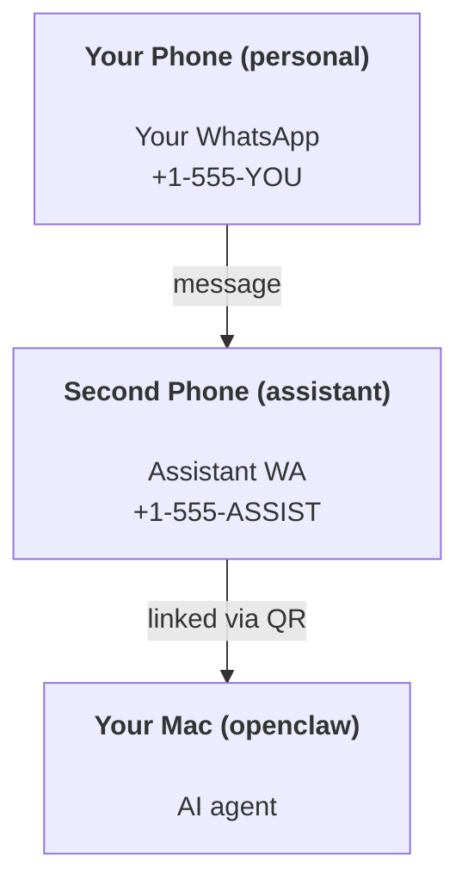

---
read_when:
    - 新しいアシスタントインスタンスのオンボーディング
    - 安全性/権限への影響をレビューする
summary: 安全上の注意を含む、OpenClaw をパーソナルアシスタントとして実行するためのエンドツーエンドガイド
title: 個人アシスタントのセットアップ
x-i18n:
    generated_at: "2026-06-27T13:05:38Z"
    model: gpt-5.5
    postprocess_version: locale-links-v1
    provider: openai
    source_hash: b0cd640872a2a60fd88d2dc3df6d038ef8574163430d8683ef9b67921b0c87f4
    source_path: start/openclaw.md
    workflow: 16
---

OpenClaw は、Discord、Google Chat、iMessage、Matrix、Microsoft Teams、Signal、Slack、Telegram、WhatsApp、Zalo などを AI エージェントに接続するセルフホスト型 Gateway です。このガイドでは「パーソナルアシスタント」セットアップ、つまり常時稼働する AI アシスタントのように振る舞う専用 WhatsApp 番号について説明します。

## ⚠️ 安全を最優先

エージェントには次のことができる立場を与えることになります。

- マシン上でコマンドを実行する（ツールポリシーによる）
- ワークスペース内のファイルを読み書きする
- WhatsApp/Telegram/Discord/Mattermost やその他の同梱チャンネル経由でメッセージを返信する

保守的に始めてください。

- 必ず `channels.whatsapp.allowFrom` を設定する（個人用 Mac で世界中に開いた状態で実行しない）。
- アシスタント用に専用の WhatsApp 番号を使う。
- Heartbeat は現在、デフォルトで 30 分ごとです。セットアップを信頼できるまでは、`agents.defaults.heartbeat.every: "0m"` を設定して無効にしてください。

## 前提条件

- OpenClaw がインストールされ、オンボーディング済みであること - まだの場合は [はじめに](/ja-JP/start/getting-started) を参照してください
- アシスタント用の 2 つ目の電話番号（SIM/eSIM/プリペイド）

## 2 台の電話によるセットアップ（推奨）

目指す構成は次のとおりです。



個人用 WhatsApp を OpenClaw にリンクすると、あなた宛てのすべてのメッセージが「エージェント入力」になります。これは通常、望む動作ではありません。

## 5 分でできるクイックスタート

1. WhatsApp Web をペアリングします（QR が表示されるので、アシスタント用の電話でスキャンします）。

```bash
openclaw channels login
```

2. Gateway を起動します（実行したままにします）。

```bash
openclaw gateway --port 18789
```

3. `~/.openclaw/openclaw.json` に最小構成を入れます。

```json5
{
  gateway: { mode: "local" },
  channels: { whatsapp: { allowFrom: ["+15555550123"] } },
}
```

これで、許可リストに入れた電話からアシスタント番号にメッセージを送ります。

オンボーディングが完了すると、OpenClaw はダッシュボードを自動で開き、クリーンな（トークン化されていない）リンクを表示します。ダッシュボードで認証を求められた場合は、設定済みの共有シークレットを Control UI 設定に貼り付けます。オンボーディングではデフォルトでトークン（`gateway.auth.token`）を使いますが、`gateway.auth.mode` を `password` に切り替えている場合はパスワード認証も使えます。後で再度開くには、`openclaw dashboard` を使います。

## エージェントにワークスペースを与える（AGENTS）

OpenClaw はワークスペースディレクトリから操作指示と「メモリ」を読み取ります。

デフォルトでは、OpenClaw はエージェントワークスペースとして `~/.openclaw/workspace` を使用し、セットアップ時または初回エージェント実行時にそれを（スターターの `AGENTS.md`、`SOUL.md`、`TOOLS.md`、`IDENTITY.md`、`USER.md`、`HEARTBEAT.md` とともに）自動作成します。`BOOTSTRAP.md` はワークスペースが完全に新規の場合にのみ作成されます（一度削除した後に戻ってくるべきではありません）。`MEMORY.md` は任意です（自動作成されません）。存在する場合は、通常セッションで読み込まれます。サブエージェントセッションでは `AGENTS.md` と `TOOLS.md` のみが注入されます。

<Tip>
このフォルダーは OpenClaw のメモリとして扱い、`AGENTS.md` とメモリファイルがバックアップされるように git リポジトリ（理想的には非公開）にしてください。git がインストールされている場合、新規ワークスペースは自動で初期化されます。
</Tip>

```bash
openclaw setup
```

完全なワークスペースレイアウトとバックアップガイド: [エージェントワークスペース](/ja-JP/concepts/agent-workspace)
メモリワークフロー: [メモリ](/ja-JP/concepts/memory)

任意: `agents.defaults.workspace` で別のワークスペースを選択します（`~` をサポート）。

```json5
{
  agents: {
    defaults: {
      workspace: "~/.openclaw/workspace",
    },
  },
}
```

すでに自分のリポジトリからワークスペースファイルを配布している場合は、ブートストラップファイルの作成を完全に無効化できます。

```json5
{
  agents: {
    defaults: {
      skipBootstrap: true,
    },
  },
}
```

## 「アシスタント」にする設定

OpenClaw のデフォルトは良好なアシスタントセットアップですが、通常は次を調整します。

- [`SOUL.md`](/ja-JP/concepts/soul) のペルソナ/指示
- 思考のデフォルト（必要な場合）
- Heartbeat（信頼できるようになってから）

例:

```json5
{
  logging: { level: "info" },
  agents: {
    defaults: {
      model: { primary: "anthropic/claude-opus-4-6" },
      workspace: "~/.openclaw/workspace",
      thinkingDefault: "high",
      timeoutSeconds: 1800,
      // Start with 0; enable later.
      heartbeat: { every: "0m" },
    },
    list: [
      {
        id: "main",
        default: true,
        groupChat: {
          mentionPatterns: ["@openclaw", "openclaw"],
        },
      },
    ],
  },
  channels: {
    whatsapp: {
      allowFrom: ["+15555550123"],
      groups: {
        "*": { requireMention: true },
      },
    },
  },
  session: {
    scope: "per-sender",
    resetTriggers: ["/new", "/reset"],
    reset: {
      mode: "daily",
      atHour: 4,
      idleMinutes: 10080,
    },
  },
}
```

## セッションとメモリ

- セッションファイル: `~/.openclaw/agents/<agentId>/sessions/{{SessionId}}.jsonl`
- セッションメタデータ（トークン使用量、最後のルートなど）: `~/.openclaw/agents/<agentId>/sessions/sessions.json`（レガシー: `~/.openclaw/sessions/sessions.json`）
- `/new` または `/reset` は、そのチャット用に新しいセッションを開始します（`resetTriggers` で設定可能）。単独で送信された場合、OpenClaw はモデルを呼び出さずにリセットを確認します。
- `/compact [instructions]` はセッションコンテキストを圧縮し、残りのコンテキスト予算を報告します。

## Heartbeat（プロアクティブモード）

デフォルトでは、OpenClaw は次のプロンプトで 30 分ごとに Heartbeat を実行します。
`Read HEARTBEAT.md if it exists (workspace context). Follow it strictly. Do not infer or repeat old tasks from prior chats. If nothing needs attention, reply HEARTBEAT_OK.`
無効化するには `agents.defaults.heartbeat.every: "0m"` を設定します。

- `HEARTBEAT.md` が存在していても実質的に空（空行のみ、Markdown/HTML コメント、`# Heading` のような Markdown 見出し、フェンスマーカー、空のチェックリストスタブ）である場合、OpenClaw は API 呼び出しを節約するために Heartbeat 実行をスキップします。
- ファイルがない場合でも Heartbeat は実行され、モデルが何をするかを決定します。
- エージェントが `HEARTBEAT_OK` で応答した場合（短い余白付きも可。`agents.defaults.heartbeat.ackMaxChars` を参照）、OpenClaw はその Heartbeat の外部配信を抑制します。
- デフォルトでは、DM 形式の `user:<id>` ターゲットへの Heartbeat 配信は許可されています。Heartbeat 実行は有効なまま直接ターゲット配信を抑制するには、`agents.defaults.heartbeat.directPolicy: "block"` を設定します。
- Heartbeat は完全なエージェントターンを実行します。間隔を短くすると、より多くのトークンを消費します。

```json5
{
  agents: {
    defaults: {
      heartbeat: { every: "30m" },
    },
  },
}
```

## メディアの入出力

受信添付ファイル（画像/音声/ドキュメント）は、テンプレート経由でコマンドに提示できます。

- `{{MediaPath}}`（ローカル一時ファイルパス）
- `{{MediaUrl}}`（擬似 URL）
- `{{Transcript}}`（音声文字起こしが有効な場合）

エージェントからの送信添付ファイルは、メッセージツールまたは返信ペイロード上の構造化メディアフィールドを使います。たとえば `media`、`mediaUrl`、`mediaUrls`、`path`、`filePath` です。メッセージツール引数の例:

```json
{
  "message": "Here's the screenshot.",
  "mediaUrl": "https://example.com/screenshot.png"
}
```

OpenClaw はテキストと一緒に構造化メディアを送信します。レガシーの最終アシスタント返信は互換性のために正規化される場合がありますが、ツール出力、ブラウザー出力、ストリーミングブロック、メッセージアクションは、添付ファイルコマンドとしてテキストを解析しません。

ローカルパスの動作は、エージェントと同じファイル読み取り信頼モデルに従います。

- `tools.fs.workspaceOnly` が `true` の場合、送信ローカルメディアパスは OpenClaw 一時ルート、メディアキャッシュ、エージェントワークスペースパス、サンドボックスで生成されたファイルに制限されます。
- `tools.fs.workspaceOnly` が `false` の場合、送信ローカルメディアは、エージェントがすでに読み取りを許可されているホストローカルファイルを使用できます。
- ローカルパスは、絶対パス、ワークスペース相対パス、または `~/` を使ったホーム相対パスにできます。
- ホストローカル送信では、それでもメディアと安全なドキュメントタイプ（画像、音声、動画、PDF、Office ドキュメント、Markdown/MD、TXT、JSON、YAML、YML などの検証済みテキストドキュメント）のみが許可されます。これは既存のホスト読み取り信頼境界の拡張であり、シークレットスキャナーではありません。エージェントがホストローカルの `secret.txt` や `config.json` を読み取れる場合、拡張子とコンテンツ検証が一致すれば、そのファイルを添付できます。

つまり、fs ポリシーがすでにそれらの読み取りを許可している場合、ワークスペース外で生成された画像/ファイルも送信できるようになりました。一方で、任意のホストローカルテキスト拡張子は引き続きブロックされます。機密ファイルはエージェントが読み取れるファイルシステムの外に置くか、より厳格なローカルパス送信のために `tools.fs.workspaceOnly=true` を維持してください。

## 運用チェックリスト

```bash
openclaw status          # local status (creds, sessions, queued events)
openclaw status --all    # full diagnosis (read-only, pasteable)
openclaw status --deep   # asks the gateway for a live health probe with channel probes when supported
openclaw health --json   # gateway health snapshot (WS; default can return a fresh cached snapshot)
```

ログは `/tmp/openclaw/` 配下にあります（デフォルト: `openclaw-YYYY-MM-DD.log`）。

## 次のステップ

- WebChat: [WebChat](/ja-JP/web/webchat)
- Gateway 運用: [Gateway ランブック](/ja-JP/gateway)
- Cron + ウェイクアップ: [Cron ジョブ](/ja-JP/automation/cron-jobs)
- macOS メニューバーコンパニオン: [OpenClaw macOS アプリ](/ja-JP/platforms/macos)
- iOS ノードアプリ: [iOS アプリ](/ja-JP/platforms/ios)
- Android ノードアプリ: [Android アプリ](/ja-JP/platforms/android)
- Windows Hub: [Windows](/ja-JP/platforms/windows)
- Linux の状況: [Linux アプリ](/ja-JP/platforms/linux)
- セキュリティ: [セキュリティ](/ja-JP/gateway/security)

## 関連

- [はじめに](/ja-JP/start/getting-started)
- [セットアップ](/ja-JP/start/setup)
- [チャンネル概要](/ja-JP/channels)
