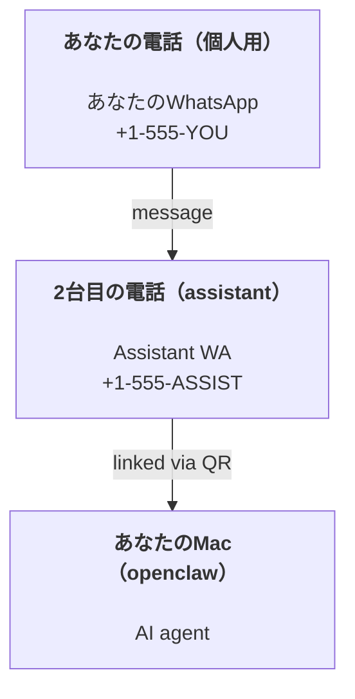

---
read_when:
    - 新しいassistantインスタンスのオンボーディング
    - 安全性と権限への影響を確認する
summary: 安全上の注意を含む、OpenClawをパーソナルassistantとして実行するためのエンドツーエンドガイド
title: パーソナルassistantのセットアップ
x-i18n:
    generated_at: "2026-04-24T05:21:54Z"
    model: gpt-5.4
    provider: openai
    source_hash: 3048f2faae826fc33d962f1fac92da3c0ce464d2de803fee381c897eb6c76436
    source_path: start/openclaw.md
    workflow: 15
---

# OpenClawでパーソナルassistantを構築する

OpenClawは、Discord、Google Chat、iMessage、Matrix、Microsoft Teams、Signal、Slack、Telegram、WhatsApp、ZaloなどをAI agentに接続するself-hosted Gatewayです。このガイドでは「パーソナルassistant」構成を扱います。つまり、常時稼働するAI assistantとして振る舞う専用のWhatsApp番号です。

## ⚠️ まず安全性を優先する

agentに次のことができる位置を与えることになります:

- マシン上でcommandを実行する（tool policyによる）
- workspace内のfileを読み書きする
- WhatsApp/Telegram/Discord/Mattermostやその他の同梱channel経由でメッセージを外部送信する

最初は保守的に始めてください:

- 必ず `channels.whatsapp.allowFrom` を設定する（個人用Macでworld-openな構成では絶対に運用しない）。
- assistantには専用のWhatsApp番号を使う。
- Heartbeatは現在デフォルトで30分ごとです。セットアップを信頼できるようになるまでは、`agents.defaults.heartbeat.every: "0m"` を設定して無効にしてください。

## 前提条件

- OpenClawがインストール済みでオンボーディング済みであること。まだなら [はじめに](/ja-JP/start/getting-started) を参照してください
- assistant用の2つ目の電話番号（SIM/eSIM/prepaid）

## 2台の電話による構成（推奨）

目指す構成はこれです:



個人用のWhatsAppをOpenClawにリンクすると、あなた宛てのすべてのメッセージが「agent input」になります。これはたいてい望ましくありません。

## 5分で始めるクイックスタート

1. WhatsApp Webをペアリングする（QRが表示されるので、assistant用の電話でスキャンします）:

```bash
openclaw channels login
```

2. Gatewayを起動する（起動したままにしておきます）:

```bash
openclaw gateway --port 18789
```

3. 最小構成を `~/.openclaw/openclaw.json` に入れます:

```json5
{
  gateway: { mode: "local" },
  channels: { whatsapp: { allowFrom: ["+15555550123"] } },
}
```

これで、allowlistに入っているあなたの電話からassistant番号へメッセージを送ってください。

オンボーディングが終わると、OpenClawは自動でdashboardを開き、クリーンな（token化されていない）リンクを表示します。dashboardでauthを求められた場合は、設定済みの共有secretをControl UI settingsに貼り付けてください。オンボーディングはデフォルトでtoken（`gateway.auth.token`）を使いますが、`gateway.auth.mode` を `password` に切り替えているならpassword authも使えます。後で再度開くには: `openclaw dashboard`。

## agentにworkspaceを与える（AGENTS）

OpenClawは、workspace directoryから運用指示と「memory」を読み取ります。

デフォルトでは、OpenClawは `~/.openclaw/workspace` をagent workspaceとして使い、セットアップ時または初回agent実行時に自動で作成します（スターターの `AGENTS.md`, `SOUL.md`, `TOOLS.md`, `IDENTITY.md`, `USER.md`, `HEARTBEAT.md` も含む）。`BOOTSTRAP.md` はworkspaceが完全に新規のときだけ作成されます（削除したあとに再作成されるべきではありません）。`MEMORY.md` は任意です（自動作成されません）。存在する場合は通常sessionで読み込まれます。subagent sessionでは `AGENTS.md` と `TOOLS.md` だけが注入されます。

Tip: このfolderをOpenClawの「memory」として扱い、git repo（できればprivate）にしておくと、`AGENTS.md` とmemory fileをバックアップできます。gitがインストールされていれば、新規workspaceは自動で初期化されます。

```bash
openclaw setup
```

workspace layout全体とバックアップガイド: [Agent workspace](/ja-JP/concepts/agent-workspace)  
memory workflow: [Memory](/ja-JP/concepts/memory)

任意: `agents.defaults.workspace` で別のworkspaceを選べます（`~` をサポート）。

```json5
{
  agent: {
    workspace: "~/.openclaw/workspace",
  },
}
```

すでにrepoから独自のworkspace fileを提供している場合は、bootstrap file作成を完全に無効にできます:

```json5
{
  agent: {
    skipBootstrap: true,
  },
}
```

## これを「assistant」にする設定

OpenClawはassistant向けに良いデフォルトを持っていますが、通常は次を調整したくなります:

- [`SOUL.md`](/ja-JP/concepts/soul) 内のpersona/instructions
- thinkingのデフォルト（必要なら）
- Heartbeat（信頼できるようになってから）

例:

```json5
{
  logging: { level: "info" },
  agent: {
    model: "anthropic/claude-opus-4-6",
    workspace: "~/.openclaw/workspace",
    thinkingDefault: "high",
    timeoutSeconds: 1800,
    // 最初は0にする。あとで有効化する。
    heartbeat: { every: "0m" },
  },
  channels: {
    whatsapp: {
      allowFrom: ["+15555550123"],
      groups: {
        "*": { requireMention: true },
      },
    },
  },
  routing: {
    groupChat: {
      mentionPatterns: ["@openclaw", "openclaw"],
    },
  },
  session: {
    scope: "per-sender",
    resetTriggers: ["/new", "/reset"],
    reset: {
      mode: "daily",
      atHour: 4,
      idleMinutes: 10080,
    },
  },
}
```

## セッションとmemory

- Session file: `~/.openclaw/agents/<agentId>/sessions/{{SessionId}}.jsonl`
- Session metadata（token usage、last routeなど）: `~/.openclaw/agents/<agentId>/sessions/sessions.json`（legacy: `~/.openclaw/sessions/sessions.json`）
- `/new` または `/reset` は、そのchatの新しいsessionを開始します（`resetTriggers` で設定可能）。それだけを送ると、agentはreset確認用の短いhelloを返します。
- `/compact [instructions]` はsession contextをCompactionし、残りのcontext budgetを報告します。

## Heartbeat（proactive mode）

デフォルトでは、OpenClawは30分ごとに次のpromptでheartbeatを実行します:  
`Read HEARTBEAT.md if it exists (workspace context). Follow it strictly. Do not infer or repeat old tasks from prior chats. If nothing needs attention, reply HEARTBEAT_OK.`
無効にするには `agents.defaults.heartbeat.every: "0m"` を設定してください。

- `HEARTBEAT.md` が存在しても、実質的に空（空行と `# Heading` のようなmarkdown headerだけ）の場合、OpenClawはAPI call節約のためheartbeat実行をスキップします。
- fileが存在しなくてもheartbeatは実行され、何をするかはmodelが判断します。
- agentが `HEARTBEAT_OK` で応答した場合（任意で短いpaddingを含められます。`agents.defaults.heartbeat.ackMaxChars` を参照）、OpenClawはそのheartbeatのoutbound deliveryを抑止します。
- デフォルトでは、DMスタイルの `user:<id>` targetへのheartbeat deliveryは許可されています。heartbeat実行自体は維持しつつdirect-target deliveryを抑止するには、`agents.defaults.heartbeat.directPolicy: "block"` を設定してください。
- Heartbeatは完全なagent turnを実行します。間隔を短くするとより多くのtokenを消費します。

```json5
{
  agent: {
    heartbeat: { every: "30m" },
  },
}
```

## メディアの入力と出力

受信attachment（画像/音声/doc）はtemplate経由でcommandに渡せます:

- `{{MediaPath}}`（ローカルtemp file path）
- `{{MediaUrl}}`（擬似URL）
- `{{Transcript}}`（音声文字起こしが有効な場合）

agentからの送信attachment: 独立した行に `MEDIA:<path-or-url>` を含めてください（空白なし）。例:

```
Here’s the screenshot.
MEDIA:https://example.com/screenshot.png
```

OpenClawはこれを抽出し、textと一緒にmediaとして送信します。

local pathの挙動は、agentと同じfile-read trust modelに従います:

- `tools.fs.workspaceOnly` が `true` の場合、送信 `MEDIA:` のlocal pathは、OpenClaw temp root、media cache、agent workspace path、sandbox生成fileに制限されます。
- `tools.fs.workspaceOnly` が `false` の場合、送信 `MEDIA:` では、agentがすでに読み取りを許可されているhost-local fileを使えます。
- host-local送信でも、許可されるのはmediaと安全なdocument type（画像、音声、動画、PDF、Office document）のみです。平文textやsecretらしいfileは送信可能mediaとして扱われません。

つまり、fs policyがすでにそれらの読み取りを許可しているなら、workspace外で生成された画像/fileも送信できるようになりつつ、任意のhost text attachment流出を再び開いてしまうことはありません。

## 運用チェックリスト

```bash
openclaw status          # ローカルstatus（credential、session、queued event）
openclaw status --all    # 完全診断（read-only、貼り付け可能）
openclaw status --deep   # 可能な場合はchannel probe付きでgatewayにlive health probeを問い合わせる
openclaw health --json   # gateway health snapshot（WS。デフォルトでは新しくキャッシュされたsnapshotを返すことがある）
```

logは `/tmp/openclaw/` 配下にあります（デフォルト: `openclaw-YYYY-MM-DD.log`）。

## 次のステップ

- WebChat: [WebChat](/ja-JP/web/webchat)
- Gateway運用: [Gateway runbook](/ja-JP/gateway)
- Cronとwakeups: [Cron jobs](/ja-JP/automation/cron-jobs)
- macOS menu bar companion: [OpenClaw macOS app](/ja-JP/platforms/macos)
- iOS Node app: [iOS app](/ja-JP/platforms/ios)
- Android Node app: [Android app](/ja-JP/platforms/android)
- Windowsの状況: [Windows (WSL2)](/ja-JP/platforms/windows)
- Linuxの状況: [Linux app](/ja-JP/platforms/linux)
- セキュリティ: [Security](/ja-JP/gateway/security)

## 関連

- [はじめに](/ja-JP/start/getting-started)
- [セットアップ](/ja-JP/start/setup)
- [Channels overview](/ja-JP/channels)
