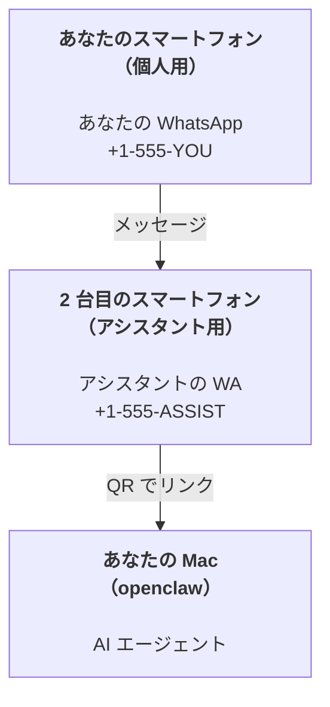

---
read_when:
    - 新しいアシスタントインスタンスのオンボーディング
    - 安全性と権限への影響の確認
summary: 安全上の注意事項を含む、OpenClaw をパーソナルアシスタントとして運用するためのエンドツーエンドガイド
title: パーソナルアシスタントのセットアップ
x-i18n:
    generated_at: "2026-07-12T14:54:03Z"
    model: gpt-5.6
    postprocess_version: locale-links-v1
    prompt_version: 15
    provider: openai
    source_hash: e8c34e31314f55647059fd600935330110add27b338a675bc0ce1529bebb207d
    source_path: start/openclaw.md
    workflow: 16
---

OpenClaw は、Discord、Google Chat、iMessage、Matrix、Microsoft Teams、Signal、Slack、Telegram、WhatsApp、Zalo などを AI エージェントに接続するセルフホスト型 Gateway です。このガイドでは、「パーソナルアシスタント」のセットアップ、つまり常時稼働する AI アシスタントのように動作する専用の WhatsApp 番号について説明します。

## まずは安全性を確保

エージェントにチャンネルを与えると、ツールポリシーに応じて、マシン上でコマンドを実行し、ワークスペース内のファイルを読み書きし、接続済みの任意のチャンネル経由でメッセージを送信できるようになります。最初は制限を厳しく設定してください。

- 必ず `channels.whatsapp.allowFrom` を設定してください（個人用 Mac で全世界に公開された状態では決して実行しないでください）。
- アシスタントには専用の WhatsApp 番号を使用してください。
- Heartbeat のデフォルト間隔は 30 分です。セットアップを信頼できるようになるまでは、`agents.defaults.heartbeat.every: "0m"` を設定して無効にしてください。

## 前提条件

- OpenClaw がインストールされ、オンボーディングが完了していること。まだの場合は、[はじめに](/ja-JP/start/getting-started)を参照してください
- アシスタント用の 2 つ目の電話番号（SIM/eSIM/プリペイド）

## 2 台のスマートフォンを使うセットアップ（推奨）

次の構成にします。



個人用 WhatsApp を OpenClaw にリンクすると、あなた宛てのすべてのメッセージが「エージェントへの入力」になります。通常、これは望ましい動作ではありません。

## 5 分でできるクイックスタート

1. WhatsApp Web をペアリングします（QR が表示されるので、アシスタント用スマートフォンでスキャンします）。

```bash
openclaw channels login
```

2. Gateway を起動します（起動したままにします）。

```bash
openclaw gateway --port 18789
```

3. 最小限の設定を `~/.openclaw/openclaw.json` に記述します。

```json5
{
  gateway: { mode: "local" },
  channels: { whatsapp: { allowFrom: ["+15555550123"] } },
}
```

次に、許可リストに登録したスマートフォンからアシスタント番号にメッセージを送信します。

オンボーディングが完了すると、OpenClaw はダッシュボードを自動的に開き、トークンを含まないクリーンなリンクを表示します。ダッシュボードで認証を求められた場合は、設定済みの共有シークレットを Control UI の設定に貼り付けてください。オンボーディングではデフォルトでトークン（`gateway.auth.token`）を使用しますが、`gateway.auth.mode` を `password` に変更している場合は、パスワード認証も使用できます。後で再度開くには、`openclaw dashboard` を実行します。

## エージェントにワークスペースを与える（AGENTS）

OpenClaw は、ワークスペースディレクトリから操作手順と「メモリ」を読み取ります。

デフォルトでは、OpenClaw は `~/.openclaw/workspace` をエージェントのワークスペースとして使用し、オンボーディング時またはエージェントの初回実行時に、このディレクトリと初期ファイル（`AGENTS.md`、`SOUL.md`、`TOOLS.md`、`IDENTITY.md`、`USER.md`、`HEARTBEAT.md`）を自動的に作成します。`BOOTSTRAP.md` は新規ワークスペースに対してのみ作成され、一度削除した後に再作成されることはありません。`MEMORY.md` は任意であり、自動作成されることはありません。存在する場合は通常のセッションで読み込まれます。サブエージェントのセッションには、`AGENTS.md` と `TOOLS.md` のみが注入されます。

<Tip>
このフォルダーを OpenClaw のメモリとして扱い、`AGENTS.md` とメモリファイルをバックアップできるように git リポジトリ（できれば非公開）にしてください。git がインストールされている場合、新規ワークスペースは `git init` によって自動的に初期化されます。
</Tip>

完全なオンボーディングウィザードを実行せずに、ワークスペースと設定フォルダーを作成するには、次を実行します。

```bash
openclaw setup --baseline
```

（引数なしの `openclaw setup` は `openclaw onboard` のエイリアスであり、完全な対話型ウィザードを実行します。）

ワークスペースの完全な構成とバックアップガイド：[エージェントのワークスペース](/ja-JP/concepts/agent-workspace)
メモリのワークフロー：[メモリ](/ja-JP/concepts/memory)

任意：`agents.defaults.workspace` で別のワークスペースを選択できます（`~` をサポート）。

```json5
{
  agents: {
    defaults: {
      workspace: "~/.openclaw/workspace",
    },
  },
}
```

すでにリポジトリから独自のワークスペースファイルを配布している場合は、ブートストラップファイルの作成を完全に無効化できます。

```json5
{
  agents: {
    defaults: {
      skipBootstrap: true,
    },
  },
}
```

## 「アシスタント」にするための設定

OpenClaw のデフォルトは優れたアシスタント向け設定ですが、通常は次の項目を調整します。

- [`SOUL.md`](/ja-JP/concepts/soul) のペルソナ／指示
- 思考のデフォルト設定（必要な場合）
- Heartbeat（信頼できることを確認してから）

例：

```json5
{
  logging: { level: "info" },
  agents: {
    defaults: {
      model: { primary: "anthropic/claude-opus-4-8" },
      workspace: "~/.openclaw/workspace",
      thinkingDefault: "high",
      timeoutSeconds: 1800,
      // 最初は 0 にし、後で有効化します。
      heartbeat: { every: "0m" },
    },
    list: [
      {
        id: "main",
        default: true,
        groupChat: {
          mentionPatterns: ["@openclaw", "openclaw"],
        },
      },
    ],
  },
  channels: {
    whatsapp: {
      allowFrom: ["+15555550123"],
      groups: {
        "*": { requireMention: true },
      },
    },
  },
  session: {
    scope: "per-sender",
    resetTriggers: ["/new", "/reset"],
    reset: {
      mode: "daily",
      atHour: 4,
      idleMinutes: 10080,
    },
  },
}
```

## セッションとメモリ

- セッション行、トランスクリプト行、メタデータ（トークン使用量、最後のルートなど）: `~/.openclaw/agents/<agentId>/agent/openclaw-agent.sqlite`
- レガシー／アーカイブのトランスクリプト成果物: `~/.openclaw/agents/<agentId>/sessions/`
- レガシー行の移行元: `~/.openclaw/agents/<agentId>/sessions/sessions.json`
- `/new` または `/reset` は、そのチャットの新しいセッションを開始します（`session.resetTriggers` で設定可能）。単独で送信した場合、OpenClaw はモデルを呼び出さずにリセットを確認します。
- `/compact [instructions]` はセッションコンテキストを圧縮し、残りのコンテキスト予算を報告します。

## Heartbeat（プロアクティブモード）

デフォルトでは、OpenClaw は次のプロンプトを使用して 30 分ごとに Heartbeat を実行します。
`Read HEARTBEAT.md if it exists (workspace context). Follow it strictly. Do not infer or repeat old tasks from prior chats. If nothing needs attention, reply HEARTBEAT_OK.`
無効にするには、`agents.defaults.heartbeat.every: "0m"`を設定します。

- `HEARTBEAT.md`が存在していても実質的に空の場合（空行、Markdown/HTML コメント、`# Heading`のような Markdown 見出し、フェンスマーカー、または空のチェックリスト項目のみの場合）、OpenClaw は API 呼び出しを節約するために Heartbeat の実行をスキップします。
- ファイルが存在しない場合でも Heartbeat は実行され、モデルが何をするかを判断します。
- エージェントが`HEARTBEAT_OK`と応答した場合（短い付加テキストを含めることもできます。`agents.defaults.heartbeat.ackMaxChars`を参照）、OpenClaw はその Heartbeat の外部配信を抑制します。
- デフォルトでは、DM 形式の`user:<id>`ターゲットへの Heartbeat 配信が許可されています。Heartbeat の実行を有効にしたまま直接ターゲットへの配信を抑制するには、`agents.defaults.heartbeat.directPolicy: "block"`を設定します。
- Heartbeat はエージェントの完全なターンとして実行されます。間隔を短くすると、より多くのトークンを消費します。

```json5
{
  agents: {
    defaults: {
      heartbeat: { every: "30m" },
    },
  },
}
```

## メディアの入出力

受信した添付ファイル（画像／音声／ドキュメント）は、テンプレートを介してコマンドに渡せます。

- `{{MediaPath}}`（ローカル一時ファイルのパス）
- `{{MediaUrl}}`（疑似 URL）
- `{{Transcript}}`（音声文字起こしが有効な場合）

エージェントから送信する添付ファイルでは、メッセージツールまたは返信ペイロードの構造化メディアフィールド（`media`、`mediaUrl`、`mediaUrls`、`path`、`filePath` など）を使用します。メッセージツール引数の例：

```json
{
  "message": "スクリーンショットです。",
  "mediaUrl": "https://example.com/screenshot.png"
}
```

OpenClaw は、構造化メディアをテキストとともに送信します。従来の最終アシスタント返信は互換性のために引き続き正規化される場合がありますが、ツール出力、ブラウザー出力、ストリーミングブロック、メッセージアクションでは、テキストを添付ファイルコマンドとして解析しません。

ローカルパスの動作は、エージェントと同じファイル読み取りの信頼モデルに従います。

- `tools.fs.workspaceOnly` が `true` の場合、送信するローカルメディアのパスは、OpenClaw の一時ルート、メディアキャッシュ、エージェントのワークスペースパス、サンドボックスで生成されたファイルに制限されます。
- `tools.fs.workspaceOnly` が `false` の場合、送信するローカルメディアには、エージェントがすでに読み取りを許可されているホストローカルファイルを使用できます。
- ローカルパスには、絶対パス、ワークスペース相対パス、または `~/` を使用したホーム相対パスを指定できます。
- ホストローカルからの送信で許可されるのは、引き続きメディアおよび安全なドキュメント形式のみです（画像、音声、動画、PDF、Office ドキュメント、および Markdown/MD、TXT、JSON、YAML、YML など、検証済みのテキストドキュメント）。これは既存のホスト読み取り信頼境界の拡張であり、シークレットスキャナーではありません。エージェントがホストローカルの `secret.txt` または `config.json` を読み取れる場合、その拡張子と内容が検証条件に一致すれば、そのファイルを添付できます。

機密ファイルはエージェントが読み取れるファイルシステムの外部に置くか、ローカルパスからの送信をより厳格に制限するために `tools.fs.workspaceOnly: true` を維持してください。

## 運用チェックリスト

```bash
openclaw status          # ローカル状態（認証情報、セッション、キュー内のイベント）
openclaw status --all    # 完全な診断（読み取り専用、貼り付け可能）
openclaw status --deep   # チャンネルをプローブ（WhatsApp Web + Telegram + Discord + Slack + Signal）
openclaw health --json   # WS 接続を介した Gateway のヘルススナップショット
```

ログは `/tmp/openclaw/` 配下に保存されます（デフォルト：`openclaw-YYYY-MM-DD.log`）。

## 次のステップ

- WebChat：[WebChat](/ja-JP/web/webchat)
- Gateway の運用：[Gateway ランブック](/ja-JP/gateway)
- Cron とウェイクアップ：[Cron ジョブ](/ja-JP/automation/cron-jobs)
- macOS メニューバーコンパニオン：[OpenClaw macOS アプリ](/ja-JP/platforms/macos)
- iOS Node アプリ：[iOS アプリ](/ja-JP/platforms/ios)
- Android Node アプリ：[Android アプリ](/ja-JP/platforms/android)
- Windows Hub：[Windows](/ja-JP/platforms/windows)
- Linux の状態：[Linux アプリ](/ja-JP/platforms/linux)
- セキュリティ：[セキュリティ](/ja-JP/gateway/security)

## 関連項目

- [はじめに](/ja-JP/start/getting-started)
- [セットアップ](/ja-JP/start/setup)
- [チャンネルの概要](/ja-JP/channels)
