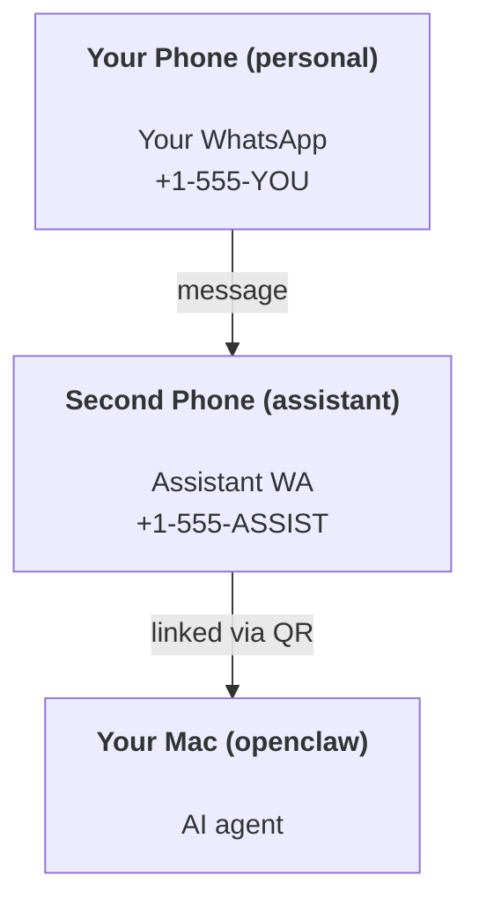

---
read_when:
    - 新しいアシスタントインスタンスのオンボーディング
    - 安全性/権限への影響の確認
summary: OpenClawを個人アシスタントとして運用するための、安全上の注意事項を含むエンドツーエンドガイド
title: パーソナルアシスタントのセットアップ
x-i18n:
    generated_at: "2026-05-11T20:37:16Z"
    model: gpt-5.5
    provider: openai
    source_hash: 74dd13c4b43faa8e29e1fd56a355f36c6cf7c3fa8193bb62c1056211933f4df9
    source_path: start/openclaw.md
    workflow: 16
---

OpenClaw は、Discord、Google Chat、iMessage、Matrix、Microsoft Teams、Signal、Slack、Telegram、WhatsApp、Zalo などを AI エージェントに接続するセルフホスト型 Gateway です。このガイドでは、「パーソナルアシスタント」セットアップ、つまり常時稼働の AI アシスタントのように動作する専用 WhatsApp 番号について説明します。

## ⚠️ まず安全性

エージェントには次のことを行える立場を与えることになります。

- マシン上でコマンドを実行する（ツールポリシーによる）
- ワークスペース内のファイルを読み書きする
- WhatsApp/Telegram/Discord/Mattermost やその他の同梱チャンネル経由でメッセージを送信する

保守的に始めてください。

- 必ず `channels.whatsapp.allowFrom` を設定する（個人用 Mac で全世界に開放した状態で実行しない）。
- アシスタント用に専用の WhatsApp 番号を使う。
- Heartbeat は現在、デフォルトで 30 分ごとです。セットアップを信頼できるまで、`agents.defaults.heartbeat.every: "0m"` を設定して無効にしてください。

## 前提条件

- OpenClaw がインストール済みでオンボーディング済みであること - まだの場合は [はじめに](/ja-JP/start/getting-started) を参照してください
- アシスタント用の 2 つ目の電話番号（SIM/eSIM/プリペイド）

## 2 台の電話セットアップ（推奨）

目指す構成は次のとおりです。



個人用 WhatsApp を OpenClaw にリンクすると、自分宛てのすべてのメッセージが「エージェント入力」になります。これはほとんどの場合、望ましい挙動ではありません。

## 5分でできるクイックスタート

1. WhatsApp Web をペアリングする（QR が表示されるので、アシスタント用の電話でスキャンします）。

```bash
openclaw channels login
```

2. Gateway を起動する（起動したままにします）。

```bash
openclaw gateway --port 18789
```

3. 最小構成を `~/.openclaw/openclaw.json` に入れます。

```json5
{
  gateway: { mode: "local" },
  channels: { whatsapp: { allowFrom: ["+15555550123"] } },
}
```

これで、許可リストに入れた電話からアシスタント番号へメッセージを送信します。

オンボーディングが完了すると、OpenClaw はダッシュボードを自動で開き、クリーンな（トークン化されていない）リンクを出力します。ダッシュボードで認証を求められた場合は、構成済みの共有シークレットを Control UI 設定に貼り付けてください。オンボーディングではデフォルトでトークン（`gateway.auth.token`）を使用しますが、`gateway.auth.mode` を `password` に切り替えている場合はパスワード認証も機能します。後で再度開くには、`openclaw dashboard` を使います。

## エージェントにワークスペースを与える（AGENTS）

OpenClaw は、ワークスペースディレクトリから運用指示と「メモリ」を読み込みます。

デフォルトでは、OpenClaw は `~/.openclaw/workspace` をエージェントワークスペースとして使用し、セットアップ時または最初のエージェント実行時に自動で作成します（スターター `AGENTS.md`、`SOUL.md`、`TOOLS.md`、`IDENTITY.md`、`USER.md`、`HEARTBEAT.md` も作成されます）。`BOOTSTRAP.md` は、ワークスペースが完全に新規の場合にのみ作成されます（削除した後に戻ってくるべきではありません）。`MEMORY.md` は任意です（自動作成されません）。存在する場合、通常セッションで読み込まれます。サブエージェントセッションでは `AGENTS.md` と `TOOLS.md` のみが注入されます。

<Tip>
このフォルダーを OpenClaw のメモリとして扱い、`AGENTS.md` とメモリファイルをバックアップできるように git リポジトリ（理想的には非公開）にしてください。git がインストールされている場合、新規ワークスペースは自動で初期化されます。
</Tip>

```bash
openclaw setup
```

完全なワークスペース構成とバックアップガイド: [エージェントワークスペース](/ja-JP/concepts/agent-workspace)
メモリワークフロー: [メモリ](/ja-JP/concepts/memory)

任意: `agents.defaults.workspace` で別のワークスペースを選択します（`~` をサポート）。

```json5
{
  agents: {
    defaults: {
      workspace: "~/.openclaw/workspace",
    },
  },
}
```

すでにリポジトリから独自のワークスペースファイルを提供している場合は、ブートストラップファイル作成を完全に無効化できます。

```json5
{
  agents: {
    defaults: {
      skipBootstrap: true,
    },
  },
}
```

## 「アシスタント」にするための構成

OpenClaw はデフォルトで適切なアシスタント設定になっていますが、通常は次を調整します。

- [`SOUL.md`](/ja-JP/concepts/soul) のペルソナ/指示
- 思考のデフォルト（必要な場合）
- Heartbeat（信頼できるようになってから）

例:

```json5
{
  logging: { level: "info" },
  agents: {
    defaults: {
      model: { primary: "anthropic/claude-opus-4-6" },
      workspace: "~/.openclaw/workspace",
      thinkingDefault: "high",
      timeoutSeconds: 1800,
      // Start with 0; enable later.
      heartbeat: { every: "0m" },
    },
    list: [
      {
        id: "main",
        default: true,
        groupChat: {
          mentionPatterns: ["@openclaw", "openclaw"],
        },
      },
    ],
  },
  channels: {
    whatsapp: {
      allowFrom: ["+15555550123"],
      groups: {
        "*": { requireMention: true },
      },
    },
  },
  session: {
    scope: "per-sender",
    resetTriggers: ["/new", "/reset"],
    reset: {
      mode: "daily",
      atHour: 4,
      idleMinutes: 10080,
    },
  },
}
```

## セッションとメモリ

- セッションファイル: `~/.openclaw/agents/<agentId>/sessions/{{SessionId}}.jsonl`
- セッションメタデータ（トークン使用量、最後のルートなど）: `~/.openclaw/agents/<agentId>/sessions/sessions.json`（レガシー: `~/.openclaw/sessions/sessions.json`）
- `/new` または `/reset` は、そのチャットの新しいセッションを開始します（`resetTriggers` で構成可能）。単独で送信された場合、OpenClaw はモデルを呼び出さずにリセットを確認応答します。
- `/compact [instructions]` はセッションコンテキストを圧縮し、残りのコンテキスト予算を報告します。

## Heartbeat（プロアクティブモード）

デフォルトでは、OpenClaw は次のプロンプトで 30 分ごとに Heartbeat を実行します。
`Read HEARTBEAT.md if it exists (workspace context). Follow it strictly. Do not infer or repeat old tasks from prior chats. If nothing needs attention, reply HEARTBEAT_OK.`
無効にするには `agents.defaults.heartbeat.every: "0m"` を設定します。

- `HEARTBEAT.md` が存在していても実質的に空（空行と `# Heading` のような Markdown ヘッダーのみ）の場合、OpenClaw は API 呼び出しを節約するため Heartbeat 実行をスキップします。
- ファイルがない場合でも、Heartbeat は実行され、モデルが何をするかを決定します。
- エージェントが `HEARTBEAT_OK` で応答した場合（短い補足は任意。`agents.defaults.heartbeat.ackMaxChars` を参照）、OpenClaw はその Heartbeat のアウトバウンド配信を抑制します。
- デフォルトでは、DM 形式の `user:<id>` ターゲットへの Heartbeat 配信は許可されています。Heartbeat 実行を有効に保ったまま直接ターゲットへの配信を抑制するには、`agents.defaults.heartbeat.directPolicy: "block"` を設定します。
- Heartbeat は完全なエージェントターンとして実行されます - 間隔を短くすると、より多くのトークンを消費します。

```json5
{
  agents: {
    defaults: {
      heartbeat: { every: "30m" },
    },
  },
}
```

## メディアの入出力

受信添付ファイル（画像/音声/ドキュメント）は、テンプレート経由でコマンドに公開できます。

- `{{MediaPath}}`（ローカル一時ファイルパス）
- `{{MediaUrl}}`（疑似 URL）
- `{{Transcript}}`（音声文字起こしが有効な場合）

エージェントからの送信添付ファイル: 独立した行に `MEDIA:<path-or-url>` を含めます（スペースなし）。例:

```
Here's the screenshot.
MEDIA:https://example.com/screenshot.png
```

OpenClaw はこれらを抽出し、テキストと一緒にメディアとして送信します。

ローカルパスの挙動は、エージェントと同じファイル読み取り信頼モデルに従います。

- `tools.fs.workspaceOnly` が `true` の場合、送信 `MEDIA:` のローカルパスは OpenClaw の一時ルート、メディアキャッシュ、エージェントワークスペースパス、サンドボックスで生成されたファイルに制限されたままです。
- `tools.fs.workspaceOnly` が `false` の場合、送信 `MEDIA:` は、エージェントがすでに読み取りを許可されているホストローカルファイルを使用できます。
- ローカルパスは、絶対パス、ワークスペース相対パス、または `~/` を使ったホーム相対パスにできます。
- ホストローカル送信では、引き続きメディアと安全なドキュメントタイプ（画像、音声、動画、PDF、Office ドキュメント）のみが許可されます。プレーンテキストやシークレットに見えるファイルは、送信可能なメディアとして扱われません。

つまり、ファイルシステムポリシーがすでにそれらの読み取りを許可している場合、任意のホストテキスト添付ファイルの流出を再び許すことなく、ワークスペース外で生成された画像/ファイルを送信できるようになりました。

## 運用チェックリスト

```bash
openclaw status          # local status (creds, sessions, queued events)
openclaw status --all    # full diagnosis (read-only, pasteable)
openclaw status --deep   # asks the gateway for a live health probe with channel probes when supported
openclaw health --json   # gateway health snapshot (WS; default can return a fresh cached snapshot)
```

ログは `/tmp/openclaw/` 配下にあります（デフォルト: `openclaw-YYYY-MM-DD.log`）。

## 次のステップ

- WebChat: [WebChat](/ja-JP/web/webchat)
- Gateway 運用: [Gateway ランブック](/ja-JP/gateway)
- Cron + ウェイクアップ: [Cron ジョブ](/ja-JP/automation/cron-jobs)
- macOS メニューバーコンパニオン: [OpenClaw macOS アプリ](/ja-JP/platforms/macos)
- iOS ノードアプリ: [iOS アプリ](/ja-JP/platforms/ios)
- Android ノードアプリ: [Android アプリ](/ja-JP/platforms/android)
- Windows の状態: [Windows (WSL2)](/ja-JP/platforms/windows)
- Linux の状態: [Linux アプリ](/ja-JP/platforms/linux)
- セキュリティ: [セキュリティ](/ja-JP/gateway/security)

## 関連

- [はじめに](/ja-JP/start/getting-started)
- [セットアップ](/ja-JP/start/setup)
- [チャンネル概要](/ja-JP/channels)
