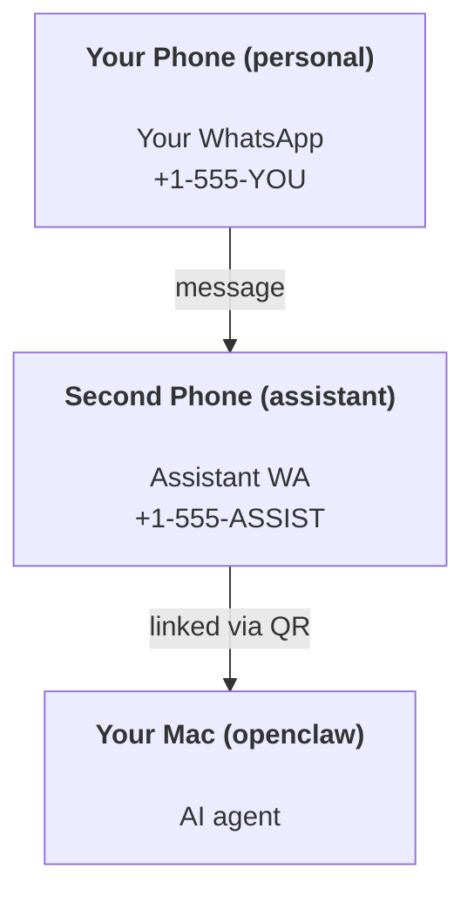

---
read_when:
    - 新しいアシスタントインスタンスのオンボーディング
    - 安全性/権限への影響の確認
summary: 安全上の注意を含む、OpenClawをパーソナルアシスタントとして運用するためのエンドツーエンドガイド
title: 個人アシスタントのセットアップ
x-i18n:
    generated_at: "2026-04-30T05:35:28Z"
    model: gpt-5.5
    provider: openai
    source_hash: b0614272f9a2b30e0900c55b39a8bd6a2b71b9f5d5fbf0fe00c534b91193e6a0
    source_path: start/openclaw.md
    workflow: 16
---

# OpenClawでパーソナルアシスタントを構築する

OpenClawは、Discord、Google Chat、iMessage、Matrix、Microsoft Teams、Signal、Slack、Telegram、WhatsApp、ZaloなどをAIエージェントに接続するセルフホスト型Gatewayです。このガイドでは「パーソナルアシスタント」設定、つまり常時稼働するAIアシスタントのように振る舞う専用のWhatsApp番号について説明します。

## ⚠️ 安全第一

エージェントには次のことができる立場を与えることになります。

- マシン上でコマンドを実行する（ツールポリシーによる）
- ワークスペース内のファイルを読み書きする
- WhatsApp/Telegram/Discord/Mattermostやその他の同梱チャンネル経由でメッセージを送り返す

保守的に始めてください。

- 必ず`channels.whatsapp.allowFrom`を設定する（個人用Macで外部に開放された状態で実行しないでください）。
- アシスタントには専用のWhatsApp番号を使用する。
- Heartbeatの既定値は現在30分ごとです。設定を信頼できるまでは、`agents.defaults.heartbeat.every: "0m"`を設定して無効にしてください。

## 前提条件

- OpenClawがインストール済みでオンボーディング済みであること。まだの場合は[はじめに](/ja-JP/start/getting-started)を参照してください
- アシスタント用の2つ目の電話番号（SIM/eSIM/プリペイド）

## 2台の電話構成（推奨）

目指す構成は次のとおりです。



個人用のWhatsAppをOpenClawにリンクすると、あなた宛てのすべてのメッセージが「エージェント入力」になります。通常、それは望む動作ではありません。

## 5分クイックスタート

1. WhatsApp Webをペアリングします（QRが表示されます。アシスタント用の電話でスキャンします）。

```bash
openclaw channels login
```

2. Gatewayを起動します（起動したままにします）。

```bash
openclaw gateway --port 18789
```

3. 最小構成を`~/.openclaw/openclaw.json`に配置します。

```json5
{
  gateway: { mode: "local" },
  channels: { whatsapp: { allowFrom: ["+15555550123"] } },
}
```

これで、許可リストに入れた電話からアシスタント番号へメッセージを送ります。

オンボーディングが完了すると、OpenClawはダッシュボードを自動で開き、クリーンな（トークン化されていない）リンクを表示します。ダッシュボードで認証を求められた場合は、設定済みの共有シークレットをControl UI設定に貼り付けます。オンボーディングは既定でトークン（`gateway.auth.token`）を使用しますが、`gateway.auth.mode`を`password`に切り替えている場合はパスワード認証も使用できます。後で再度開くには、`openclaw dashboard`を実行します。

## エージェントにワークスペースを与える（AGENTS）

OpenClawは、ワークスペースディレクトリから操作指示と「メモリ」を読み取ります。

既定では、OpenClawはエージェントのワークスペースとして`~/.openclaw/workspace`を使用し、セットアップ時または最初のエージェント実行時に自動作成します（スターターの`AGENTS.md`、`SOUL.md`、`TOOLS.md`、`IDENTITY.md`、`USER.md`、`HEARTBEAT.md`も作成します）。`BOOTSTRAP.md`はワークスペースが完全に新しい場合にのみ作成されます（削除した後に戻ってくるべきではありません）。`MEMORY.md`は任意です（自動作成されません）。存在する場合は通常セッションで読み込まれます。サブエージェントセッションでは`AGENTS.md`と`TOOLS.md`のみが注入されます。

<Tip>
このフォルダーをOpenClawのメモリのように扱い、`AGENTS.md`とメモリファイルがバックアップされるようにgitリポジトリ（理想的には非公開）にしてください。gitがインストールされている場合、新規ワークスペースは自動で初期化されます。
</Tip>

```bash
openclaw setup
```

ワークスペース全体のレイアウトとバックアップガイド: [エージェントワークスペース](/ja-JP/concepts/agent-workspace)
メモリワークフロー: [メモリ](/ja-JP/concepts/memory)

任意: `agents.defaults.workspace`で別のワークスペースを選択できます（`~`をサポート）。

```json5
{
  agents: {
    defaults: {
      workspace: "~/.openclaw/workspace",
    },
  },
}
```

自分のリポジトリからワークスペースファイルをすでに配布している場合は、ブートストラップファイルの作成を完全に無効化できます。

```json5
{
  agents: {
    defaults: {
      skipBootstrap: true,
    },
  },
}
```

## 「アシスタント」にする設定

OpenClawの既定値は優れたアシスタント構成ですが、通常は次を調整します。

- [`SOUL.md`](/ja-JP/concepts/soul)内のペルソナ/指示
- 思考の既定値（必要な場合）
- Heartbeat（信頼できるようになったら）

例:

```json5
{
  logging: { level: "info" },
  agent: {
    model: "anthropic/claude-opus-4-6",
    workspace: "~/.openclaw/workspace",
    thinkingDefault: "high",
    timeoutSeconds: 1800,
    // Start with 0; enable later.
    heartbeat: { every: "0m" },
  },
  channels: {
    whatsapp: {
      allowFrom: ["+15555550123"],
      groups: {
        "*": { requireMention: true },
      },
    },
  },
  routing: {
    groupChat: {
      mentionPatterns: ["@openclaw", "openclaw"],
    },
  },
  session: {
    scope: "per-sender",
    resetTriggers: ["/new", "/reset"],
    reset: {
      mode: "daily",
      atHour: 4,
      idleMinutes: 10080,
    },
  },
}
```

## セッションとメモリ

- セッションファイル: `~/.openclaw/agents/<agentId>/sessions/{{SessionId}}.jsonl`
- セッションメタデータ（トークン使用量、最後のルートなど）: `~/.openclaw/agents/<agentId>/sessions/sessions.json`（レガシー: `~/.openclaw/sessions/sessions.json`）
- `/new`または`/reset`は、そのチャット用に新しいセッションを開始します（`resetTriggers`で設定可能）。単独で送信された場合、OpenClawはモデルを呼び出さずにリセットを確認します。
- `/compact [instructions]`はセッションコンテキストをCompactionし、残りのコンテキスト予算を報告します。

## Heartbeat（プロアクティブモード）

既定では、OpenClawは30分ごとに次のプロンプトでHeartbeatを実行します。
`Read HEARTBEAT.md if it exists (workspace context). Follow it strictly. Do not infer or repeat old tasks from prior chats. If nothing needs attention, reply HEARTBEAT_OK.`
無効にするには`agents.defaults.heartbeat.every: "0m"`を設定します。

- `HEARTBEAT.md`が存在していても実質的に空（空行と`# Heading`のようなMarkdown見出しのみ）の場合、OpenClawはAPI呼び出しを節約するためにHeartbeat実行をスキップします。
- ファイルがない場合でもHeartbeatは実行され、モデルが何をするかを決定します。
- エージェントが`HEARTBEAT_OK`（任意で短い余白を含められます。`agents.defaults.heartbeat.ackMaxChars`を参照）と返信した場合、OpenClawはそのHeartbeatの外向き配信を抑制します。
- 既定では、DM形式の`user:<id>`ターゲットへのHeartbeat配信は許可されています。Heartbeat実行を有効のまま直接ターゲットへの配信を抑制するには、`agents.defaults.heartbeat.directPolicy: "block"`を設定します。
- Heartbeatは完全なエージェントターンを実行します。短い間隔ほど多くのトークンを消費します。

```json5
{
  agent: {
    heartbeat: { every: "30m" },
  },
}
```

## メディアの入出力

受信添付ファイル（画像/音声/ドキュメント）は、テンプレート経由でコマンドに渡せます。

- `{{MediaPath}}`（ローカル一時ファイルパス）
- `{{MediaUrl}}`（疑似URL）
- `{{Transcript}}`（音声文字起こしが有効な場合）

エージェントからの送信添付ファイル: 単独行に`MEDIA:<path-or-url>`を含めます（スペースなし）。例:

```
Here’s the screenshot.
MEDIA:https://example.com/screenshot.png
```

OpenClawはこれらを抽出し、テキストと一緒にメディアとして送信します。

ローカルパスの動作は、エージェントと同じファイル読み取り信頼モデルに従います。

- `tools.fs.workspaceOnly`が`true`の場合、送信`MEDIA:`のローカルパスはOpenClawの一時ルート、メディアキャッシュ、エージェントワークスペースパス、サンドボックス生成ファイルに制限されたままです。
- `tools.fs.workspaceOnly`が`false`の場合、送信`MEDIA:`は、エージェントがすでに読み取りを許可されているホストローカルファイルを使用できます。
- ホストローカル送信でも、許可されるのはメディアと安全なドキュメント種別（画像、音声、動画、PDF、Officeドキュメント）のみです。プレーンテキストやシークレットのようなファイルは送信可能なメディアとして扱われません。

つまり、ワークスペース外で生成された画像/ファイルも、fsポリシーがすでにその読み取りを許可している場合は送信できるようになりました。任意のホストテキスト添付ファイルの持ち出しを再び開放することはありません。

## 運用チェックリスト

```bash
openclaw status          # local status (creds, sessions, queued events)
openclaw status --all    # full diagnosis (read-only, pasteable)
openclaw status --deep   # asks the gateway for a live health probe with channel probes when supported
openclaw health --json   # gateway health snapshot (WS; default can return a fresh cached snapshot)
```

ログは`/tmp/openclaw/`配下にあります（既定: `openclaw-YYYY-MM-DD.log`）。

## 次のステップ

- WebChat: [WebChat](/ja-JP/web/webchat)
- Gateway運用: [Gatewayランブック](/ja-JP/gateway)
- Cron + ウェイクアップ: [Cronジョブ](/ja-JP/automation/cron-jobs)
- macOSメニューバーコンパニオン: [OpenClaw macOSアプリ](/ja-JP/platforms/macos)
- iOSノードアプリ: [iOSアプリ](/ja-JP/platforms/ios)
- Androidノードアプリ: [Androidアプリ](/ja-JP/platforms/android)
- Windowsステータス: [Windows (WSL2)](/ja-JP/platforms/windows)
- Linuxステータス: [Linuxアプリ](/ja-JP/platforms/linux)
- セキュリティ: [セキュリティ](/ja-JP/gateway/security)

## 関連

- [はじめに](/ja-JP/start/getting-started)
- [セットアップ](/ja-JP/start/setup)
- [チャンネル概要](/ja-JP/channels)
