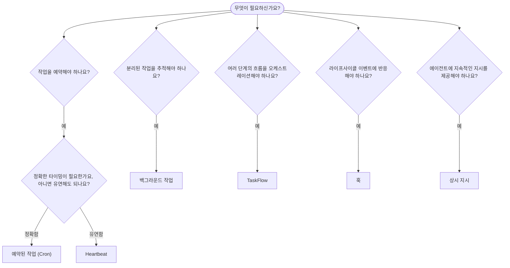

---
read_when:
    - OpenClaw로 작업을 자동화하는 방법 결정하기
    - Heartbeat, Cron, 훅, 상시 지시 중에서 선택하기
    - 적절한 자동화 진입점 찾기
summary: '자동화 메커니즘 개요: 작업, Cron, 훅, 상시 지시, 그리고 TaskFlow'
title: 자동화 및 작업
x-i18n:
    generated_at: "2026-04-26T11:22:59Z"
    model: gpt-5.4
    provider: openai
    source_hash: 6d2a2d3ef58830133e07b34f33c611664fc1032247e9dd81005adf7fc0c43cdb
    source_path: automation/index.md
    workflow: 15
---

OpenClaw는 작업, 예약된 작업, 이벤트 훅, 상시 지시를 통해 백그라운드에서 작업을 실행합니다. 이 페이지는 적절한 메커니즘을 선택하고 이들이 어떻게 함께 동작하는지 이해하는 데 도움을 줍니다.

## 빠른 결정 가이드

| 사용 사례 | 권장 사항 | 이유 |
| --------------------------------------- | ---------------------- | ------------------------------------------------ |
| 매일 오전 9시에 정확히 일일 보고서 전송 | 예약된 작업 (Cron) | 정확한 타이밍, 격리된 실행 |
| 20분 후에 알림 | 예약된 작업 (Cron) | 정확한 타이밍의 일회성 작업 (`--at`) |
| 매주 심층 분석 실행 | 예약된 작업 (Cron) | 독립형 작업, 다른 모델 사용 가능 |
| 30분마다 받은편지함 확인 | Heartbeat | 다른 확인 작업과 함께 배치되며, 컨텍스트를 인식함 |
| 예정된 이벤트에 대해 캘린더 모니터링 | Heartbeat | 주기적인 인지 작업에 자연스럽게 적합함 |
| 하위 에이전트 또는 ACP 실행 상태 점검 | 백그라운드 작업 | 작업 원장이 모든 분리된 작업을 추적함 |
| 무엇이 언제 실행되었는지 감사 | 백그라운드 작업 | `openclaw tasks list` 및 `openclaw tasks audit` |
| 여러 단계의 조사 후 요약 | TaskFlow | 수정 이력 추적이 가능한 내구성 있는 오케스트레이션 |
| 세션 재설정 시 스크립트 실행 | 훅 | 이벤트 기반, 라이프사이클 이벤트에서 실행됨 |
| 모든 도구 호출 시 코드 실행 | Plugin 훅 | 인프로세스 훅이 도구 호출을 가로챌 수 있음 |
| 응답 전에 항상 컴플라이언스 확인 | 상시 지시 | 모든 세션에 자동으로 주입됨 |

### 예약된 작업 (Cron) vs Heartbeat

| 차원 | 예약된 작업 (Cron) | Heartbeat |
| --------------- | ----------------------------------- | ------------------------------------- |
| 타이밍 | 정확함 (cron 표현식, 일회성 작업) | 대략적임 (기본값: 30분마다) |
| 세션 컨텍스트 | 새로 시작됨(격리됨) 또는 공유됨 | 전체 메인 세션 컨텍스트 |
| 작업 기록 | 항상 생성됨 | 생성되지 않음 |
| 전달 | 채널, Webhook 또는 무음 | 메인 세션에 인라인으로 표시 |
| 가장 적합한 용도 | 보고서, 알림, 백그라운드 작업 | 받은편지함 확인, 캘린더, 알림 |

정확한 타이밍이나 격리된 실행이 필요할 때는 예약된 작업 (Cron)을 사용하세요. 작업이 전체 세션 컨텍스트의 이점을 받고 대략적인 타이밍으로 충분할 때는 Heartbeat를 사용하세요.

## 핵심 개념

### 예약된 작업 (cron)

Cron은 정확한 타이밍을 위한 Gateway의 내장 스케줄러입니다. 작업을 지속적으로 저장하고, 적절한 시점에 에이전트를 깨우며, 채팅 채널이나 Webhook 엔드포인트로 출력을 전달할 수 있습니다. 일회성 알림, 반복 표현식, 인바운드 Webhook 트리거를 지원합니다.

[예약된 작업](/ko/automation/cron-jobs) 문서를 참조하세요.

### 작업

백그라운드 작업 원장은 모든 분리된 작업을 추적합니다: ACP 실행, 하위 에이전트 생성, 격리된 cron 실행, CLI 작업. 작업은 스케줄러가 아니라 기록입니다. 이를 검사하려면 `openclaw tasks list` 및 `openclaw tasks audit`를 사용하세요.

[백그라운드 작업](/ko/automation/tasks) 문서를 참조하세요.

### Task Flow

Task Flow는 백그라운드 작업 위에 있는 흐름 오케스트레이션 기반 계층입니다. 관리형 및 미러링된 동기화 모드, 수정 이력 추적, 그리고 검사용 `openclaw tasks flow list|show|cancel`과 함께 내구성 있는 여러 단계의 흐름을 관리합니다.

[Task Flow](/ko/automation/taskflow) 문서를 참조하세요.

### 상시 지시

상시 지시는 정의된 프로그램에 대해 에이전트에 영구적인 운영 권한을 부여합니다. 이 지시는 작업공간 파일(일반적으로 `AGENTS.md`)에 저장되며 모든 세션에 주입됩니다. 시간 기반 강제를 위해 cron과 함께 조합하세요.

[상시 지시](/ko/automation/standing-orders) 문서를 참조하세요.

### 훅

내부 훅은 에이전트 라이프사이클 이벤트
(`/new`, `/reset`, `/stop`), 세션 Compaction, Gateway 시작, 메시지
흐름에 의해 트리거되는 이벤트 기반 스크립트입니다. 디렉터리에서 자동으로 검색되며
`openclaw hooks`로 관리할 수 있습니다. 인프로세스 도구 호출 가로채기에는
[Plugin 훅](/ko/plugins/hooks)을 사용하세요.

[훅](/ko/automation/hooks) 문서를 참조하세요.

### Heartbeat

Heartbeat는 주기적인 메인 세션 턴입니다(기본값: 30분마다). 여러 확인 작업(받은편지함, 캘린더, 알림)을 전체 세션 컨텍스트와 함께 하나의 에이전트 턴으로 배치합니다. Heartbeat 턴은 작업 기록을 생성하지 않으며 일일/유휴 세션 재설정의 최신 상태를 연장하지도 않습니다. 간단한 체크리스트에는 `HEARTBEAT.md`를 사용하고, Heartbeat 자체 안에서 기한이 된 주기 확인만 원할 때는 `tasks:` 블록을 사용하세요. 비어 있는 Heartbeat 파일은 `empty-heartbeat-file`로 건너뛰고, 기한 기반 작업 전용 모드는 `no-tasks-due`로 건너뜁니다.

[Heartbeat](/ko/gateway/heartbeat) 문서를 참조하세요.

## 함께 동작하는 방식

- **Cron**은 정확한 일정(일일 보고서, 주간 검토)과 일회성 알림을 처리합니다. 모든 cron 실행은 작업 기록을 생성합니다.
- **Heartbeat**는 정기적인 모니터링(받은편지함, 캘린더, 알림)을 30분마다 한 번의 배치된 턴으로 처리합니다.
- **훅**은 특정 이벤트(세션 재설정, Compaction, 메시지 흐름)에 맞춰 사용자 지정 스크립트로 반응합니다. Plugin 훅은 도구 호출을 담당합니다.
- **상시 지시**는 에이전트에 지속적인 컨텍스트와 권한 경계를 제공합니다.
- **Task Flow**는 개별 작업 위에서 여러 단계의 흐름을 조정합니다.
- **작업**은 모든 분리된 작업을 자동으로 추적하므로 이를 검사하고 감사할 수 있습니다.

## 관련 문서

- [예약된 작업](/ko/automation/cron-jobs) — 정확한 일정 관리 및 일회성 알림
- [백그라운드 작업](/ko/automation/tasks) — 모든 분리된 작업을 위한 작업 원장
- [Task Flow](/ko/automation/taskflow) — 내구성 있는 여러 단계 흐름 오케스트레이션
- [훅](/ko/automation/hooks) — 이벤트 기반 라이프사이클 스크립트
- [Plugin 훅](/ko/plugins/hooks) — 인프로세스 도구, 프롬프트, 메시지 및 라이프사이클 훅
- [상시 지시](/ko/automation/standing-orders) — 지속적인 에이전트 지시
- [Heartbeat](/ko/gateway/heartbeat) — 주기적인 메인 세션 턴
- [구성 참조](/ko/gateway/configuration-reference) — 모든 구성 키
