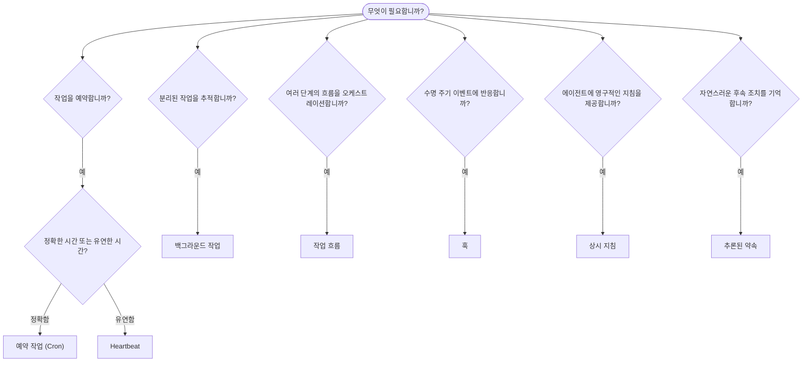

OpenClaw은 작업, 예약 작업, 추론된 약속, 이벤트 훅, 상시 지침을 통해 백그라운드에서 작업을 실행합니다. 이 페이지를 사용하여 적절한 메커니즘을 선택하십시오.

## 빠른 결정 가이드

| 사용 사례                                      | 권장 메커니즘       | 이유                                                |
| ---------------------------------------------- | ------------------- | --------------------------------------------------- |
| 매일 오전 9시 정각에 보고서 전송               | 예약 작업 (Cron)    | 정확한 시간 지정, 격리된 실행                      |
| 20분 후에 알림                                 | 예약 작업 (Cron)    | 정확한 시간의 일회성 실행 (`--at`)                 |
| 매주 심층 분석 실행                            | 예약 작업 (Cron)    | 독립형 작업이며 다른 모델을 사용할 수 있음         |
| 30분마다 받은편지함 확인                       | Heartbeat           | 다른 확인 작업과 일괄 처리하며 컨텍스트를 인식함   |
| 예정된 이벤트가 있는지 캘린더 모니터링         | Heartbeat           | 주기적 인식에 자연스럽게 적합함                     |
| 언급된 면접 후 상황 확인                       | 추론된 약속         | 기억과 유사한 후속 조치이며 정확한 알림 요청은 없음 |
| 사용자 컨텍스트에 따른 가벼운 안부 확인        | 추론된 약속         | 동일한 에이전트와 채널로 범위가 제한됨             |
| 하위 에이전트 또는 ACP 실행 상태 검사          | 백그라운드 작업     | 작업 원장이 모든 분리된 작업을 추적함              |
| 실행된 작업과 실행 시점 감사                   | 백그라운드 작업     | `openclaw tasks list` 및 `openclaw tasks audit`     |
| 여러 단계의 조사 후 요약                       | 작업 흐름           | 리비전 추적을 지원하는 지속성 있는 오케스트레이션  |
| 세션 재설정 시 스크립트 실행                   | 훅                  | 이벤트 기반이며 수명 주기 이벤트에서 실행됨        |
| 모든 도구 호출에서 코드 실행                   | Plugin 훅           | 인프로세스 훅이 도구 호출을 가로챌 수 있음         |
| 응답하기 전에 항상 규정 준수 확인              | 상시 지침           | 모든 세션에 자동으로 삽입됨                         |

### 예약 작업 (Cron)과 Heartbeat 비교

| 구분            | 예약 작업 (Cron)                    | Heartbeat                                |
| --------------- | ----------------------------------- | ---------------------------------------- |
| 시간 지정       | 정확함 (cron 표현식, 일회성)        | 근사치 (기본값은 30분마다)               |
| 세션 컨텍스트   | 새 컨텍스트(격리) 또는 공유         | 기본 세션의 전체 컨텍스트                |
| 작업 레코드     | 항상 생성됨                         | 생성되지 않음                            |
| 전달            | 채널, webhook 또는 전달 안 함       | 기본 세션 내에서 직접 전달               |
| 적합한 용도     | 보고서, 알림, 백그라운드 작업       | 받은편지함 확인, 캘린더, 알림            |

정확한 시간 지정이나 격리된 실행이 필요하면 예약 작업 (Cron)을 사용하십시오. 전체 세션 컨텍스트가 작업에 유용하고 대략적인 시간 지정으로 충분하면 Heartbeat를 사용하십시오.

## 핵심 개념

### 예약 작업 (Cron)

Cron은 정확한 시간 지정을 위한 Gateway 내장 스케줄러입니다. 작업을 영구 저장하고 적절한 시점에 에이전트를 깨우며, 출력을 채팅 채널이나 webhook 엔드포인트로 전달할 수 있습니다. 일회성 알림, 반복 표현식, 인바운드 webhook 트리거를 지원합니다.

[예약 작업](/ko/automation/cron-jobs)을 참조하십시오.

### 작업

백그라운드 작업 원장은 ACP 실행, 하위 에이전트 생성, 격리된 cron 실행, CLI 작업 등 모든 분리된 작업을 추적합니다. 작업은 레코드이며 스케줄러가 아닙니다. `openclaw tasks list`와 `openclaw tasks audit`를 사용하여 검사하십시오.

[백그라운드 작업](/ko/automation/tasks)을 참조하십시오.

### 추론된 약속

약속은 선택적으로 사용하는 단기 후속 조치 기억입니다. OpenClaw은 일반적인 대화에서 이를 추론하고 동일한 에이전트와 채널로 범위를 제한하며, Heartbeat를 통해 기한이 된 상황 확인을 전달합니다. 사용자가 정확히 요청한 알림은 여전히 Cron으로 처리해야 합니다.

[추론된 약속](/ko/concepts/commitments)을 참조하십시오.

### 작업 흐름

작업 흐름은 백그라운드 작업 위에서 동작하는 흐름 오케스트레이션 기반입니다. 관리형 및 미러링 동기화 모드와 리비전 추적을 사용하여 지속성 있는 여러 단계의 흐름을 관리하며, 검사를 위해 `openclaw tasks flow list|show|cancel`을 제공합니다.

[작업 흐름](/ko/automation/taskflow)을 참조하십시오.

### 상시 지침

상시 지침은 정의된 프로그램에 대한 영구적인 운영 권한을 에이전트에 부여합니다. 이 지침은 작업 공간 파일(일반적으로 `AGENTS.md`)에 있으며 모든 세션에 삽입됩니다. 시간 기반 적용이 필요하면 Cron과 결합하십시오.

[상시 지침](/ko/automation/standing-orders)을 참조하십시오.

### 훅

내부 훅은 에이전트 수명 주기 이벤트(`/new`, `/reset`, `/stop`), 세션 Compaction, Gateway 시작, 메시지 흐름에 의해 트리거되는 이벤트 기반 스크립트입니다. 훅 디렉터리에서 검색되며 `openclaw hooks`로 관리됩니다. 인프로세스 도구 호출을 가로채려면 [Plugin 훅](/ko/plugins/hooks)을 사용하십시오.

[훅](/ko/automation/hooks)을 참조하십시오.

### Heartbeat

Heartbeat는 주기적으로 실행되는 기본 세션 턴입니다(기본값은 30분마다). 전체 세션 컨텍스트를 사용하여 여러 확인 작업(받은편지함, 캘린더, 알림)을 하나의 에이전트 턴으로 일괄 처리합니다. Heartbeat 턴은 작업 레코드를 생성하지 않으며 일일/유휴 세션 재설정의 최신 상태를 연장하지 않습니다. 간단한 체크리스트에는 `HEARTBEAT.md`를 사용하고, Heartbeat 자체에서 기한이 된 주기적 확인만 실행하려면 `tasks:` 블록을 사용하십시오. 비어 있는 Heartbeat 파일은 `empty-heartbeat-file`로 건너뛰며, 기한 기반 전용 작업 모드는 `no-tasks-due`로 건너뜁니다. Cron 작업이 활성 상태이거나 대기열에 있으면 Heartbeat가 연기되며, 동일한 에이전트의 세션 키 기반 하위 에이전트 또는 중첩 레인이 사용 중일 때 `heartbeat.skipWhenBusy`를 통해 해당 에이전트의 실행을 연기할 수도 있습니다.

[Heartbeat](/ko/gateway/heartbeat)를 참조하십시오.

## 함께 작동하는 방식

- **Cron**은 정확한 일정(일일 보고서, 주간 검토)과 일회성 알림을 처리합니다. 모든 Cron 실행은 작업 레코드를 생성합니다.
- **Heartbeat**는 30분마다 한 번의 일괄 처리 턴으로 정기 모니터링(받은편지함, 캘린더, 알림)을 처리합니다.
- **훅**은 사용자 지정 스크립트로 특정 이벤트(세션 재설정, Compaction, 메시지 흐름)에 반응합니다. Plugin 훅은 도구 호출을 처리합니다.
- **상시 지침**은 에이전트에 영구적인 컨텍스트와 권한 경계를 제공합니다.
- **작업 흐름**은 개별 작업 위에서 여러 단계의 흐름을 조정합니다.
- **작업**은 모든 분리된 작업을 자동으로 추적하여 검사하고 감사할 수 있게 합니다.

## 관련 문서

- [예약 작업](/ko/automation/cron-jobs) — 정확한 일정 지정 및 일회성 알림
- [추론된 약속](/ko/concepts/commitments) — 기억과 유사한 후속 상황 확인
- [백그라운드 작업](/ko/automation/tasks) — 모든 분리된 작업을 위한 작업 원장
- [작업 흐름](/ko/automation/taskflow) — 지속성 있는 여러 단계의 흐름 오케스트레이션
- [훅](/ko/automation/hooks) — 이벤트 기반 수명 주기 스크립트
- [Plugin 훅](/ko/plugins/hooks) — 인프로세스 도구, 프롬프트, 메시지 및 수명 주기 훅
- [상시 지침](/ko/automation/standing-orders) — 영구적인 에이전트 지침
- [Heartbeat](/ko/gateway/heartbeat) — 주기적인 기본 세션 턴
- [구성 참조](/ko/gateway/configuration-reference) — 모든 구성 키
