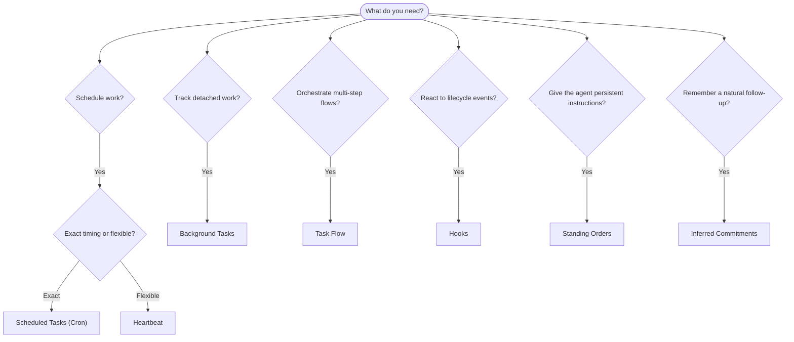

OpenClaw는 작업, 예약된 작업, 추론된
커밋먼트, 이벤트 훅, 상시 지침을 통해 백그라운드에서 작업을 실행합니다. 이 페이지는
올바른 메커니즘을 선택하고 이들이 어떻게 함께 맞물리는지 이해하는 데 도움을 줍니다.

## 빠른 결정 가이드

| 사용 사례                               | 권장 사항                | 이유                                             |
| --------------------------------------- | ------------------------ | ------------------------------------------------ |
| 매일 오전 9시에 정확히 보고서 보내기    | 예약된 작업(Cron)        | 정확한 타이밍, 격리된 실행                      |
| 20분 뒤에 알림 받기                     | 예약된 작업(Cron)        | 정확한 타이밍의 일회성 작업(`--at`)             |
| 매주 심층 분석 실행                     | 예약된 작업(Cron)        | 독립 실행형 작업, 다른 모델 사용 가능           |
| 30분마다 받은 편지함 확인               | Heartbeat                | 다른 확인 작업과 일괄 처리, 컨텍스트 인식       |
| 예정된 이벤트를 위해 캘린더 모니터링    | Heartbeat                | 주기적 인식에 자연스럽게 적합                   |
| 언급된 인터뷰 후 확인                   | 추론된 커밋먼트          | 메모리 같은 후속 확인, 정확한 알림 요청 없음    |
| 사용자 컨텍스트 후 부드러운 안부 확인   | 추론된 커밋먼트          | 동일한 에이전트와 채널로 범위 지정              |
| 하위 에이전트 또는 ACP 실행 상태 점검   | 백그라운드 작업          | 작업 장부가 모든 분리된 작업을 추적             |
| 무엇이 언제 실행되었는지 감사           | 백그라운드 작업          | `openclaw tasks list` 및 `openclaw tasks audit` |
| 다단계 조사 후 요약                     | Task Flow                | 리비전 추적이 있는 내구성 있는 오케스트레이션   |
| 세션 재설정 시 스크립트 실행            | 훅                       | 이벤트 기반, 수명 주기 이벤트에서 실행          |
| 모든 도구 호출에서 코드 실행            | Plugin 훅                | 인프로세스 훅이 도구 호출을 가로챌 수 있음      |
| 응답 전 항상 컴플라이언스 확인          | 상시 명령                | 모든 세션에 자동으로 주입됨                     |

### 예약된 작업(Cron)과 Heartbeat 비교

| 차원            | 예약된 작업(Cron)                  | Heartbeat                         |
| --------------- | ---------------------------------- | --------------------------------- |
| 타이밍          | 정확함(cron 표현식, 일회성)        | 근사값(기본 30분마다)             |
| 세션 컨텍스트   | 새 컨텍스트(격리됨) 또는 공유됨    | 전체 주 세션 컨텍스트             |
| 작업 기록       | 항상 생성됨                        | 생성되지 않음                     |
| 전달            | 채널, webhook 또는 무음            | 주 세션에 인라인으로 전달         |
| 최적 용도       | 보고서, 알림, 백그라운드 작업      | 받은 편지함 확인, 캘린더, 알림    |

정확한 타이밍이나 격리된 실행이 필요하면 예약된 작업(Cron)을 사용하세요. 전체 세션 컨텍스트가 유용하고 대략적인 타이밍으로 충분하면 Heartbeat를 사용하세요.

## 핵심 개념

### 예약된 작업(cron)

Cron은 정확한 타이밍을 위한 Gateway의 내장 스케줄러입니다. 작업을 영속화하고, 적절한 시점에 에이전트를 깨우며, 출력을 채팅 채널이나 webhook 엔드포인트로 전달할 수 있습니다. 일회성 알림, 반복 표현식, 인바운드 webhook 트리거를 지원합니다.

[예약된 작업](/ko/automation/cron-jobs)을 참조하세요.

### 작업

백그라운드 작업 장부는 모든 분리된 작업을 추적합니다: ACP 실행, 하위 에이전트 생성, 격리된 cron 실행, CLI 작업. 작업은 스케줄러가 아니라 기록입니다. 이를 점검하려면 `openclaw tasks list`와 `openclaw tasks audit`를 사용하세요.

[백그라운드 작업](/ko/automation/tasks)을 참조하세요.

### 추론된 커밋먼트

커밋먼트는 옵트인 방식의 짧게 유지되는 후속 확인 메모리입니다. OpenClaw는 일반 대화에서 이를 추론하고, 동일한 에이전트와 채널로 범위를 지정하며,
Heartbeat를 통해 기한이 된 확인을 전달합니다. 사용자가 정확히 요청한 알림은 여전히
cron에 속합니다.

[추론된 커밋먼트](/ko/concepts/commitments)를 참조하세요.

### Task Flow

Task Flow는 백그라운드 작업 위에 있는 흐름 오케스트레이션 기반입니다. 관리형 및 미러링된 동기화 모드, 리비전 추적, 점검을 위한 `openclaw tasks flow list|show|cancel`을 통해 내구성 있는 다단계 흐름을 관리합니다.

[Task Flow](/ko/automation/taskflow)를 참조하세요.

### 상시 명령

상시 명령은 정의된 프로그램에 대해 에이전트에 영구 운영 권한을 부여합니다. 이는 워크스페이스 파일(일반적으로 `AGENTS.md`)에 있으며 모든 세션에 주입됩니다. 시간 기반 적용에는 cron과 함께 사용하세요.

[상시 명령](/ko/automation/standing-orders)을 참조하세요.

### 훅

내부 훅은 에이전트 수명 주기 이벤트
(`/new`, `/reset`, `/stop`), 세션 Compaction, Gateway 시작, 메시지
흐름에 의해 트리거되는 이벤트 기반 스크립트입니다. 디렉터리에서 자동으로 발견되며
`openclaw hooks`로 관리할 수 있습니다. 인프로세스 도구 호출 가로채기에는
[Plugin 훅](/ko/plugins/hooks)을 사용하세요.

[훅](/ko/automation/hooks)을 참조하세요.

### Heartbeat

Heartbeat는 주기적인 주 세션 턴입니다(기본 30분마다). 받은 편지함, 캘린더, 알림 같은 여러 확인 작업을 전체 세션 컨텍스트가 있는 하나의 에이전트 턴으로 일괄 처리합니다. Heartbeat 턴은 작업 기록을 생성하지 않으며 일일/유휴 세션 재설정 최신성을 연장하지 않습니다. 작은 체크리스트에는 `HEARTBEAT.md`를 사용하고, Heartbeat 자체 안에서 기한이 된 주기적 확인만 실행하려면 `tasks:` 블록을 사용하세요. 빈 Heartbeat 파일은 `empty-heartbeat-file`로 건너뛰며, 기한 도래 전용 작업 모드는 `no-tasks-due`로 건너뜁니다. cron 작업이 활성 상태이거나 대기 중이면 Heartbeat는 지연되며, `heartbeat.skipWhenBusy`는 동일한 에이전트의 세션 키 기반 하위 에이전트나 중첩 레인이 바쁠 때도 해당 에이전트를 지연할 수 있습니다.

[Heartbeat](/ko/gateway/heartbeat)를 참조하세요.

## 함께 작동하는 방식

- **Cron**은 정확한 일정(일일 보고서, 주간 검토)과 일회성 알림을 처리합니다. 모든 cron 실행은 작업 기록을 생성합니다.
- **Heartbeat**는 받은 편지함, 캘린더, 알림 같은 일상적 모니터링을 30분마다 하나의 일괄 처리 턴으로 처리합니다.
- **훅**은 사용자 지정 스크립트로 특정 이벤트(세션 재설정, Compaction, 메시지 흐름)에 반응합니다. Plugin 훅은 도구 호출을 다룹니다.
- **상시 명령**은 에이전트에 지속적인 컨텍스트와 권한 경계를 제공합니다.
- **Task Flow**는 개별 작업 위에서 다단계 흐름을 조정합니다.
- **작업**은 모든 분리된 작업을 자동으로 추적하므로 이를 점검하고 감사할 수 있습니다.

## 관련 항목

- [예약된 작업](/ko/automation/cron-jobs) — 정확한 예약과 일회성 알림
- [추론된 커밋먼트](/ko/concepts/commitments) — 메모리 같은 후속 확인
- [백그라운드 작업](/ko/automation/tasks) — 모든 분리된 작업을 위한 작업 장부
- [Task Flow](/ko/automation/taskflow) — 내구성 있는 다단계 흐름 오케스트레이션
- [훅](/ko/automation/hooks) — 이벤트 기반 수명 주기 스크립트
- [Plugin 훅](/ko/plugins/hooks) — 인프로세스 도구, 프롬프트, 메시지, 수명 주기 훅
- [상시 명령](/ko/automation/standing-orders) — 지속적인 에이전트 지침
- [Heartbeat](/ko/gateway/heartbeat) — 주기적인 주 세션 턴
- [구성 참조](/ko/gateway/configuration-reference) — 모든 구성 키
