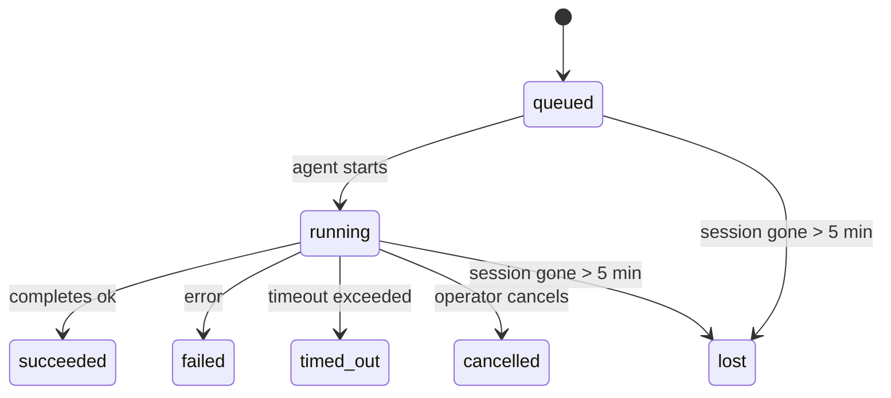

---
read_when:
    - 진행 중이거나 최근 완료된 백그라운드 작업 검사
    - 분리된 에이전트 실행의 전달 실패 디버깅
    - 백그라운드 실행이 세션, Cron, Heartbeat와 어떤 관련이 있는지 이해하기
sidebarTitle: Background tasks
summary: ACP 실행, 하위 에이전트, 격리된 Cron 작업 및 CLI 작업을 위한 백그라운드 작업 추적
title: 백그라운드 작업
x-i18n:
    generated_at: "2026-05-01T06:23:22Z"
    model: gpt-5.5
    provider: openai
    source_hash: 8782987a79989264ae3bd1ca4b16755bdfb7e295e4f77933bf3a38c136d837f4
    source_path: automation/tasks.md
    workflow: 16
---

<Note>
일정을 찾고 계신가요? 올바른 메커니즘을 선택하려면 [자동화 및 작업](/ko/automation)을 참고하세요. 이 페이지는 스케줄러가 아니라 백그라운드 작업의 활동 원장입니다.
</Note>

백그라운드 작업은 **기본 대화 세션 외부에서** 실행되는 작업을 추적합니다: ACP 실행, 서브에이전트 생성, 격리된 Cron 작업 실행, CLI에서 시작한 작업입니다.

작업은 세션, Cron 작업 또는 Heartbeat를 대체하지 않습니다. 작업은 분리된 작업이 무엇이었는지, 언제 발생했는지, 성공했는지를 기록하는 **활동 원장**입니다.

<Note>
모든 에이전트 실행이 작업을 생성하는 것은 아닙니다. Heartbeat 턴과 일반 대화형 채팅은 작업을 생성하지 않습니다. 모든 Cron 실행, ACP 생성, 서브에이전트 생성, CLI 에이전트 명령은 작업을 생성합니다.
</Note>

## 요약

- 작업은 스케줄러가 아니라 **기록**입니다. Cron과 Heartbeat가 작업이 _언제_ 실행될지 결정하고, 작업은 _무슨 일이 있었는지_ 추적합니다.
- ACP, 서브에이전트, 모든 Cron 작업, CLI 작업은 작업을 생성합니다. Heartbeat 턴은 생성하지 않습니다.
- 각 작업은 `queued → running → terminal`(succeeded, failed, timed_out, cancelled 또는 lost)을 거칩니다.
- Cron 런타임이 여전히 작업을 소유하는 동안 Cron 작업은 활성 상태로 유지됩니다. 메모리 내 런타임 상태가 사라지면, 작업 유지 관리는 작업을 lost로 표시하기 전에 먼저 영구 Cron 실행 기록을 확인합니다.
- 완료는 푸시 기반입니다. 분리된 작업은 완료 시 직접 알리거나 요청자 세션/Heartbeat를 깨울 수 있으므로, 상태 폴링 루프는 일반적으로 적합하지 않습니다.
- 격리된 Cron 실행과 서브에이전트 완료는 최종 정리 장부 처리 전에 자식 세션에서 추적 중인 브라우저 탭/프로세스를 최선의 노력으로 정리합니다.
- 격리된 Cron 전달은 하위 서브에이전트 작업이 아직 처리 중일 때 오래된 중간 부모 응답을 억제하고, 전달 전에 최종 하위 출력이 도착하면 이를 우선 사용합니다.
- 완료 알림은 채널로 직접 전달되거나 다음 Heartbeat를 위해 대기열에 추가됩니다.
- `openclaw tasks list`는 모든 작업을 표시합니다. `openclaw tasks audit`는 문제를 드러냅니다.
- Terminal 기록은 7일 동안 보관된 뒤 자동으로 정리됩니다.

## 빠른 시작

<Tabs>
  <Tab title="목록 및 필터">
    ```bash
    # 모든 작업 나열(최신순)
    openclaw tasks list

    # 런타임 또는 상태로 필터링
    openclaw tasks list --runtime acp
    openclaw tasks list --status running
    ```

  </Tab>
  <Tab title="검사">
    ```bash
    # 특정 작업의 세부 정보 표시(ID, 실행 ID 또는 세션 키 기준)
    openclaw tasks show <lookup>
    ```
  </Tab>
  <Tab title="취소 및 알림">
    ```bash
    # 실행 중인 작업 취소(자식 세션 종료)
    openclaw tasks cancel <lookup>

    # 작업의 알림 정책 변경
    openclaw tasks notify <lookup> state_changes
    ```

  </Tab>
  <Tab title="감사 및 유지 관리">
    ```bash
    # 상태 감사 실행
    openclaw tasks audit

    # 유지 관리 미리 보기 또는 적용
    openclaw tasks maintenance
    openclaw tasks maintenance --apply
    ```

  </Tab>
  <Tab title="TaskFlow">
    ```bash
    # TaskFlow 상태 검사
    openclaw tasks flow list
    openclaw tasks flow show <lookup>
    openclaw tasks flow cancel <lookup>
    ```
  </Tab>
</Tabs>

## 작업을 생성하는 항목

| 소스                   | 런타임 유형 | 작업 기록이 생성되는 시점                           | 기본 알림 정책 |
| ---------------------- | ------------ | ------------------------------------------------------ | --------------------- |
| ACP 백그라운드 실행    | `acp`        | 자식 ACP 세션 생성                                    | `done_only`           |
| 서브에이전트 오케스트레이션 | `subagent`   | `sessions_spawn`을 통해 서브에이전트 생성             | `done_only`           |
| Cron 작업(모든 유형)  | `cron`       | 모든 Cron 실행(기본 세션 및 격리)                    | `silent`              |
| CLI 작업              | `cli`        | Gateway를 통해 실행되는 `openclaw agent` 명령         | `silent`              |
| 에이전트 미디어 작업  | `cli`        | 세션 기반 `music_generate`/`video_generate` 실행      | `silent`              |

<AccordionGroup>
  <Accordion title="Cron 및 미디어의 기본 알림">
    기본 세션 Cron 작업은 기본적으로 `silent` 알림 정책을 사용합니다. 추적을 위해 기록을 생성하지만 알림은 생성하지 않습니다. 격리된 Cron 작업도 기본값은 `silent`이지만 자체 세션에서 실행되므로 더 잘 보입니다.

    세션 기반 `music_generate` 및 `video_generate` 실행도 `silent` 알림 정책을 사용합니다. 여전히 작업 기록은 생성하지만, 완료는 원래 에이전트 세션으로 내부 wake 형태로 반환되어 에이전트가 후속 메시지를 작성하고 완성된 미디어를 직접 첨부할 수 있습니다. `tools.media.asyncCompletion.directSend`를 선택하면 비동기 `video_generate` 완료는 먼저 직접 채널 전달을 시도할 수 있습니다. 비동기 `music_generate` 완료는 요청자 세션 wake 경로에 남습니다.

  </Accordion>
  <Accordion title="동시 video_generate 가드레일">
    세션 기반 `video_generate` 작업이 아직 활성 상태인 동안 이 도구는 가드레일로도 동작합니다. 같은 세션에서 반복된 `video_generate` 호출은 두 번째 동시 생성을 시작하는 대신 활성 작업 상태를 반환합니다. 에이전트 측에서 명시적인 진행률/상태 조회가 필요할 때는 `action: "status"`를 사용하세요.
  </Accordion>
  <Accordion title="작업을 생성하지 않는 항목">
    - Heartbeat 턴 - 기본 세션; [Heartbeat](/ko/gateway/heartbeat) 참고
    - 일반 대화형 채팅 턴
    - 직접 `/command` 응답

  </Accordion>
</AccordionGroup>

## 작업 수명 주기



| 상태        | 의미                                                                       |
| ----------- | -------------------------------------------------------------------------- |
| `queued`    | 생성되었고 에이전트 시작을 기다리는 중                                    |
| `running`   | 에이전트 턴이 활발히 실행 중                                               |
| `succeeded` | 성공적으로 완료됨                                                          |
| `failed`    | 오류와 함께 완료됨                                                         |
| `timed_out` | 구성된 시간 제한을 초과함                                                  |
| `cancelled` | 운영자가 `openclaw tasks cancel`로 중지함                                  |
| `lost`      | 5분 유예 기간 후 런타임이 권한 있는 백업 상태를 잃음                       |

전환은 자동으로 발생합니다. 연결된 에이전트 실행이 끝나면 작업 상태가 그에 맞게 업데이트됩니다.

에이전트 실행 완료는 활성 작업 기록에 대한 권한 있는 기준입니다. 성공한 분리 실행은 `succeeded`로 종료되고, 일반 실행 오류는 `failed`로 종료되며, 시간 초과 또는 중단 결과는 `timed_out`으로 종료됩니다. 운영자가 이미 작업을 취소했거나 런타임이 이미 `failed`, `timed_out` 또는 `lost` 같은 더 강한 Terminal 상태를 기록했다면, 이후의 성공 신호가 해당 Terminal 상태를 낮추지 않습니다.

`lost`는 런타임을 인식합니다.

- ACP 작업: 백업 ACP 자식 세션 메타데이터가 사라졌습니다.
- 서브에이전트 작업: 백업 자식 세션이 대상 에이전트 저장소에서 사라졌습니다.
- Cron 작업: Cron 런타임이 더 이상 작업을 활성 상태로 추적하지 않고, 영구 Cron 실행 기록도 해당 실행의 Terminal 결과를 보여주지 않습니다. 오프라인 CLI 감사는 자체의 빈 프로세스 내 Cron 런타임 상태를 권한 있는 기준으로 취급하지 않습니다.
- CLI 작업: 격리된 자식 세션 작업은 자식 세션을 사용합니다. 채팅 기반 CLI 작업은 대신 라이브 실행 컨텍스트를 사용하므로, 남아 있는 채널/그룹/직접 세션 행이 해당 작업을 계속 활성 상태로 유지하지 않습니다. Gateway 기반 `openclaw agent` 실행도 실행 결과에서 종료되므로, 완료된 실행이 스위퍼가 `lost`로 표시할 때까지 활성 상태로 남지 않습니다.

## 전달 및 알림

작업이 Terminal 상태에 도달하면 OpenClaw가 알립니다. 전달 경로는 두 가지입니다.

**직접 전달** - 작업에 채널 대상(`requesterOrigin`)이 있으면 완료 메시지가 해당 채널(Telegram, Discord, Slack 등)로 바로 전송됩니다. 서브에이전트 완료의 경우, OpenClaw는 가능한 경우 바인딩된 스레드/토픽 라우팅도 보존하며, 직접 전달을 포기하기 전에 요청자 세션의 저장된 경로(`lastChannel` / `lastTo` / `lastAccountId`)에서 누락된 `to` / 계정을 채울 수 있습니다.

**세션 대기열 전달** - 직접 전달이 실패하거나 origin이 설정되지 않은 경우, 업데이트는 요청자의 세션에 시스템 이벤트로 대기열에 추가되고 다음 Heartbeat에서 표시됩니다.

<Tip>
작업 완료는 즉시 Heartbeat wake를 트리거하므로 결과를 빠르게 볼 수 있습니다. 다음으로 예정된 Heartbeat 틱까지 기다릴 필요가 없습니다.
</Tip>

따라서 일반적인 워크플로는 푸시 기반입니다. 분리된 작업을 한 번 시작한 다음, 완료 시 런타임이 깨우거나 알리도록 두면 됩니다. 디버깅, 개입 또는 명시적 감사가 필요할 때만 작업 상태를 폴링하세요.

### 알림 정책

각 작업에 대해 얼마나 많은 알림을 받을지 제어합니다.

| 정책                  | 전달되는 내용                                                          |
| --------------------- | ----------------------------------------------------------------------- |
| `done_only`(기본값)   | Terminal 상태(성공, 실패 등)만 - **이것이 기본값입니다**                |
| `state_changes`       | 모든 상태 전환 및 진행률 업데이트                                      |
| `silent`              | 아무것도 전달하지 않음                                                  |

작업이 실행 중일 때 정책을 변경합니다.

```bash
openclaw tasks notify <lookup> state_changes
```

## CLI 참조

<AccordionGroup>
  <Accordion title="tasks list">
    ```bash
    openclaw tasks list [--runtime <acp|subagent|cron|cli>] [--status <status>] [--json]
    ```

    출력 열: 작업 ID, 종류, 상태, 전달, 실행 ID, 자식 세션, 요약.

  </Accordion>
  <Accordion title="tasks show">
    ```bash
    openclaw tasks show <lookup>
    ```

    조회 토큰은 작업 ID, 실행 ID 또는 세션 키를 허용합니다. 타이밍, 전달 상태, 오류, Terminal 요약을 포함한 전체 기록을 표시합니다.

  </Accordion>
  <Accordion title="tasks cancel">
    ```bash
    openclaw tasks cancel <lookup>
    ```

    ACP 및 서브에이전트 작업의 경우 자식 세션을 종료합니다. CLI 추적 작업의 경우 취소가 작업 레지스트리에 기록됩니다(별도의 자식 런타임 핸들은 없습니다). 상태가 `cancelled`로 전환되고, 적용 가능한 경우 전달 알림이 전송됩니다.

  </Accordion>
  <Accordion title="tasks notify">
    ```bash
    openclaw tasks notify <lookup> <done_only|state_changes|silent>
    ```
  </Accordion>
  <Accordion title="tasks audit">
    ```bash
    openclaw tasks audit [--json]
    ```

    운영상 문제를 드러냅니다. 문제가 감지되면 발견 항목은 `openclaw status`에도 표시됩니다.

    | 발견 항목                 | 심각도     | 트리거                                                                                                        |
    | ------------------------- | ---------- | ------------------------------------------------------------------------------------------------------------ |
    | `stale_queued`            | warn       | 10분 넘게 대기열에 있음                                                                                       |
    | `stale_running`           | error      | 30분 넘게 실행 중                                                                                             |
    | `lost`                    | warn/error | 런타임 기반 작업 소유권이 사라짐. 보존된 유실 작업은 `cleanupAfter`까지 경고로 남고, 이후 오류가 됨 |
    | `delivery_failed`         | warn       | 전달에 실패했고 알림 정책이 `silent`가 아님                                                            |
    | `missing_cleanup`         | warn       | 정리 타임스탬프가 없는 터미널 작업                                                                      |
    | `inconsistent_timestamps` | warn       | 타임라인 위반(예: 시작 전에 종료됨)                                                        |

  </Accordion>
  <Accordion title="tasks maintenance">
    ```bash
    openclaw tasks maintenance [--json]
    openclaw tasks maintenance --apply [--json]
    ```

    작업 및 Task Flow 상태에 대해 조정, 정리 스탬프 지정, 가지치기를 미리 보거나 적용할 때 사용합니다.

    조정은 런타임을 인식합니다.

    - ACP/하위 에이전트 작업은 기반 자식 세션을 확인합니다.
    - 자식 세션에 재시작 복구 툼스톤이 있는 하위 에이전트 작업은 복구 가능한 기반 세션으로 취급되지 않고 유실로 표시됩니다.
    - Cron 작업은 cron 런타임이 여전히 작업을 소유하는지 확인한 다음, `lost`로 폴백하기 전에 지속된 cron 실행 로그/작업 상태에서 터미널 상태를 복구합니다. 메모리 내 cron 활성 작업 집합에 대해서는 Gateway 프로세스만 권한을 가집니다. 오프라인 CLI 감사는 내구성 있는 기록을 사용하지만, 해당 로컬 Set이 비어 있다는 이유만으로 cron 작업을 유실로 표시하지 않습니다.
    - 채팅 기반 CLI 작업은 채팅 세션 행만이 아니라 소유 중인 라이브 실행 컨텍스트를 확인합니다.

    완료 정리도 런타임을 인식합니다.

    - 하위 에이전트 완료는 알림 정리가 계속되기 전에 자식 세션의 추적된 브라우저 탭/프로세스를 최선의 노력으로 닫습니다.
    - 격리된 cron 완료는 실행이 완전히 해제되기 전에 cron 세션의 추적된 브라우저 탭/프로세스를 최선의 노력으로 닫습니다.
    - 격리된 cron 전달은 필요할 때 하위 에이전트 후속 작업이 끝날 때까지 기다리고, 오래된 부모 확인 텍스트를 알리는 대신 억제합니다.
    - 하위 에이전트 완료 전달은 최신 표시 가능한 어시스턴트 텍스트를 우선합니다. 그것이 비어 있으면 정리된 최신 도구/toolResult 텍스트로 폴백하며, 시간 초과만 있는 도구 호출 실행은 짧은 부분 진행 요약으로 축약될 수 있습니다. 터미널 실패 실행은 캡처된 응답 텍스트를 재생하지 않고 실패 상태를 알립니다.
    - 정리 실패는 실제 작업 결과를 가리지 않습니다.

  </Accordion>
  <Accordion title="tasks flow list | show | cancel">
    ```bash
    openclaw tasks flow list [--status <status>] [--json]
    openclaw tasks flow show <lookup> [--json]
    openclaw tasks flow cancel <lookup>
    ```

    개별 백그라운드 작업 레코드가 아니라 오케스트레이션하는 Task Flow가 관심 대상일 때 사용합니다.

  </Accordion>
</AccordionGroup>

## 채팅 작업 보드(`/tasks`)

어떤 채팅 세션에서든 `/tasks`를 사용하면 해당 세션에 연결된 백그라운드 작업을 볼 수 있습니다. 보드는 활성 작업과 최근 완료된 작업을 런타임, 상태, 타이밍, 진행 상황 또는 오류 세부 정보와 함께 표시합니다.

현재 세션에 표시 가능한 연결 작업이 없으면 `/tasks`는 에이전트 로컬 작업 개수로 폴백하므로 다른 세션의 세부 정보를 노출하지 않고도 개요를 볼 수 있습니다.

전체 운영자 원장은 CLI를 사용하세요: `openclaw tasks list`.

## 상태 통합(작업 압력)

`openclaw status`에는 한눈에 보는 작업 요약이 포함됩니다.

```
Tasks: 3 queued · 2 running · 1 issues
```

요약은 다음을 보고합니다.

- **활성** — `queued` + `running` 개수
- **실패** — `failed` + `timed_out` + `lost` 개수
- **런타임별** — `acp`, `subagent`, `cron`, `cli`별 세부 내역

`/status`와 `session_status` 도구는 모두 정리를 인식하는 작업 스냅샷을 사용합니다. 활성 작업이 우선되고, 오래된 완료 행은 숨겨지며, 최근 실패는 활성 작업이 남아 있지 않을 때만 표시됩니다. 이렇게 하면 상태 카드가 지금 중요한 것에 집중됩니다.

## 저장소 및 유지 관리

### 작업이 저장되는 위치

작업 레코드는 SQLite에 다음 위치로 지속됩니다.

```
$OPENCLAW_STATE_DIR/tasks/runs.sqlite
```

레지스트리는 Gateway 시작 시 메모리로 로드되고, 재시작 후에도 내구성을 유지하도록 쓰기를 SQLite에 동기화합니다.
Gateway는 SQLite의 기본 자동 체크포인트 임계값과 주기적 및 종료 시 `TRUNCATE` 체크포인트를 사용해 SQLite 미리 쓰기 로그의 크기를 제한합니다.

### 자동 유지 관리

스위퍼는 **60초**마다 실행되며 네 가지를 처리합니다.

<Steps>
  <Step title="Reconciliation">
    활성 작업에 여전히 권한 있는 런타임 기반이 있는지 확인합니다. ACP/하위 에이전트 작업은 자식 세션 상태를 사용하고, cron 작업은 활성 작업 소유권을 사용하며, 채팅 기반 CLI 작업은 소유 중인 실행 컨텍스트를 사용합니다. 해당 기반 상태가 5분 넘게 사라져 있으면 작업이 `lost`로 표시됩니다.
  </Step>
  <Step title="ACP session repair">
    터미널 또는 고아 상태인 부모 소유 일회성 ACP 세션을 닫고, 활성 대화 바인딩이 남아 있지 않은 경우에만 오래된 터미널 또는 고아 상태의 지속 ACP 세션을 닫습니다.
  </Step>
  <Step title="Cleanup stamping">
    터미널 작업에 `cleanupAfter` 타임스탬프를 설정합니다(endedAt + 7일). 보존 기간 동안 유실 작업은 감사에서 계속 경고로 표시됩니다. `cleanupAfter`가 만료되거나 정리 메타데이터가 없으면 오류가 됩니다.
  </Step>
  <Step title="Pruning">
    `cleanupAfter` 날짜가 지난 레코드를 삭제합니다.
  </Step>
</Steps>

<Note>
**보존:** 터미널 작업 레코드는 **7일** 동안 보관된 뒤 자동으로 가지치기됩니다. 구성이 필요하지 않습니다.
</Note>

## 작업과 다른 시스템의 관계

<AccordionGroup>
  <Accordion title="Tasks and Task Flow">
    [Task Flow](/ko/automation/taskflow)는 백그라운드 작업 위의 플로 오케스트레이션 계층입니다. 단일 플로는 관리형 또는 미러링된 동기화 모드를 사용해 수명 동안 여러 작업을 조정할 수 있습니다. 개별 작업 레코드를 검사하려면 `openclaw tasks`를 사용하고, 오케스트레이션하는 플로를 검사하려면 `openclaw tasks flow`를 사용하세요.

    자세한 내용은 [Task Flow](/ko/automation/taskflow)를 참조하세요.

  </Accordion>
  <Accordion title="Tasks and cron">
    cron 작업 **정의**는 `~/.openclaw/cron/jobs.json`에 있고, 런타임 실행 상태는 그 옆의 `~/.openclaw/cron/jobs-state.json`에 있습니다. **모든** cron 실행은 작업 레코드를 만듭니다. 메인 세션과 격리 세션 모두 해당됩니다. 메인 세션 cron 작업은 알림을 생성하지 않고 추적되도록 기본 알림 정책이 `silent`입니다.

    [Cron 작업](/ko/automation/cron-jobs)을 참조하세요.

  </Accordion>
  <Accordion title="Tasks and heartbeat">
    Heartbeat 실행은 메인 세션 턴입니다. 작업 레코드를 만들지 않습니다. 작업이 완료되면 Heartbeat 깨우기를 트리거해 결과를 즉시 볼 수 있습니다.

    [Heartbeat](/ko/gateway/heartbeat)를 참조하세요.

  </Accordion>
  <Accordion title="Tasks and sessions">
    작업은 `childSessionKey`(작업이 실행되는 위치)와 `requesterSessionKey`(시작한 주체)를 참조할 수 있습니다. 세션은 대화 컨텍스트이고, 작업은 그 위의 활동 추적입니다.
  </Accordion>
  <Accordion title="Tasks and agent runs">
    작업의 `runId`는 작업을 수행하는 에이전트 실행에 연결됩니다. 에이전트 수명 주기 이벤트(시작, 종료, 오류)는 작업 상태를 자동으로 업데이트합니다. 수명 주기를 수동으로 관리할 필요가 없습니다.
  </Accordion>
</AccordionGroup>

## 관련 항목

- [자동화 및 작업](/ko/automation) — 모든 자동화 메커니즘 한눈에 보기
- [CLI: 작업](/ko/cli/tasks) — CLI 명령 참조
- [Heartbeat](/ko/gateway/heartbeat) — 주기적인 메인 세션 턴
- [예약된 작업](/ko/automation/cron-jobs) — 백그라운드 작업 예약
- [Task Flow](/ko/automation/taskflow) — 작업 위의 플로 오케스트레이션
