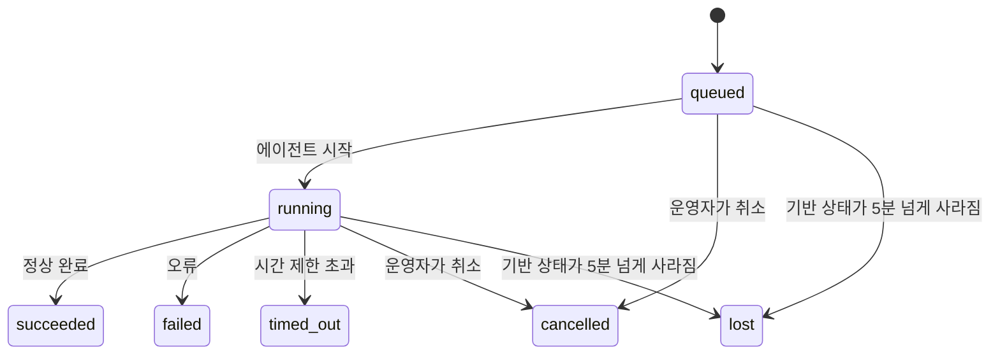

---
read_when:
    - 진행 중이거나 최근 완료된 백그라운드 작업 검사하기
    - 분리된 에이전트 실행의 전송 실패 디버깅
    - 백그라운드 실행과 세션, Cron 및 Heartbeat의 관계 이해하기
sidebarTitle: Background tasks
summary: ACP 실행, 하위 에이전트, Cron 실행 및 CLI 작업의 백그라운드 작업 추적
title: 백그라운드 작업
x-i18n:
    generated_at: "2026-07-12T00:31:29Z"
    model: gpt-5.6
    postprocess_version: locale-links-v1
    provider: openai
    source_hash: 0a945e8103c5df5a64785f326a9d0b08784ac32a2ca6fa3d4c399d75fc54be2b
    source_path: automation/tasks.md
    workflow: 16
---

<Note>
예약 실행 기능을 찾고 계신가요? 적절한 메커니즘을 선택하려면 [자동화](/ko/automation)를 참조하세요. 이 페이지는 스케줄러가 아니라 백그라운드 작업의 활동 원장에 관한 문서입니다.
</Note>

백그라운드 작업은 **기본 대화 세션 외부에서** 실행되는 작업을 추적합니다. 여기에는 ACP 실행, 하위 에이전트 생성, Cron 작업 실행, CLI에서 시작한 작업이 포함됩니다.

작업은 세션, Cron 작업 또는 Heartbeat를 **대체하지 않습니다**. 분리된 작업에서 어떤 일이 발생했는지, 언제 발생했는지, 성공했는지를 기록하는 **활동 원장**입니다.

<Note>
모든 에이전트 실행이 작업을 생성하는 것은 아닙니다. Heartbeat 턴과 일반 대화형 채팅은 작업을 생성하지 않습니다. 모든 Cron 실행, ACP 생성, 하위 에이전트 생성, Gateway에서 디스패치한 CLI 에이전트 명령은 작업을 생성합니다.
</Note>

## 요약

- 작업은 스케줄러가 아니라 **기록**입니다. Cron과 Heartbeat는 작업이 _언제_ 실행될지 결정하고, 작업은 _무슨 일이 있었는지_ 추적합니다.
- ACP, 하위 에이전트, 모든 Cron 작업 및 CLI 작업은 작업을 생성합니다. Heartbeat 턴은 생성하지 않습니다.
- 각 작업은 `queued → running → terminal` 상태로 진행됩니다(`succeeded`, `failed`, `timed_out`, `cancelled` 또는 `lost`).
- Cron 런타임이 작업을 계속 소유하는 동안 Cron 작업은 활성 상태로 유지됩니다. 메모리 내 런타임 상태가 사라지면 작업 유지 관리는 작업을 `lost`로 표시하기 전에 먼저 영구 Cron 실행 기록을 확인합니다.
- 완료 처리는 푸시 방식입니다. 분리된 작업은 완료 시 직접 알리거나 요청자 세션/Heartbeat를 깨울 수 있으므로, 상태 폴링 루프는 일반적으로 적합하지 않습니다.
- 격리된 Cron 실행과 하위 에이전트 완료는 최종 정리 기록을 처리하기 전에 하위 세션에 대해 추적 중인 브라우저 탭/프로세스를 최선의 노력으로 정리합니다.
- 격리된 Cron 전달은 하위 에이전트 작업이 아직 마무리되는 동안 오래된 중간 상위 응답을 억제하며, 전달 전에 최종 하위 출력이 도착하면 이를 우선 사용합니다.
- 완료 알림은 채널로 직접 전달되거나 다음 Heartbeat를 위해 대기열에 추가됩니다.
- `openclaw tasks list`는 모든 작업을 표시하고, `openclaw tasks audit`은 문제를 보여 줍니다.
- 종료 상태 기록은 7일 동안 유지되며(`lost` 기록은 24시간), 이후 자동으로 정리됩니다.

## 빠른 시작

<Tabs>
  <Tab title="목록 및 필터링">
    ```bash
    # 모든 작업 나열(최신 항목부터)
    openclaw tasks list

    # 런타임 또는 상태로 필터링
    openclaw tasks list --runtime acp
    openclaw tasks list --status running
    ```

  </Tab>
  <Tab title="검사">
    ```bash
    # 특정 작업의 세부 정보 표시(작업 ID, 실행 ID 또는 세션 키 기준)
    openclaw tasks show <lookup>
    ```
  </Tab>
  <Tab title="취소 및 알림">
    ```bash
    # 실행 중인 작업 취소(하위 세션 종료)
    openclaw tasks cancel <lookup>

    # 작업의 알림 정책 변경
    openclaw tasks notify <lookup> state_changes
    ```

  </Tab>
  <Tab title="감사 및 유지 관리">
    ```bash
    # 상태 감사 실행
    openclaw tasks audit

    # 유지 관리 미리 보기 또는 적용
    openclaw tasks maintenance
    openclaw tasks maintenance --apply
    ```

  </Tab>
  <Tab title="작업 흐름">
    ```bash
    # TaskFlow 상태 검사
    openclaw tasks flow list
    openclaw tasks flow show <lookup>
    openclaw tasks flow cancel <lookup>
    ```
  </Tab>
</Tabs>

## 작업을 생성하는 항목

| 소스                   | 런타임 유형 | 작업 기록이 생성되는 시점                                        | 기본 알림 정책 |
| ---------------------- | ----------- | ----------------------------------------------------------------- | -------------- |
| ACP 백그라운드 실행    | `acp`       | 하위 ACP 세션 생성                                                | `done_only`    |
| 하위 에이전트 오케스트레이션 | `subagent`  | `sessions_spawn`을 통해 하위 에이전트 생성                        | `done_only`    |
| Cron 작업(모든 유형)   | `cron`      | 모든 Cron 실행(기본 세션 및 격리 세션)                            | `silent`       |
| CLI 작업               | `cli`       | Gateway를 통해 실행되는 `openclaw agent` 명령                     | `silent`       |
| 에이전트 미디어 작업   | `cli`       | 세션 기반 `image_generate`/`music_generate`/`video_generate` 실행 | `silent`       |

<AccordionGroup>
  <Accordion title="Cron 및 미디어의 기본 알림">
    Cron 작업(기본 세션 및 격리 세션)은 `silent` 알림 정책을 사용합니다. 추적을 위한 기록은 생성하지만 자체적으로 작업 알림을 생성하지 않으며, 전달 경로는 Cron이 소유합니다.

    세션 기반 `image_generate`, `music_generate`, `video_generate` 실행도 `silent` 알림 정책을 사용합니다. 이 실행들도 작업 기록을 생성하지만, 완료 결과는 내부 깨우기 방식으로 원래 에이전트 세션에 반환되므로 에이전트가 후속 메시지를 작성하고 완성된 미디어를 직접 첨부할 수 있습니다. 요청자 에이전트는 일반적인 표시 응답 계약을 따릅니다. 구성된 경우 자동으로 최종 응답을 보내고, 세션에서 메시지 도구 응답이 필요한 경우 `message(action="send")`와 `NO_REPLY`를 사용합니다. 요청자 세션이 더 이상 활성 상태가 아니거나 활성 깨우기가 실패하고 완료 에이전트가 생성된 미디어 일부 또는 전부를 누락하면, OpenClaw는 누락된 미디어만 포함한 멱등성 직접 대체 전달을 원래 채널 대상으로 보냅니다.

  </Accordion>
  <Accordion title="동시 미디어 생성 보호 장치">
    세션 기반 미디어 생성 작업이 아직 활성 상태인 동안 `image_generate`, `music_generate`, `video_generate`는 실수로 인한 재시도를 방지합니다. 같은 프롬프트/요청으로 호출을 반복하면 중복 작업을 시작하는 대신 일치하는 활성 작업 상태를 반환하며, 다른 프롬프트는 자체 작업을 시작할 수 있습니다. 에이전트 측에서 명시적으로 진행률/상태를 조회하려면 `action: "status"`를 사용하세요.
  </Accordion>
  <Accordion title="작업을 생성하지 않는 항목">
    - Heartbeat 턴 - 기본 세션. [Heartbeat](/ko/gateway/heartbeat) 참조
    - 일반 대화형 채팅 턴
    - 직접 `/command` 응답

  </Accordion>
</AccordionGroup>

## 작업 수명 주기



| 상태        | 의미                                                                        |
| ----------- | --------------------------------------------------------------------------- |
| `queued`    | 생성되었으며 에이전트가 시작되기를 기다리는 중                             |
| `running`   | 에이전트 턴이 실행 중                                                       |
| `succeeded` | 성공적으로 완료됨                                                           |
| `failed`    | 오류와 함께 완료됨                                                          |
| `timed_out` | 구성된 시간 제한을 초과함                                                   |
| `cancelled` | 운영자가 `openclaw tasks cancel`로 중지했거나 실행이 중단됨                 |
| `lost`      | 5분의 유예 기간 후 런타임이 신뢰할 수 있는 기반 상태를 잃음                |

상태 전환은 자동으로 이루어집니다. 에이전트 실행 수명 주기 이벤트(시작, 종료, 오류)가 작업 상태를 업데이트하므로 수동으로 관리하지 않습니다.

활성 작업 기록에서는 에이전트 실행 완료 결과가 최종 기준입니다. 성공한 분리 실행은 `succeeded`, 일반 실행 오류는 `failed`, 시간 제한 초과는 `timed_out`, 취소/중단 결과는 `cancelled`로 확정됩니다. 작업이 종료 상태가 되면 이후의 수명 주기 신호가 상태를 낮추지 않습니다. 운영자가 취소했거나 이미 `failed`/`timed_out`/`lost` 상태인 작업은 나중에 성공 신호가 도착하더라도 그대로 유지됩니다.

`lost` 판정은 런타임을 인식합니다.

- ACP 작업: Gateway 프로세스 내에서 실제로 실행 중인 ACP 턴만 실행이 살아 있음을 증명하며, 영구 저장된 세션 메타데이터만으로는 충분하지 않습니다. 오프라인 CLI 감사는 보수적으로 동작하며 ACP 작업을 회수하지 않습니다.
- 하위 에이전트 작업: 기반 하위 세션이 대상 에이전트 저장소에서 사라졌거나 재시작 복구 툼스톤을 포함합니다.
- Cron 작업: Cron 런타임이 더 이상 해당 작업을 활성 상태로 추적하지 않고, 영구 Cron 실행 기록에도 해당 실행의 종료 결과가 없습니다. 오프라인 CLI 감사는 자체적인 빈 프로세스 내 Cron 런타임 상태를 최종 기준으로 취급하지 않습니다.
- CLI 작업: 실행 ID/소스 ID가 있는 작업은 현재 실행 컨텍스트를 사용하므로, Gateway가 소유한 실행이 사라진 후에도 남아 있는 하위 세션 또는 채팅 세션 행이 작업을 활성 상태로 유지하지 않습니다. 실행 식별 정보가 없는 레거시 CLI 작업은 여전히 하위 세션으로 대체 판정합니다. Gateway 기반 `openclaw agent` 실행도 실행 결과에 따라 확정되므로, 완료된 실행이 스위퍼에 의해 `lost`로 표시될 때까지 활성 상태로 남지 않습니다.

## 전달 및 알림

작업이 종료 상태에 도달하면 OpenClaw가 알림을 보냅니다. 전달 경로는 두 가지입니다.

**직접 전달** - 작업에 채널 대상(`requesterOrigin`)이 있으면 완료 메시지가 해당 채널(Discord, Slack, Telegram 등)로 바로 전달됩니다. 그룹 및 채널 작업 완료는 대신 요청자 세션을 통해 라우팅되므로 상위 에이전트가 표시할 응답을 작성할 수 있습니다. 하위 에이전트 완료의 경우 OpenClaw는 가능하면 바인딩된 스레드/주제 라우팅도 유지하며, 직접 전달을 포기하기 전에 요청자 세션에 저장된 경로(`lastChannel` / `lastTo` / `lastAccountId`)에서 누락된 `to` / 계정을 채울 수 있습니다.

**세션 대기열 전달** - 직접 전달이 실패하거나 출처가 설정되지 않은 경우, 업데이트는 요청자의 세션에 시스템 이벤트로 대기열에 추가되고 다음 Heartbeat에서 표시됩니다.

<Tip>
세션 대기열에 추가된 작업 완료는 즉시 Heartbeat 깨우기를 트리거하므로 결과를 빠르게 확인할 수 있습니다. 다음에 예약된 Heartbeat 틱까지 기다릴 필요가 없습니다.
</Tip>

따라서 일반적인 워크플로는 푸시 기반입니다. 분리된 작업을 한 번 시작한 다음 완료 시 런타임이 사용자를 깨우거나 알리도록 두세요. 디버깅, 개입 또는 명시적 감사가 필요한 경우에만 작업 상태를 폴링하세요.

### 알림 정책

각 작업에 대해 어느 정도의 알림을 받을지 제어합니다.

| 정책                  | 전달되는 내용                                            |
| --------------------- | -------------------------------------------------------- |
| `done_only` (기본값)  | 종료 상태만 전달(`succeeded`, `failed` 등)               |
| `state_changes`       | 모든 상태 전환 및 진행률 업데이트                       |
| `silent`              | 아무것도 전달하지 않음(Cron, CLI 및 미디어 작업의 기본값) |

작업이 실행 중일 때 정책을 변경할 수 있습니다.

```bash
openclaw tasks notify <lookup> state_changes
```

## CLI 참조

<AccordionGroup>
  <Accordion title="tasks list">
    ```bash
    openclaw tasks list [--runtime <acp|subagent|cron|cli>] [--status <status>] [--json]
    ```

    출력 열: 작업, 종류, 상태, 전달, 실행, 하위 세션, 요약. 인수 없는 `openclaw tasks`는 `openclaw tasks list`처럼 동작합니다.

  </Accordion>
  <Accordion title="tasks show">
    ```bash
    openclaw tasks show <lookup> [--json]
    ```

    조회 토큰에는 작업 ID, 실행 ID 또는 세션 키를 사용할 수 있습니다. 시간 정보, 전달 상태, 오류 및 종료 요약을 포함한 전체 기록을 표시합니다.

  </Accordion>
  <Accordion title="tasks cancel">
    ```bash
    openclaw tasks cancel <lookup>
    ```

    ACP 및 하위 에이전트 작업에서는 하위 세션을 종료합니다. ACP 및 Cron 취소는 실행 중인 Gateway(`tasks.cancel`)를 통해 라우팅됩니다. CLI에서 추적하는 작업의 경우 취소가 작업 레지스트리에 기록됩니다(별도의 하위 런타임 핸들은 없음). 상태가 `cancelled`로 전환되고 해당하는 경우 전달 알림이 전송됩니다.

  </Accordion>
  <Accordion title="tasks notify">
    ```bash
    openclaw tasks notify <lookup> <done_only|state_changes|silent>
    ```
  </Accordion>
  <Accordion title="tasks audit">
    ```bash
    openclaw tasks audit [--severity <warn|error>] [--code <name>] [--limit <n>] [--json]
    ```

    작업과 TaskFlow의 운영 문제를 하나의 보고서로 보여 줍니다. 문제가 감지되면 결과가 `openclaw status`에도 표시됩니다.

    작업 결과:

    | 발견 항목                   | 심각도     | 발생 조건                                                                                                      |
    | ------------------------- | ---------- | ------------------------------------------------------------------------------------------------------------ |
    | `stale_queued`            | 경고       | 10분 넘게 대기열에 있음                                                                              |
    | `stale_running`           | 오류       | 30분 넘게 실행 중임                                                                             |
    | `lost`                    | 경고/오류 | 런타임이 지원하던 작업의 소유권이 사라짐. 보존된 유실 작업은 `cleanupAfter`까지 경고를 표시한 후 오류가 됨 |
    | `delivery_failed`         | 경고       | 전달에 실패했고 알림 정책이 `silent`가 아님                                                            |
    | `missing_cleanup`         | 경고       | 정리 타임스탬프가 없는 종료 작업                                                                      |
    | `inconsistent_timestamps` | 경고       | 타임라인 위반(예: 시작 전에 종료됨)                                                        |

    TaskFlow 발견 항목:

    | 발견 항목                | 심각도     | 발생 조건                                                                    |
    | ---------------------- | ---------- | --------------------------------------------------------------------------- |
    | `restore_failed`       | 오류      | SQLite에서 흐름 레지스트리를 복원하지 못함                                    |
    | `stale_running`        | 오류      | 실행 중인 흐름이 30분 넘게 진행되지 않음                      |
    | `stale_waiting`        | 경고       | 대기 중인 흐름이 30분 넘게 진행되지 않음                      |
    | `stale_blocked`        | 경고       | 차단된 흐름이 30분 넘게 진행되지 않음                      |
    | `cancel_stuck`         | 경고       | 5분 넘게 전에 취소가 요청되었고 활성 하위 작업이 없지만 아직 종료되지 않음 |
    | `missing_linked_tasks` | 경고/오류 | 연결된 작업이나 대기 상태가 없는 오래된 관리형 흐름                       |
    | `blocked_task_missing` | 경고       | 차단된 흐름이 더 이상 존재하지 않는 작업 ID를 가리킴                      |

  </Accordion>
  <Accordion title="작업 유지 관리">
    ```bash
    openclaw tasks maintenance [--json]
    openclaw tasks maintenance --apply [--json]
    ```

    작업, TaskFlow 상태, 오래된 Cron 실행 세션 레지스트리 행에 대한 조정, 정리 타임스탬프 지정 및 가지치기를 미리 보거나 적용할 때 사용합니다.

    조정은 런타임을 인식합니다.

    - ACP 작업에는 Gateway에서 실행 중인 실제 프로세스 내 턴이 필요하며, 하위 에이전트 작업은 기반이 되는 하위 세션을 확인합니다.
    - 하위 세션에 재시작 복구 툼스톤이 있는 하위 에이전트 작업은 복구 가능한 기반 세션으로 처리되지 않고 유실로 표시됩니다.
    - Cron 작업은 Cron 런타임이 여전히 해당 작업을 소유하는지 확인한 다음, `lost`로 대체하기 전에 영구 저장된 Cron 실행 로그/작업 상태에서 종료 상태를 복구합니다. 메모리 내 Cron 활성 작업 집합에 대한 권위는 Gateway 프로세스에만 있습니다. 오프라인 CLI 감사는 영구 기록을 사용하지만 로컬 집합이 비어 있다는 이유만으로 Cron 작업을 유실로 표시하지 않습니다.
    - 실행 식별 정보가 있는 CLI 작업은 하위 세션이나 채팅 세션 행만이 아니라 소유 중인 실제 실행 컨텍스트를 확인합니다.

    완료 정리도 런타임을 인식합니다.

    - 하위 에이전트 완료 시 알림 정리가 계속되기 전에 하위 세션에 대해 추적 중인 브라우저 탭/프로세스를 최선의 방식으로 닫습니다.
    - 격리된 Cron 완료 시 실행이 완전히 종료되기 전에 Cron 세션에 대해 추적 중인 브라우저 탭/프로세스를 최선의 방식으로 닫습니다.
    - 격리된 Cron 전달은 필요한 경우 하위 에이전트 후속 작업이 끝날 때까지 기다리고, 오래된 상위 확인 텍스트를 알리는 대신 억제합니다.
    - 하위 에이전트 완료 전달은 하위 세션의 가장 최근에 표시된 어시스턴트 텍스트만 사용합니다. 도구/`toolResult` 출력은 하위 결과 텍스트로 승격되지 않습니다. 종료된 실패 실행은 캡처된 응답 텍스트를 재생하지 않고 실패 상태를 알립니다.
    - 정리 실패가 실제 작업 결과를 가리지 않습니다.

    유지 관리를 적용하면 OpenClaw는 현재 실행 중인 Cron 작업의 행은 보존하고 Cron이 아닌 세션 행은 그대로 둔 채, 7일보다 오래된 `cron:<jobId>:run:<runId>` 세션 레지스트리 행도 제거합니다.

  </Accordion>
  <Accordion title="작업 흐름 목록 | 표시 | 취소">
    ```bash
    openclaw tasks flow list [--status <status>] [--json]
    openclaw tasks flow show <lookup> [--json]
    openclaw tasks flow cancel <lookup>
    ```

    흐름 조회 토큰에는 흐름 ID 또는 소유자 키를 사용할 수 있습니다. 개별 백그라운드 작업 레코드가 아니라 오케스트레이션하는 [작업 흐름](/ko/automation/taskflow)에 관심이 있을 때 사용합니다.

  </Accordion>
</AccordionGroup>

## 채팅 작업 보드(`/tasks`)

채팅 세션에서 `/tasks`를 사용하면 해당 세션에 연결된 백그라운드 작업을 볼 수 있습니다. 보드에는 실행 중이거나 최근 완료된 작업이 최대 5개까지 런타임, 상태, 시간 정보, 진행 상황 또는 오류 세부 정보와 함께 표시됩니다.

현재 세션에 표시 가능한 연결 작업이 없으면 `/tasks`는 에이전트 로컬 작업 수로 대체하여 다른 세션의 세부 정보를 노출하지 않고도 개요를 제공합니다.

전체 운영자 원장을 보려면 CLI인 `openclaw tasks list`를 사용하세요.

### 제어 UI

웹 제어 UI의 사이드바에는 실행 중이거나 최근 완료된 백그라운드 작업을 실시간으로 보여 주는 **작업** 페이지가 있습니다. 이 페이지에서 진행 상황을 점검하고, 연결된 세션을 열고, 원장을 새로 고치거나, 대기열 및 실행 중인 작업을 취소할 수 있습니다.

채팅 창에는 해당 창의 에이전트로 범위가 지정된 접을 수 있는 **백그라운드 작업** 레일도 있습니다. 여기에는 중지 컨트롤이 있는 실행 중 작업과 하위 에이전트, 완료 섹션, 각 작업의 하위 세션으로 이동하는 대화 내용 보기 링크가 표시됩니다. 창 헤더의 활동 토글(또는 단일 창 채팅의 플로팅 활동 버튼)에서 여세요.

## 상태 통합(작업 부하)

`openclaw status`에는 작업 현황을 한눈에 볼 수 있는 줄이 포함됩니다.

```
작업    활성 2개 · 대기열 1개 · 실행 중 1개 · 문제 1개 · 감사 이상 없음 · 추적 6개
```

요약에는 활성 작업(`queued` + `running`), 실패(`failed` + `timed_out` + `lost`), 감사 발견 항목 및 추적 중인 전체 레코드 수가 집계됩니다. JSON 페이로드는 런타임별(`acp`, `subagent`, `cron`, `cli`) 개수도 세분화합니다.

`/status`와 `session_status` 도구는 모두 정리를 인식하는 작업 스냅샷을 사용합니다. 활성 작업을 우선하고, 만료된 행은 숨기며, 종료 작업은 짧은 최근 기간(5분) 동안만 표시합니다. 활성 작업이 남아 있지 않으면 실패에 초점을 맞춥니다. 이를 통해 상태 카드가 지금 중요한 내용에 집중합니다.

## 저장소 및 유지 관리

### 작업 저장 위치

작업 레코드와 전달 상태는 공유 OpenClaw SQLite 상태 데이터베이스에 영구 저장됩니다.

```
~/.openclaw/state/openclaw.sqlite   (테이블: task_runs, task_delivery_state, flow_runs)
```

전체 상태 루트(기본값 `~/.openclaw`)를 다른 위치로 옮기려면 `OPENCLAW_STATE_DIR`을 설정하세요. 공유 데이터베이스 경로도 함께 이동합니다.

레지스트리는 처음 사용할 때 메모리로 로드되며 모든 쓰기를 SQLite에 다시 영구 저장하므로 Gateway가 재시작되어도 레코드가 유지됩니다. WAL 증가는 SQLite의 기본 자동 체크포인트 임계값과 주기적인 `PASSIVE` 체크포인트를 통해 제한됩니다. 종료 및 명시적 유지 관리 체크포인트는 `TRUNCATE`를 사용하므로 백그라운드 스위퍼가 활성 리더를 기다리게 하지 않으면서 정상 종료 시 WAL 공간을 회수합니다.

이전 설치의 레거시 사이드카 저장소(`tasks/runs.sqlite`, `flows/registry.sqlite`)는 `openclaw doctor`가 공유 데이터베이스로 가져옵니다.

### 자동 유지 관리

스위퍼는 **60초**마다 실행되며(Gateway 시작 후 약 5초 뒤 첫 실행), 다음 네 가지를 처리합니다.

<Steps>
  <Step title="조정">
    활성 작업에 권위 있는 런타임 기반이 여전히 있는지 확인합니다. ACP 작업에는 실제 프로세스 내 턴이 필요하고, 하위 에이전트 작업은 하위 세션 상태를 사용하며, Cron 작업은 활성 작업 소유권과 영구 실행 기록을 함께 사용하고, 실행 식별 정보가 있는 CLI 작업은 소유 중인 실행 컨텍스트를 사용합니다. 기반 상태가 5분 넘게 사라진 경우(하위 세션이 없는 네이티브 하위 에이전트 작업은 30분) 작업은 `lost`로 표시됩니다.
  </Step>
  <Step title="ACP 세션 복구">
    종료되었거나 고립된 상위 소유 일회성 ACP 세션을 닫고, 활성 대화 바인딩이 남아 있지 않은 경우에만 오래되어 종료되었거나 고립된 영구 ACP 세션을 닫습니다.
  </Step>
  <Step title="정리 타임스탬프 지정">
    종료 작업에 `cleanupAfter` 타임스탬프(종료 시간 + 보존 기간)를 설정합니다. 보존 기간에는 유실 작업이 감사에서 계속 경고로 표시되지만, `cleanupAfter`가 만료되거나 정리 메타데이터가 없으면 오류가 됩니다.
  </Step>
  <Step title="가지치기">
    `cleanupAfter` 날짜가 지난 레코드를 삭제합니다.
  </Step>
</Steps>

<Note>
**보존 기간:** 종료 작업 레코드는 **7일** 동안(`lost` 레코드는 **24시간**) 보관된 후 자동으로 제거됩니다. 별도의 설정은 필요하지 않습니다.
</Note>

## 작업과 다른 시스템의 관계

<AccordionGroup>
  <Accordion title="작업과 Task Flow">
    [Task Flow](/ko/automation/taskflow)는 백그라운드 작업 위에 있는 흐름 오케스트레이션 계층입니다. 하나의 흐름은 수명 주기 동안 관리형 또는 미러링 동기화 모드를 사용하여 여러 작업을 조정할 수 있습니다. 개별 작업 레코드를 점검하려면 `openclaw tasks`를 사용하고, 오케스트레이션하는 흐름을 점검하려면 `openclaw tasks flow`를 사용하세요.

  </Accordion>
  <Accordion title="작업과 Cron">
    Cron 작업 정의, 런타임 실행 상태 및 실행 기록은 OpenClaw의 공유 SQLite 상태 데이터베이스에 저장됩니다. **모든** Cron 실행은 기본 세션과 격리된 세션 모두 `silent` 알림 정책을 사용하는 작업 레코드를 생성하므로, Cron 실행 자체의 작업 알림을 생성하지 않으면서 추적됩니다.

    [Cron 작업](/ko/automation/cron-jobs)을 참조하세요.

  </Accordion>
  <Accordion title="작업과 Heartbeat">
    Heartbeat 실행은 기본 세션 턴이므로 작업 레코드를 생성하지 않습니다. 작업이 완료되면 Heartbeat 깨우기를 트리거하여 결과를 신속하게 확인할 수 있습니다.

    [Heartbeat](/ko/gateway/heartbeat)를 참조하세요.

  </Accordion>
  <Accordion title="작업과 세션">
    작업은 `childSessionKey`(작업이 실행되는 위치)와 `requesterSessionKey`(작업을 시작한 주체)를 참조할 수 있습니다. `agentId`는 작업을 실행하는 에이전트를 식별하며, 요청자 및 소유자 필드는 시작 및 제어 컨텍스트를 보존합니다. 세션은 대화 컨텍스트이며, 작업은 그 위에 있는 활동 추적 계층입니다.
  </Accordion>
  <Accordion title="작업과 에이전트 실행">
    작업의 `runId`는 해당 작업을 수행하는 에이전트 실행에 연결됩니다. 에이전트 수명 주기 이벤트(시작, 종료, 오류)는 작업 상태를 자동으로 업데이트하므로 수명 주기를 수동으로 관리할 필요가 없습니다.
  </Accordion>
</AccordionGroup>

## 관련 문서

- [자동화](/ko/automation) - 모든 자동화 메커니즘 한눈에 보기
- [CLI: 작업](/ko/cli/tasks) - CLI 명령 참조
- [Heartbeat](/ko/gateway/heartbeat) - 주기적인 기본 세션 턴
- [예약된 작업](/ko/automation/cron-jobs) - 백그라운드 작업 예약
- [Task Flow](/ko/automation/taskflow) - 작업 위의 흐름 오케스트레이션
