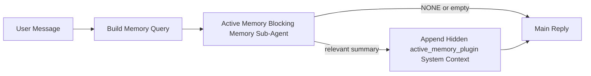

---
read_when:
    - 활성 메모리가 무엇을 위한 것인지 이해하고 싶습니다
    - 대화형 에이전트에 활성 메모리를 켜고 싶습니다
    - 활성 메모리를 모든 곳에서 활성화하지 않고 동작을 조정하고 싶습니다
summary: 대화형 채팅 세션에 관련 메모리를 주입하는 플러그인 소유 차단 메모리 서브 에이전트
title: 활성 메모리
x-i18n:
    generated_at: "2026-04-11T05:44:54Z"
    model: gpt-5.4
    provider: openai
    source_hash: e8b0e6539e09678e9e8def68795f8bcb992f98509423da3da3123eda88ec1dd5
    source_path: concepts/active-memory.md
    workflow: 15
---

# 활성 메모리

활성 메모리는 적격한 대화형 세션에서 메인 응답 전에 실행되는 선택적 플러그인 소유 차단 메모리 서브 에이전트입니다.

대부분의 메모리 시스템은 성능은 좋지만 반응형이기 때문에 이것이 존재합니다. 메인 에이전트가 언제 메모리를 검색할지 결정하거나, 사용자가 "이걸 기억해" 또는 "메모리 검색해" 같은 말을 하기를 기다립니다. 그 시점이 되면, 메모리가 응답을 더 자연스럽게 만들 수 있었던 순간은 이미 지나간 뒤입니다.

활성 메모리는 메인 응답이 생성되기 전에 관련 메모리를 노출할 수 있는 제한된 한 번의 기회를 시스템에 제공합니다.

## 이것을 에이전트에 붙여넣기

안전한 기본값이 포함된 독립형 설정으로 활성 메모리를 켜고 싶다면, 이것을 에이전트에 붙여넣으세요:

```json5
{
  plugins: {
    entries: {
      "active-memory": {
        enabled: true,
        config: {
          enabled: true,
          agents: ["main"],
          allowedChatTypes: ["direct"],
          modelFallbackPolicy: "default-remote",
          queryMode: "recent",
          promptStyle: "balanced",
          timeoutMs: 15000,
          maxSummaryChars: 220,
          persistTranscripts: false,
          logging: true,
        },
      },
    },
  },
}
```

이 설정은 `main` 에이전트에 대해 플러그인을 켜고, 기본적으로 직접 메시지 스타일 세션으로 제한하며, 먼저 현재 세션 모델을 상속하도록 하고, 명시적이거나 상속된 모델을 사용할 수 없는 경우에도 내장 원격 대체를 계속 허용합니다.

그다음 게이트웨이를 다시 시작하세요:

```bash
openclaw gateway
```

대화에서 실시간으로 확인하려면:

```text
/verbose on
```

## 활성 메모리 켜기

가장 안전한 설정은 다음과 같습니다:

1. 플러그인 활성화
2. 하나의 대화형 에이전트 지정
3. 조정하는 동안에만 로깅 유지

`openclaw.json`에서 다음으로 시작하세요:

```json5
{
  plugins: {
    entries: {
      "active-memory": {
        enabled: true,
        config: {
          agents: ["main"],
          allowedChatTypes: ["direct"],
          modelFallbackPolicy: "default-remote",
          queryMode: "recent",
          promptStyle: "balanced",
          timeoutMs: 15000,
          maxSummaryChars: 220,
          persistTranscripts: false,
          logging: true,
        },
      },
    },
  },
}
```

그다음 게이트웨이를 다시 시작하세요:

```bash
openclaw gateway
```

이 의미는 다음과 같습니다:

- `plugins.entries.active-memory.enabled: true` 는 플러그인을 켭니다
- `config.agents: ["main"]` 는 `main` 에이전트만 활성 메모리에 참여시킵니다
- `config.allowedChatTypes: ["direct"]` 는 기본적으로 직접 메시지 스타일 세션에서만 활성 메모리가 실행되도록 유지합니다
- `config.model` 이 설정되지 않은 경우, 활성 메모리는 먼저 현재 세션 모델을 상속합니다
- `config.modelFallbackPolicy: "default-remote"` 는 명시적이거나 상속된 모델을 사용할 수 없을 때 기본값으로 내장 원격 대체를 유지합니다
- `config.promptStyle: "balanced"` 는 `recent` 모드에 대한 기본 범용 프롬프트 스타일을 사용합니다
- 활성 메모리는 여전히 적격한 대화형 지속 채팅 세션에서만 실행됩니다

## 확인 방법

활성 메모리는 모델에 숨겨진 시스템 컨텍스트를 주입합니다. 클라이언트에 원시 `<active_memory_plugin>...</active_memory_plugin>` 태그를 노출하지는 않습니다.

## 세션 토글

설정을 수정하지 않고 현재 채팅 세션에서 활성 메모리를 일시 중지하거나 다시 시작하려면 플러그인 명령을 사용하세요:

```text
/active-memory status
/active-memory off
/active-memory on
```

이것은 세션 범위 설정입니다. `plugins.entries.active-memory.enabled`, 에이전트 대상 지정, 기타 전역 설정은 변경하지 않습니다.

명령이 설정을 기록하고 모든 세션에 대해 활성 메모리를 일시 중지하거나 다시 시작하게 하려면, 명시적 전역 형식을 사용하세요:

```text
/active-memory status --global
/active-memory off --global
/active-memory on --global
```

전역 형식은 `plugins.entries.active-memory.config.enabled` 를 기록합니다. 나중에 명령으로 활성 메모리를 다시 켤 수 있도록 `plugins.entries.active-memory.enabled` 는 켜진 상태로 둡니다.

실시간 세션에서 활성 메모리가 무엇을 하는지 보고 싶다면, 해당 세션에서 상세 모드를 켜세요:

```text
/verbose on
```

상세 모드가 활성화되면 OpenClaw는 다음을 표시할 수 있습니다:

- `Active Memory: ok 842ms recent 34 chars` 같은 활성 메모리 상태 줄
- `Active Memory Debug: Lemon pepper wings with blue cheese.` 같은 읽기 쉬운 디버그 요약

이 줄들은 숨겨진 시스템 컨텍스트를 제공하는 동일한 활성 메모리 패스에서 파생되지만, 원시 프롬프트 마크업을 노출하는 대신 사람이 읽기 쉬운 형식으로 표시됩니다.

기본적으로 차단 메모리 서브 에이전트 기록은 일시적이며 실행이 완료되면 삭제됩니다.

예시 흐름:

```text
/verbose on
what wings should i order?
```

예상되는 표시 응답 형태:

```text
...normal assistant reply...

🧩 Active Memory: ok 842ms recent 34 chars
🔎 Active Memory Debug: Lemon pepper wings with blue cheese.
```

## 실행 시점

활성 메모리는 두 가지 게이트를 사용합니다:

1. **설정 옵트인**
   플러그인이 활성화되어 있어야 하며, 현재 에이전트 id가
   `plugins.entries.active-memory.config.agents` 에 포함되어 있어야 합니다.
2. **엄격한 런타임 적격성**
   활성화되어 있고 대상으로 지정되었더라도, 활성 메모리는 적격한
   대화형 지속 채팅 세션에서만 실행됩니다.

실제 규칙은 다음과 같습니다:

```text
plugin enabled
+
agent id targeted
+
allowed chat type
+
eligible interactive persistent chat session
=
active memory runs
```

이 중 하나라도 실패하면 활성 메모리는 실행되지 않습니다.

## 세션 유형

`config.allowedChatTypes` 는 어떤 종류의 대화에서 활성 메모리를 아예 실행할 수 있는지를 제어합니다.

기본값은 다음과 같습니다:

```json5
allowedChatTypes: ["direct"]
```

즉, 활성 메모리는 기본적으로 직접 메시지 스타일 세션에서 실행되지만, 그룹이나 채널 세션에서는 명시적으로 참여시키지 않는 한 실행되지 않습니다.

예시:

```json5
allowedChatTypes: ["direct"]
```

```json5
allowedChatTypes: ["direct", "group"]
```

```json5
allowedChatTypes: ["direct", "group", "channel"]
```

## 실행 위치

활성 메모리는 플랫폼 전반의 추론 기능이 아니라 대화 강화 기능입니다.

| Surface                                                             | 활성 메모리 실행 여부                                |
| ------------------------------------------------------------------- | --------------------------------------------------- |
| Control UI / 웹 채팅 지속 세션                                      | 예, 플러그인이 활성화되어 있고 에이전트가 지정된 경우 |
| 동일한 지속 채팅 경로의 다른 대화형 채널 세션                       | 예, 플러그인이 활성화되어 있고 에이전트가 지정된 경우 |
| 헤드리스 단발 실행                                                  | 아니요                                              |
| 하트비트/백그라운드 실행                                            | 아니요                                              |
| 일반 내부 `agent-command` 경로                                      | 아니요                                              |
| 서브 에이전트/내부 헬퍼 실행                                        | 아니요                                              |

## 사용해야 하는 이유

다음과 같은 경우 활성 메모리를 사용하세요:

- 세션이 지속적이고 사용자 대상일 때
- 에이전트가 검색할 만한 의미 있는 장기 메모리를 가지고 있을 때
- 원시 프롬프트 결정성보다 연속성과 개인화가 더 중요할 때

특히 다음에 잘 맞습니다:

- 안정적인 선호
- 반복되는 습관
- 자연스럽게 드러나야 하는 장기 사용자 컨텍스트

다음에는 적합하지 않습니다:

- 자동화
- 내부 작업자
- 단발성 API 작업
- 숨겨진 개인화가 놀랍게 느껴질 수 있는 위치

## 작동 방식

런타임 형태는 다음과 같습니다:



차단 메모리 서브 에이전트는 다음만 사용할 수 있습니다:

- `memory_search`
- `memory_get`

연결이 약하면 `NONE` 을 반환해야 합니다.

## 쿼리 모드

`config.queryMode` 는 차단 메모리 서브 에이전트가 얼마나 많은 대화를 볼 수 있는지를 제어합니다.

## 프롬프트 스타일

`config.promptStyle` 는 차단 메모리 서브 에이전트가 메모리를 반환할지 결정할 때 얼마나 적극적이거나 엄격할지를 제어합니다.

사용 가능한 스타일:

- `balanced`: `recent` 모드용 범용 기본값
- `strict`: 가장 덜 적극적이며, 주변 컨텍스트의 영향을 매우 적게 원할 때 가장 적합
- `contextual`: 가장 연속성 친화적이며, 대화 기록이 더 중요할 때 가장 적합
- `recall-heavy`: 약하지만 여전히 그럴듯한 일치에도 메모리를 더 잘 노출함
- `precision-heavy`: 일치가 명확하지 않으면 `NONE` 을 강하게 선호함
- `preference-only`: 즐겨찾기, 습관, 루틴, 취향, 반복되는 개인 사실에 최적화됨

`config.promptStyle` 이 설정되지 않은 경우의 기본 매핑:

```text
message -> strict
recent -> balanced
full -> contextual
```

`config.promptStyle` 을 명시적으로 설정하면 그 재정의가 우선합니다.

예시:

```json5
promptStyle: "preference-only"
```

## 모델 대체 정책

`config.model` 이 설정되지 않은 경우, 활성 메모리는 다음 순서로 모델을 확인하려고 시도합니다:

```text
explicit plugin model
-> current session model
-> agent primary model
-> optional built-in remote fallback
```

`config.modelFallbackPolicy` 는 마지막 단계를 제어합니다.

기본값:

```json5
modelFallbackPolicy: "default-remote"
```

다른 옵션:

```json5
modelFallbackPolicy: "resolved-only"
```

명시적이거나 상속된 모델을 사용할 수 없을 때 내장 원격 기본값으로 대체하는 대신 활성 메모리가 회상을 건너뛰게 하려면 `resolved-only` 를 사용하세요.

## 고급 탈출구

이 옵션들은 의도적으로 권장 설정에 포함되지 않습니다.

`config.thinking` 은 차단 메모리 서브 에이전트의 사고 수준을 재정의할 수 있습니다:

```json5
thinking: "medium"
```

기본값:

```json5
thinking: "off"
```

기본적으로 이것을 활성화하지 마세요. 활성 메모리는 응답 경로에서 실행되므로 추가 사고 시간은 사용자에게 보이는 지연 시간을 직접 증가시킵니다.

`config.promptAppend` 는 기본 활성 메모리 프롬프트 뒤와 대화 컨텍스트 앞에 추가 운영자 지침을 더합니다:

```json5
promptAppend: "Prefer stable long-term preferences over one-off events."
```

`config.promptOverride` 는 기본 활성 메모리 프롬프트를 대체합니다. OpenClaw는 그 뒤에 대화 컨텍스트를 계속 추가합니다:

```json5
promptOverride: "You are a memory search agent. Return NONE or one compact user fact."
```

의도적으로 다른 회상 계약을 테스트하는 경우가 아니라면 프롬프트 사용자 지정은 권장되지 않습니다. 기본 프롬프트는 메인 모델에 대해 `NONE` 또는 간결한 사용자 사실 컨텍스트를 반환하도록 조정되어 있습니다.

### `message`

가장 최근 사용자 메시지만 전송됩니다.

```text
Latest user message only
```

다음과 같은 경우 사용하세요:

- 가장 빠른 동작을 원할 때
- 안정적인 선호 회상에 가장 강한 편향을 원할 때
- 후속 턴에 대화 컨텍스트가 필요하지 않을 때

권장 타임아웃:

- `3000` ~ `5000` ms 정도로 시작

### `recent`

가장 최근 사용자 메시지와 최근 대화의 작은 꼬리 부분이 함께 전송됩니다.

```text
Recent conversation tail:
user: ...
assistant: ...
user: ...

Latest user message:
...
```

다음과 같은 경우 사용하세요:

- 속도와 대화 기반 맥락 사이에서 더 나은 균형을 원할 때
- 후속 질문이 최근 몇 턴에 자주 의존할 때

권장 타임아웃:

- `15000` ms 정도로 시작

### `full`

전체 대화가 차단 메모리 서브 에이전트로 전송됩니다.

```text
Full conversation context:
user: ...
assistant: ...
user: ...
...
```

다음과 같은 경우 사용하세요:

- 지연 시간보다 가장 강한 회상 품질이 더 중요할 때
- 대화에 스레드의 훨씬 앞부분에 있는 중요한 설정이 포함되어 있을 때

권장 타임아웃:

- `message` 또는 `recent` 보다 상당히 늘리세요
- 스레드 크기에 따라 `15000` ms 이상으로 시작하세요

일반적으로 타임아웃은 컨텍스트 크기에 따라 증가해야 합니다:

```text
message < recent < full
```

## 기록 지속성

활성 메모리 차단 메모리 서브 에이전트 실행은 차단 메모리 서브 에이전트 호출 중 실제 `session.jsonl` 기록을 생성합니다.

기본적으로 이 기록은 일시적입니다:

- 임시 디렉터리에 기록됩니다
- 차단 메모리 서브 에이전트 실행에만 사용됩니다
- 실행이 끝나면 즉시 삭제됩니다

디버깅이나 검토를 위해 해당 차단 메모리 서브 에이전트 기록을 디스크에 유지하고 싶다면, 지속성을 명시적으로 켜세요:

```json5
{
  plugins: {
    entries: {
      "active-memory": {
        enabled: true,
        config: {
          agents: ["main"],
          persistTranscripts: true,
          transcriptDir: "active-memory",
        },
      },
    },
  },
}
```

활성화되면 활성 메모리는 기록을 메인 사용자 대화 기록 경로가 아니라 대상 에이전트의 세션 폴더 아래 별도 디렉터리에 저장합니다.

기본 레이아웃은 개념적으로 다음과 같습니다:

```text
agents/<agent>/sessions/active-memory/<blocking-memory-sub-agent-session-id>.jsonl
```

상대 하위 디렉터리는 `config.transcriptDir` 로 변경할 수 있습니다.

다음 사항에 주의해서 사용하세요:

- 바쁜 세션에서는 차단 메모리 서브 에이전트 기록이 빠르게 누적될 수 있습니다
- `full` 쿼리 모드는 많은 대화 컨텍스트를 중복할 수 있습니다
- 이 기록에는 숨겨진 프롬프트 컨텍스트와 회상된 메모리가 포함됩니다

## 설정

모든 활성 메모리 설정은 다음 아래에 있습니다:

```text
plugins.entries.active-memory
```

가장 중요한 필드는 다음과 같습니다:

| Key                         | Type                                                                                                 | 의미                                                                                                   |
| --------------------------- | ---------------------------------------------------------------------------------------------------- | ------------------------------------------------------------------------------------------------------ |
| `enabled`                   | `boolean`                                                                                            | 플러그인 자체를 활성화합니다                                                                            |
| `config.agents`             | `string[]`                                                                                           | 활성 메모리를 사용할 수 있는 에이전트 id                                                                |
| `config.model`              | `string`                                                                                             | 선택적 차단 메모리 서브 에이전트 모델 참조; 설정되지 않으면 활성 메모리는 현재 세션 모델을 사용합니다 |
| `config.queryMode`          | `"message" \| "recent" \| "full"`                                                                    | 차단 메모리 서브 에이전트가 얼마나 많은 대화를 보는지 제어합니다                                        |
| `config.promptStyle`        | `"balanced" \| "strict" \| "contextual" \| "recall-heavy" \| "precision-heavy" \| "preference-only"` | 차단 메모리 서브 에이전트가 메모리를 반환할지 결정할 때 얼마나 적극적이거나 엄격한지 제어합니다        |
| `config.thinking`           | `"off" \| "minimal" \| "low" \| "medium" \| "high" \| "xhigh" \| "adaptive"`                         | 차단 메모리 서브 에이전트용 고급 사고 재정의; 속도를 위해 기본값은 `off` 입니다                        |
| `config.promptOverride`     | `string`                                                                                             | 고급 전체 프롬프트 대체; 일반적인 사용에는 권장되지 않습니다                                            |
| `config.promptAppend`       | `string`                                                                                             | 기본 또는 재정의된 프롬프트 뒤에 추가되는 고급 추가 지침                                                |
| `config.timeoutMs`          | `number`                                                                                             | 차단 메모리 서브 에이전트의 하드 타임아웃                                                               |
| `config.maxSummaryChars`    | `number`                                                                                             | 활성 메모리 요약에 허용되는 최대 전체 문자 수                                                           |
| `config.logging`            | `boolean`                                                                                            | 조정 중 활성 메모리 로그를 출력합니다                                                                   |
| `config.persistTranscripts` | `boolean`                                                                                            | 임시 파일을 삭제하는 대신 차단 메모리 서브 에이전트 기록을 디스크에 유지합니다                          |
| `config.transcriptDir`      | `string`                                                                                             | 에이전트 세션 폴더 아래의 상대 차단 메모리 서브 에이전트 기록 디렉터리                                 |

유용한 조정 필드:

| Key                           | Type     | 의미                                                   |
| ----------------------------- | -------- | ------------------------------------------------------ |
| `config.maxSummaryChars`      | `number` | 활성 메모리 요약에 허용되는 최대 전체 문자 수          |
| `config.recentUserTurns`      | `number` | `queryMode` 가 `recent` 일 때 포함할 이전 사용자 턴 수 |
| `config.recentAssistantTurns` | `number` | `queryMode` 가 `recent` 일 때 포함할 이전 어시스턴트 턴 수 |
| `config.recentUserChars`      | `number` | 최근 사용자 턴당 최대 문자 수                          |
| `config.recentAssistantChars` | `number` | 최근 어시스턴트 턴당 최대 문자 수                      |
| `config.cacheTtlMs`           | `number` | 반복되는 동일 쿼리에 대한 캐시 재사용                  |

## 권장 설정

`recent` 로 시작하세요.

```json5
{
  plugins: {
    entries: {
      "active-memory": {
        enabled: true,
        config: {
          agents: ["main"],
          queryMode: "recent",
          promptStyle: "balanced",
          timeoutMs: 15000,
          maxSummaryChars: 220,
          logging: true,
        },
      },
    },
  },
}
```

조정 중 실시간 동작을 확인하고 싶다면, 별도의 active-memory 디버그 명령을 찾는 대신 세션에서 `/verbose on` 을 사용하세요.

그다음 다음으로 이동하세요:

- 더 낮은 지연 시간을 원하면 `message`
- 더 느린 차단 메모리 서브 에이전트의 대가로 추가 컨텍스트가 가치 있다고 판단되면 `full`

## 디버깅

예상한 위치에서 활성 메모리가 나타나지 않는다면:

1. `plugins.entries.active-memory.enabled` 아래에서 플러그인이 활성화되어 있는지 확인하세요.
2. 현재 에이전트 id가 `config.agents` 에 나열되어 있는지 확인하세요.
3. 대화형 지속 채팅 세션을 통해 테스트하고 있는지 확인하세요.
4. `config.logging: true` 를 켜고 게이트웨이 로그를 확인하세요.
5. `openclaw memory status --deep` 로 메모리 검색 자체가 작동하는지 확인하세요.

메모리 적중이 너무 시끄럽다면 다음을 더 엄격하게 조정하세요:

- `maxSummaryChars`

활성 메모리가 너무 느리다면:

- `queryMode` 낮추기
- `timeoutMs` 낮추기
- 최근 턴 수 줄이기
- 턴당 문자 제한 줄이기

## 관련 페이지

- [메모리 검색](/ko/concepts/memory-search)
- [메모리 설정 참조](/ko/reference/memory-config)
- [Plugin SDK 설정](/ko/plugins/sdk-setup)
