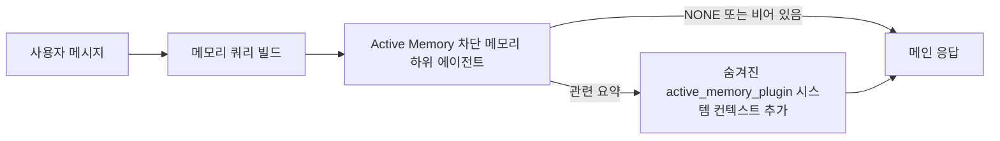

---
read_when:
    - 활성 메모리가 무엇을 위한 것인지 이해하고 싶습니다
    - 대화형 에이전트에 활성 메모리를 켜고 싶습니다
    - 어디에서나 활성화하지 않고 활성 메모리 동작을 조정하고 싶습니다
summary: 대화형 채팅 세션에 관련 메모리를 주입하는 plugin 소유 차단 메모리 하위 에이전트
title: 활성 메모리
x-i18n:
    generated_at: "2026-04-10T05:59:51Z"
    model: gpt-5.4
    provider: openai
    source_hash: 6a51437df4ae4d9d57764601dfcfcdadb269e2895bf49dc82b9f496c1b3cb341
    source_path: concepts/active-memory.md
    workflow: 15
---

# 활성 메모리

활성 메모리는 적격한 대화형 세션에서 메인 응답 전에 실행되는 선택적 plugin 소유 차단 메모리 하위 에이전트입니다.

이 기능이 존재하는 이유는 대부분의 메모리 시스템이 유능하지만 반응형이기 때문입니다. 메인 에이전트가 언제 메모리를 검색할지 결정하거나, 사용자가 "이걸 기억해" 또는 "메모리 검색해" 같은 말을 하길 기다립니다. 그 시점에는 메모리가 응답을 자연스럽게 느끼게 만들 수 있었던 순간이 이미 지나가 버립니다.

활성 메모리는 메인 응답이 생성되기 전에 시스템이 관련 메모리를 노출할 수 있는 제한된 한 번의 기회를 제공합니다.

## 이를 에이전트에 붙여 넣으세요

자체 포함형의 안전한 기본 설정으로 Active Memory를 활성화하려면 이것을 에이전트에 붙여 넣으세요:

```json5
{
  plugins: {
    entries: {
      "active-memory": {
        enabled: true,
        config: {
          enabled: true,
          agents: ["main"],
          allowedChatTypes: ["direct"],
          modelFallbackPolicy: "default-remote",
          queryMode: "recent",
          promptStyle: "balanced",
          timeoutMs: 15000,
          maxSummaryChars: 220,
          persistTranscripts: false,
          logging: true,
        },
      },
    },
  },
}
```

이 설정은 `main` 에이전트에 대해 plugin을 켜고, 기본적으로 direct-message 스타일 세션으로 제한하며, 먼저 현재 세션 모델을 상속하도록 하고, 명시적이거나 상속된 모델을 사용할 수 없는 경우에도 내장 원격 폴백을 허용합니다.

그다음 게이트웨이를 다시 시작하세요:

```bash
node scripts/run-node.mjs gateway --profile dev
```

대화에서 실시간으로 확인하려면:

```text
/verbose on
```

## 활성 메모리 켜기

가장 안전한 설정은 다음과 같습니다:

1. plugin 활성화
2. 하나의 대화형 에이전트를 대상으로 지정
3. 조정하는 동안에만 로깅 유지

`openclaw.json`에서 다음으로 시작하세요:

```json5
{
  plugins: {
    entries: {
      "active-memory": {
        enabled: true,
        config: {
          agents: ["main"],
          allowedChatTypes: ["direct"],
          modelFallbackPolicy: "default-remote",
          queryMode: "recent",
          promptStyle: "balanced",
          timeoutMs: 15000,
          maxSummaryChars: 220,
          persistTranscripts: false,
          logging: true,
        },
      },
    },
  },
}
```

그런 다음 게이트웨이를 다시 시작하세요:

```bash
node scripts/run-node.mjs gateway --profile dev
```

이 의미는 다음과 같습니다:

- `plugins.entries.active-memory.enabled: true`는 plugin을 켭니다
- `config.agents: ["main"]`는 `main` 에이전트만 활성 메모리에 옵트인합니다
- `config.allowedChatTypes: ["direct"]`는 기본적으로 direct-message 스타일 세션에서만 활성 메모리를 유지합니다
- `config.model`이 설정되지 않은 경우, 활성 메모리는 먼저 현재 세션 모델을 상속합니다
- `config.modelFallbackPolicy: "default-remote"`는 명시적이거나 상속된 모델을 사용할 수 없을 때 기본값으로 내장 원격 폴백을 유지합니다
- `config.promptStyle: "balanced"`는 `recent` 모드에 대해 기본 범용 프롬프트 스타일을 사용합니다
- 활성 메모리는 여전히 적격한 대화형 지속 채팅 세션에서만 실행됩니다

## 확인하는 방법

활성 메모리는 모델에 숨겨진 시스템 컨텍스트를 주입합니다. 클라이언트에 원시 `<active_memory_plugin>...</active_memory_plugin>` 태그를 노출하지 않습니다.

## 세션 토글

설정을 수정하지 않고 현재 채팅 세션에 대해 활성 메모리를 일시 중지하거나 다시 시작하려면 plugin 명령을 사용하세요:

```text
/active-memory status
/active-memory off
/active-memory on
```

이것은 세션 범위입니다.  
`plugins.entries.active-memory.enabled`, 에이전트 대상 지정 또는 기타 전역 설정은 변경하지 않습니다.

명령이 설정을 기록하고 모든 세션에 대해 활성 메모리를 일시 중지하거나 다시 시작하게 하려면 명시적인 전역 형식을 사용하세요:

```text
/active-memory status --global
/active-memory off --global
/active-memory on --global
```

전역 형식은 `plugins.entries.active-memory.config.enabled`를 기록합니다. 나중에 명령으로 활성 메모리를 다시 켤 수 있도록 `plugins.entries.active-memory.enabled`는 켜 둡니다.

라이브 세션에서 활성 메모리가 무엇을 하는지 보고 싶다면 해당 세션에 대해 상세 모드를 켜세요:

```text
/verbose on
```

상세 모드가 활성화되면 OpenClaw는 다음을 표시할 수 있습니다:

- `Active Memory: ok 842ms recent 34 chars`와 같은 활성 메모리 상태 줄
- `Active Memory Debug: Lemon pepper wings with blue cheese.`와 같은 읽기 쉬운 디버그 요약

이 줄들은 숨겨진 시스템 컨텍스트를 공급하는 동일한 활성 메모리 패스에서 파생되지만, 원시 프롬프트 마크업을 노출하는 대신 사람이 읽을 수 있도록 형식화됩니다.

기본적으로 차단 메모리 하위 에이전트 전사는 임시이며 실행이 완료되면 삭제됩니다.

예시 흐름:

```text
/verbose on
어떤 윙을 주문해야 할까?
```

예상되는 표시 응답 형태:

```text
...일반적인 어시스턴트 응답...

🧩 Active Memory: ok 842ms recent 34 chars
🔎 Active Memory Debug: 블루치즈를 곁들인 레몬 페퍼 윙.
```

## 실행 시점

활성 메모리는 두 개의 게이트를 사용합니다:

1. **설정 옵트인**
   plugin이 활성화되어 있어야 하며, 현재 에이전트 ID가
   `plugins.entries.active-memory.config.agents`에 있어야 합니다.
2. **엄격한 런타임 적격성**
   활성화되고 대상이 지정된 경우에도 활성 메모리는 적격한
   대화형 지속 채팅 세션에서만 실행됩니다.

실제 규칙은 다음과 같습니다:

```text
plugin 활성화
+
에이전트 ID 대상 지정
+
허용된 채팅 유형
+
적격한 대화형 지속 채팅 세션
=
활성 메모리 실행
```

이 중 하나라도 실패하면 활성 메모리는 실행되지 않습니다.

## 세션 유형

`config.allowedChatTypes`는 어떤 종류의 대화에서 Active Memory를 실행할 수 있는지 전체적으로 제어합니다.

기본값은 다음과 같습니다:

```json5
allowedChatTypes: ["direct"]
```

즉, Active Memory는 기본적으로 direct-message 스타일 세션에서 실행되지만, group 또는 channel 세션에서는 명시적으로 옵트인하지 않는 한 실행되지 않습니다.

예시:

```json5
allowedChatTypes: ["direct"]
```

```json5
allowedChatTypes: ["direct", "group"]
```

```json5
allowedChatTypes: ["direct", "group", "channel"]
```

## 실행 위치

활성 메모리는 플랫폼 전체 추론 기능이 아니라 대화 강화 기능입니다.

| Surface                                                             | 활성 메모리 실행 여부                                  |
| ------------------------------------------------------------------- | ----------------------------------------------------- |
| Control UI / 웹 채팅 지속 세션                                      | 예, plugin이 활성화되어 있고 에이전트가 대상이면 실행 |
| 같은 지속 채팅 경로의 다른 대화형 채널 세션                         | 예, plugin이 활성화되어 있고 에이전트가 대상이면 실행 |
| 헤드리스 원샷 실행                                                  | 아니요                                                |
| 하트비트/백그라운드 실행                                            | 아니요                                                |
| 일반 내부 `agent-command` 경로                                      | 아니요                                                |
| 하위 에이전트/내부 헬퍼 실행                                        | 아니요                                                |

## 사용해야 하는 이유

다음과 같은 경우 활성 메모리를 사용하세요:

- 세션이 지속적이고 사용자 대상일 때
- 에이전트가 검색할 만한 의미 있는 장기 메모리를 가지고 있을 때
- 연속성과 개인화가 원시 프롬프트 결정성보다 더 중요할 때

특히 다음에 잘 맞습니다:

- 안정적인 선호
- 반복되는 습관
- 자연스럽게 드러나야 하는 장기 사용자 컨텍스트

다음에는 적합하지 않습니다:

- 자동화
- 내부 워커
- 원샷 API 작업
- 숨겨진 개인화가 놀랍게 느껴질 수 있는 곳

## 동작 방식

런타임 형태는 다음과 같습니다:



차단 메모리 하위 에이전트가 사용할 수 있는 것은 다음뿐입니다:

- `memory_search`
- `memory_get`

연결 상태가 약하면 `NONE`을 반환해야 합니다.

## 쿼리 모드

`config.queryMode`는 차단 메모리 하위 에이전트가 얼마나 많은 대화를 볼지 제어합니다.

## 프롬프트 스타일

`config.promptStyle`는 차단 메모리 하위 에이전트가 메모리를 반환할지 결정할 때 얼마나 적극적이거나 엄격할지 제어합니다.

사용 가능한 스타일:

- `balanced`: `recent` 모드용 범용 기본값
- `strict`: 가장 덜 적극적임; 인접한 컨텍스트의 영향이 매우 적기를 원할 때 가장 적합
- `contextual`: 연속성 친화성이 가장 높음; 대화 기록이 더 중요해야 할 때 가장 적합
- `recall-heavy`: 더 약하지만 여전히 그럴듯한 일치에도 메모리를 더 기꺼이 노출함
- `precision-heavy`: 일치가 명확하지 않으면 적극적으로 `NONE`을 선호함
- `preference-only`: 즐겨찾기, 습관, 루틴, 취향, 반복되는 개인 사실에 최적화됨

`config.promptStyle`이 설정되지 않았을 때의 기본 매핑:

```text
message -> strict
recent -> balanced
full -> contextual
```

`config.promptStyle`을 명시적으로 설정하면 그 재정의가 우선합니다.

예시:

```json5
promptStyle: "preference-only"
```

## 모델 폴백 정책

`config.model`이 설정되지 않은 경우, Active Memory는 다음 순서로 모델을 확인하려고 합니다:

```text
명시적 plugin 모델
-> 현재 세션 모델
-> 에이전트 기본 모델
-> 선택적 내장 원격 폴백
```

`config.modelFallbackPolicy`는 마지막 단계를 제어합니다.

기본값:

```json5
modelFallbackPolicy: "default-remote"
```

다른 옵션:

```json5
modelFallbackPolicy: "resolved-only"
```

명시적이거나 상속된 모델을 사용할 수 없을 때 내장 원격 기본값으로 폴백하는 대신 Active Memory가 회상을 건너뛰게 하려면 `resolved-only`를 사용하세요.

## 고급 이스케이프 해치

이 옵션들은 의도적으로 권장 설정에 포함되지 않았습니다.

`config.thinking`은 차단 메모리 하위 에이전트의 사고 수준을 재정의할 수 있습니다:

```json5
thinking: "medium"
```

기본값:

```json5
thinking: "off"
```

이것을 기본으로 활성화하지 마세요. Active Memory는 응답 경로에서 실행되므로 추가 사고 시간은 사용자에게 보이는 지연 시간을 직접 증가시킵니다.

`config.promptAppend`는 기본 Active Memory 프롬프트 뒤와 대화 컨텍스트 앞에 추가 운영자 지침을 더합니다:

```json5
promptAppend: "일회성 이벤트보다 안정적인 장기 선호를 우선하세요."
```

`config.promptOverride`는 기본 Active Memory 프롬프트를 대체합니다. OpenClaw는 그 뒤에 대화 컨텍스트를 계속 추가합니다:

```json5
promptOverride: "당신은 메모리 검색 에이전트입니다. NONE 또는 하나의 간결한 사용자 사실을 반환하세요."
```

프롬프트 커스터마이징은 의도적으로 다른 회상 계약을 테스트하는 경우가 아니라면 권장되지 않습니다. 기본 프롬프트는 메인 모델에 대해 `NONE` 또는 간결한 사용자 사실 컨텍스트를 반환하도록 조정되어 있습니다.

### `message`

최신 사용자 메시지만 전송됩니다.

```text
최신 사용자 메시지만
```

다음과 같은 경우 사용하세요:

- 가장 빠른 동작을 원할 때
- 안정적인 선호 회상에 가장 강한 편향을 원할 때
- 후속 턴에 대화 컨텍스트가 필요 없을 때

권장 타임아웃:

- `3000`~`5000`ms 정도에서 시작

### `recent`

최신 사용자 메시지와 소량의 최근 대화 꼬리가 전송됩니다.

```text
최근 대화 꼬리:
user: ...
assistant: ...
user: ...

최신 사용자 메시지:
...
```

다음과 같은 경우 사용하세요:

- 속도와 대화 맥락화 사이에서 더 나은 균형을 원할 때
- 후속 질문이 종종 마지막 몇 턴에 의존할 때

권장 타임아웃:

- `15000`ms 정도에서 시작

### `full`

전체 대화가 차단 메모리 하위 에이전트로 전송됩니다.

```text
전체 대화 컨텍스트:
user: ...
assistant: ...
user: ...
...
```

다음과 같은 경우 사용하세요:

- 지연 시간보다 가장 강한 회상 품질이 더 중요할 때
- 대화에 스레드 앞부분의 중요한 설정이 포함되어 있을 때

권장 타임아웃:

- `message` 또는 `recent`보다 상당히 늘리세요
- 스레드 크기에 따라 `15000`ms 이상에서 시작

일반적으로 타임아웃은 컨텍스트 크기에 따라 증가해야 합니다:

```text
message < recent < full
```

## 전사 지속성

활성 메모리 차단 메모리 하위 에이전트 실행은 차단 메모리 하위 에이전트 호출 중 실제 `session.jsonl` 전사를 생성합니다.

기본적으로 그 전사는 임시입니다:

- 임시 디렉터리에 기록됩니다
- 차단 메모리 하위 에이전트 실행에만 사용됩니다
- 실행이 끝나면 즉시 삭제됩니다

디버깅이나 검토를 위해 이러한 차단 메모리 하위 에이전트 전사를 디스크에 유지하려면 지속성을 명시적으로 켜세요:

```json5
{
  plugins: {
    entries: {
      "active-memory": {
        enabled: true,
        config: {
          agents: ["main"],
          persistTranscripts: true,
          transcriptDir: "active-memory",
        },
      },
    },
  },
}
```

활성화되면 활성 메모리는 메인 사용자 대화 전사 경로가 아니라 대상 에이전트의 세션 폴더 아래 별도 디렉터리에 전사를 저장합니다.

기본 레이아웃의 개념은 다음과 같습니다:

```text
agents/<agent>/sessions/active-memory/<blocking-memory-sub-agent-session-id>.jsonl
```

상대 하위 디렉터리는 `config.transcriptDir`로 변경할 수 있습니다.

이 기능은 주의해서 사용하세요:

- 바쁜 세션에서는 차단 메모리 하위 에이전트 전사가 빠르게 누적될 수 있습니다
- `full` 쿼리 모드는 많은 대화 컨텍스트를 중복할 수 있습니다
- 이러한 전사에는 숨겨진 프롬프트 컨텍스트와 회상된 메모리가 포함됩니다

## 구성

모든 활성 메모리 구성은 다음 아래에 있습니다:

```text
plugins.entries.active-memory
```

가장 중요한 필드는 다음과 같습니다:

| Key                         | Type                                                                                                 | 의미                                                                                                   |
| --------------------------- | ---------------------------------------------------------------------------------------------------- | ------------------------------------------------------------------------------------------------------ |
| `enabled`                   | `boolean`                                                                                            | plugin 자체를 활성화합니다                                                                             |
| `config.agents`             | `string[]`                                                                                           | 활성 메모리를 사용할 수 있는 에이전트 ID                                                               |
| `config.model`              | `string`                                                                                             | 선택적 차단 메모리 하위 에이전트 모델 참조; 설정되지 않으면 활성 메모리는 현재 세션 모델을 사용합니다 |
| `config.queryMode`          | `"message" \| "recent" \| "full"`                                                                    | 차단 메모리 하위 에이전트가 얼마나 많은 대화를 볼지 제어합니다                                         |
| `config.promptStyle`        | `"balanced" \| "strict" \| "contextual" \| "recall-heavy" \| "precision-heavy" \| "preference-only"` | 차단 메모리 하위 에이전트가 메모리를 반환할지 결정할 때 얼마나 적극적이거나 엄격할지 제어합니다       |
| `config.thinking`           | `"off" \| "minimal" \| "low" \| "medium" \| "high" \| "xhigh" \| "adaptive"`                         | 차단 메모리 하위 에이전트용 고급 사고 재정의; 속도를 위해 기본값은 `off`                              |
| `config.promptOverride`     | `string`                                                                                             | 고급 전체 프롬프트 대체; 일반적인 사용에는 권장되지 않음                                               |
| `config.promptAppend`       | `string`                                                                                             | 기본 또는 재정의된 프롬프트에 추가되는 고급 추가 지침                                                  |
| `config.timeoutMs`          | `number`                                                                                             | 차단 메모리 하위 에이전트의 하드 타임아웃                                                              |
| `config.maxSummaryChars`    | `number`                                                                                             | active-memory 요약에 허용되는 총 최대 문자 수                                                          |
| `config.logging`            | `boolean`                                                                                            | 조정 중에 활성 메모리 로그를 출력합니다                                                                |
| `config.persistTranscripts` | `boolean`                                                                                            | 임시 파일을 삭제하는 대신 차단 메모리 하위 에이전트 전사를 디스크에 유지합니다                         |
| `config.transcriptDir`      | `string`                                                                                             | 에이전트 세션 폴더 아래의 상대 차단 메모리 하위 에이전트 전사 디렉터리                                |

유용한 조정 필드:

| Key                           | Type     | 의미                                                          |
| ----------------------------- | -------- | ------------------------------------------------------------- |
| `config.maxSummaryChars`      | `number` | active-memory 요약에 허용되는 총 최대 문자 수                |
| `config.recentUserTurns`      | `number` | `queryMode`가 `recent`일 때 포함할 이전 사용자 턴 수         |
| `config.recentAssistantTurns` | `number` | `queryMode`가 `recent`일 때 포함할 이전 어시스턴트 턴 수     |
| `config.recentUserChars`      | `number` | 최근 사용자 턴당 최대 문자 수                                |
| `config.recentAssistantChars` | `number` | 최근 어시스턴트 턴당 최대 문자 수                            |
| `config.cacheTtlMs`           | `number` | 반복되는 동일 쿼리에 대한 캐시 재사용                        |

## 권장 설정

`recent`로 시작하세요.

```json5
{
  plugins: {
    entries: {
      "active-memory": {
        enabled: true,
        config: {
          agents: ["main"],
          queryMode: "recent",
          promptStyle: "balanced",
          timeoutMs: 15000,
          maxSummaryChars: 220,
          logging: true,
        },
      },
    },
  },
}
```

조정하는 동안 라이브 동작을 확인하고 싶다면 별도의 active-memory 디버그 명령을 찾는 대신 세션에서 `/verbose on`을 사용하세요.

그런 다음 다음으로 이동하세요:

- 더 낮은 지연 시간을 원하면 `message`
- 추가 컨텍스트가 더 느린 차단 메모리 하위 에이전트의 가치가 있다고 판단되면 `full`

## 디버깅

활성 메모리가 예상한 위치에 표시되지 않는다면:

1. `plugins.entries.active-memory.enabled` 아래에서 plugin이 활성화되어 있는지 확인합니다.
2. 현재 에이전트 ID가 `config.agents`에 나열되어 있는지 확인합니다.
3. 대화형 지속 채팅 세션을 통해 테스트하고 있는지 확인합니다.
4. `config.logging: true`를 켜고 게이트웨이 로그를 확인합니다.
5. `openclaw memory status --deep`로 메모리 검색 자체가 작동하는지 검증합니다.

메모리 적중이 너무 시끄럽다면 다음을 더 엄격하게 하세요:

- `maxSummaryChars`

활성 메모리가 너무 느리다면:

- `queryMode`를 낮추기
- `timeoutMs`를 낮추기
- 최근 턴 수 줄이기
- 턴당 문자 제한 줄이기

## 관련 페이지

- [메모리 검색](/ko/concepts/memory-search)
- [메모리 구성 참조](/ko/reference/memory-config)
- [Plugin SDK 설정](/ko/plugins/sdk-setup)
