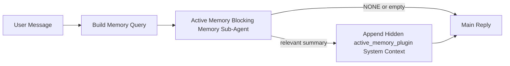

---
read_when:
    - Active Memory의 용도를 이해하고자 합니다
    - 대화형 에이전트에 대해 Active Memory를 켜고 싶습니다
    - Active Memory를 모든 곳에서 활성화하지 않고 그 동작을 조정하고 싶습니다
summary: 대화형 채팅 세션에 관련 메모리를 주입하는 Plugin 소유의 차단형 메모리 하위 에이전트
title: Active Memory
x-i18n:
    generated_at: "2026-04-12T23:28:00Z"
    model: gpt-5.4
    provider: openai
    source_hash: 11665dbc888b6d4dc667a47624cc1f2e4cc71e1d58e1f7d9b5fe4057ec4da108
    source_path: concepts/active-memory.md
    workflow: 15
---

# Active Memory

Active Memory는 적격한 대화 세션에서 기본 응답 전에 실행되는 선택적 Plugin 소유의 차단형 메모리 하위 에이전트입니다.

이 기능이 존재하는 이유는 대부분의 메모리 시스템이 유능하지만 반응형이기 때문입니다. 이런 시스템은 주 에이전트가 언제 메모리를 검색할지 결정하거나, 사용자가 "이거 기억해" 또는 "메모리 검색해" 같은 말을 하기를 기다립니다. 그 시점이 되면, 메모리가 응답을 자연스럽게 느끼게 만들 수 있었던 순간은 이미 지나간 뒤입니다.

Active Memory는 기본 응답이 생성되기 전에 시스템이 관련 메모리를 떠올릴 수 있는 제한된 한 번의 기회를 제공합니다.

## 에이전트에 이것을 붙여넣기

자급식의 안전한 기본 설정으로 Active Memory를 활성화하려면, 아래 내용을 에이전트에 붙여넣으세요.

```json5
{
  plugins: {
    entries: {
      "active-memory": {
        enabled: true,
        config: {
          enabled: true,
          agents: ["main"],
          allowedChatTypes: ["direct"],
          modelFallback: "google/gemini-3-flash",
          queryMode: "recent",
          promptStyle: "balanced",
          timeoutMs: 15000,
          maxSummaryChars: 220,
          persistTranscripts: false,
          logging: true,
        },
      },
    },
  },
}
```

이 설정은 `main` 에이전트에 대해 Plugin을 켜고, 기본적으로 직접 메시지 스타일 세션으로만 제한하며, 먼저 현재 세션 모델을 상속하도록 하고, 명시적 모델이나 상속된 모델이 없을 때만 구성된 대체 모델을 사용합니다.

그다음 Gateway를 다시 시작하세요.

```bash
openclaw gateway
```

대화에서 실시간으로 확인하려면:

```text
/verbose on
/trace on
```

## Active Memory 켜기

가장 안전한 설정은 다음과 같습니다.

1. Plugin 활성화
2. 하나의 대화형 에이전트 지정
3. 동작을 조정하는 동안에만 logging 유지

`openclaw.json`에 다음 설정으로 시작하세요.

```json5
{
  plugins: {
    entries: {
      "active-memory": {
        enabled: true,
        config: {
          agents: ["main"],
          allowedChatTypes: ["direct"],
          modelFallback: "google/gemini-3-flash",
          queryMode: "recent",
          promptStyle: "balanced",
          timeoutMs: 15000,
          maxSummaryChars: 220,
          persistTranscripts: false,
          logging: true,
        },
      },
    },
  },
}
```

그다음 Gateway를 다시 시작하세요.

```bash
openclaw gateway
```

의미는 다음과 같습니다.

- `plugins.entries.active-memory.enabled: true`는 Plugin을 켭니다
- `config.agents: ["main"]`은 `main` 에이전트만 Active Memory에 참여하도록 설정합니다
- `config.allowedChatTypes: ["direct"]`는 기본적으로 직접 메시지 스타일 세션에서만 Active Memory가 실행되도록 유지합니다
- `config.model`이 설정되지 않은 경우, Active Memory는 먼저 현재 세션 모델을 상속합니다
- `config.modelFallback`은 회상을 위한 자체 대체 provider/model을 선택적으로 제공합니다
- `config.promptStyle: "balanced"`는 `recent` 모드에 대해 기본 범용 프롬프트 스타일을 사용합니다
- Active Memory는 여전히 적격한 대화형 지속 채팅 세션에서만 실행됩니다

## 확인 방법

Active Memory는 모델에 숨겨진 시스템 컨텍스트를 주입합니다. 원시 `<active_memory_plugin>...</active_memory_plugin>` 태그를 클라이언트에 노출하지 않습니다.

## 세션 토글

설정을 수정하지 않고 현재 채팅 세션에서 Active Memory를 일시 중지하거나 다시 시작하려면 Plugin 명령을 사용하세요.

```text
/active-memory status
/active-memory off
/active-memory on
```

이 동작은 세션 범위로 적용됩니다.  
`plugins.entries.active-memory.enabled`, 에이전트 대상 지정, 기타 전역 구성은 변경하지 않습니다.

명령이 설정을 기록하고 모든 세션에 대해 Active Memory를 일시 중지하거나 다시 시작하게 하려면, 명시적인 전역 형식을 사용하세요.

```text
/active-memory status --global
/active-memory off --global
/active-memory on --global
```

전역 형식은 `plugins.entries.active-memory.config.enabled`를 기록합니다. 대신 `plugins.entries.active-memory.enabled`는 켜 둔 상태로 유지하므로, 나중에 명령을 사용해 Active Memory를 다시 켤 수 있습니다.

실시간 세션에서 Active Memory가 무엇을 하고 있는지 보고 싶다면, 원하는 출력에 맞는 세션 토글을 켜세요.

```text
/verbose on
/trace on
```

이를 활성화하면 OpenClaw는 다음을 표시할 수 있습니다.

- `/verbose on`일 때 `Active Memory: ok 842ms recent 34 chars`와 같은 Active Memory 상태 줄
- `/trace on`일 때 `Active Memory Debug: Lemon pepper wings with blue cheese.`와 같은 읽기 쉬운 디버그 요약

이 줄들은 숨겨진 시스템 컨텍스트에 공급되는 것과 동일한 Active Memory 패스에서 파생되지만, 원시 프롬프트 마크업을 노출하는 대신 사람이 읽기 좋게 형식화됩니다. 일반 어시스턴트 응답 뒤에 후속 진단 메시지로 전송되므로, Telegram 같은 채널 클라이언트에서 응답 전 별도의 진단 말풍선이 깜박이지 않습니다.

기본적으로 차단형 메모리 하위 에이전트 transcript는 임시이며 실행이 완료되면 삭제됩니다.

예시 흐름:

```text
/verbose on
/trace on
what wings should i order?
```

예상되는 표시 응답 형태:

```text
...normal assistant reply...

🧩 Active Memory: ok 842ms recent 34 chars
🔎 Active Memory Debug: Lemon pepper wings with blue cheese.
```

## 실행 시점

Active Memory는 두 가지 게이트를 사용합니다.

1. **구성 opt-in**  
   Plugin이 활성화되어 있어야 하며, 현재 에이전트 id가 `plugins.entries.active-memory.config.agents`에 포함되어 있어야 합니다.
2. **엄격한 런타임 적격성**  
   활성화되어 있고 대상이 지정되어 있더라도, Active Memory는 적격한 대화형 지속 채팅 세션에서만 실행됩니다.

실제 규칙은 다음과 같습니다.

```text
plugin enabled
+
agent id targeted
+
allowed chat type
+
eligible interactive persistent chat session
=
active memory runs
```

이 중 하나라도 실패하면 Active Memory는 실행되지 않습니다.

## 세션 유형

`config.allowedChatTypes`는 어떤 종류의 대화에서 Active Memory를 아예 실행할 수 있는지를 제어합니다.

기본값은 다음과 같습니다.

```json5
allowedChatTypes: ["direct"]
```

즉, 기본적으로 Active Memory는 직접 메시지 스타일 세션에서 실행되지만, 명시적으로 opt-in하지 않으면 그룹이나 채널 세션에서는 실행되지 않습니다.

예시:

```json5
allowedChatTypes: ["direct"]
```

```json5
allowedChatTypes: ["direct", "group"]
```

```json5
allowedChatTypes: ["direct", "group", "channel"]
```

## 실행 위치

Active Memory는 대화 강화 기능이지, 플랫폼 전반의 추론 기능이 아닙니다.

| 표면 | Active Memory 실행 여부 |
| ------------------------------------------------------------------- | ------------------------------------------------------- |
| Control UI / 웹 채팅 지속 세션 | 예, Plugin이 활성화되어 있고 에이전트가 대상이면 |
| 동일한 지속 채팅 경로의 다른 대화형 채널 세션 | 예, Plugin이 활성화되어 있고 에이전트가 대상이면 |
| Headless 단발 실행 | 아니요 |
| Heartbeat/백그라운드 실행 | 아니요 |
| 일반 내부 `agent-command` 경로 | 아니요 |
| 하위 에이전트/내부 헬퍼 실행 | 아니요 |

## 사용해야 하는 이유

다음과 같은 경우 Active Memory를 사용하세요.

- 세션이 지속적이고 사용자 대상일 때
- 에이전트가 검색할 만한 의미 있는 장기 메모리를 가질 때
- 순수한 프롬프트 결정성보다 연속성과 개인화가 더 중요할 때

특히 다음에 잘 맞습니다.

- 안정적인 선호
- 반복되는 습관
- 자연스럽게 드러나야 하는 장기 사용자 컨텍스트

다음에는 적합하지 않습니다.

- 자동화
- 내부 워커
- 단발성 API 작업
- 숨겨진 개인화가 놀랍게 느껴질 수 있는 곳

## 동작 방식

런타임 형태는 다음과 같습니다.



차단형 메모리 하위 에이전트는 다음만 사용할 수 있습니다.

- `memory_search`
- `memory_get`

연결이 약하면 `NONE`을 반환해야 합니다.

## 쿼리 모드

`config.queryMode`는 차단형 메모리 하위 에이전트가 얼마나 많은 대화를 볼지 제어합니다.

## 프롬프트 스타일

`config.promptStyle`은 차단형 메모리 하위 에이전트가 메모리를 반환할지 결정할 때 얼마나 적극적이거나 엄격할지를 제어합니다.

사용 가능한 스타일:

- `balanced`: `recent` 모드용 범용 기본값
- `strict`: 가장 덜 적극적임; 주변 컨텍스트의 번짐을 매우 적게 원할 때 가장 적합
- `contextual`: 연속성 친화성이 가장 높음; 대화 기록이 더 중요할 때 가장 적합
- `recall-heavy`: 더 약하지만 여전히 그럴듯한 일치에도 메모리를 더 잘 드러냄
- `precision-heavy`: 일치가 명확하지 않으면 적극적으로 `NONE`을 선호
- `preference-only`: 즐겨찾기, 습관, 루틴, 취향, 반복되는 개인 사실에 최적화

`config.promptStyle`이 설정되지 않았을 때의 기본 매핑:

```text
message -> strict
recent -> balanced
full -> contextual
```

`config.promptStyle`을 명시적으로 설정하면 그 재정의가 우선합니다.

예시:

```json5
promptStyle: "preference-only"
```

## 모델 대체 정책

`config.model`이 설정되지 않은 경우, Active Memory는 다음 순서로 모델을 확인하려고 시도합니다.

```text
explicit plugin model
-> current session model
-> agent primary model
-> optional configured fallback model
```

`config.modelFallback`은 구성된 대체 단계에 해당합니다.

선택적 사용자 지정 대체:

```json5
modelFallback: "google/gemini-3-flash"
```

명시적 모델, 상속된 모델, 구성된 대체 모델 중 어느 것도 확인되지 않으면, Active Memory는 해당 턴의 회상을 건너뜁니다.

`config.modelFallbackPolicy`는 이전 구성과의 호환성을 위한 더 이상 사용되지 않는 필드로만 유지됩니다. 더는 런타임 동작을 변경하지 않습니다.

## 고급 탈출구

이 옵션들은 의도적으로 권장 설정에 포함되지 않습니다.

`config.thinking`은 차단형 메모리 하위 에이전트의 thinking 수준을 재정의할 수 있습니다.

```json5
thinking: "medium"
```

기본값:

```json5
thinking: "off"
```

기본적으로 이 옵션을 활성화하지 마세요. Active Memory는 응답 경로에서 실행되므로, 추가 thinking 시간은 사용자에게 보이는 지연 시간을 직접 증가시킵니다.

`config.promptAppend`는 기본 Active Memory 프롬프트 뒤, 그리고 대화 컨텍스트 앞에 추가 운영자 지시를 더합니다.

```json5
promptAppend: "Prefer stable long-term preferences over one-off events."
```

`config.promptOverride`는 기본 Active Memory 프롬프트를 대체합니다. OpenClaw는 그 뒤에 여전히 대화 컨텍스트를 추가합니다.

```json5
promptOverride: "You are a memory search agent. Return NONE or one compact user fact."
```

프롬프트 사용자 지정은 의도적으로 다른 회상 계약을 시험하는 경우가 아니라면 권장되지 않습니다. 기본 프롬프트는 기본 모델에 대해 `NONE` 또는 간결한 사용자 사실 컨텍스트만 반환하도록 조정되어 있습니다.

### `message`

최신 사용자 메시지만 전송됩니다.

```text
Latest user message only
```

다음과 같은 경우에 사용하세요.

- 가장 빠른 동작을 원할 때
- 안정적인 선호 회상에 가장 강한 편향을 원할 때
- 후속 턴에 대화 컨텍스트가 필요하지 않을 때

권장 timeout:

- `3000`~`5000`ms 정도에서 시작

### `recent`

최신 사용자 메시지와 함께 최근의 짧은 대화 꼬리가 전송됩니다.

```text
Recent conversation tail:
user: ...
assistant: ...
user: ...

Latest user message:
...
```

다음과 같은 경우에 사용하세요.

- 속도와 대화 맥락 사이의 더 나은 균형을 원할 때
- 후속 질문이 종종 최근 몇 턴에 의존할 때

권장 timeout:

- `15000`ms 정도에서 시작

### `full`

전체 대화가 차단형 메모리 하위 에이전트로 전송됩니다.

```text
Full conversation context:
user: ...
assistant: ...
user: ...
...
```

다음과 같은 경우에 사용하세요.

- 지연 시간보다 더 강한 회상 품질이 중요할 때
- 대화에 스레드 훨씬 앞부분의 중요한 설정이 포함되어 있을 때

권장 timeout:

- `message`나 `recent`보다 상당히 더 늘리세요
- 스레드 크기에 따라 `15000`ms 이상에서 시작하세요

일반적으로 timeout은 컨텍스트 크기에 따라 증가해야 합니다.

```text
message < recent < full
```

## transcript 지속성

Active Memory 차단형 메모리 하위 에이전트 실행은 호출 중 실제 `session.jsonl` transcript를 생성합니다.

기본적으로 이 transcript는 임시입니다.

- 임시 디렉터리에 기록됩니다
- 차단형 메모리 하위 에이전트 실행에만 사용됩니다
- 실행이 끝나면 즉시 삭제됩니다

디버깅이나 검토를 위해 이러한 차단형 메모리 하위 에이전트 transcript를 디스크에 유지하려면, 지속성을 명시적으로 켜세요.

```json5
{
  plugins: {
    entries: {
      "active-memory": {
        enabled: true,
        config: {
          agents: ["main"],
          persistTranscripts: true,
          transcriptDir: "active-memory",
        },
      },
    },
  },
}
```

활성화되면 Active Memory는 transcript를 기본 사용자 대화 transcript 경로가 아니라, 대상 에이전트의 sessions 폴더 아래 별도 디렉터리에 저장합니다.

기본 레이아웃의 개념은 다음과 같습니다.

```text
agents/<agent>/sessions/active-memory/<blocking-memory-sub-agent-session-id>.jsonl
```

`config.transcriptDir`로 상대 하위 디렉터리를 변경할 수 있습니다.

다음 사항에 주의해서 사용하세요.

- 바쁜 세션에서는 차단형 메모리 하위 에이전트 transcript가 빠르게 누적될 수 있습니다
- `full` 쿼리 모드는 많은 대화 컨텍스트를 중복할 수 있습니다
- 이 transcript에는 숨겨진 프롬프트 컨텍스트와 회상된 메모리가 포함됩니다

## 구성

모든 Active Memory 구성은 다음 아래에 있습니다.

```text
plugins.entries.active-memory
```

가장 중요한 필드는 다음과 같습니다.

| Key                         | Type                                                                                                 | 의미                                                                                                   |
| --------------------------- | ---------------------------------------------------------------------------------------------------- | ------------------------------------------------------------------------------------------------------ |
| `enabled`                   | `boolean`                                                                                            | Plugin 자체를 활성화함                                                                                 |
| `config.agents`             | `string[]`                                                                                           | Active Memory를 사용할 수 있는 에이전트 id                                                             |
| `config.model`              | `string`                                                                                             | 선택적 차단형 메모리 하위 에이전트 모델 ref; 설정되지 않으면 Active Memory는 현재 세션 모델을 사용함 |
| `config.queryMode`          | `"message" \| "recent" \| "full"`                                                                    | 차단형 메모리 하위 에이전트가 얼마나 많은 대화를 보는지 제어함                                         |
| `config.promptStyle`        | `"balanced" \| "strict" \| "contextual" \| "recall-heavy" \| "precision-heavy" \| "preference-only"` | 차단형 메모리 하위 에이전트가 메모리 반환 여부를 결정할 때 얼마나 적극적이거나 엄격한지 제어함        |
| `config.thinking`           | `"off" \| "minimal" \| "low" \| "medium" \| "high" \| "xhigh" \| "adaptive"`                         | 차단형 메모리 하위 에이전트용 고급 thinking 재정의; 속도를 위해 기본값은 `off`                        |
| `config.promptOverride`     | `string`                                                                                             | 고급 전체 프롬프트 대체; 일반적인 사용에는 권장되지 않음                                               |
| `config.promptAppend`       | `string`                                                                                             | 기본 또는 재정의된 프롬프트 뒤에 추가되는 고급 추가 지시                                               |
| `config.timeoutMs`          | `number`                                                                                             | 차단형 메모리 하위 에이전트의 하드 timeout                                                             |
| `config.maxSummaryChars`    | `number`                                                                                             | active-memory summary에 허용되는 총 최대 문자 수                                                       |
| `config.logging`            | `boolean`                                                                                            | 동작을 조정하는 동안 Active Memory 로그를 출력함                                                       |
| `config.persistTranscripts` | `boolean`                                                                                            | 임시 파일을 삭제하는 대신 차단형 메모리 하위 에이전트 transcript를 디스크에 유지함                    |
| `config.transcriptDir`      | `string`                                                                                             | 에이전트 sessions 폴더 아래의 상대 차단형 메모리 하위 에이전트 transcript 디렉터리                    |

유용한 조정 필드:

| Key                           | Type     | 의미                                                          |
| ----------------------------- | -------- | ------------------------------------------------------------- |
| `config.maxSummaryChars`      | `number` | active-memory summary에 허용되는 총 최대 문자 수              |
| `config.recentUserTurns`      | `number` | `queryMode`가 `recent`일 때 포함할 이전 사용자 턴 수          |
| `config.recentAssistantTurns` | `number` | `queryMode`가 `recent`일 때 포함할 이전 assistant 턴 수       |
| `config.recentUserChars`      | `number` | 최근 사용자 턴당 최대 문자 수                                 |
| `config.recentAssistantChars` | `number` | 최근 assistant 턴당 최대 문자 수                              |
| `config.cacheTtlMs`           | `number` | 반복되는 동일 쿼리에 대한 캐시 재사용                         |

## 권장 설정

`recent`로 시작하세요.

```json5
{
  plugins: {
    entries: {
      "active-memory": {
        enabled: true,
        config: {
          agents: ["main"],
          queryMode: "recent",
          promptStyle: "balanced",
          timeoutMs: 15000,
          maxSummaryChars: 220,
          logging: true,
        },
      },
    },
  },
}
```

조정하는 동안 실시간 동작을 확인하고 싶다면, 별도의 active-memory 디버그 명령을 찾는 대신 `/verbose on`으로 일반 상태 줄을 보고 `/trace on`으로 active-memory 디버그 요약을 보세요. 채팅 채널에서는 이러한 진단 줄이 기본 assistant 응답 전에가 아니라 그 후에 전송됩니다.

그다음 필요에 따라 다음으로 이동하세요.

- 더 낮은 지연 시간을 원하면 `message`
- 더 느린 차단형 메모리 하위 에이전트를 감수할 만큼 추가 컨텍스트의 가치가 있다고 판단되면 `full`

## 디버깅

Active Memory가 예상한 위치에서 보이지 않는다면:

1. `plugins.entries.active-memory.enabled` 아래에서 Plugin이 활성화되어 있는지 확인합니다.
2. 현재 에이전트 id가 `config.agents`에 나열되어 있는지 확인합니다.
3. 대화형 지속 채팅 세션을 통해 테스트 중인지 확인합니다.
4. `config.logging: true`를 켜고 Gateway 로그를 확인합니다.
5. `openclaw memory status --deep`로 메모리 검색 자체가 동작하는지 확인합니다.

메모리 적중이 너무 시끄럽다면 다음을 더 엄격하게 조정하세요.

- `maxSummaryChars`

Active Memory가 너무 느리다면:

- `queryMode`를 낮춥니다
- `timeoutMs`를 낮춥니다
- 최근 턴 수를 줄입니다
- 턴당 문자 수 제한을 줄입니다

## 일반적인 문제

### 임베딩 provider가 예기치 않게 변경됨

Active Memory는 `agents.defaults.memorySearch` 아래의 일반 `memory_search` 파이프라인을 사용합니다. 즉, 원하는 동작을 위해 `memorySearch` 설정에 임베딩이 필요한 경우에만 임베딩 provider 설정이 요구됩니다.

실제로는:

- `ollama`처럼 자동 감지되지 않는 provider를 원한다면 명시적 provider 설정이 **필수**입니다
- 환경에서 사용할 수 있는 임베딩 provider를 자동 감지가 확인하지 못한다면 명시적 provider 설정이 **필수**입니다
- "사용 가능한 첫 번째 provider 승리" 대신 결정적인 provider 선택을 원한다면 명시적 provider 설정을 **강력히 권장**합니다
- 자동 감지가 이미 원하는 provider를 확인하고 해당 provider가 배포 환경에서 안정적이라면, 보통 명시적 provider 설정은 **필수는 아닙니다**

`memorySearch.provider`가 설정되지 않으면, OpenClaw는 사용 가능한 첫 번째 임베딩 provider를 자동 감지합니다.

이 점은 실제 배포에서 혼란스러울 수 있습니다.

- 새로 사용 가능해진 API 키로 인해 메모리 검색이 사용하는 provider가 바뀔 수 있습니다
- 어떤 명령이나 진단 표면에서는 선택된 provider가, 실제로 라이브 메모리 동기화나 검색 bootstrap 중에 사용되는 경로와 다르게 보일 수 있습니다
- 호스팅 provider는 할당량 또는 rate-limit 오류로 실패할 수 있으며, 이러한 오류는 Active Memory가 각 응답 전에 회상 검색을 시작한 뒤에야 드러날 수 있습니다

임베딩 provider를 확인할 수 없을 때 `memory_search`가 성능 저하된 lexical-only 모드로 동작할 수 있다면, Active Memory는 임베딩 없이도 여전히 실행될 수 있습니다.

provider가 이미 선택된 뒤에 발생하는 할당량 소진, rate limit, 네트워크/provider 오류, 누락된 로컬/원격 모델과 같은 provider 런타임 실패에서도 동일한 fallback이 적용된다고 가정하지 마세요.

실제로는:

- 임베딩 provider를 확인할 수 없으면 `memory_search`는 lexical-only 검색으로 성능 저하될 수 있습니다
- 임베딩 provider가 확인된 뒤 런타임에 실패하면, OpenClaw는 현재 그 요청에 대해 lexical fallback을 보장하지 않습니다
- 결정적인 provider 선택이 필요하다면 `agents.defaults.memorySearch.provider`를 고정하세요
- 런타임 오류 시 provider failover가 필요하다면 `agents.defaults.memorySearch.fallback`을 명시적으로 구성하세요

임베딩 기반 회상, 멀티모달 인덱싱 또는 특정 로컬/원격 provider에 의존한다면, 자동 감지에 의존하지 말고 provider를 명시적으로 고정하세요.

일반적인 고정 예시:

OpenAI:

```json5
{
  agents: {
    defaults: {
      memorySearch: {
        provider: "openai",
        model: "text-embedding-3-small",
      },
    },
  },
}
```

Gemini:

```json5
{
  agents: {
    defaults: {
      memorySearch: {
        provider: "gemini",
        model: "gemini-embedding-001",
      },
    },
  },
}
```

Ollama:

```json5
{
  agents: {
    defaults: {
      memorySearch: {
        provider: "ollama",
        model: "nomic-embed-text",
      },
    },
  },
}
```

할당량 소진 같은 런타임 오류에서 provider failover를 기대한다면, provider만 고정하는 것으로는 충분하지 않습니다. 명시적 fallback도 함께 구성하세요.

```json5
{
  agents: {
    defaults: {
      memorySearch: {
        provider: "openai",
        fallback: "gemini",
      },
    },
  },
}
```

### provider 문제 디버깅

Active Memory가 느리거나, 비어 있거나, 예기치 않게 provider를 전환하는 것처럼 보인다면:

- 문제를 재현하는 동안 Gateway 로그를 확인하세요. `active-memory: ... start|done`, `memory sync failed (search-bootstrap)`, 또는 provider별 임베딩 오류 같은 줄을 찾으세요
- `/trace on`을 켜서 세션에 Plugin 소유의 Active Memory 디버그 요약이 표시되게 하세요
- 각 응답 뒤에 일반 `🧩 Active Memory: ...` 상태 줄도 원한다면 `/verbose on`도 켜세요
- `openclaw memory status --deep`를 실행해 현재 메모리 검색 백엔드와 인덱스 상태를 점검하세요
- `agents.defaults.memorySearch.provider`와 관련 인증/구성을 확인해, 기대하는 provider가 실제로 런타임에서 확인 가능한 provider인지 확인하세요
- `ollama`를 사용한다면 구성된 임베딩 모델이 설치되어 있는지 확인하세요. 예: `ollama list`

예시 디버깅 루프:

```text
1. Gateway를 시작하고 그 로그를 확인합니다
2. 채팅 세션에서 /trace on을 실행합니다
3. Active Memory를 트리거해야 하는 메시지 하나를 보냅니다
4. 채팅에 보이는 디버그 줄과 Gateway 로그 줄을 비교합니다
5. provider 선택이 모호하면 agents.defaults.memorySearch.provider를 명시적으로 고정합니다
```

예시:

```json5
{
  agents: {
    defaults: {
      memorySearch: {
        provider: "ollama",
        model: "nomic-embed-text",
      },
    },
  },
}
```

또는 Gemini 임베딩을 원한다면:

```json5
{
  agents: {
    defaults: {
      memorySearch: {
        provider: "gemini",
      },
    },
  },
}
```

provider를 변경한 후 Gateway를 다시 시작하고 `/trace on`으로 새 테스트를 실행하면 Active Memory 디버그 줄에 새 임베딩 경로가 반영됩니다.

## 관련 페이지

- [메모리 검색](/ko/concepts/memory-search)
- [메모리 구성 참조](/ko/reference/memory-config)
- [Plugin SDK 설정](/ko/plugins/sdk-setup)
