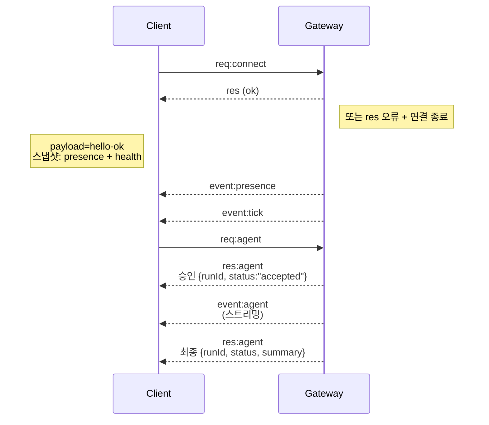

---
read_when:
    - Gateway 프로토콜, 클라이언트 또는 전송 계층 작업하기
summary: WebSocket Gateway 아키텍처, 구성 요소 및 클라이언트 흐름
title: Gateway 아키텍처
x-i18n:
    generated_at: "2026-07-12T00:40:11Z"
    model: gpt-5.6
    postprocess_version: locale-links-v1
    provider: openai
    source_hash: f8054bd87f738b957c24f8d6965d55365de2293d44902530a9ba778afa597cc7
    source_path: concepts/architecture.md
    workflow: 16
---

## 개요

- 하나의 장기 실행 **Gateway**가 모든 메시징 표면(Baileys를 통한 WhatsApp, grammY를 통한 Telegram, Slack, Discord, Signal, iMessage, WebChat)을 관리합니다.
- 제어 영역 클라이언트(macOS 앱, CLI, 웹 UI, 자동화)는 구성된 바인드 호스트(기본값 `127.0.0.1:18789`)에서 **WebSocket**을 통해 Gateway에 연결합니다.
- **Node**(macOS/iOS/Android/헤드리스)도 **WebSocket**을 통해 연결하지만, 명시적인 기능/명령과 함께 `role: node`를 선언합니다.
- 호스트당 하나의 Gateway만 실행되며, WhatsApp 세션을 여는 유일한 위치입니다.
- **캔버스 호스트**는 Gateway HTTP 서버에서 다음 경로로 제공됩니다.
  - `/__openclaw__/canvas/`(에이전트가 편집할 수 있는 HTML/CSS/JS)
  - `/__openclaw__/a2ui/`(A2UI 호스트)

  Gateway와 같은 포트(기본값 `18789`)를 사용합니다.

## 구성 요소 및 흐름

### Gateway(데몬)

- 제공자 연결을 유지합니다.
- 형식이 지정된 WS API(요청, 응답, 서버 푸시 이벤트)를 노출합니다.
- 수신 프레임을 JSON Schema에 따라 검증합니다.
- `agent`, `chat`, `presence`, `health`, `heartbeat`, `cron` 등의 이벤트를 발생시킵니다.

### 클라이언트(mac 앱 / CLI / 웹 관리자)

- 클라이언트당 하나의 WS 연결을 사용합니다.
- 요청(`health`, `status`, `send`, `agent`, `system-presence`)을 전송합니다.
- 이벤트(`tick`, `agent`, `presence`, `shutdown`)를 구독합니다.

### Node(macOS / iOS / Android / 헤드리스)

- `role: node`로 **동일한 WS 서버**에 연결합니다.
- `connect`에서 기기 ID를 제공합니다. 페어링은 **기기 기반**(역할 `node`)이며 승인은 기기 페어링 저장소에서 관리됩니다.
- `canvas.*`, `camera.*`, `screen.record`, `location.get` 등의 명령을 노출합니다.

프로토콜 세부 정보: [Gateway 프로토콜](/ko/gateway/protocol)

### WebChat

- 채팅 기록과 메시지 전송에 Gateway WS API를 사용하는 정적 UI입니다.
- 원격 구성에서는 다른 클라이언트와 동일한 SSH/Tailscale 터널을 통해 연결합니다.

## 연결 수명 주기(단일 클라이언트)



## 와이어 프로토콜(요약)

- 전송 방식: WebSocket, JSON 페이로드가 포함된 텍스트 프레임.
- 첫 번째 프레임은 **반드시** `connect`여야 합니다.
- 핸드셰이크 후:
  - 요청: `{type:"req", id, method, params}` → `{type:"res", id, ok, payload|error}`
  - 이벤트: `{type:"event", event, payload, seq?, stateVersion?}`
- `hello-ok.features.methods` / `events`는 검색용 메타데이터이며, 호출 가능한 모든 도우미 경로를 생성하여 나열한 덤프가 아닙니다.
- 공유 비밀 인증은 구성된 Gateway 인증 모드에 따라 `connect.params.auth.token` 또는 `connect.params.auth.password`를 사용합니다.
- Tailscale Serve(`gateway.auth.allowTailscale: true`) 또는 local loopback이 아닌 `gateway.auth.mode: "trusted-proxy"`처럼 ID를 포함하는 모드는 `connect.params.auth.*` 대신 요청 헤더를 통해 인증 요건을 충족합니다.
- 비공개 인그레스의 `gateway.auth.mode: "none"`은 공유 비밀 인증을 완전히 비활성화합니다. 공개/신뢰할 수 없는 인그레스에서는 이 모드를 사용하지 마세요.
- 안전하게 재시도할 수 있도록 부수 효과가 있는 메서드(`send`, `agent`)에는 멱등성 키가 필요하며, 서버는 수명이 짧은 중복 제거 캐시를 유지합니다.
- Node는 `connect`에 `role: "node"`와 기능/명령/권한을 포함해야 합니다.

## 페어링 및 로컬 신뢰

- 모든 WS 클라이언트(운영자 + Node)는 `connect`에 **기기 ID**를 포함합니다.
- 새로운 기기 ID에는 페어링 승인이 필요하며, Gateway는 이후 연결에 사용할 **기기 토큰**을 발급합니다.
- 동일 호스트의 사용자 경험을 원활하게 유지하기 위해 직접 local loopback 연결은 자동 승인될 수 있습니다.
- OpenClaw에는 신뢰할 수 있는 공유 비밀 도우미 흐름을 위한 제한적인 백엔드/컨테이너 로컬 자체 연결 경로도 있습니다.
- 동일 호스트의 tailnet 바인드를 포함한 Tailnet 및 LAN 연결에는 여전히 명시적인 페어링 승인이 필요합니다.
- 모든 연결은 `connect.challenge` 논스에 서명해야 합니다. 서명 페이로드 `v3`는 `platform` 및 `deviceFamily`에도 바인딩됩니다. Gateway는 재연결 시 페어링된 메타데이터를 고정하며, 메타데이터가 변경되면 복구 페어링을 요구합니다.
- **로컬이 아닌** 연결에는 여전히 명시적인 승인이 필요합니다.
- Gateway 인증(`gateway.auth.*`)은 로컬 또는 원격 여부와 관계없이 **모든** 연결에 계속 적용됩니다.

세부 정보: [Gateway 프로토콜](/ko/gateway/protocol), [페어링](/ko/channels/pairing),
[보안](/ko/gateway/security).

## 프로토콜 형식 지정 및 코드 생성

- TypeBox 스키마가 프로토콜을 정의합니다.
- 해당 스키마에서 JSON Schema가 생성됩니다.
- JSON Schema에서 Swift 모델이 생성됩니다.

## 원격 액세스

- 권장: Tailscale 또는 VPN.
- 대안: SSH 터널

  ```bash
  ssh -N -L 18789:127.0.0.1:18789 user@gateway-host
  ```

- 터널에서도 동일한 핸드셰이크와 인증 토큰이 적용됩니다.
- 원격 구성에서는 WS에 TLS와 선택적 고정 기능을 활성화할 수 있습니다.

## 운영 현황

- 시작: `openclaw gateway`(포그라운드에서 실행, stdout에 로그 기록).
- 상태 확인: WS를 통한 `health`(`hello-ok`에도 포함됨).
- 감독: 자동 재시작에는 launchd/systemd를 사용합니다.

## 불변 조건

- 호스트마다 정확히 하나의 Gateway가 단일 Baileys 세션을 제어합니다.
- 핸드셰이크는 필수입니다. JSON이 아니거나 첫 프레임이 `connect`가 아니면 연결을 즉시 종료합니다.
- 이벤트는 재생되지 않습니다. 클라이언트는 누락이 발생하면 새로 고쳐야 합니다.

## 관련 문서

- [에이전트 루프](/ko/concepts/agent-loop) — 자세한 에이전트 실행 주기
- [Gateway 프로토콜](/ko/gateway/protocol) — WebSocket 프로토콜 계약
- [대기열](/ko/concepts/queue) — 명령 대기열 및 동시성
- [보안](/ko/gateway/security) — 신뢰 모델 및 보안 강화
