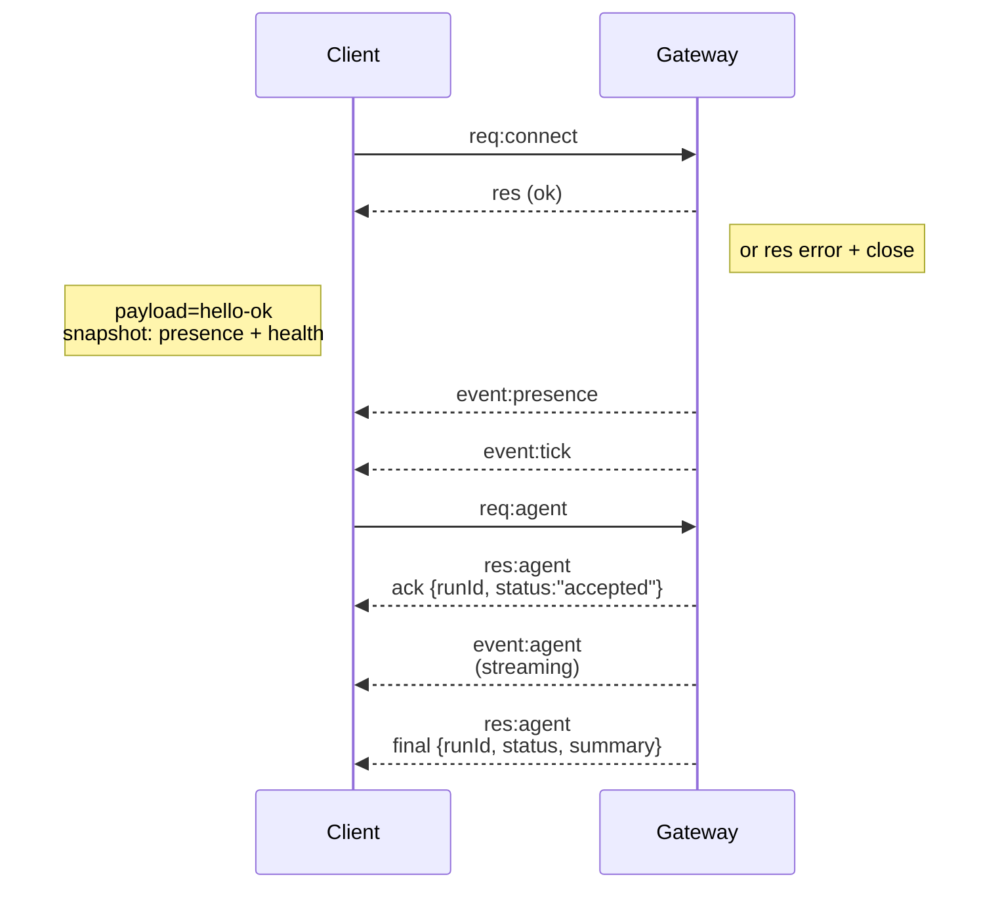

---
read_when:
    - Gateway 프로토콜, 클라이언트 또는 전송 작업
summary: WebSocket Gateway 아키텍처, 구성 요소 및 클라이언트 흐름
title: Gateway 아키텍처
x-i18n:
    generated_at: "2026-05-06T06:20:26Z"
    model: gpt-5.5
    provider: openai
    source_hash: 433489081bfe07691b211f5076ec45ce0ed3fd043eb86128f73121f2cab71cd3
    source_path: concepts/architecture.md
    workflow: 16
    postprocess_version: locale-links-v1
---

## 개요

- 단일 장기 실행 **Gateway**가 모든 메시징 표면(WhatsApp via
  Baileys, Telegram via grammY, Slack, Discord, Signal, iMessage, WebChat)을 소유합니다.
- 제어 평면 클라이언트(macOS 앱, CLI, 웹 UI, 자동화)는 구성된 바인드 호스트(기본값
  `127.0.0.1:18789`)의 **WebSocket**을 통해 Gateway에 연결합니다.
- **Node**(macOS/iOS/Android/headless)도 **WebSocket**을 통해 연결하지만,
  명시적 caps/commands와 함께 `role: node`를 선언합니다.
- 호스트당 하나의 Gateway가 있으며, WhatsApp 세션을 여는 유일한 위치입니다.
- **캔버스 호스트**는 Gateway HTTP 서버에서 다음 경로로 제공됩니다.
  - `/__openclaw__/canvas/`(에이전트가 편집 가능한 HTML/CSS/JS)
  - `/__openclaw__/a2ui/`(A2UI 호스트)
    Gateway와 동일한 포트(기본값 `18789`)를 사용합니다.

## 구성 요소와 흐름

### Gateway(데몬)

- provider 연결을 유지합니다.
- 타입이 지정된 WS API(요청, 응답, 서버 푸시 이벤트)를 노출합니다.
- 인바운드 프레임을 JSON Schema에 맞춰 검증합니다.
- `agent`, `chat`, `presence`, `health`, `heartbeat`, `cron` 같은 이벤트를 내보냅니다.

### 클라이언트(mac 앱 / CLI / 웹 관리자)

- 클라이언트당 하나의 WS 연결을 사용합니다.
- 요청(`health`, `status`, `send`, `agent`, `system-presence`)을 보냅니다.
- 이벤트(`tick`, `agent`, `presence`, `shutdown`)를 구독합니다.

### Node(macOS / iOS / Android / headless)

- `role: node`로 **동일한 WS 서버**에 연결합니다.
- `connect`에서 디바이스 ID를 제공합니다. 페어링은 **디바이스 기반**(역할 `node`)이며
  승인은 디바이스 페어링 저장소에 있습니다.
- `canvas.*`, `camera.*`, `screen.record`, `location.get` 같은 명령을 노출합니다.

프로토콜 세부 정보:

- [Gateway 프로토콜](/ko/gateway/protocol)

### WebChat

- 채팅 기록과 전송에 Gateway WS API를 사용하는 정적 UI입니다.
- 원격 설정에서는 다른 클라이언트와 동일한 SSH/Tailscale 터널을 통해
  연결합니다.

## 연결 수명 주기(단일 클라이언트)



## 와이어 프로토콜(요약)

- 전송: WebSocket, JSON 페이로드가 포함된 텍스트 프레임.
- 첫 번째 프레임은 **반드시** `connect`여야 합니다.
- 핸드셰이크 이후:
  - 요청: `{type:"req", id, method, params}` → `{type:"res", id, ok, payload|error}`
  - 이벤트: `{type:"event", event, payload, seq?, stateVersion?}`
- `hello-ok.features.methods` / `events`는 탐색 메타데이터이며,
  호출 가능한 모든 헬퍼 라우트를 생성해 덤프한 것이 아닙니다.
- 공유 비밀 인증은 구성된 Gateway 인증 모드에 따라
  `connect.params.auth.token` 또는 `connect.params.auth.password`를 사용합니다.
- Tailscale Serve(`gateway.auth.allowTailscale: true`) 또는 non-loopback
  `gateway.auth.mode: "trusted-proxy"` 같은 ID 포함 모드는
  `connect.params.auth.*` 대신 요청 헤더에서 인증을 충족합니다.
- private-ingress `gateway.auth.mode: "none"`은 공유 비밀 인증을
  완전히 비활성화합니다. 공개/신뢰할 수 없는 ingress에서는 이 모드를 끄세요.
- 부작용이 있는 메서드(`send`, `agent`)는 안전하게 재시도할 수 있도록 idempotency key가
  필요합니다. 서버는 수명이 짧은 중복 제거 캐시를 유지합니다.
- Node는 `connect`에 `role: "node"`와 caps/commands/permissions를 포함해야 합니다.

## 페어링 + 로컬 신뢰

- 모든 WS 클라이언트(운영자 + Node)는 `connect`에 **디바이스 ID**를 포함합니다.
- 새 디바이스 ID에는 페어링 승인이 필요합니다. Gateway는 이후 연결을 위한 **디바이스 토큰**을 발급합니다.
- 직접 local loopback 연결은 동일 호스트 UX를 매끄럽게 유지하기 위해 자동 승인될 수 있습니다.
- OpenClaw에는 신뢰된 공유 비밀 헬퍼 흐름을 위한 제한적인 backend/container-local 자체 연결 경로도 있습니다.
- 동일 호스트 tailnet 바인드를 포함한 tailnet 및 LAN 연결은 여전히
  명시적 페어링 승인이 필요합니다.
- 모든 연결은 `connect.challenge` nonce에 서명해야 합니다.
- 서명 페이로드 `v3`는 `platform` + `deviceFamily`도 바인딩합니다. Gateway는 재연결 시 페어링된 메타데이터를 고정하고 메타데이터 변경에는 복구 페어링을 요구합니다.
- **비로컬** 연결에는 여전히 명시적 승인이 필요합니다.
- Gateway 인증(`gateway.auth.*`)은 로컬이든 원격이든 **모든** 연결에 계속 적용됩니다.

세부 정보: [Gateway 프로토콜](/ko/gateway/protocol), [페어링](/ko/channels/pairing),
[보안](/ko/gateway/security).

## 프로토콜 타입 지정과 codegen

- TypeBox 스키마가 프로토콜을 정의합니다.
- JSON Schema는 해당 스키마에서 생성됩니다.
- Swift 모델은 JSON Schema에서 생성됩니다.

## 원격 액세스

- 권장: Tailscale 또는 VPN.
- 대안: SSH 터널

  ```bash
  ssh -N -L 18789:127.0.0.1:18789 user@host
  ```

- 동일한 핸드셰이크 + 인증 토큰이 터널을 통해 적용됩니다.
- 원격 설정에서 WS에 TLS + 선택적 pinning을 활성화할 수 있습니다.

## 운영 스냅샷

- 시작: `openclaw gateway`(포그라운드, stdout에 로그 출력).
- 상태: WS를 통한 `health`(`hello-ok`에도 포함됨).
- 감독: 자동 재시작을 위한 launchd/systemd.

## 불변 조건

- 정확히 하나의 Gateway가 호스트당 단일 Baileys 세션을 제어합니다.
- 핸드셰이크는 필수입니다. 첫 번째 프레임이 non-JSON이거나 non-connect이면 즉시 연결을 종료합니다.
- 이벤트는 재생되지 않습니다. 클라이언트는 gap이 있으면 새로고침해야 합니다.

## 관련 항목

- [에이전트 루프](/ko/concepts/agent-loop) — 자세한 에이전트 실행 주기
- [Gateway 프로토콜](/ko/gateway/protocol) — WebSocket 프로토콜 계약
- [큐](/ko/concepts/queue) — 명령 큐와 동시성
- [보안](/ko/gateway/security) — 신뢰 모델과 강화
