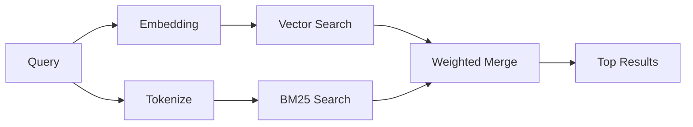

---
read_when:
    - memory_search가 어떻게 작동하는지 이해하려고 합니다
    - 임베딩 제공자를 선택하려는 경우
    - 검색 품질을 조정하려는 경우
summary: 메모리 검색이 임베딩과 하이브리드 검색을 사용하여 관련 노트를 찾는 방법
title: 메모리 검색
x-i18n:
    generated_at: "2026-04-30T16:27:53Z"
    model: gpt-5.5
    provider: openai
    source_hash: 7f40bbe32453a28070ffc67f19a4c06e2fe59a24237a2aef353f4b9b8260bcf2
    source_path: concepts/memory-search.md
    workflow: 16
---

`memory_search`는 원문과 표현이 다르더라도 메모리 파일에서 관련 노트를 찾습니다. 메모리를 작은 청크로 인덱싱하고 임베딩, 키워드 또는 둘 다를 사용해 검색하는 방식으로 작동합니다.

## 빠른 시작

GitHub Copilot 구독, OpenAI, Gemini, Voyage 또는 Mistral API 키가 구성되어 있으면 메모리 검색이 자동으로 작동합니다. provider를 명시적으로 설정하려면:

```json5
{
  agents: {
    defaults: {
      memorySearch: {
        provider: "openai", // 또는 "gemini", "local", "ollama" 등
      },
    },
  },
}
```

다중 엔드포인트 설정의 경우, `provider`는 해당 provider가 `api: "ollama"` 또는 다른 임베딩 어댑터 소유자를 설정할 때 `ollama-5080` 같은 사용자 지정 `models.providers.<id>` 항목일 수도 있습니다.

API 키 없이 로컬 임베딩을 사용하려면 `provider: "local"`을 설정합니다. 패키지 설치는 OpenClaw의 관리형 Plugin runtime-deps 트리에 네이티브 `node-llama-cpp` 런타임을 유지합니다. 해당 트리에 복구가 필요하면 `openclaw doctor --fix`를 실행하세요.

일부 OpenAI 호환 임베딩 엔드포인트는 검색에는 `input_type: "query"`, 인덱싱된 청크에는 `input_type: "document"` 또는 `"passage"` 같은 비대칭 레이블이 필요합니다. 이러한 값은 `memorySearch.queryInputType` 및 `memorySearch.documentInputType`으로 구성하세요. [메모리 구성 참조](/ko/reference/memory-config#provider-specific-config)를 참조하세요.

## 지원되는 provider

| Provider       | ID               | API 키 필요 | 참고 사항                                                |
| -------------- | ---------------- | ----------- | -------------------------------------------------------- |
| Bedrock        | `bedrock`        | 아니요      | AWS 자격 증명 체인이 확인되면 자동 감지됨                |
| Gemini         | `gemini`         | 예          | 이미지/오디오 인덱싱 지원                               |
| GitHub Copilot | `github-copilot` | 아니요      | 자동 감지되며 Copilot 구독 사용                         |
| Local          | `local`          | 아니요      | GGUF 모델, 약 0.6GB 다운로드                            |
| Mistral        | `mistral`        | 예          | 자동 감지됨                                             |
| Ollama         | `ollama`         | 아니요      | 로컬, 명시적으로 설정해야 함                            |
| OpenAI         | `openai`         | 예          | 자동 감지됨, 빠름                                       |
| Voyage         | `voyage`         | 예          | 자동 감지됨                                             |

## 검색 작동 방식

OpenClaw는 두 검색 경로를 병렬로 실행하고 결과를 병합합니다.



- **벡터 검색**은 의미가 비슷한 노트를 찾습니다("gateway host"는 "OpenClaw를 실행하는 머신"과 일치).
- **BM25 키워드 검색**은 정확히 일치하는 항목(ID, 오류 문자열, 구성 키)을 찾습니다.

하나의 경로만 사용할 수 있는 경우(임베딩 없음 또는 FTS 없음), 다른 경로 없이 해당 경로만 실행됩니다.

임베딩을 사용할 수 없을 때도 OpenClaw는 원시 정확 일치 순서만으로 대체하지 않고 FTS 결과에 대해 어휘 기반 랭킹을 사용합니다. 이 성능 저하 모드는 더 강한 쿼리 용어 포함 범위와 관련 파일 경로를 가진 청크의 순위를 높여 `sqlite-vec` 또는 임베딩 provider 없이도 유용한 재현율을 유지합니다.

## 검색 품질 개선

대규모 노트 기록이 있을 때 도움이 되는 두 가지 선택적 기능이 있습니다.

### 시간 감쇠

오래된 노트는 점차 랭킹 가중치를 잃어 최신 정보가 먼저 표시됩니다. 기본 반감기 30일을 사용하면 지난달의 노트는 원래 가중치의 50% 점수를 받습니다. `MEMORY.md` 같은 에버그린 파일은 감쇠되지 않습니다.

<Tip>
에이전트에 수개월치 일일 노트가 있고 오래된 정보가 최신 컨텍스트보다 계속 높은 순위를 차지한다면 시간 감쇠를 활성화하세요.
</Tip>

### MMR(다양성)

중복 결과를 줄입니다. 다섯 개의 노트가 모두 같은 라우터 구성을 언급하는 경우, MMR은 최상위 결과가 반복되지 않고 서로 다른 주제를 다루도록 보장합니다.

<Tip>
`memory_search`가 서로 다른 일일 노트에서 거의 중복되는 스니펫을 계속 반환한다면 MMR을 활성화하세요.
</Tip>

### 둘 다 활성화

```json5
{
  agents: {
    defaults: {
      memorySearch: {
        query: {
          hybrid: {
            mmr: { enabled: true },
            temporalDecay: { enabled: true },
          },
        },
      },
    },
  },
}
```

## 멀티모달 메모리

Gemini Embedding 2를 사용하면 Markdown과 함께 이미지 및 오디오 파일을 인덱싱할 수 있습니다. 검색 쿼리는 텍스트로 유지되지만 시각 및 오디오 콘텐츠와 매칭됩니다. 설정은 [메모리 구성 참조](/ko/reference/memory-config)를 참조하세요.

## 세션 메모리 검색

선택적으로 세션 대화 기록을 인덱싱하여 `memory_search`가 이전 대화를 기억하게 할 수 있습니다. 이는 `memorySearch.experimental.sessionMemory`를 통해 옵트인합니다. 자세한 내용은 [구성 참조](/ko/reference/memory-config)를 참조하세요.

## 문제 해결

**결과가 없나요?** 인덱스를 확인하려면 `openclaw memory status`를 실행하세요. 비어 있으면 `openclaw memory index --force`를 실행하세요.

**키워드 일치만 나오나요?** 임베딩 provider가 구성되지 않았을 수 있습니다. `openclaw memory status --deep`을 확인하세요.

**로컬 임베딩이 시간 초과되나요?** `ollama`, `lmstudio`, `local`은 기본적으로 더 긴 인라인 배치 시간 제한을 사용합니다. 호스트가 단순히 느린 경우 `agents.defaults.memorySearch.sync.embeddingBatchTimeoutSeconds`를 설정하고 `openclaw memory index --force`를 다시 실행하세요.

**CJK 텍스트를 찾을 수 없나요?** `openclaw memory index --force`로 FTS 인덱스를 다시 빌드하세요.

## 추가 자료

- [Active Memory](/ko/concepts/active-memory) -- 대화형 채팅 세션을 위한 하위 에이전트 메모리
- [메모리](/ko/concepts/memory) -- 파일 레이아웃, 백엔드, 도구
- [메모리 구성 참조](/ko/reference/memory-config) -- 모든 구성 옵션

## 관련

- [메모리 개요](/ko/concepts/memory)
- [Active Memory](/ko/concepts/active-memory)
- [내장 메모리 엔진](/ko/concepts/memory-builtin)
