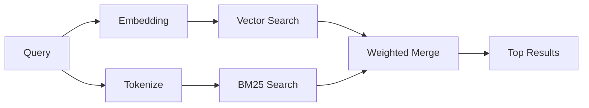

---
read_when:
    - '`memory_search`가 어떻게 작동하는지 이해하려는 경우'
    - 임베딩 provider를 선택하려는 경우
    - 검색 품질을 조정하려는 경우
summary: 메모리 검색이 임베딩과 하이브리드 검색을 사용해 관련 노트를 찾는 방식
title: 메모리 검색
x-i18n:
    generated_at: "2026-04-26T11:27:07Z"
    model: gpt-5.4
    provider: openai
    source_hash: 95d86fb3efe79aae92f5e3590f1c15fb0d8f3bb3301f8fe9a41f891e290d7a14
    source_path: concepts/memory-search.md
    workflow: 15
---

`memory_search`는 원래 텍스트와 표현이 달라도 메모리 파일에서 관련 노트를 찾습니다. 이를 위해 메모리를 작은 청크로 인덱싱하고, 임베딩, 키워드 또는 둘 다를 사용해 검색합니다.

## 빠른 시작

GitHub Copilot 구독이나 OpenAI, Gemini, Voyage, Mistral API 키가 구성되어 있으면 메모리 검색은 자동으로 동작합니다. provider를 명시적으로 설정하려면 다음과 같이 하세요.

```json5
{
  agents: {
    defaults: {
      memorySearch: {
        provider: "openai", // or "gemini", "local", "ollama", etc.
      },
    },
  },
}
```

API 키 없이 로컬 임베딩을 사용하려면 OpenClaw 옆에 선택적 `node-llama-cpp` 런타임 패키지를 설치하고 `provider: "local"`을 사용하세요.

## 지원되는 provider

| Provider       | ID               | API 키 필요 | 참고 |
| -------------- | ---------------- | ------------- | ---------------------------------------------------- |
| Bedrock        | `bedrock`        | 아니요            | AWS 자격 증명 체인이 확인되면 자동 감지됨 |
| Gemini         | `gemini`         | 예           | 이미지/오디오 인덱싱 지원 |
| GitHub Copilot | `github-copilot` | 아니요            | 자동 감지되며 Copilot 구독 사용 |
| Local          | `local`          | 아니요            | GGUF 모델, 약 0.6 GB 다운로드 |
| Mistral        | `mistral`        | 예           | 자동 감지됨 |
| Ollama         | `ollama`         | 아니요            | 로컬, 명시적으로 설정해야 함 |
| OpenAI         | `openai`         | 예           | 자동 감지됨, 빠름 |
| Voyage         | `voyage`         | 예           | 자동 감지됨 |

## 검색 작동 방식

OpenClaw는 두 개의 검색 경로를 병렬로 실행하고 결과를 병합합니다.



- **벡터 검색**은 의미가 비슷한 노트를 찾습니다("gateway host"는
  "OpenClaw를 실행하는 머신"과 일치).
- **BM25 키워드 검색**은 정확히 일치하는 항목을 찾습니다(ID, 오류 문자열, config
  키).

한 경로만 사용 가능한 경우(임베딩 없음 또는 FTS 없음), 다른 경로만 단독으로 실행됩니다.

임베딩을 사용할 수 없더라도 OpenClaw는 단순한 원시 정확 일치 정렬로만 되돌아가지 않고 FTS 결과에 대해 어휘 기반 랭킹을 계속 사용합니다. 이 성능 저하 모드는 더 강한 쿼리 용어 커버리지와 관련 파일 경로를 가진 청크를 부스트하므로, `sqlite-vec` 또는 임베딩 provider가 없어도 재현율을 유용하게 유지합니다.

## 검색 품질 향상

노트 기록이 많은 경우 도움이 되는 두 가지 선택적 기능이 있습니다.

### 시간 감쇠

오래된 노트는 랭킹 가중치를 점차 잃기 때문에 최근 정보가 먼저 나타납니다.
기본 반감기 30일에서는 지난달의 노트 점수가 원래 가중치의 50%가 됩니다.
`MEMORY.md` 같은 evergreen 파일은 절대 감쇠되지 않습니다.

<Tip>
에이전트에 수개월치 일일 노트가 있고 오래된 정보가 최신 컨텍스트보다 계속 더 높게 랭크된다면 시간 감쇠를 활성화하세요.
</Tip>

### MMR (다양성)

중복 결과를 줄입니다. 다섯 개의 노트가 모두 같은 라우터 config를 언급하더라도, MMR은
상위 결과가 반복되지 않고 서로 다른 주제를 다루도록 보장합니다.

<Tip>
`memory_search`가 서로 다른 일일 노트에서 거의 중복된 스니펫을 계속 반환한다면 MMR을 활성화하세요.
</Tip>

### 둘 다 활성화

```json5
{
  agents: {
    defaults: {
      memorySearch: {
        query: {
          hybrid: {
            mmr: { enabled: true },
            temporalDecay: { enabled: true },
          },
        },
      },
    },
  },
}
```

## 멀티모달 메모리

Gemini Embedding 2를 사용하면 Markdown과 함께 이미지 및 오디오 파일도 인덱싱할 수 있습니다. 검색 쿼리는 여전히 텍스트이지만 시각 및 오디오 콘텐츠와 일치합니다. 설정 방법은 [메모리 구성 참조](/ko/reference/memory-config)를 참조하세요.

## 세션 메모리 검색

선택적으로 세션 전사 내용을 인덱싱하여 `memory_search`가 이전 대화를 기억하도록 만들 수 있습니다. 이 기능은 `memorySearch.experimental.sessionMemory`를 통해 옵트인 방식으로 활성화합니다. 자세한 내용은 [구성 참조](/ko/reference/memory-config)를 참조하세요.

## 문제 해결

**결과가 없나요?** 인덱스를 확인하려면 `openclaw memory status`를 실행하세요. 비어 있다면 `openclaw memory index --force`를 실행하세요.

**키워드 일치만 나오나요?** 임베딩 provider가 구성되지 않았을 수 있습니다. `openclaw memory status --deep`를 확인하세요.

**로컬 임베딩이 시간 초과되나요?** `ollama`, `lmstudio`, `local`은 기본적으로 더 긴 인라인 배치 타임아웃을 사용합니다. 호스트가 단순히 느린 경우 `agents.defaults.memorySearch.sync.embeddingBatchTimeoutSeconds`를 설정한 다음 `openclaw memory index --force`를 다시 실행하세요.

**CJK 텍스트를 찾을 수 없나요?** `openclaw memory index --force`로 FTS 인덱스를 다시 빌드하세요.

## 추가 읽을거리

- [Active Memory](/ko/concepts/active-memory) -- 대화형 채팅 세션을 위한 하위 에이전트 메모리
- [Memory](/ko/concepts/memory) -- 파일 레이아웃, 백엔드, 도구
- [메모리 구성 참조](/ko/reference/memory-config) -- 모든 config 조정 항목

## 관련 문서

- [메모리 개요](/ko/concepts/memory)
- [Active Memory](/ko/concepts/active-memory)
- [내장 메모리 엔진](/ko/concepts/memory-builtin)
