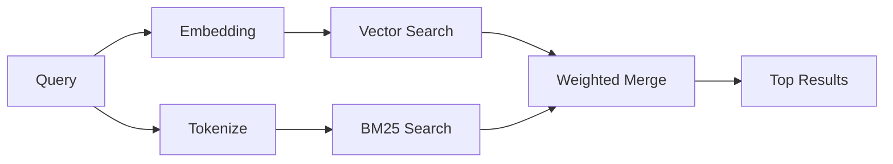

---
read_when:
    - memory_search가 어떻게 작동하는지 이해하고 싶습니다
    - 임베딩 제공자를 선택하려는 경우
    - 검색 품질을 조정하려는 경우
summary: 메모리 검색이 임베딩과 하이브리드 검색을 사용해 관련 노트를 찾는 방식
title: 메모리 검색
x-i18n:
    generated_at: "2026-06-28T22:33:49Z"
    model: gpt-5.5
    postprocess_version: locale-links-v1
    provider: openai
    source_hash: 32ffb9d996851566eb92b7812c5425f545ecbb5387a0a445686df35a6c8ae143
    source_path: concepts/memory-search.md
    workflow: 16
---

`memory_search`는 표현이 원문과 달라도 메모리 파일에서 관련 노트를 찾습니다. 메모리를 작은 청크로 색인하고 임베딩, 키워드 또는 둘 다를 사용해 검색하는 방식으로 동작합니다.

## 빠른 시작

메모리 검색은 기본적으로 OpenAI 임베딩을 사용합니다. 다른 임베딩 백엔드를 사용하려면 제공자를 명시적으로 설정하세요.

```json5
{
  agents: {
    defaults: {
      memorySearch: {
        provider: "openai", // or "gemini", "local", "ollama", "openai-compatible", etc.
      },
    },
  },
}
```

메모리 전용 제공자가 있는 다중 엔드포인트 설정에서는 해당 제공자가 `api: "ollama"` 또는 다른 메모리 임베딩 어댑터 소유자를 설정하는 경우 `provider`가 `ollama-5080` 같은 사용자 지정 `models.providers.<id>` 항목일 수도 있습니다.

API 키 없이 로컬 임베딩을 사용하려면 `@openclaw/llama-cpp-provider`를 설치하고 `provider: "local"`을 설정하세요. 소스 체크아웃에서는 여전히 네이티브 빌드 승인이 필요할 수 있습니다. `pnpm approve-builds`를 실행한 다음 `pnpm rebuild node-llama-cpp`를 실행하세요.

일부 OpenAI 호환 임베딩 엔드포인트는 검색에는 `input_type: "query"`, 색인된 청크에는 `input_type: "document"` 또는 `"passage"` 같은 비대칭 레이블이 필요합니다. `memorySearch.queryInputType` 및 `memorySearch.documentInputType`으로 이를 구성하세요. [메모리 구성 참조](/ko/reference/memory-config#provider-specific-config)를 확인하세요.

## 지원되는 제공자

| 제공자            | ID                  | API 키 필요 | 참고                          |
| ----------------- | ------------------- | ----------- | ----------------------------- |
| Bedrock           | `bedrock`           | 아니요      | AWS 자격 증명 체인 사용       |
| DeepInfra         | `deepinfra`         | 예          | 기본값: `BAAI/bge-m3`         |
| Gemini            | `gemini`            | 예          | 이미지/오디오 색인 지원      |
| GitHub Copilot    | `github-copilot`    | 아니요      | Copilot 구독 사용             |
| Local             | `local`             | 아니요      | GGUF 모델, 약 0.6GB 다운로드 |
| Mistral           | `mistral`           | 예          |                               |
| Ollama            | `ollama`            | 아니요      | 로컬/셀프 호스팅              |
| OpenAI            | `openai`            | 예          | 기본값                        |
| OpenAI-compatible | `openai-compatible` | 보통        | 일반 `/v1/embeddings`         |
| Voyage            | `voyage`            | 예          |                               |

## 검색 작동 방식

OpenClaw는 두 검색 경로를 병렬로 실행하고 결과를 병합합니다.



- **벡터 검색**은 의미가 비슷한 노트를 찾습니다("gateway host"는 "OpenClaw를 실행하는 머신"과 일치).
- **BM25 키워드 검색**은 정확히 일치하는 항목(ID, 오류 문자열, 구성 키)을 찾습니다.

한 경로만 사용할 수 있으면 다른 경로 없이 단독으로 실행됩니다. 의도적인 FTS 전용 모드(`provider: "none"`)와 자동/기본 제공자 선택은 임베딩을 사용할 수 없을 때도 어휘 기반 순위를 사용할 수 있습니다.

명시적인 비로컬 임베딩 제공자는 다르게 동작합니다. `memorySearch.provider`를 구체적인 원격 기반 제공자로 설정했는데 런타임에 해당 제공자를 사용할 수 없으면, `memory_search`는 FTS 전용 결과를 조용히 사용하는 대신 메모리를 사용할 수 없다고 보고합니다. 이렇게 하면 구성된 의미 검색 제공자가 고장 난 상태를 드러낼 수 있습니다. 의도적인 FTS 전용 회상을 원하면 `provider: "none"`을 설정하고, 의미 기반 순위를 복원하려면 제공자/인증 구성을 수정하세요.

## 검색 품질 개선

노트 기록이 많은 경우 두 가지 선택 기능이 도움이 됩니다.

### 시간 감쇠

오래된 노트는 점차 순위 가중치가 낮아져 최신 정보가 먼저 표시됩니다. 기본 반감기 30일을 사용하면 지난달의 노트는 원래 가중치의 50%로 점수가 매겨집니다. `MEMORY.md` 같은 에버그린 파일은 감쇠되지 않습니다.

<Tip>
에이전트에 수개월치 일일 노트가 있고 오래된 정보가 최신 컨텍스트보다 계속 높은 순위를 차지한다면 시간 감쇠를 활성화하세요.
</Tip>

### MMR(다양성)

중복 결과를 줄입니다. 다섯 개의 노트가 모두 같은 라우터 구성을 언급하는 경우, MMR은 상위 결과가 반복되는 대신 서로 다른 주제를 다루도록 합니다.

<Tip>
`memory_search`가 서로 다른 일일 노트에서 거의 중복된 스니펫을 계속 반환한다면 MMR을 활성화하세요.
</Tip>

### 둘 다 활성화

```json5
{
  agents: {
    defaults: {
      memorySearch: {
        query: {
          hybrid: {
            mmr: { enabled: true },
            temporalDecay: { enabled: true },
          },
        },
      },
    },
  },
}
```

## 멀티모달 메모리

Gemini Embedding 2를 사용하면 Markdown과 함께 이미지 및 오디오 파일을 색인할 수 있습니다. 검색 쿼리는 텍스트로 유지되지만 시각 및 오디오 콘텐츠와 일치합니다. 설정은 [메모리 구성 참조](/ko/reference/memory-config)를 확인하세요.

## 세션 메모리 검색

선택적으로 세션 transcript를 색인하여 `memory_search`가 이전 대화를 회상하도록 할 수 있습니다. 이는 `memorySearch.experimental.sessionMemory` 및 `sources: ["sessions"]`를 통한 옵트인 기능입니다. 기본 소스 목록은 메모리 전용입니다. 실험적 플래그는 세션 transcript 색인을 활성화하고, `sources`는 세션 청크를 검색할지 제어합니다.

세션 검색 결과는 `tools.sessions.visibility`를 따릅니다. 기본 `tree` 설정은 현재 세션과 현재 세션이 생성한 세션만 노출합니다. 별도 DM 세션에서 Gateway가 디스패치한 관련 없는 동일 에이전트 세션을 회상하려면 의도적으로 가시성을 `agent`로 넓히세요.

QMD를 사용할 때는 transcript가 QMD 컬렉션으로 내보내지도록 `memory.qmd.sessions.enabled: true`도 설정하세요. 자세한 내용은 [구성 참조](/ko/reference/memory-config)를 확인하세요.

## 문제 해결

**결과가 없나요?** `openclaw memory status`를 실행해 색인을 확인하세요. 비어 있으면 `openclaw memory index --force`를 실행하세요.

**키워드 일치만 나오나요?** 임베딩 제공자가 구성되지 않았을 수 있습니다. `openclaw memory status --deep`를 확인하세요.

**로컬 임베딩 시간이 초과되나요?** `ollama`, `lmstudio`, `local`은 기본적으로 더 긴 인라인 배치 제한 시간을 사용합니다. 호스트가 단순히 느린 경우 `agents.defaults.memorySearch.sync.embeddingBatchTimeoutSeconds`를 설정하고 `openclaw memory index --force`를 다시 실행하세요.

**CJK 텍스트를 찾을 수 없나요?** `openclaw memory index --force`로 FTS 색인을 다시 빌드하세요.

## 더 읽을거리

- [Active Memory](/ko/concepts/active-memory) -- 대화형 채팅 세션을 위한 하위 에이전트 메모리
- [메모리](/ko/concepts/memory) -- 파일 레이아웃, 백엔드, 도구
- [메모리 구성 참조](/ko/reference/memory-config) -- 모든 구성 옵션

## 관련 항목

- [메모리 개요](/ko/concepts/memory)
- [Active Memory](/ko/concepts/active-memory)
- [내장 메모리 엔진](/ko/concepts/memory-builtin)
