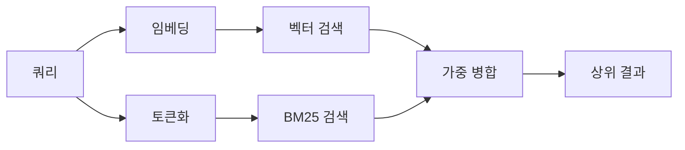

---
read_when:
    - memory_search의 작동 방식을 이해하려고 합니다
    - 임베딩 제공자를 선택하려고 합니다
    - 검색 품질을 조정하려는 경우
summary: 임베딩과 하이브리드 검색을 사용하여 메모리 검색이 관련 메모를 찾는 방법
title: 메모리 검색
x-i18n:
    generated_at: "2026-07-12T15:10:14Z"
    model: gpt-5.6
    postprocess_version: locale-links-v1
    prompt_version: 15
    provider: openai
    source_hash: 2ae0830843fba28c24159d85425240051fb8caf086cd0563d3091890045dcfad
    source_path: concepts/memory-search.md
    workflow: 16
---

`memory_search`는 표현이 원문과 다르더라도 메모리 파일에서 관련 메모를 찾습니다. 메모리를 작은 조각으로 나눈 다음 임베딩, 키워드 또는 두 가지 모두를 사용해 검색합니다.

## 빠른 시작

OpenClaw는 기본적으로 OpenAI 임베딩을 사용합니다. 다른 제공자를 사용하려면 명시적으로 설정하십시오.

```json5
{
  agents: {
    defaults: {
      memorySearch: {
        provider: "openai", // 또는 "gemini", "voyage", "mistral", "bedrock", "local", "ollama", "lmstudio", "github-copilot", "openai-compatible"
      },
    },
  },
}
```

`provider`는 사용자 지정 `models.providers.<id>` 항목(예: `ollama-5080`)을 참조할 수도 있습니다. 단, 해당 항목에서 `api`를 `"ollama"` 또는 메모리 임베딩 어댑터가 있는 다른 제공자 ID로 설정해야 합니다.

API 키 없이 로컬 임베딩을 사용하려면 공식 llama.cpp 제공자 Plugin을 설치하고 `provider: "local"`을 설정하십시오.

```bash
openclaw plugins install @openclaw/llama-cpp-provider
```

소스 체크아웃에서는 여전히 네이티브 빌드 승인이 필요합니다. `pnpm approve-builds`를 실행한 다음 `pnpm rebuild node-llama-cpp`를 실행하십시오.

일부 OpenAI 호환 임베딩 엔드포인트에는 검색용 `"query"`와 인덱싱된 청크용 `"document"`/`"passage"`처럼 비대칭 `input_type` 레이블이 필요합니다. `queryInputType`과 `documentInputType`으로 이를 설정하십시오. 자세한 내용은 [메모리 구성 참고 자료](/ko/reference/memory-config#provider-specific-config)를 참조하십시오.

## 지원되는 제공자

| 제공자            | ID                  | API 키 필요 | 참고 사항                              |
| ----------------- | ------------------- | ----------- | -------------------------------------- |
| Bedrock           | `bedrock`           | 아니요      | AWS 자격 증명 체인을 사용합니다        |
| DeepInfra         | `deepinfra`         | 예          | 기본 모델 `BAAI/bge-m3`                |
| Gemini            | `gemini`            | 예          | 이미지/오디오 인덱싱을 지원합니다      |
| GitHub Copilot    | `github-copilot`    | 아니요      | Copilot 구독을 사용합니다              |
| 로컬              | `local`             | 아니요      | GGUF 모델, 약 0.6 GB 자동 다운로드     |
| LM Studio         | `lmstudio`          | 아니요      | 로컬/자체 호스팅 서버                  |
| Mistral           | `mistral`           | 예          |                                        |
| Ollama            | `ollama`            | 아니요      | 로컬/자체 호스팅 서버                  |
| OpenAI            | `openai`            | 예          | 기본값                                 |
| OpenAI 호환       | `openai-compatible` | 일반적으로  | 범용 `/v1/embeddings` 엔드포인트       |
| Voyage            | `voyage`            | 예          |                                        |

## 검색 작동 방식

OpenClaw는 두 검색 경로를 병렬로 실행하고 결과를 병합합니다.



- **벡터 검색**은 유사한 의미를 일치시킵니다("gateway host"는 "OpenClaw를 실행하는 시스템"과 일치합니다).
- **BM25 키워드 검색**은 정확한 용어(ID, 오류 문자열, 구성 키)를 일치시킵니다.
- **파일 이름 검색**은 경로를 메모 본문과 별도로 인덱싱합니다. 정확한 전체 경로, 기본 이름, 파일 이름 어간은 부분 경로 일치보다 높은 순위를 차지하며, 스니펫과 본문 키워드 점수는 계속 메모 내용에서 산출됩니다.

한 경로만 사용할 수 있으면 해당 경로만 실행됩니다.

**FTS 전용 모드.** 임베딩을 의도적으로 비활성화하고 키워드로만 검색하려면 `provider: "none"`을 설정하십시오. `provider`를 설정하지 않거나 `"auto"`로 설정한 경우에도 임베딩 인증이 구성되지 않았다면 오류 없이 키워드 전용 순위 지정으로 대체됩니다. `provider: "local"`(GGUF/llama.cpp 제공자)이 실패한 경우에도 마찬가지입니다.

**명시적으로 지정한 제공자를 사용할 수 없는 경우.** 다른 제공자(예: `openai`, `ollama`, `gemini`)를 명시적으로 지정했는데 요청 시점에 사용할 수 없게 되면(잘못된 인증, 네트워크 장애) `memory_search`는 FTS 전용 결과로 조용히 성능을 낮추는 대신 메모리를 사용할 수 없다고 보고합니다. 이를 통해 구성된 제공자의 문제를 명확히 드러냅니다. 의도적으로 FTS 전용 회상을 사용하려면 `provider: "none"`을 설정하고, 의미 기반 순위 지정을 복원하려면 제공자/인증 구성을 수정하십시오.

## 검색 품질 개선

대규모 메모 기록에는 두 가지 선택적 기능이 유용합니다.

### 시간적 감쇠

오래된 메모는 순위 가중치가 점차 감소하여 최근 정보가 먼저 표시됩니다. 기본 반감기인 30일을 적용하면 지난달의 메모 점수는 원래 가중치의 50%가 됩니다. `MEMORY.md` 및 `memory/` 아래의 날짜가 없는 다른 파일은 상시 유지되며 감쇠되지 않습니다. 날짜가 있는 `memory/YYYY-MM-DD.md` 파일만 감쇠됩니다.

<Tip>
에이전트에 수개월 분량의 일일 메모가 있고 오래된 정보가 계속 최근 컨텍스트보다 높은 순위를 차지한다면 이 기능을 활성화하십시오.
</Tip>

### MMR(다양성)

중복 결과를 줄입니다. 5개의 메모가 모두 동일한 라우터 구성을 언급하더라도 MMR을 사용하면 상위 결과가 반복되는 대신 서로 다른 주제를 다룹니다.

<Tip>
`memory_search`가 서로 다른 일일 메모에서 거의 중복되는 스니펫을 계속 반환한다면 이 기능을 활성화하십시오.
</Tip>

### 두 기능 모두 활성화

```json5
{
  agents: {
    defaults: {
      memorySearch: {
        query: {
          hybrid: {
            mmr: { enabled: true },
            temporalDecay: { enabled: true },
          },
        },
      },
    },
  },
}
```

## 멀티모달 메모리

`gemini-embedding-2-preview`를 사용하면 Markdown과 함께 이미지 및 오디오를 인덱싱할 수 있습니다. 이 기능은 `memorySearch.extraPaths` 아래의 파일에만 적용됩니다. 기본 메모리 루트(`MEMORY.md`, `memory/*.md`)는 Markdown 전용으로 유지됩니다. 검색 쿼리는 계속 텍스트이지만 시각 및 오디오 콘텐츠와 일치할 수 있습니다. 설정 방법은 [메모리 구성 참고 자료](/ko/reference/memory-config#multimodal-memory-gemini)를 참조하십시오.

## 세션 메모리 검색

세션 기록에서 정확한 전체 텍스트를 회상하려면 [`sessions_search`](/concepts/session-search)를 사용한 다음 `sessions_history`로 결과를 여십시오. 세션 메모리 검색은 의미 기반의 실험적 보완 기능으로 유지됩니다.

선택적으로 세션 기록을 인덱싱하여 `memory_search`가 이전 대화를 회상할 수 있게 할 수 있습니다. 이 기능은 옵트인입니다. `experimental.sessionMemory: true`를 설정하고 `sources`에 `"sessions"`를 추가하십시오(기본 `sources`는 `["memory"]`입니다).

세션 검색 결과에는 `tools.sessions.visibility`가 적용됩니다. 기본값 `"tree"`는 현재 세션과 이 세션이 생성한 세션만 노출합니다. 다른 세션에서 관련 없는 동일 에이전트의 세션(예: DM에서 Gateway가 디스패치한 세션)을 회상하려면 가시성을 `"agent"`로 확장하십시오.

QMD 백엔드를 사용할 때는 기록이 QMD 컬렉션으로 내보내지도록 `memory.qmd.sessions.enabled: true`도 설정하십시오. `experimental.sessionMemory`와 `sources`만으로는 기록이 QMD로 내보내지지 않습니다. 자세한 내용은 [구성 참고 자료](/ko/reference/memory-config#session-memory-search-experimental)를 참조하십시오.

## 문제 해결

**결과가 없습니까?** `openclaw memory status`를 실행하여 인덱스를 확인하십시오. 비어 있다면 `openclaw memory index --force`를 실행하십시오.

**키워드 일치만 표시됩니까?** 임베딩 제공자가 구성되지 않았을 수 있습니다. `openclaw memory status --deep`를 확인하십시오.

**로컬 임베딩 시간이 초과됩니까?** `ollama`, `lmstudio`, `local`은 기본적으로 더 긴 인라인 배치 제한 시간을 사용합니다. 호스트가 느릴 뿐이라면 `agents.defaults.memorySearch.sync.embeddingBatchTimeoutSeconds`를 설정하고 `openclaw memory index --force`를 다시 실행하십시오.

**CJK 텍스트를 찾을 수 없습니까?** `openclaw memory index --force`를 사용하여 FTS 인덱스를 다시 빌드하십시오.

## 관련 항목

- [메모리 개요](/ko/concepts/memory)
- [Active Memory](/ko/concepts/active-memory)
- [내장 메모리 엔진](/ko/concepts/memory-builtin)
- [메모리 구성 참고 자료](/ko/reference/memory-config)
