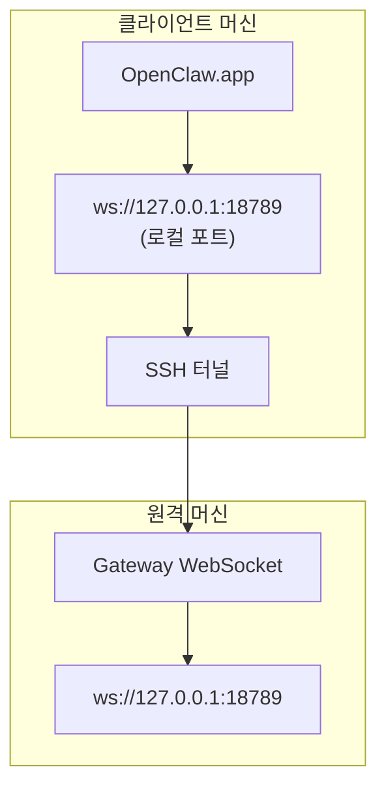

<Note>
이 콘텐츠는 이제 [원격 액세스](/ko/gateway/remote#macos-persistent-ssh-tunnel-via-launchagent)에 있습니다. 최신 가이드는 해당 페이지를 참조하십시오. 이 페이지는 리디렉션 대상으로 유지됩니다.
</Note>

# 원격 Gateway로 OpenClaw.app 실행하기

OpenClaw.app은 SSH 터널을 통해 원격 Gateway에 연결합니다. SSH `LocalForward`는 로컬 포트를 원격 호스트의 Gateway WebSocket 포트에 매핑합니다.

## 설정

1. `LocalForward 18789 127.0.0.1:18789`가 포함된 SSH 구성 항목을 추가합니다(전체 구성 블록은 [원격 액세스](/ko/gateway/remote#macos-persistent-ssh-tunnel-via-launchagent)를 참조하십시오).
2. `ssh-copy-id`를 사용하여 SSH 키를 원격 호스트에 복사합니다.
3. `openclaw config set gateway.remote.token "<your-token>"`을 사용하여 `gateway.remote.token`(또는 `gateway.remote.password`)을 설정합니다.
4. 터널을 시작합니다: `ssh -N remote-gateway &`.
5. OpenClaw.app을 종료한 후 다시 엽니다.

재부팅 후에도 유지되고 자동으로 다시 연결되는 터널을 사용하려면 수동 `ssh -N` 대신 [원격 액세스](/ko/gateway/remote#macos-persistent-ssh-tunnel-via-launchagent) 페이지의 LaunchAgent 설정을 사용하십시오.

## 작동 방식

| 구성 요소                            | 기능                                                          |
| ------------------------------------ | ------------------------------------------------------------- |
| `LocalForward 18789 127.0.0.1:18789` | 로컬 포트 18789를 원격 포트 18789로 전달합니다                |
| `ssh -N`                             | 원격 명령을 실행하지 않고 SSH를 사용합니다(포트 전달만 수행)  |
| `KeepAlive`                          | 터널이 중단되면 자동으로 다시 시작합니다(LaunchAgent)         |
| `RunAtLoad`                          | LaunchAgent가 로드될 때 터널을 시작합니다(LaunchAgent)        |

OpenClaw.app은 클라이언트의 `ws://127.0.0.1:18789`에 연결합니다. 터널은 이 연결을 Gateway가 실행 중인 원격 호스트의 포트 18789로 전달합니다.

## 관련 항목

- [원격 액세스](/ko/gateway/remote)
- [Tailscale](/ko/gateway/tailscale)
