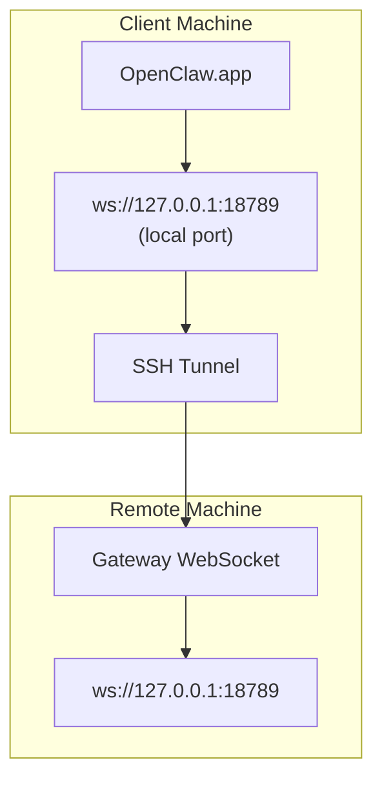

> 이 콘텐츠는 [원격 액세스](/ko/gateway/remote#macos-persistent-ssh-tunnel-via-launchagent)에 병합되었습니다. 최신 가이드는 해당 페이지를 참조하세요.

# 원격 Gateway로 OpenClaw.app 실행하기

OpenClaw.app은 SSH 터널링을 사용해 원격 Gateway에 연결합니다. 이 가이드는 설정 방법을 보여줍니다.

## 개요



## 빠른 설정

### 1단계: SSH 설정 추가

`~/.ssh/config`를 편집하고 다음을 추가합니다.

```ssh
Host remote-gateway
    HostName <REMOTE_IP>          # e.g., 172.27.187.184
    User <REMOTE_USER>            # e.g., jefferson
    LocalForward 18789 127.0.0.1:18789
    IdentityFile ~/.ssh/id_rsa
```

`<REMOTE_IP>` 및 `<REMOTE_USER>`를 사용자의 값으로 바꾸세요.

### 2단계: SSH 키 복사

공개 키를 원격 머신에 복사합니다(비밀번호 한 번 입력).

```bash
ssh-copy-id -i ~/.ssh/id_rsa <REMOTE_USER>@<REMOTE_IP>
```

### 3단계: 원격 Gateway 인증 설정

```bash
openclaw config set gateway.remote.token "<your-token>"
```

원격 Gateway가 비밀번호 인증을 사용하는 경우 대신 `gateway.remote.password`를 사용하세요.
`OPENCLAW_GATEWAY_TOKEN`은 셸 수준 재정의로 여전히 유효하지만, 지속적인
원격 클라이언트 설정은 `gateway.remote.token` / `gateway.remote.password`입니다.

### 4단계: SSH 터널 시작

```bash
ssh -N remote-gateway &
```

### 5단계: OpenClaw.app 다시 시작

```bash
# Quit OpenClaw.app (⌘Q), then reopen:
open /path/to/OpenClaw.app
```

이제 앱은 SSH 터널을 통해 원격 Gateway에 연결됩니다.

---

## 로그인 시 터널 자동 시작

로그인할 때 SSH 터널이 자동으로 시작되도록 하려면 Launch Agent를 생성하세요.

### PLIST 파일 생성

이를 `~/Library/LaunchAgents/ai.openclaw.ssh-tunnel.plist`로 저장합니다.

```xml
<?xml version="1.0" encoding="UTF-8"?>
<!DOCTYPE plist PUBLIC "-//Apple//DTD PLIST 1.0//EN" "http://www.apple.com/DTDs/PropertyList-1.0.dtd">
<plist version="1.0">
<dict>
    <key>Label</key>
    <string>ai.openclaw.ssh-tunnel</string>
    <key>ProgramArguments</key>
    <array>
        <string>/usr/bin/ssh</string>
        <string>-N</string>
        <string>remote-gateway</string>
    </array>
    <key>KeepAlive</key>
    <true/>
    <key>RunAtLoad</key>
    <true/>
</dict>
</plist>
```

### Launch Agent 로드

```bash
launchctl bootstrap gui/$UID ~/Library/LaunchAgents/ai.openclaw.ssh-tunnel.plist
```

이제 터널은 다음과 같이 동작합니다.

- 로그인할 때 자동으로 시작
- 충돌하면 다시 시작
- 백그라운드에서 계속 실행

레거시 참고: 남아 있는 `com.openclaw.ssh-tunnel` LaunchAgent가 있으면 제거하세요.

---

## 문제 해결

**터널이 실행 중인지 확인:**

```bash
ps aux | grep "ssh -N remote-gateway" | grep -v grep
lsof -i :18789
```

**터널 다시 시작:**

```bash
launchctl kickstart -k gui/$UID/ai.openclaw.ssh-tunnel
```

**터널 중지:**

```bash
launchctl bootout gui/$UID/ai.openclaw.ssh-tunnel
```

---

## 작동 방식

| 구성 요소                            | 수행 작업                                                     |
| ------------------------------------ | ------------------------------------------------------------ |
| `LocalForward 18789 127.0.0.1:18789` | 로컬 포트 18789를 원격 포트 18789로 전달                     |
| `ssh -N`                             | 원격 명령을 실행하지 않는 SSH(포트 전달만 수행)              |
| `KeepAlive`                          | 터널이 충돌하면 자동으로 다시 시작                           |
| `RunAtLoad`                          | 에이전트가 로드될 때 터널 시작                               |

OpenClaw.app은 클라이언트 머신의 `ws://127.0.0.1:18789`에 연결합니다. SSH 터널은 해당 연결을 Gateway가 실행 중인 원격 머신의 포트 18789로 전달합니다.

## 관련 항목

- [원격 액세스](/ko/gateway/remote)
- [Tailscale](/ko/gateway/tailscale)
