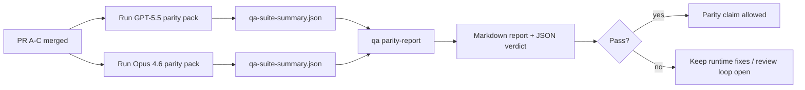

---
read_when:
    - GPT-5.5 / Codex 동등성 PR 시리즈 검토
    - 패리티 프로그램을 뒷받침하는 여섯 계약 기반 에이전트형 아키텍처 유지 관리
summary: 네 개의 병합 단위로 GPT-5.5 / Codex 패리티 프로그램을 검토하는 방법
title: GPT-5.5 / Codex 동등성 유지관리자 참고 사항
x-i18n:
    generated_at: "2026-05-06T06:28:05Z"
    model: gpt-5.5
    provider: openai
    source_hash: 5752b4610f8b0d70b80d880ea10df75478b5f85ca431cdb73d3b61d745b23356
    source_path: help/gpt55-codex-agentic-parity-maintainers.md
    workflow: 16
---

이 메모는 원래의 여섯 계약 아키텍처를 잃지 않으면서 GPT-5.5 / Codex 패리티 프로그램을 네 개의 병합 단위로 검토하는 방법을 설명합니다.

## 병합 단위

### PR A: 엄격한 에이전트형 실행

소유 범위:

- `executionContract`
- GPT-5 우선 동일 턴 완수
- 비종결 진행 상황 추적으로서의 `update_plan`
- 계획만 남기고 조용히 멈추는 대신 명시적인 차단 상태

소유하지 않는 범위:

- 인증/런타임 실패 분류
- 권한 진실성
- 재생/계속 실행 재설계
- 패리티 벤치마킹

### PR B: 런타임 진실성

소유 범위:

- Codex OAuth 범위 정확성
- 타입이 지정된 제공자/런타임 실패 분류
- 진실한 `/elevated full` 가용성과 차단 사유

소유하지 않는 범위:

- 도구 스키마 정규화
- 재생/활성 상태
- 벤치마크 게이팅

### PR C: 실행 정확성

소유 범위:

- 제공자 소유 OpenAI/Codex 도구 호환성
- 매개변수 없는 엄격한 스키마 처리
- 재생 무효 상태 노출
- 일시 중지, 차단, 포기된 장기 작업 상태 가시성

소유하지 않는 범위:

- 자체 선택 계속 실행
- 제공자 훅 외부의 일반 Codex 방언 동작
- 벤치마크 게이팅

### PR D: 패리티 하니스

소유 범위:

- 첫 번째 GPT-5.5 대 Opus 4.6 시나리오 팩
- 패리티 문서
- 패리티 보고서 및 릴리스 게이트 메커니즘

소유하지 않는 범위:

- QA-lab 외부의 런타임 동작 변경
- 하니스 내부의 인증/프록시/DNS 시뮬레이션

## 원래 여섯 계약으로의 매핑

| 원래 계약                                | 병합 단위 |
| ---------------------------------------- | ---------- |
| 제공자 전송/인증 정확성                 | PR B       |
| 도구 계약/스키마 호환성                 | PR C       |
| 동일 턴 실행                            | PR A       |
| 권한 진실성                             | PR B       |
| 재생/계속 실행/활성 상태 정확성         | PR C       |
| 벤치마크/릴리스 게이트                  | PR D       |

## 검토 순서

1. PR A
2. PR B
3. PR C
4. PR D

PR D는 증명 계층입니다. 이것이 런타임 정확성 PR을 지연시키는 이유가 되어서는 안 됩니다.

## 확인할 사항

### PR A

- GPT-5 실행이 설명에서 멈추지 않고 동작하거나 닫힌 상태로 실패하는지
- `update_plan` 자체가 더 이상 진행처럼 보이지 않는지
- 동작이 GPT-5 우선이며 임베디드 Pi 범위로 유지되는지

### PR B

- 인증/프록시/런타임 실패가 일반적인 "모델 실패" 처리로 뭉개지지 않는지
- `/elevated full`이 실제로 사용 가능할 때만 사용 가능하다고 설명되는지
- 차단 사유가 모델과 사용자 대상 런타임 모두에 표시되는지

### PR C

- 엄격한 OpenAI/Codex 도구 등록이 예측 가능하게 동작하는지
- 매개변수 없는 도구가 엄격한 스키마 검사에서 실패하지 않는지
- 재생 및 Compaction 결과가 진실한 활성 상태를 보존하는지

### PR D

- 시나리오 팩이 이해 가능하고 재현 가능한지
- 팩이 읽기 전용 흐름뿐 아니라 변경을 수반하는 재생 안전성 레인을 포함하는지
- 보고서를 사람과 자동화가 읽을 수 있는지
- 패리티 주장이 일화가 아니라 증거로 뒷받침되는지

PR D에서 예상되는 산출물:

- 각 모델 실행에 대한 `qa-suite-report.md` / `qa-suite-summary.json`
- 집계 및 시나리오 수준 비교가 포함된 `qa-agentic-parity-report.md`
- 기계가 읽을 수 있는 판정이 포함된 `qa-agentic-parity-summary.json`

## 릴리스 게이트

다음 조건이 충족될 때까지 GPT-5.5가 Opus 4.6과 패리티를 달성했거나 더 우수하다고 주장하지 마십시오.

- PR A, PR B, PR C가 병합됨
- PR D가 첫 번째 패리티 팩을 깨끗하게 실행함
- 런타임 진실성 회귀 스위트가 계속 녹색 상태임
- 패리티 보고서에 가짜 성공 사례와 중단 동작의 회귀가 없음

패리티 하니스가 유일한 증거 출처는 아닙니다. 검토에서 이 분리를 명시적으로 유지하십시오.

- PR D는 시나리오 기반 GPT-5.5 대 Opus 4.6 비교를 소유합니다
- PR B 결정적 스위트는 여전히 인증/프록시/DNS 및 전체 액세스 진실성 증거를 소유합니다

## 빠른 메인테이너 병합 워크플로

패리티 PR을 랜딩할 준비가 되었고 반복 가능하며 위험이 낮은 순서를 원할 때 사용하십시오.

1. 병합 전에 증거 기준이 충족되었는지 확인합니다.
   - 재현 가능한 증상 또는 실패하는 테스트
   - 변경된 코드에서 확인된 근본 원인
   - 문제가 된 경로의 수정
   - 회귀 테스트 또는 명시적인 수동 검증 메모
2. 병합 전에 트리아지/라벨을 지정합니다.
   - PR이 랜딩되어서는 안 되는 경우 `r:*` 자동 종료 라벨 적용
   - 병합 후보에 해결되지 않은 차단 스레드가 없도록 유지
3. 변경된 표면에서 로컬로 검증합니다.
   - `pnpm check:changed`
   - 테스트가 변경되었거나 버그 수정 신뢰도가 테스트 커버리지에 의존하는 경우 `pnpm test:changed`
4. 표준 메인테이너 흐름(`/landpr` 프로세스)으로 랜딩한 뒤 검증합니다.
   - 연결된 이슈 자동 종료 동작
   - `main`의 CI 및 병합 후 상태
5. 랜딩 후 관련 열린 PR/이슈에 대한 중복 검색을 실행하고, 표준 참조가 있을 때만 닫습니다.

증거 기준 항목 중 하나라도 누락된 경우 병합하지 말고 변경을 요청하십시오.

## 목표-증거 맵

| 완료 게이트 항목                         | 기본 소유자 | 검토 산출물                                                          |
| ---------------------------------------- | ----------- | -------------------------------------------------------------------- |
| 계획만 남기고 멈추는 경우 없음          | PR A        | 엄격한 에이전트형 런타임 테스트 및 `approval-turn-tool-followthrough` |
| 가짜 진행 또는 가짜 도구 완료 없음      | PR A + PR D | 패리티 가짜 성공 횟수 및 시나리오 수준 보고서 세부 정보             |
| 잘못된 `/elevated full` 안내 없음        | PR B        | 결정적 런타임 진실성 스위트                                          |
| 재생/활성 상태 실패가 계속 명시적임     | PR C + PR D | 수명 주기/재생 스위트 및 `compaction-retry-mutating-tool`            |
| GPT-5.5가 Opus 4.6과 같거나 더 우수함    | PR D        | `qa-agentic-parity-report.md` 및 `qa-agentic-parity-summary.json`    |

## 검토자 약어: 이전과 이후

| 이전의 사용자 가시 문제                                      | 이후의 검토 신호                                                                        |
| ------------------------------------------------------------ | --------------------------------------------------------------------------------------- |
| GPT-5.5가 계획 후 멈춤                                      | PR A가 설명만으로 완료하는 대신 동작하거나 차단되는 동작을 보여줌                      |
| 엄격한 OpenAI/Codex 스키마에서 도구 사용이 취약하게 느껴짐  | PR C가 도구 등록과 매개변수 없는 호출을 예측 가능하게 유지함                           |
| `/elevated full` 힌트가 때때로 오해를 일으킴                | PR B가 안내를 실제 런타임 기능 및 차단 사유에 연결함                                    |
| 장기 작업이 재생/Compaction 모호성 속으로 사라질 수 있음    | PR C가 명시적인 일시 중지, 차단, 포기, 재생 무효 상태를 내보냄                         |
| 패리티 주장이 일화적이었음                                  | PR D가 두 모델에서 동일한 시나리오 커버리지로 보고서와 JSON 판정을 생성함              |

## 관련

- [GPT-5.5 / Codex 에이전트형 패리티](/ko/help/gpt55-codex-agentic-parity)
