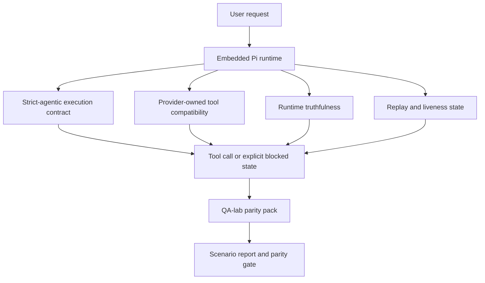
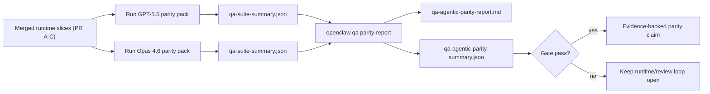

---
read_when:
    - GPT-5.5 또는 Codex 에이전트 동작 디버깅
    - 프런티어 모델 간 OpenClaw의 에이전트형 동작 비교
    - 엄격한 에이전트형, 도구 스키마, 권한 상승 및 재생 수정 사항 검토
summary: GPT-5.5 및 Codex 스타일 모델의 에이전트 실행 격차를 OpenClaw가 해소하는 방법
title: GPT-5.5 / Codex 에이전트형 동등성
x-i18n:
    generated_at: "2026-05-06T06:28:17Z"
    model: gpt-5.5
    provider: openai
    source_hash: bbc32f418dfffe2786093fa6b42b19f92a2d382c9408dfc55dd0154d67959390
    source_path: help/gpt55-codex-agentic-parity.md
    workflow: 16
---

OpenClaw는 이미 도구를 사용하는 frontier 모델과 잘 작동했지만, GPT-5.5 및 Codex 스타일 모델은 몇 가지 실무적인 측면에서 여전히 기대에 미치지 못했습니다.

- 작업을 수행하는 대신 계획 후 중단할 수 있음
- 엄격한 OpenAI/Codex 도구 스키마를 잘못 사용할 수 있음
- 전체 액세스가 불가능한 경우에도 `/elevated full`을 요청할 수 있음
- 재생 또는 Compaction 중 장기 실행 작업 상태를 잃을 수 있음
- Claude Opus 4.6과의 패리티 주장이 반복 가능한 시나리오가 아닌 일화에 기반함

이 패리티 프로그램은 검토 가능한 네 가지 조각으로 이러한 간극을 해결합니다.

## 변경 사항

### PR A: strict-agentic 실행

이 조각은 내장 Pi GPT-5 실행을 위한 옵트인 `strict-agentic` 실행 계약을 추가합니다.

활성화되면 OpenClaw는 계획만 있는 턴을 "충분히 좋은" 완료로 받아들이지 않습니다. 모델이 하려는 일을 말하기만 하고 실제로 도구를 사용하거나 진행하지 않으면, OpenClaw는 즉시 실행하라는 유도와 함께 재시도한 다음 작업을 조용히 종료하는 대신 명시적인 차단 상태로 닫힌 실패를 발생시킵니다.

이는 다음에서 GPT-5.5 경험을 가장 크게 개선합니다.

- 짧은 "좋아, 해줘" 후속 요청
- 첫 단계가 명확한 코드 작업
- `update_plan`이 채우기용 텍스트가 아니라 진행 상황 추적이어야 하는 흐름

### PR B: 런타임 진실성

이 조각은 OpenClaw가 두 가지에 대해 사실대로 말하게 합니다.

- provider/runtime 호출이 실패한 이유
- `/elevated full`이 실제로 사용 가능한지 여부

즉, GPT-5.5는 누락된 범위, 인증 갱신 실패, HTML 403 인증 실패, 프록시 문제, DNS 또는 시간 초과 실패, 차단된 전체 액세스 모드에 대해 더 나은 런타임 신호를 받습니다. 모델이 잘못된 해결 방법을 환각하거나 런타임이 제공할 수 없는 권한 모드를 계속 요청할 가능성이 줄어듭니다.

### PR C: 실행 정확성

이 조각은 두 종류의 정확성을 개선합니다.

- provider 소유 OpenAI/Codex 도구 스키마 호환성
- 재생 및 장기 작업 활성 상태 노출

도구 호환 작업은 특히 매개변수가 없는 도구와 엄격한 객체 루트 기대 사항 주변에서, 엄격한 OpenAI/Codex 도구 등록의 스키마 마찰을 줄입니다. 재생/활성 상태 작업은 장기 실행 작업을 더 관찰 가능하게 만들어, 일시 중지됨, 차단됨, 방치됨 상태가 일반적인 실패 텍스트로 사라지지 않고 보이도록 합니다.

### PR D: 패리티 하네스

이 조각은 첫 번째 QA-lab 패리티 팩을 추가하여 GPT-5.5와 Opus 4.6을 동일한 시나리오로 실행하고 공유 증거를 사용해 비교할 수 있게 합니다.

패리티 팩은 증명 계층입니다. 그 자체로 런타임 동작을 변경하지는 않습니다.

두 개의 `qa-suite-summary.json` 아티팩트가 준비되면 다음으로 릴리스 게이트 비교를 생성하세요.

```bash
pnpm openclaw qa parity-report \
  --repo-root . \
  --candidate-summary .artifacts/qa-e2e/gpt55/qa-suite-summary.json \
  --baseline-summary .artifacts/qa-e2e/opus46/qa-suite-summary.json \
  --output-dir .artifacts/qa-e2e/parity
```

이 명령은 다음을 작성합니다.

- 사람이 읽을 수 있는 Markdown 보고서
- 기계가 읽을 수 있는 JSON 판정
- 명시적인 `pass` / `fail` 게이트 결과

## 이것이 실제로 GPT-5.5를 개선하는 이유

이 작업 전에는 OpenClaw에서 GPT-5.5가 실제 코딩 세션에서 Opus보다 덜 agentic하게 느껴질 수 있었습니다. 런타임이 GPT-5 스타일 모델에 특히 해로운 동작을 허용했기 때문입니다.

- 해설만 있는 턴
- 도구 주변의 스키마 마찰
- 모호한 권한 피드백
- 조용한 재생 또는 Compaction 손상

목표는 GPT-5.5가 Opus를 흉내 내게 하는 것이 아닙니다. 목표는 GPT-5.5에 실제 진행을 보상하고, 더 명확한 도구 및 권한 의미 체계를 제공하며, 실패 모드를 명시적인 기계 및 사람이 읽을 수 있는 상태로 바꾸는 런타임 계약을 제공하는 것입니다.

이는 사용자 경험을 다음에서 바꿉니다.

- "모델은 좋은 계획을 세웠지만 중단했다"

다음으로:

- "모델이 실제로 행동했거나, OpenClaw가 행동할 수 없었던 정확한 이유를 드러냈다"

## GPT-5.5 사용자를 위한 이전과 이후

| 이 프로그램 이전                                                                            | PR A-D 이후                                                                             |
| ---------------------------------------------------------------------------------------------- | ---------------------------------------------------------------------------------------- |
| GPT-5.5가 합리적인 계획 후 다음 도구 단계를 수행하지 않고 중단할 수 있었음                   | PR A는 "계획만 있음"을 "지금 행동하거나 차단 상태를 노출"로 바꿈                         |
| 엄격한 도구 스키마가 매개변수가 없거나 OpenAI/Codex 형태인 도구를 혼란스러운 방식으로 거부할 수 있었음 | PR C는 provider 소유 도구 등록 및 호출을 더 예측 가능하게 만듦              |
| 차단된 런타임에서 `/elevated full` 안내가 모호하거나 잘못될 수 있었음                          | PR B는 GPT-5.5와 사용자에게 진실한 런타임 및 권한 힌트를 제공함                    |
| 재생 또는 Compaction 실패가 작업이 조용히 사라진 것처럼 느껴질 수 있었음                    | PR C는 일시 중지됨, 차단됨, 방치됨, 재생 무효 결과를 명시적으로 노출함         |
| "GPT-5.5가 Opus보다 나쁘게 느껴진다"는 말은 대부분 일화였음                                           | PR D는 이를 동일한 시나리오 팩, 동일한 지표, 엄격한 pass/fail 게이트로 전환함 |

## 아키텍처



## 릴리스 흐름



## 시나리오 팩

첫 번째 패리티 팩은 현재 다섯 가지 시나리오를 다룹니다.

### `approval-turn-tool-followthrough`

짧은 승인 후 모델이 "그렇게 하겠습니다"에서 멈추지 않는지 확인합니다. 동일한 턴에서 첫 번째 구체적인 행동을 수행해야 합니다.

### `model-switch-tool-continuity`

도구 사용 작업이 해설로 재설정되거나 실행 컨텍스트를 잃지 않고 모델/런타임 전환 경계 전반에서 일관성을 유지하는지 확인합니다.

### `source-docs-discovery-report`

모델이 소스와 문서를 읽고, 발견 내용을 종합하며, 얇은 요약만 생성하고 일찍 중단하는 대신 agentic하게 작업을 계속할 수 있는지 확인합니다.

### `image-understanding-attachment`

첨부 파일이 포함된 혼합 모드 작업이 실행 가능하게 유지되고 모호한 서술로 축소되지 않는지 확인합니다.

### `compaction-retry-mutating-tool`

실제 변경 쓰기가 있는 작업이, 실행이 Compaction되거나 재시도되거나 압박 속에서 응답 상태를 잃더라도 조용히 재생 안전해 보이지 않고 재생 비안전성을 명시적으로 유지하는지 확인합니다.

## 시나리오 매트릭스

| 시나리오                           | 테스트 대상                           | 좋은 GPT-5.5 동작                                                          | 실패 신호                                                                 |
| ---------------------------------- | --------------------------------------- | ------------------------------------------------------------------------------ | ------------------------------------------------------------------------------ |
| `approval-turn-tool-followthrough` | 계획 후 짧은 승인 턴       | 의도를 다시 말하는 대신 첫 번째 구체적인 도구 행동을 즉시 시작함  | 계획만 있는 후속 턴, 도구 활동 없음, 또는 실제 차단 요인 없는 차단 턴  |
| `model-switch-tool-continuity`     | 도구 사용 중 런타임/모델 전환  | 작업 컨텍스트를 보존하고 일관되게 계속 행동함                         | 해설로 재설정, 도구 컨텍스트 상실, 또는 전환 후 중단              |
| `source-docs-discovery-report`     | 소스 읽기 + 종합 + 행동     | 소스를 찾고, 도구를 사용하며, 멈추지 않고 유용한 보고서를 생성함       | 얇은 요약, 누락된 도구 작업, 또는 미완료 턴 중단                       |
| `image-understanding-attachment`   | 첨부 파일 기반 agentic 작업          | 첨부 파일을 해석하고, 이를 도구와 연결하며, 작업을 계속함        | 모호한 서술, 첨부 파일 무시, 또는 구체적인 다음 행동 없음                |
| `compaction-retry-mutating-tool`   | Compaction 압박하의 변경 작업 | 실제 쓰기를 수행하고 부수 효과 후에도 재생 비안전성을 명시적으로 유지함 | 변경 쓰기는 발생했지만 재생 안전성이 암시되거나, 누락되거나, 모순됨 |

## 릴리스 게이트

GPT-5.5는 병합된 런타임이 패리티 팩과 런타임 진실성 회귀를 동시에 통과할 때만 패리티 이상으로 간주될 수 있습니다.

필수 결과:

- 다음 도구 행동이 명확할 때 계획만 있고 멈추는 일이 없음
- 실제 실행 없는 가짜 완료 없음
- 잘못된 `/elevated full` 안내 없음
- 조용한 재생 또는 Compaction 방치 없음
- 합의된 Opus 4.6 기준선 이상으로 강한 패리티 팩 지표

첫 번째 하네스에서 게이트는 다음을 비교합니다.

- 완료율
- 의도치 않은 중단율
- 유효한 도구 호출률
- 가짜 성공 수

패리티 증거는 의도적으로 두 계층으로 나뉩니다.

- PR D는 QA-lab으로 동일 시나리오 GPT-5.5 대 Opus 4.6 동작을 증명함
- PR B 결정적 스위트는 하네스 밖에서 인증, 프록시, DNS, `/elevated full` 진실성을 증명함

## 목표-증거 매트릭스

| 완료 게이트 항목                                     | 소유 PR   | 증거 소스                                                    | 통과 신호                                                                              |
| -------------------------------------------------------- | ----------- | ------------------------------------------------------------------ | ---------------------------------------------------------------------------------------- |
| GPT-5.5가 계획 후 더 이상 멈추지 않음                  | PR A        | `approval-turn-tool-followthrough` 및 PR A 런타임 스위트        | 승인 턴이 실제 작업 또는 명시적인 차단 상태를 트리거함                            |
| GPT-5.5가 더 이상 진행 또는 도구 완료를 가장하지 않음 | PR A + PR D | 패리티 보고서 시나리오 결과 및 가짜 성공 수             | 의심스러운 통과 결과가 없고 해설만 있는 완료가 없음                             |
| GPT-5.5가 더 이상 잘못된 `/elevated full` 안내를 제공하지 않음  | PR B        | 결정적 진실성 스위트                                  | 차단 이유와 전체 액세스 힌트가 런타임에 정확하게 유지됨                              |
| 재생/활성 상태 실패가 명시적으로 유지됨                   | PR C + PR D | PR C 수명주기/재생 스위트 및 `compaction-retry-mutating-tool` | 변경 작업이 조용히 사라지는 대신 재생 비안전성을 명시적으로 유지함            |
| GPT-5.5가 합의된 지표에서 Opus 4.6과 같거나 능가함  | PR D        | `qa-agentic-parity-report.md` 및 `qa-agentic-parity-summary.json` | 동일한 시나리오 범위와 완료, 중단 동작, 유효한 도구 사용에서 회귀 없음 |

## 패리티 판정 읽는 방법

첫 번째 패리티 팩의 최종 기계 판정으로 `qa-agentic-parity-summary.json`의 판정을 사용하세요.

- `pass`는 GPT-5.5가 Opus 4.6과 동일한 시나리오를 다뤘고, 합의된 집계 지표에서 퇴행하지 않았음을 의미합니다.
- `fail`은 하나 이상의 하드 게이트가 걸렸음을 의미합니다. 완료 성능 약화, 의도치 않은 중단 증가, 유효한 도구 사용 약화, 가짜 성공 사례, 또는 시나리오 적용 범위 불일치가 여기에 해당합니다.
- "공유/기본 CI 문제" 자체는 동등성 결과가 아닙니다. PR D 외부의 CI 노이즈가 실행을 막는 경우, 평결은 브랜치 시절 로그에서 추론하지 말고 깨끗한 병합된 런타임 실행을 기다려야 합니다.
- 인증, 프록시, DNS, 그리고 `/elevated full` 진실성은 여전히 PR B의 결정적 스위트에서 나오므로, 최종 릴리스 주장은 둘 다 필요합니다. 통과한 PR D 동등성 평결과 녹색 PR B 진실성 적용 범위입니다.

## `strict-agentic`는 누가 활성화해야 하나

다음 경우 `strict-agentic`를 사용하세요.

- 다음 단계가 명확할 때 에이전트가 즉시 행동해야 하는 경우
- GPT-5.5 또는 Codex 계열 모델이 기본 런타임인 경우
- "도움이 되는" 요약만 있는 응답보다 명시적인 차단 상태를 선호하는 경우

다음 경우 기본 계약을 유지하세요.

- 기존의 더 느슨한 동작을 원하는 경우
- GPT-5 계열 모델을 사용하지 않는 경우
- 런타임 강제가 아니라 프롬프트를 테스트하는 경우

## 관련

- [GPT-5.5 / Codex 동등성 유지관리자 참고 사항](/ko/help/gpt55-codex-agentic-parity-maintainers)
