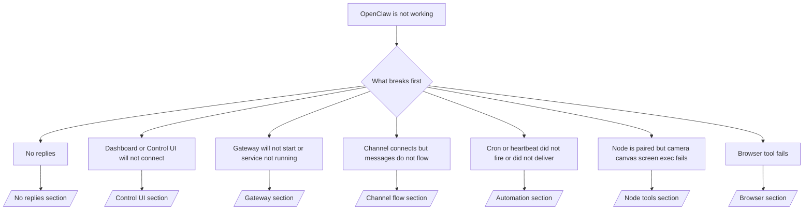

---
read_when:
    - OpenClaw가 작동하지 않으며 가장 빠른 해결 경로가 필요합니다.
    - 심층 런북으로 들어가기 전에 먼저 트리아지 흐름이 필요합니다.
summary: OpenClaw용 증상 우선 문제 해결 허브
title: 일반 문제 해결
x-i18n:
    generated_at: "2026-04-11T02:46:03Z"
    model: gpt-5.4
    provider: openai
    source_hash: 16b38920dbfdc8d4a79bbb5d6fab2c67c9f218a97c36bb4695310d7db9c4614a
    source_path: help/troubleshooting.md
    workflow: 15
---

# 문제 해결

시간이 2분밖에 없다면, 이 페이지를 트리아지 시작점으로 사용하세요.

## 처음 60초

다음 정확한 순서로 실행하세요.

```bash
openclaw status
openclaw status --all
openclaw gateway probe
openclaw gateway status
openclaw doctor
openclaw channels status --probe
openclaw logs --follow
```

좋은 출력의 한 줄 요약:

- `openclaw status` → 구성된 채널이 표시되고 명백한 인증 오류가 없습니다.
- `openclaw status --all` → 전체 보고서가 존재하며 공유할 수 있습니다.
- `openclaw gateway probe` → 예상한 gateway 대상에 도달할 수 있습니다(`Reachable: yes`). `RPC: limited - missing scope: operator.read`는 연결 실패가 아니라 제한된 진단 상태입니다.
- `openclaw gateway status` → `Runtime: running` 및 `RPC probe: ok`.
- `openclaw doctor` → 차단하는 config/service 오류가 없습니다.
- `openclaw channels status --probe` → 도달 가능한 gateway는 라이브 계정별
  전송 상태와 `works` 또는 `audit ok` 같은 probe/audit 결과를 반환합니다. gateway에
  도달할 수 없으면, 이 명령은 config 전용 요약으로 대체됩니다.
- `openclaw logs --follow` → 안정적인 활동이 보이고 반복되는 치명적 오류가 없습니다.

## Anthropic 긴 컨텍스트 429

다음이 보이면:
`HTTP 429: rate_limit_error: Extra usage is required for long context requests`
[/gateway/troubleshooting#anthropic-429-extra-usage-required-for-long-context](/ko/gateway/troubleshooting#anthropic-429-extra-usage-required-for-long-context)로 이동하세요.

## 로컬 OpenAI 호환 백엔드는 직접 호출하면 작동하지만 OpenClaw에서는 실패함

로컬 또는 self-hosted `/v1` 백엔드가 작은 직접
`/v1/chat/completions` probe에는 응답하지만 `openclaw infer model run` 또는 일반
에이전트 턴에서는 실패하는 경우:

1. 오류에 `messages[].content`가 문자열이어야 한다는 내용이 있으면
   `models.providers.<provider>.models[].compat.requiresStringContent: true`를 설정하세요.
2. 백엔드가 여전히 OpenClaw 에이전트 턴에서만 실패한다면
   `models.providers.<provider>.models[].compat.supportsTools: false`를 설정하고 다시 시도하세요.
3. 아주 작은 직접 호출은 여전히 작동하지만 더 큰 OpenClaw 프롬프트에서 백엔드가 충돌한다면
   남은 문제는 업스트림 모델/서버 제한으로 보고 심층 런북으로 계속 진행하세요:
   [/gateway/troubleshooting#local-openai-compatible-backend-passes-direct-probes-but-agent-runs-fail](/ko/gateway/troubleshooting#local-openai-compatible-backend-passes-direct-probes-but-agent-runs-fail)

## 플러그인 설치가 누락된 openclaw extensions 오류로 실패함

설치가 `package.json missing openclaw.extensions`로 실패하면, 플러그인 패키지가
OpenClaw가 더 이상 허용하지 않는 오래된 형식을 사용하고 있는 것입니다.

플러그인 패키지에서 다음과 같이 수정하세요.

1. `package.json`에 `openclaw.extensions`를 추가합니다.
2. 엔트리가 빌드된 런타임 파일(보통 `./dist/index.js`)을 가리키도록 합니다.
3. 플러그인을 다시 배포한 후 `openclaw plugins install <package>`를 다시 실행합니다.

예시:

```json
{
  "name": "@openclaw/my-plugin",
  "version": "1.2.3",
  "openclaw": {
    "extensions": ["./dist/index.js"]
  }
}
```

참조: [Plugin architecture](/ko/plugins/architecture)

## 결정 트리



<AccordionGroup>
  <Accordion title="응답 없음">
    ```bash
    openclaw status
    openclaw gateway status
    openclaw channels status --probe
    openclaw pairing list --channel <channel> [--account <id>]
    openclaw logs --follow
    ```

    좋은 출력 예시:

    - `Runtime: running`
    - `RPC probe: ok`
    - 채널에 전송 연결 상태가 표시되고, 지원되는 경우 `channels status --probe`에 `works` 또는 `audit ok`가 표시됨
    - 발신자가 승인된 상태로 표시됨(또는 DM 정책이 open/allowlist)

    일반적인 로그 시그니처:

    - `drop guild message (mention required` → Discord에서 멘션 게이팅이 메시지를 차단했습니다.
    - `pairing request` → 발신자가 승인되지 않았고 DM 페어링 승인을 기다리고 있습니다.
    - 채널 로그의 `blocked` / `allowlist` → 발신자, 룸 또는 그룹이 필터링되었습니다.

    심층 페이지:

    - [/gateway/troubleshooting#no-replies](/ko/gateway/troubleshooting#no-replies)
    - [/channels/troubleshooting](/ko/channels/troubleshooting)
    - [/channels/pairing](/ko/channels/pairing)

  </Accordion>

  <Accordion title="Dashboard 또는 Control UI가 연결되지 않음">
    ```bash
    openclaw status
    openclaw gateway status
    openclaw logs --follow
    openclaw doctor
    openclaw channels status --probe
    ```

    좋은 출력 예시:

    - `openclaw gateway status`에 `Dashboard: http://...`가 표시됨
    - `RPC probe: ok`
    - 로그에 인증 루프가 없음

    일반적인 로그 시그니처:

    - `device identity required` → HTTP/비보안 컨텍스트에서는 디바이스 인증을 완료할 수 없습니다.
    - `origin not allowed` → 브라우저 `Origin`이 Control UI
      gateway 대상에서 허용되지 않습니다.
    - 재시도 힌트가 있는 `AUTH_TOKEN_MISMATCH` (`canRetryWithDeviceToken=true`) → 신뢰된 device-token 재시도 1회가 자동으로 발생할 수 있습니다.
    - 해당 캐시된 토큰 재시도는 페어링된 device token과 함께 저장된 캐시된 scope 집합을 재사용합니다. 명시적 `deviceToken` / 명시적 `scopes` 호출자는 요청한 scope 집합을 그대로 유지합니다.
    - 비동기 Tailscale Serve Control UI 경로에서는 동일한
      `{scope, ip}`에 대한 실패한 시도가 limiter가 실패를 기록하기 전에 직렬화되므로,
      두 번째 동시 잘못된 재시도는 이미 `retry later`를 표시할 수 있습니다.
    - localhost 브라우저 origin에서의 `too many failed authentication attempts (retry later)` → 같은 `Origin`에서 반복 실패가 발생해 일시적으로 차단된 상태이며, 다른 localhost origin은 별도 버킷을 사용합니다.
    - 그 재시도 이후에도 반복되는 `unauthorized` → 잘못된 토큰/비밀번호, 인증 모드 불일치, 또는 오래된 페어링된 device token입니다.
    - `gateway connect failed:` → UI가 잘못된 URL/포트를 대상으로 하거나 gateway에 도달할 수 없습니다.

    심층 페이지:

    - [/gateway/troubleshooting#dashboard-control-ui-connectivity](/ko/gateway/troubleshooting#dashboard-control-ui-connectivity)
    - [/web/control-ui](/web/control-ui)
    - [/gateway/authentication](/ko/gateway/authentication)

  </Accordion>

  <Accordion title="Gateway가 시작되지 않거나 서비스가 설치되어 있지만 실행되지 않음">
    ```bash
    openclaw status
    openclaw gateway status
    openclaw logs --follow
    openclaw doctor
    openclaw channels status --probe
    ```

    좋은 출력 예시:

    - `Service: ... (loaded)`
    - `Runtime: running`
    - `RPC probe: ok`

    일반적인 로그 시그니처:

    - `Gateway start blocked: set gateway.mode=local` 또는 `existing config is missing gateway.mode` → gateway 모드가 remote이거나, config 파일에 local-mode 표시가 없어 복구가 필요합니다.
    - `refusing to bind gateway ... without auth` → 유효한 gateway 인증 경로(token/password 또는 구성된 경우 trusted-proxy) 없이 non-loopback bind를 시도했습니다.
    - `another gateway instance is already listening` 또는 `EADDRINUSE` → 포트가 이미 사용 중입니다.

    심층 페이지:

    - [/gateway/troubleshooting#gateway-service-not-running](/ko/gateway/troubleshooting#gateway-service-not-running)
    - [/gateway/background-process](/ko/gateway/background-process)
    - [/gateway/configuration](/ko/gateway/configuration)

  </Accordion>

  <Accordion title="채널은 연결되지만 메시지가 흐르지 않음">
    ```bash
    openclaw status
    openclaw gateway status
    openclaw logs --follow
    openclaw doctor
    openclaw channels status --probe
    ```

    좋은 출력 예시:

    - 채널 전송이 연결되어 있습니다.
    - pairing/allowlist 검사를 통과합니다.
    - 필요한 경우 멘션이 감지됩니다.

    일반적인 로그 시그니처:

    - `mention required` → 그룹 멘션 게이팅이 처리를 차단했습니다.
    - `pairing` / `pending` → DM 발신자가 아직 승인되지 않았습니다.
    - `not_in_channel`, `missing_scope`, `Forbidden`, `401/403` → 채널 권한 토큰 문제입니다.

    심층 페이지:

    - [/gateway/troubleshooting#channel-connected-messages-not-flowing](/ko/gateway/troubleshooting#channel-connected-messages-not-flowing)
    - [/channels/troubleshooting](/ko/channels/troubleshooting)

  </Accordion>

  <Accordion title="Cron 또는 heartbeat가 실행되지 않았거나 전달되지 않음">
    ```bash
    openclaw status
    openclaw gateway status
    openclaw cron status
    openclaw cron list
    openclaw cron runs --id <jobId> --limit 20
    openclaw logs --follow
    ```

    좋은 출력 예시:

    - `cron.status`에 활성화 상태와 다음 wake가 표시됨
    - `cron runs`에 최근 `ok` 항목이 표시됨
    - heartbeat가 활성화되어 있고 활성 시간대 밖이 아님

    일반적인 로그 시그니처:

    - `cron: scheduler disabled; jobs will not run automatically` → cron이 비활성화되어 있습니다.
    - `heartbeat skipped` with `reason=quiet-hours` → 구성된 활성 시간대 밖입니다.
    - `heartbeat skipped` with `reason=empty-heartbeat-file` → `HEARTBEAT.md`가 존재하지만 빈 내용이거나 헤더만 있는 골격만 포함합니다.
    - `heartbeat skipped` with `reason=no-tasks-due` → `HEARTBEAT.md` 작업 모드가 활성화되어 있지만 아직 도래한 작업 간격이 없습니다.
    - `heartbeat skipped` with `reason=alerts-disabled` → heartbeat 가시성이 모두 비활성화되어 있습니다(`showOk`, `showAlerts`, `useIndicator`가 모두 꺼짐).
    - `requests-in-flight` → 메인 레인이 바쁩니다. heartbeat wake가 연기되었습니다.
    - `unknown accountId` → heartbeat 전달 대상 account가 존재하지 않습니다.

    심층 페이지:

    - [/gateway/troubleshooting#cron-and-heartbeat-delivery](/ko/gateway/troubleshooting#cron-and-heartbeat-delivery)
    - [/automation/cron-jobs#troubleshooting](/ko/automation/cron-jobs#troubleshooting)
    - [/gateway/heartbeat](/ko/gateway/heartbeat)

    </Accordion>

    <Accordion title="Node는 페어링되었지만 도구의 camera canvas screen exec가 실패함">
      ```bash
      openclaw status
      openclaw gateway status
      openclaw nodes status
      openclaw nodes describe --node <idOrNameOrIp>
      openclaw logs --follow
      ```

      좋은 출력 예시:

      - Node가 `node` 역할로 연결되고 페어링된 상태로 표시됩니다.
      - 호출하는 명령에 대한 capability가 존재합니다.
      - 도구에 대한 permission 상태가 허용됨입니다.

      일반적인 로그 시그니처:

      - `NODE_BACKGROUND_UNAVAILABLE` → node 앱을 전경으로 가져오세요.
      - `*_PERMISSION_REQUIRED` → OS 권한이 거부되었거나 없습니다.
      - `SYSTEM_RUN_DENIED: approval required` → exec 승인이 대기 중입니다.
      - `SYSTEM_RUN_DENIED: allowlist miss` → 명령이 exec allowlist에 없습니다.

      심층 페이지:

      - [/gateway/troubleshooting#node-paired-tool-fails](/ko/gateway/troubleshooting#node-paired-tool-fails)
      - [/nodes/troubleshooting](/ko/nodes/troubleshooting)
      - [/tools/exec-approvals](/ko/tools/exec-approvals)

    </Accordion>

    <Accordion title="Exec이 갑자기 승인을 요청함">
      ```bash
      openclaw config get tools.exec.host
      openclaw config get tools.exec.security
      openclaw config get tools.exec.ask
      openclaw gateway restart
      ```

      변경된 내용:

      - `tools.exec.host`가 설정되지 않으면 기본값은 `auto`입니다.
      - `host=auto`는 샌드박스 런타임이 활성화되어 있으면 `sandbox`로, 그렇지 않으면 `gateway`로 해석됩니다.
      - `host=auto`는 라우팅만 담당합니다. 프롬프트 없는 "YOLO" 동작은 gateway/node의 `security=full`과 `ask=off`에서 옵니다.
      - `gateway`와 `node`에서는 `tools.exec.security`가 설정되지 않으면 기본값은 `full`입니다.
      - `tools.exec.ask`가 설정되지 않으면 기본값은 `off`입니다.
      - 결과적으로 지금 승인이 보인다면, 일부 호스트 로컬 또는 세션별 정책이 현재 기본값보다 더 엄격하게 exec를 제한한 것입니다.

      현재 기본 no-approval 동작 복원:

      ```bash
      openclaw config set tools.exec.host gateway
      openclaw config set tools.exec.security full
      openclaw config set tools.exec.ask off
      openclaw gateway restart
      ```

      더 안전한 대안:

      - 안정적인 호스트 라우팅만 원한다면 `tools.exec.host=gateway`만 설정하세요.
      - 호스트 exec는 사용하되 allowlist 미스는 검토하고 싶다면 `security=allowlist`와 `ask=on-miss`를 사용하세요.
      - `host=auto`가 다시 `sandbox`로 해석되길 원한다면 sandbox 모드를 활성화하세요.

      일반적인 로그 시그니처:

      - `Approval required.` → 명령이 `/approve ...` 승인을 기다리고 있습니다.
      - `SYSTEM_RUN_DENIED: approval required` → node-host exec 승인이 대기 중입니다.
      - `exec host=sandbox requires a sandbox runtime for this session` → 암시적/명시적 sandbox 선택이 되었지만 sandbox 모드가 꺼져 있습니다.

      심층 페이지:

      - [/tools/exec](/ko/tools/exec)
      - [/tools/exec-approvals](/ko/tools/exec-approvals)
      - [/gateway/security#what-the-audit-checks-high-level](/ko/gateway/security#what-the-audit-checks-high-level)

    </Accordion>

    <Accordion title="Browser 도구 실패">
      ```bash
      openclaw status
      openclaw gateway status
      openclaw browser status
      openclaw logs --follow
      openclaw doctor
      ```

      좋은 출력 예시:

      - Browser 상태에 `running: true`와 선택된 browser/profile이 표시됩니다.
      - `openclaw`가 시작되거나, `user`가 로컬 Chrome 탭을 볼 수 있습니다.

      일반적인 로그 시그니처:

      - `unknown command "browser"` 또는 `unknown command 'browser'` → `plugins.allow`가 설정되어 있으며 `browser`가 포함되어 있지 않습니다.
      - `Failed to start Chrome CDP on port` → 로컬 browser 실행에 실패했습니다.
      - `browser.executablePath not found` → 구성된 바이너리 경로가 잘못되었습니다.
      - `browser.cdpUrl must be http(s) or ws(s)` → 구성된 CDP URL이 지원되지 않는 스킴을 사용하고 있습니다.
      - `browser.cdpUrl has invalid port` → 구성된 CDP URL의 포트가 잘못되었거나 범위를 벗어났습니다.
      - `No Chrome tabs found for profile="user"` → Chrome MCP attach profile에 열린 로컬 Chrome 탭이 없습니다.
      - `Remote CDP for profile "<name>" is not reachable` → 구성된 원격 CDP 엔드포인트에 이 호스트에서 도달할 수 없습니다.
      - `Browser attachOnly is enabled ... not reachable` 또는 `Browser attachOnly is enabled and CDP websocket ... is not reachable` → attach-only profile에 활성 CDP 대상이 없습니다.
      - attach-only 또는 원격 CDP profile에서 viewport / dark-mode / locale / offline 재정의가 오래 유지되는 경우 → `openclaw browser stop --browser-profile <name>`을 실행해 활성 제어 세션을 닫고 gateway를 재시작하지 않고도 에뮬레이션 상태를 해제하세요.

      심층 페이지:

      - [/gateway/troubleshooting#browser-tool-fails](/ko/gateway/troubleshooting#browser-tool-fails)
      - [/tools/browser#missing-browser-command-or-tool](/ko/tools/browser#missing-browser-command-or-tool)
      - [/tools/browser-linux-troubleshooting](/ko/tools/browser-linux-troubleshooting)
      - [/tools/browser-wsl2-windows-remote-cdp-troubleshooting](/ko/tools/browser-wsl2-windows-remote-cdp-troubleshooting)

    </Accordion>

  </AccordionGroup>

## 관련 항목

- [FAQ](/ko/help/faq) — 자주 묻는 질문
- [Gateway Troubleshooting](/ko/gateway/troubleshooting) — gateway 관련 문제
- [Doctor](/ko/gateway/doctor) — 자동 상태 점검 및 복구
- [Channel Troubleshooting](/ko/channels/troubleshooting) — 채널 연결 문제
- [Automation Troubleshooting](/ko/automation/cron-jobs#troubleshooting) — cron 및 heartbeat 문제
