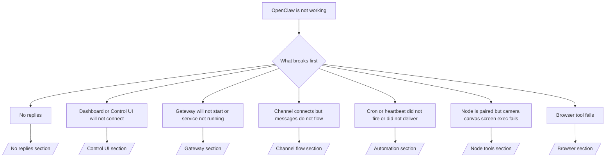

---
read_when:
    - OpenClaw가 작동하지 않으며 가장 빠르게 해결할 방법이 필요합니다
    - 심층 런북으로 들어가기 전에 트리아지 흐름이 필요합니다
summary: OpenClaw를 위한 증상 우선 문제 해결 허브
title: 일반 문제 해결
x-i18n:
    generated_at: "2026-06-27T17:35:02Z"
    model: gpt-5.5
    postprocess_version: locale-links-v1
    provider: openai
    source_hash: ae1236c73e3a5c9237bd81d603e8dca18c595a8bcbb71f5931bfbf2389b342cd
    source_path: help/troubleshooting.md
    workflow: 16
---

시간이 2분밖에 없다면, 이 페이지를 분류용 첫 관문으로 사용하세요.

## 첫 60초

다음 단계를 정확히 순서대로 실행하세요.

```bash
openclaw status
openclaw status --all
openclaw gateway probe
openclaw gateway status
openclaw doctor
openclaw channels status --probe
openclaw logs --follow
```

좋은 출력은 한 줄로 다음과 같습니다.

- `openclaw status` → 구성된 채널이 표시되고 명백한 인증 오류가 없습니다.
- `openclaw status --all` → 전체 보고서가 있고 공유할 수 있습니다.
- `openclaw gateway probe` → 예상 Gateway 대상에 연결할 수 있습니다(`Reachable: yes`). `Capability: ...`는 프로브가 증명할 수 있었던 인증 수준을 알려 주며, `Read probe: limited - missing scope: operator.read`는 연결 실패가 아니라 성능이 저하된 진단입니다.
- `openclaw gateway status` → `Runtime: running`, `Connectivity probe: ok`, 그리고 그럴듯한 `Capability: ...` 줄이 있습니다. 읽기 범위 RPC 증명도 필요하면 `--require-rpc`를 사용하세요.
- `openclaw doctor` → 차단되는 구성/서비스 오류가 없습니다.
- `openclaw channels status --probe` → 연결 가능한 Gateway는 계정별 실시간
  전송 상태와 `works` 또는 `audit ok` 같은 프로브/감사 결과를 반환합니다. Gateway에
  연결할 수 없으면, 이 명령은 구성 전용 요약으로 대체됩니다.
- `openclaw logs --follow` → 활동이 안정적이며 치명적인 오류가 반복되지 않습니다.

## Assistant가 제한적이거나 도구가 누락된 것처럼 느껴짐

Assistant가 파일을 검사하거나, 명령을 실행하거나, 브라우저 자동화를 사용하거나,
예상 도구를 볼 수 없다면 먼저 유효한 도구 프로필을 확인하세요.

```bash
openclaw status
openclaw status --all
openclaw doctor
```

일반적인 원인:

- `tools.profile: "messaging"`은 채팅 전용 에이전트를 위해 의도적으로 좁게 설정된 프로필입니다.
- `tools.profile: "coding"`은 저장소, 파일, 셸,
  런타임 워크플로에 일반적으로 사용하는 프로필입니다.
- `tools.profile: "full"`은 가장 넓은 도구 집합을 노출하므로
  신뢰할 수 있는 운영자 제어 에이전트로 제한해야 합니다.
- 에이전트별 `agents.list[].tools` 재정의는 한 에이전트의 루트
  프로필을 좁히거나 확장할 수 있습니다.

루트 또는 에이전트별 도구 프로필을 변경한 다음 Gateway를 재시작하거나 다시 로드하고
`openclaw status --all`을 다시 실행하세요. 프로필 모델과 허용/거부 재정의는
[도구](/ko/tools)를 참고하세요.

## Anthropic 긴 컨텍스트 429

다음이 표시되면:
`HTTP 429: rate_limit_error: Extra usage is required for long context requests`,
[/gateway/troubleshooting#anthropic-429-extra-usage-required-for-long-context](/ko/gateway/troubleshooting#anthropic-429-extra-usage-required-for-long-context)로 이동하세요.

## 로컬 OpenAI 호환 백엔드는 직접 작동하지만 OpenClaw에서는 실패함

로컬 또는 자체 호스팅 `/v1` 백엔드가 작은 직접
`/v1/chat/completions` 프로브에는 응답하지만 `openclaw infer model run` 또는 일반
에이전트 턴에서 실패하는 경우:

1. 오류에서 `messages[].content`가 문자열을 예상한다고 언급하면
   `models.providers.<provider>.models[].compat.requiresStringContent: true`를 설정하세요.
2. 백엔드가 여전히 OpenClaw 에이전트 턴에서만 실패하면
   `models.providers.<provider>.models[].compat.supportsTools: false`를 설정하고 다시 시도하세요.
3. 작은 직접 호출은 여전히 작동하지만 더 큰 OpenClaw 프롬프트에서
   백엔드가 중단되면, 남은 문제를 업스트림 모델/서버 제한으로 취급하고
   심층 런북으로 계속 진행하세요.
   [/gateway/troubleshooting#local-openai-compatible-backend-passes-direct-probes-but-agent-runs-fail](/ko/gateway/troubleshooting#local-openai-compatible-backend-passes-direct-probes-but-agent-runs-fail)

## Plugin 설치가 openclaw extensions 누락으로 실패함

설치가 `package.json missing openclaw.extensions`로 실패하면, 해당 plugin 패키지는
OpenClaw가 더 이상 허용하지 않는 이전 구조를 사용하고 있는 것입니다.

plugin 패키지에서 수정하세요.

1. `package.json`에 `openclaw.extensions`를 추가합니다.
2. 항목이 빌드된 런타임 파일(일반적으로 `./dist/index.js`)을 가리키도록 합니다.
3. plugin을 다시 게시하고 `openclaw plugins install <package>`를 다시 실행합니다.

예시:

```json
{
  "name": "@openclaw/my-plugin",
  "version": "1.2.3",
  "openclaw": {
    "extensions": ["./dist/index.js"]
  }
}
```

참고: [Plugin 아키텍처](/ko/plugins/architecture)

## 설치 정책이 plugin 설치 또는 업데이트를 차단함

업데이트가 완료되었지만 plugin이 오래되었거나 비활성화되었거나
`blocked by install policy`, `install policy failed closed`, 또는
`Disabled "<plugin>" after plugin update failure` 같은 메시지가 표시되면
`security.installPolicy`를 확인하세요.

설치 정책은 plugin 설치 및 업데이트 중 실행됩니다. OpenClaw 소유 plugin
버전은 일반적으로 OpenClaw 릴리스와 함께 이동하므로, OpenClaw 업데이트에는
업데이트 후 동기화 중 일치하는 `@openclaw/*` plugin 업데이트도 필요할 수 있습니다.

일치하는 업그레이드 규칙도 유지 관리하지 않는 한, 다음과 같은 광범위한 정책 형태는 피하세요.

- OpenClaw 소유 plugin을 `@openclaw/*@2026.5.3`만 허용하는 식으로
  정확히 하나의 오래된 버전에 고정합니다.
- 모든 npm, 네트워크 또는
  `request.mode: "update"` plugin 요청처럼 소스 종류만으로 차단합니다.
- 정책 명령을 선택 사항으로 취급합니다. `security.installPolicy`가
  활성화되어 있으면, 누락되었거나 느리거나 읽을 수 없거나 권한으로 차단된 정책 실행 파일은
  실패 시 차단됩니다.
- 정책 요청의 `openclawVersion`과 plugin 후보 메타데이터를
  고려하지 않고 plugin 버전을 승인합니다.

더 안전한 정책 규칙은 단일 릴리스를 영구히 고정하는 대신, 후보가 현재 OpenClaw 호스트와
호환될 때 신뢰할 수 있는 OpenClaw 소유 plugin 업데이트를 허용합니다. 기본적으로 npm을 차단하는 경우,
사용하는 신뢰할 수 있는 `@openclaw/*` plugin 패키지 또는 plugin ID에 좁은 예외를 만드세요.
설치 요청과 업데이트 요청을 구분한다면 동일한 신뢰 규칙을
`request.mode: "update"`에도 적용하세요.

복구:

```bash
openclaw doctor --deep
openclaw plugins update --all
openclaw status --all
```

정책이 의도적으로 엄격한 경우, 신뢰할 수 있는 OpenClaw 업그레이드
기간 동안 완화하고 `openclaw plugins update --all`을 다시 실행한 뒤 더 엄격한 규칙을 복원하세요.
업데이트 실패 후 plugin이 비활성화된 경우, 검사한 뒤
업데이트가 성공한 후에만 다시 활성화하세요.

```bash
openclaw plugins inspect <plugin-id> --runtime --json
openclaw plugins enable <plugin-id>
```

참고: [운영자 설치 정책](/ko/tools/skills-config#operator-install-policy-securityinstallpolicy)

## Plugin이 있지만 의심스러운 소유권으로 차단됨

`openclaw doctor`, 설정 또는 시작 경고에 다음이 표시되면:

```text
blocked plugin candidate: suspicious ownership (... uid=1000, expected uid=0 or root)
plugin present but blocked
```

plugin 파일을 로드하는 프로세스와 다른 Unix 사용자가 해당 파일을 소유하고 있는 것입니다.
plugin 구성을 제거하지 마세요. 파일 소유권을 수정하거나 상태 디렉터리를 소유한
동일한 사용자로 OpenClaw를 실행하세요.

Docker 설치는 일반적으로 `node`(uid `1000`)로 실행됩니다. 기본 Docker
설정에서는 호스트 바인드 마운트를 복구하세요.

```bash
sudo chown -R 1000:1000 /path/to/openclaw-config /path/to/openclaw-workspace
openclaw doctor --fix
```

의도적으로 OpenClaw를 root로 실행하는 경우, 관리되는 plugin 루트를
root 소유권으로 대신 복구하세요.

```bash
sudo chown -R root:root /path/to/openclaw-config/npm
openclaw doctor --fix
```

심층 문서:

- [Plugin 경로 소유권](/ko/tools/plugin#blocked-plugin-path-ownership)
- [Docker 권한](/ko/install/docker#permissions-and-eacces)

## 결정 트리



<AccordionGroup>
  <Accordion title="No replies">
    ```bash
    openclaw status
    openclaw gateway status
    openclaw channels status --probe
    openclaw pairing list --channel <channel> [--account <id>]
    openclaw logs --follow
    ```

    좋은 출력은 다음과 같습니다.

    - `Runtime: running`
    - `Connectivity probe: ok`
    - `Capability: read-only`, `write-capable`, 또는 `admin-capable`
    - 채널에 전송 연결됨이 표시되고, 지원되는 경우 `channels status --probe`에 `works` 또는 `audit ok`가 표시됩니다.
    - 보낸 사람이 승인된 것으로 표시됩니다(또는 DM 정책이 열림/허용 목록 상태입니다).

    일반적인 로그 시그니처:

    - `drop guild message (mention required` → Discord에서 멘션 게이트가 메시지를 차단했습니다.
    - `pairing request` → 보낸 사람이 승인되지 않았으며 DM 페어링 승인을 기다리는 중입니다.
    - 채널 로그의 `blocked` / `allowlist` → 보낸 사람, 방 또는 그룹이 필터링되었습니다.

    심층 페이지:

    - [/gateway/troubleshooting#no-replies](/ko/gateway/troubleshooting#no-replies)
    - [/channels/troubleshooting](/ko/channels/troubleshooting)
    - [/channels/pairing](/ko/channels/pairing)

  </Accordion>

  <Accordion title="Dashboard or Control UI will not connect">
    ```bash
    openclaw status
    openclaw gateway status
    openclaw logs --follow
    openclaw doctor
    openclaw channels status --probe
    ```

    좋은 출력은 다음과 같습니다.

    - `openclaw gateway status`에 `Dashboard: http://...`가 표시됩니다.
    - `Connectivity probe: ok`
    - `Capability: read-only`, `write-capable`, 또는 `admin-capable`
    - 로그에 인증 루프가 없습니다.

    일반적인 로그 시그니처:

    - `device identity required` → HTTP/비보안 컨텍스트에서는 기기 인증을 완료할 수 없습니다.
    - `origin not allowed` → 브라우저 `Origin`이 Control UI
      Gateway 대상에 허용되지 않았습니다.
    - 재시도 힌트(`canRetryWithDeviceToken=true`)가 있는 `AUTH_TOKEN_MISMATCH` → 신뢰할 수 있는 기기 토큰 재시도가 한 번 자동으로 발생할 수 있습니다.
    - 해당 캐시된 토큰 재시도는 페어링된
      기기 토큰과 함께 저장된 캐시된 범위 집합을 재사용합니다. 명시적 `deviceToken` / 명시적 `scopes` 호출자는
      요청한 범위 집합을 그대로 유지합니다.
    - 비동기 Tailscale Serve Control UI 경로에서는 동일한
      `{scope, ip}`에 대한 실패 시도가 리미터가 실패를 기록하기 전에 직렬화되므로,
      두 번째 동시 불량 재시도에는 이미 `retry later`가 표시될 수 있습니다.
    - localhost
      브라우저 origin에서 온 `too many failed authentication attempts (retry later)` → 동일한 `Origin`에서 반복된 실패가 일시적으로
      잠깁니다. 다른 localhost origin은 별도의 버킷을 사용합니다.
    - 그 재시도 후 반복되는 `unauthorized` → 잘못된 토큰/비밀번호, 인증 모드 불일치 또는 오래된 페어링 기기 토큰입니다.
    - `gateway connect failed:` → UI가 잘못된 URL/포트를 대상으로 하거나 Gateway에 연결할 수 없습니다.

    심층 페이지:

    - [/gateway/troubleshooting#dashboard-control-ui-connectivity](/ko/gateway/troubleshooting#dashboard-control-ui-connectivity)
    - [/web/control-ui](/ko/web/control-ui)
    - [/gateway/authentication](/ko/gateway/authentication)

  </Accordion>

  <Accordion title="Gateway will not start or service installed but not running">
    ```bash
    openclaw status
    openclaw gateway status
    openclaw logs --follow
    openclaw doctor
    openclaw channels status --probe
    ```

    좋은 출력은 다음과 같습니다.

    - `Service: ... (loaded)`
    - `Runtime: running`
    - `Connectivity probe: ok`
    - `Capability: read-only`, `write-capable`, 또는 `admin-capable`

    일반적인 로그 시그니처:

    - `Gateway start blocked: set gateway.mode=local` 또는 `existing config is missing gateway.mode` → Gateway 모드가 remote이거나, 구성 파일에 로컬 모드 스탬프가 없으며 복구해야 합니다.
    - `refusing to bind gateway ... without auth` → 유효한 Gateway 인증 경로(토큰/비밀번호 또는 구성된 경우 trusted-proxy) 없이 local loopback이 아닌 주소에 바인드하려고 했습니다.
    - `another gateway instance is already listening` 또는 `EADDRINUSE` → 포트가 이미 사용 중입니다.

    심층 페이지:

    - [/gateway/troubleshooting#gateway-service-not-running](/ko/gateway/troubleshooting#gateway-service-not-running)
    - [/gateway/background-process](/ko/gateway/background-process)
    - [/gateway/configuration](/ko/gateway/configuration)

  </Accordion>

  <Accordion title="채널이 연결되지만 메시지가 흐르지 않음">
    ```bash
    openclaw status
    openclaw gateway status
    openclaw logs --follow
    openclaw doctor
    openclaw channels status --probe
    ```

    올바른 출력은 다음과 같습니다.

    - 채널 전송이 연결되어 있습니다.
    - 페어링/허용 목록 검사를 통과합니다.
    - 필요한 위치에서 멘션이 감지됩니다.

    일반적인 로그 시그니처:

    - `mention required` → 그룹 멘션 게이트가 처리를 차단했습니다.
    - `pairing` / `pending` → DM 발신자가 아직 승인되지 않았습니다.
    - `not_in_channel`, `missing_scope`, `Forbidden`, `401/403` → 채널 권한 토큰 문제입니다.

    자세한 페이지:

    - [/gateway/troubleshooting#channel-connected-messages-not-flowing](/ko/gateway/troubleshooting#channel-connected-messages-not-flowing)
    - [/channels/troubleshooting](/ko/channels/troubleshooting)

  </Accordion>

  <Accordion title="Cron 또는 Heartbeat가 실행되지 않았거나 전달되지 않음">
    ```bash
    openclaw status
    openclaw gateway status
    openclaw cron status
    openclaw cron list
    openclaw cron runs --id <jobId> --limit 20
    openclaw logs --follow
    ```

    올바른 출력은 다음과 같습니다.

    - `cron.status`가 활성화 상태와 다음 깨우기를 표시합니다.
    - `cron runs`가 최근 `ok` 항목을 표시합니다.
    - Heartbeat가 활성화되어 있고 활성 시간 밖이 아닙니다.

    일반적인 로그 시그니처:

    - `cron: scheduler disabled; jobs will not run automatically` → cron이 비활성화되어 있습니다.
    - `heartbeat skipped`와 `reason=quiet-hours` → 구성된 활성 시간 밖입니다.
    - `heartbeat skipped`와 `reason=empty-heartbeat-file` → `HEARTBEAT.md`가 존재하지만 빈 줄, 주석, 헤더, 펜스 또는 빈 체크리스트 스캐폴딩만 포함합니다.
    - `heartbeat skipped`와 `reason=no-tasks-due` → `HEARTBEAT.md` 작업 모드가 활성화되어 있지만 아직 기한이 된 작업 간격이 없습니다.
    - `heartbeat skipped`와 `reason=alerts-disabled` → 모든 heartbeat 표시가 비활성화되어 있습니다(`showOk`, `showAlerts`, `useIndicator`가 모두 꺼져 있음).
    - `requests-in-flight` → 기본 레인이 사용 중이어서 heartbeat 깨우기가 지연되었습니다.
    - `unknown accountId` → heartbeat 전달 대상 계정이 존재하지 않습니다.

    자세한 페이지:

    - [/gateway/troubleshooting#cron-and-heartbeat-delivery](/ko/gateway/troubleshooting#cron-and-heartbeat-delivery)
    - [/automation/cron-jobs#troubleshooting](/ko/automation/cron-jobs#troubleshooting)
    - [/gateway/heartbeat](/ko/gateway/heartbeat)

  </Accordion>

  <Accordion title="Node가 페어링되었지만 도구가 camera canvas screen exec에서 실패함">
    ```bash
    openclaw status
    openclaw gateway status
    openclaw nodes status
    openclaw nodes describe --node <idOrNameOrIp>
    openclaw logs --follow
    ```

    올바른 출력은 다음과 같습니다.

    - Node가 `node` 역할로 연결 및 페어링된 것으로 표시됩니다.
    - 호출하는 명령에 대한 기능이 존재합니다.
    - 도구에 대한 권한 상태가 허용됨입니다.

    일반적인 로그 시그니처:

    - `NODE_BACKGROUND_UNAVAILABLE` → Node 앱을 포그라운드로 가져오세요.
    - `*_PERMISSION_REQUIRED` → OS 권한이 거부되었거나 없습니다.
    - `SYSTEM_RUN_DENIED: approval required` → exec 승인이 대기 중입니다.
    - `SYSTEM_RUN_DENIED: allowlist miss` → 명령이 exec 허용 목록에 없습니다.

    자세한 페이지:

    - [/gateway/troubleshooting#node-paired-tool-fails](/ko/gateway/troubleshooting#node-paired-tool-fails)
    - [/nodes/troubleshooting](/ko/nodes/troubleshooting)
    - [/tools/exec-approvals](/ko/tools/exec-approvals)

  </Accordion>

  <Accordion title="Exec가 갑자기 승인을 요청함">
    ```bash
    openclaw config get tools.exec.host
    openclaw config get tools.exec.security
    openclaw config get tools.exec.ask
    openclaw gateway restart
    ```

    변경된 내용:

    - `tools.exec.host`가 설정되지 않은 경우 기본값은 `auto`입니다.
    - `host=auto`는 샌드박스 런타임이 활성 상태이면 `sandbox`로, 그렇지 않으면 `gateway`로 해석됩니다.
    - `host=auto`는 라우팅만 담당합니다. 프롬프트 없는 "YOLO" 동작은 gateway/node에서 `security=full`과 `ask=off`를 함께 사용할 때 발생합니다.
    - `gateway`와 `node`에서 설정되지 않은 `tools.exec.security`의 기본값은 `full`입니다.
    - 설정되지 않은 `tools.exec.ask`의 기본값은 `off`입니다.
    - 결과: 승인이 표시된다면 일부 호스트 로컬 또는 세션별 정책이 현재 기본값보다 exec를 더 엄격하게 제한한 것입니다.

    현재 기본 승인 없음 동작 복원:

    ```bash
    openclaw config set tools.exec.host gateway
    openclaw config set tools.exec.security full
    openclaw config set tools.exec.ask off
    openclaw gateway restart
    ```

    더 안전한 대안:

    - 안정적인 호스트 라우팅만 원한다면 `tools.exec.host=gateway`만 설정하세요.
    - 호스트 exec를 사용하되 허용 목록 누락 시 검토를 원한다면 `security=allowlist`와 `ask=on-miss`를 사용하세요.
    - `host=auto`가 다시 `sandbox`로 해석되도록 하려면 샌드박스 모드를 활성화하세요.

    일반적인 로그 시그니처:

    - `Approval required.` → 명령이 `/approve ...`를 기다리고 있습니다.
    - `SYSTEM_RUN_DENIED: approval required` → Node 호스트 exec 승인이 대기 중입니다.
    - `exec host=sandbox requires a sandbox runtime for this session` → 암시적/명시적 샌드박스 선택이지만 샌드박스 모드가 꺼져 있습니다.

    자세한 페이지:

    - [/tools/exec](/ko/tools/exec)
    - [/tools/exec-approvals](/ko/tools/exec-approvals)
    - [/gateway/security#what-the-audit-checks-high-level](/ko/gateway/security#what-the-audit-checks-high-level)

  </Accordion>

  <Accordion title="브라우저 도구 실패">
    ```bash
    openclaw status
    openclaw gateway status
    openclaw browser status
    openclaw logs --follow
    openclaw doctor
    ```

    올바른 출력은 다음과 같습니다.

    - 브라우저 상태가 `running: true`와 선택된 브라우저/프로필을 표시합니다.
    - `openclaw`가 시작되거나 `user`가 로컬 Chrome 탭을 볼 수 있습니다.

    일반적인 로그 시그니처:

    - `unknown command "browser"` 또는 `unknown command 'browser'` → `plugins.allow`가 설정되어 있으며 `browser`를 포함하지 않습니다.
    - `Failed to start Chrome CDP on port` → 로컬 브라우저 실행에 실패했습니다.
    - `browser.executablePath not found` → 구성된 바이너리 경로가 잘못되었습니다.
    - `browser.cdpUrl must be http(s) or ws(s)` → 구성된 CDP URL이 지원되지 않는 스킴을 사용합니다.
    - `browser.cdpUrl has invalid port` → 구성된 CDP URL에 잘못되었거나 범위를 벗어난 포트가 있습니다.
    - `No Chrome tabs found for profile="user"` → Chrome MCP 연결 프로필에 열려 있는 로컬 Chrome 탭이 없습니다.
    - `Remote CDP for profile "<name>" is not reachable` → 구성된 원격 CDP 엔드포인트에 이 호스트에서 연결할 수 없습니다.
    - `Browser attachOnly is enabled ... not reachable` 또는 `Browser attachOnly is enabled and CDP websocket ... is not reachable` → 연결 전용 프로필에 활성 CDP 대상이 없습니다.
    - 연결 전용 또는 원격 CDP 프로필에서 오래된 뷰포트 / 다크 모드 / 로캘 / 오프라인 재정의 → gateway를 다시 시작하지 않고 활성 제어 세션을 닫고 에뮬레이션 상태를 해제하려면 `openclaw browser stop --browser-profile <name>`을 실행하세요.

    자세한 페이지:

    - [/gateway/troubleshooting#browser-tool-fails](/ko/gateway/troubleshooting#browser-tool-fails)
    - [/tools/browser#missing-browser-command-or-tool](/ko/tools/browser#missing-browser-command-or-tool)
    - [/tools/browser-linux-troubleshooting](/ko/tools/browser-linux-troubleshooting)
    - [/tools/browser-wsl2-windows-remote-cdp-troubleshooting](/ko/tools/browser-wsl2-windows-remote-cdp-troubleshooting)

  </Accordion>

</AccordionGroup>

## 관련 항목

- [FAQ](/ko/help/faq) — 자주 묻는 질문
- [Gateway 문제 해결](/ko/gateway/troubleshooting) — gateway별 문제
- [Doctor](/ko/gateway/doctor) — 자동화된 상태 검사 및 복구
- [채널 문제 해결](/ko/channels/troubleshooting) — 채널 연결 문제
- [자동화 문제 해결](/ko/automation/cron-jobs#troubleshooting) — cron 및 heartbeat 문제
