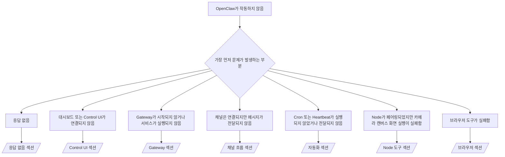

---
read_when:
    - OpenClaw이 작동하지 않아 가장 빠른 해결 방법이 필요한 경우
    - 심층 런북을 살펴보기 전에 트리아지 절차가 필요합니다
summary: OpenClaw을 위한 증상 우선 문제 해결 허브
title: 일반 문제 해결
x-i18n:
    generated_at: "2026-07-12T00:52:26Z"
    model: gpt-5.6
    postprocess_version: locale-links-v1
    provider: openai
    source_hash: db50e0cdf4d11f3aa6196be445358d904a2b9c40c89243f1b124c77167f6dd85
    source_path: help/troubleshooting.md
    workflow: 16
---

트리아지 시작점입니다. 2분 안에 진단한 다음 심층 페이지로 이동하세요.

## 첫 60초

다음 단계를 순서대로 실행하세요.

```bash
openclaw status
openclaw status --all
openclaw gateway probe
openclaw gateway status
openclaw doctor
openclaw channels status --probe
openclaw logs --follow
```

정상 출력은 각각 다음과 같습니다.

- `openclaw status`에 구성된 채널이 표시되고 인증 오류가 없습니다.
- `openclaw status --all`이 공유 가능한 전체 보고서를 생성합니다.
- `openclaw gateway probe`에 `Reachable: yes`가 표시됩니다. `Capability: ...`는 프로브로 확인된 인증 수준입니다. `Read probe: limited - missing scope:
operator.read`는 연결 실패가 아니라 진단 기능 저하를 의미합니다.
- `openclaw gateway status`에 `Runtime: running`, `Connectivity probe:
ok`, 합당한 `Capability: ...`가 표시됩니다. 읽기 범위 RPC 증명도 요구하려면 `--require-rpc`를 추가하세요.
- `openclaw doctor`가 차단을 유발하는 구성/서비스 오류를 보고하지 않습니다.
- Gateway에 연결할 수 있으면 `openclaw channels status --probe`가 계정별 실시간 전송 상태
  (`works` / `audit ok`)를 반환하고, 연결할 수 없으면
  구성 전용 요약으로 대체됩니다.
- `openclaw logs --follow`에 지속적인 활동이 표시되고 반복되는 치명적 오류가 없습니다.

## 어시스턴트의 기능이 제한적이거나 도구가 누락된 경우

실제로 적용되는 도구 프로필을 확인하세요.

```bash
openclaw status
openclaw status --all
openclaw doctor
```

일반적인 원인은 다음과 같습니다.

- `tools.profile: "minimal"`은 `session_status`만 허용합니다.
- `tools.profile: "messaging"`은 채팅 전용 에이전트를 위한 제한적인 프로필입니다.
- `tools.profile: "coding"`은 새 로컬 구성의 기본값입니다(저장소, 파일,
  셸 및 런타임 작업).
- `tools.profile: "full"`은 프로필 제한을 제거합니다. 신뢰할 수 있고
  운영자가 제어하는 에이전트에만 사용하세요.
- 에이전트별 `agents.list[].tools` 재정의는 특정 에이전트 하나에 대해
  루트 프로필을 축소하거나 확장합니다.

프로필을 변경하고 Gateway를 다시 시작하거나 다시 로드한 다음
`openclaw status --all`로 다시 확인하세요. 전체 프로필/그룹 표: [도구 프로필](/ko/gateway/config-tools#tool-profiles).

## Anthropic 긴 컨텍스트 429

`HTTP 429: rate_limit_error: Extra usage is required for long context requests`
→ [Anthropic 429: 긴 컨텍스트에 추가 사용량 필요](/ko/gateway/troubleshooting#anthropic-429-extra-usage-required-for-long-context).

## 로컬 OpenAI 호환 백엔드는 직접 호출하면 작동하지만 OpenClaw에서는 실패하는 경우

로컬/자체 호스팅 `/v1` 백엔드는 직접 `/v1/chat/completions`
프로브에 응답하지만 `openclaw infer model run` 또는 일반 에이전트 턴에서 실패합니다.

1. 문자열이 필요한 `messages[].content`를 오류에서 언급하면
   `models.providers.<provider>.models[].compat.requiresStringContent: true`로 설정하세요.
2. 여전히 OpenClaw 에이전트 턴에서만 실패하면
   `models.providers.<provider>.models[].compat.supportsTools: false`로 설정하고 다시 시도하세요.
3. 소규모 직접 호출은 작동하지만 더 큰 OpenClaw 프롬프트가 백엔드를 중단시키면
   OpenClaw 버그가 아니라 업스트림 모델/서버의 제한입니다.
   [로컬 OpenAI 호환 백엔드는 직접 프로브를 통과하지만 에이전트 실행은 실패함](/ko/gateway/troubleshooting#local-openai-compatible-backend-passes-direct-probes-but-agent-runs-fail)에서 계속 확인하세요.

## openclaw 확장이 없어 Plugin 설치가 실패하는 경우

`package.json missing openclaw.extensions`는 Plugin 패키지가
OpenClaw에서 더 이상 허용하지 않는 형식을 사용한다는 의미입니다.

Plugin 패키지에서 다음과 같이 수정하세요.

1. 빌드된 런타임 파일(일반적으로 `./dist/index.js`)을 가리키는
   `openclaw.extensions`를 `package.json`에 추가합니다.
2. 다시 게시한 다음 `openclaw plugins install <package>`를 다시 실행합니다.

```json
{
  "name": "@openclaw/my-plugin",
  "version": "1.2.3",
  "openclaw": {
    "extensions": ["./dist/index.js"]
  }
}
```

참고: [Plugin 아키텍처](/ko/plugins/architecture)

## 설치 정책이 Plugin 설치 또는 업데이트를 차단하는 경우

업데이트는 완료되지만 Plugin이 오래된 상태이거나 비활성화되거나 `blocked by install
policy`, `install policy failed closed`, 또는 `Disabled "<plugin>" after plugin
update failure`가 표시되면 `security.installPolicy`를 확인하세요.

설치 정책은 Plugin 설치 및 업데이트 시 실행됩니다. `@openclaw/*` Plugin
버전은 일반적으로 OpenClaw 릴리스와 함께 변경되므로 OpenClaw 업데이트 후
동기화 중에 그에 맞는 Plugin 업데이트가 필요할 수 있습니다.

일치하는 업그레이드 규칙도 관리하지 않는다면 다음 정책 형식을 피하세요.

- OpenClaw 소유 Plugin을 정확히 하나의 이전 버전으로 고정하는 방식(예:
  `@openclaw/*@2026.5.3`만 허용).
- 소스 종류만으로 차단하는 방식(모든 npm, 네트워크 또는 `request.mode:
"update"` 요청).
- 정책 명령을 선택 사항으로 취급하는 방식: `security.installPolicy`가
  활성화되면 정책 실행 파일이 없거나, 느리거나, 읽을 수 없거나, 권한으로
  차단될 경우 실패 시 차단됩니다.
- 요청의 `openclawVersion`을 Plugin 후보 메타데이터와 비교하지 않고
  버전을 승인하는 방식.

하나의 릴리스를 영구히 고정하는 대신 현재 호스트와 호환되는 신뢰할 수 있는
`@openclaw/*` 업데이트를 허용하는 규칙을 사용하세요. 기본적으로 npm을
차단한다면 사용하는 Plugin ID에만 적용되는 좁은 예외를 추가하고, 설치와
동일한 신뢰 규칙을 `request.mode: "update"`에도 적용하세요.

복구:

```bash
openclaw doctor --deep
openclaw plugins update --all
openclaw status --all
```

정책이 의도적으로 엄격한 경우 신뢰할 수 있는 업그레이드 기간에만 정책을
완화하고 `openclaw plugins update --all`을 다시 실행한 다음 더 엄격한 규칙을
복원하세요. 업데이트 실패로 Plugin이 비활성화된 경우 다시 활성화하기 전에
검사하세요.

```bash
openclaw plugins inspect <plugin-id> --runtime --json
openclaw plugins enable <plugin-id>
```

참고: [운영자 설치 정책](/ko/tools/skills-config#operator-install-policy-securityinstallpolicy)

## Plugin이 있지만 의심스러운 소유권 때문에 차단되는 경우

`openclaw doctor`, 설정 또는 시작 경고에 다음이 표시됩니다.

```text
blocked plugin candidate: suspicious ownership (... uid=1000, expected uid=0 or root)
plugin present but blocked
```

Plugin 파일의 소유 Unix 사용자가 해당 파일을 로드하는 프로세스의 사용자와
다릅니다. Plugin 구성을 제거하지 마세요. 파일 소유권을 수정하거나 상태
디렉터리를 소유한 사용자로 OpenClaw를 실행하세요.

Docker 설치는 `node`(uid `1000`)로 실행됩니다. 호스트 바인드 마운트를
수정하세요.

```bash
sudo chown -R 1000:1000 /path/to/openclaw-config /path/to/openclaw-workspace
openclaw doctor --fix
```

의도적으로 OpenClaw를 root로 실행하는 경우 대신 관리되는 Plugin 루트의
소유권을 수정하세요.

```bash
sudo chown -R root:root /path/to/openclaw-config/npm
openclaw doctor --fix
```

심층 문서: [차단된 Plugin 경로 소유권](/ko/tools/plugin#blocked-plugin-path-ownership), [Docker: 권한 및 EACCES](/ko/install/docker#shell-helpers-optional)

## 의사 결정 트리



<AccordionGroup>
  <Accordion title="응답 없음">
    ```bash
    openclaw status
    openclaw gateway status
    openclaw channels status --probe
    openclaw pairing list --channel <channel> [--account <id>]
    openclaw logs --follow
    ```

    정상 출력:

    - `Runtime: running`
    - `Connectivity probe: ok`
    - `Capability: read-only`, `write-capable` 또는 `admin-capable`
    - 채널 전송이 연결된 것으로 표시되고, 지원되는 경우 `channels status --probe`에
      `works` 또는 `audit ok`가 표시됨
    - 발신자가 승인됨(또는 DM 정책이 공개/허용 목록 방식임)

    로그 특징:

    - `drop guild message (mention required` → Discord 멘션 제한이 메시지를 차단했습니다.
    - `pairing request` → 발신자가 승인되지 않아 DM 페어링 승인을 기다리는 중입니다.
    - 채널 로그의 `blocked` / `allowlist` → 발신자, 대화방 또는 그룹이 필터링되었습니다.

    심층 페이지: [응답 없음](/ko/gateway/troubleshooting#no-replies), [채널 문제 해결](/ko/channels/troubleshooting), [페어링](/ko/channels/pairing)

  </Accordion>

  <Accordion title="대시보드 또는 Control UI가 연결되지 않음">
    ```bash
    openclaw status
    openclaw gateway status
    openclaw logs --follow
    openclaw doctor
    openclaw channels status --probe
    ```

    정상 출력:

    - `openclaw gateway status`에 `Dashboard: http://...`가 표시됨
    - `Connectivity probe: ok`
    - `Capability: read-only`, `write-capable` 또는 `admin-capable`
    - 로그에 인증 반복이 없음

    로그 특징:

    - `device identity required` → HTTP/비보안 컨텍스트에서는 기기 인증을 완료할 수 없습니다.
    - `origin not allowed` → 브라우저 `Origin`이 Control UI Gateway 대상에 허용되지 않습니다.
    - `canRetryWithDeviceToken=true`가 포함된 `AUTH_TOKEN_MISMATCH` → 페어링된 토큰의 캐시된 범위를 재사용하여 신뢰할 수 있는 기기 토큰으로 한 번 자동 재시도할 수 있습니다.
    - 해당 재시도 후 반복되는 `unauthorized` → 잘못된 토큰/비밀번호, 인증 모드 불일치 또는 오래된 페어링 기기 토큰입니다.
    - `too many failed authentication attempts (retry later)` → 해당 브라우저 `Origin`에서 반복적으로 실패하여 일시적으로 잠겼습니다. 다른 localhost 출처에는 별도의 버킷이 적용됩니다. Tailscale Serve 동시 재시도 관련 세부 사항은 [대시보드/Control UI 연결](/ko/gateway/troubleshooting#dashboard-control-ui-connectivity)을 참조하세요.
    - `gateway connect failed:` → UI가 잘못된 URL/포트를 대상으로 하거나 Gateway에 연결할 수 없습니다.

    심층 페이지: [대시보드/Control UI 연결](/ko/gateway/troubleshooting#dashboard-control-ui-connectivity), [Control UI](/ko/web/control-ui), [인증](/ko/gateway/authentication)

  </Accordion>

  <Accordion title="Gateway가 시작되지 않거나 서비스가 설치되었지만 실행되지 않음">
    ```bash
    openclaw status
    openclaw gateway status
    openclaw logs --follow
    openclaw doctor
    openclaw channels status --probe
    ```

    정상 출력:

    - `Service: ... (loaded)`
    - `Runtime: running`
    - `Connectivity probe: ok`
    - `Capability: read-only`, `write-capable` 또는 `admin-capable`

    로그 특징:

    - `Gateway start blocked: set gateway.mode=local` 또는 `existing config is missing gateway.mode` → Gateway 모드가 원격이거나 구성에 로컬 모드 표시가 없어 복구가 필요합니다.
    - `refusing to bind gateway ... without auth` → 유효한 인증 경로(토큰/비밀번호 또는 구성된 경우 신뢰할 수 있는 프록시) 없이 비루프백 주소에 바인딩하려고 했습니다.
    - `another gateway instance is already listening` 또는 `EADDRINUSE` → 포트가 이미 사용 중입니다.

    심층 페이지: [Gateway 서비스가 실행되지 않음](/ko/gateway/troubleshooting#gateway-service-not-running), [백그라운드 프로세스](/ko/gateway/background-process), [구성](/ko/gateway/configuration)

  </Accordion>

  <Accordion title="채널은 연결되지만 메시지가 전달되지 않음">
    ```bash
    openclaw status
    openclaw gateway status
    openclaw logs --follow
    openclaw doctor
    openclaw channels status --probe
    ```

    정상 출력:

    - 채널 전송이 연결됨.
    - 페어링/허용 목록 검사를 통과함.
    - 필요한 경우 멘션이 감지됨.

    로그 특징:

    - `mention required` → 그룹 멘션 제한이 처리를 차단했습니다.
    - `pairing` / `pending` → DM 발신자가 아직 승인되지 않았습니다.
    - `not_in_channel`, `missing_scope`, `Forbidden`, `401/403` → 채널 권한 토큰 문제입니다.

    심층 페이지: [채널은 연결되었지만 메시지가 전달되지 않음](/ko/gateway/troubleshooting#channel-connected-messages-not-flowing), [채널 문제 해결](/ko/channels/troubleshooting)

  </Accordion>

  <Accordion title="Cron 또는 Heartbeat가 실행되지 않았거나 전달되지 않음">
    ```bash
    openclaw status
    openclaw gateway status
    openclaw cron status
    openclaw cron list
    openclaw cron runs --id <jobId> --limit 20
    openclaw logs --follow
    ```

    정상 출력:

    - `cron status`에 스케줄러가 활성화되어 있고 다음 실행 시각이 표시됨.
    - `cron runs`에 최근 `ok` 항목이 표시됨.
    - Heartbeat가 활성화되어 있고 활성 시간 내에 있음.

    로그 특징:

    - `cron: scheduler disabled; jobs will not run automatically` → Cron이 비활성화되어 있습니다.
    - `heartbeat skipped` 사유 `quiet-hours` → 구성된 활성 시간 외입니다.
    - `heartbeat skipped` 사유 `empty-heartbeat-file` → `HEARTBEAT.md`가 존재하지만 공백, 주석, 헤더, 펜스 또는 빈 체크리스트용 뼈대만 포함되어 있습니다.
    - `heartbeat skipped` 사유 `no-tasks-due` → 작업 모드가 활성화되어 있지만 아직 실행 시점이 된 작업 간격이 없습니다.
    - `heartbeat skipped` 사유 `alerts-disabled` → `showOk`, `showAlerts`, `useIndicator`가 모두 꺼져 있습니다.
    - `requests-in-flight` → 메인 레인이 사용 중이므로 Heartbeat 깨우기가 연기되었습니다.
    - `unknown accountId` → Heartbeat 전송 대상 계정이 존재하지 않습니다.

    자세한 문서: [Cron 및 Heartbeat 전송](/ko/gateway/troubleshooting#cron-and-heartbeat-delivery), [예약 작업: 문제 해결](/ko/automation/cron-jobs#troubleshooting), [Heartbeat](/ko/gateway/heartbeat)

  </Accordion>

  <Accordion title="Node is paired but tool fails camera canvas screen exec">
    ```bash
    openclaw status
    openclaw gateway status
    openclaw nodes status
    openclaw nodes describe --node <idOrNameOrIp>
    openclaw logs --follow
    ```

    정상 출력:

    - Node가 `node` 역할로 연결 및 페어링된 것으로 표시됩니다.
    - 호출하려는 명령에 필요한 기능이 존재합니다.
    - 도구에 대한 권한 상태가 허용으로 표시됩니다.

    로그 특징:

    - `NODE_BACKGROUND_UNAVAILABLE` → Node 앱을 포그라운드로 전환하세요.
    - `*_PERMISSION_REQUIRED` → 운영 체제 권한이 거부되었거나 누락되었습니다.
    - `SYSTEM_RUN_DENIED: approval required` → exec 승인이 대기 중입니다.
    - `SYSTEM_RUN_DENIED: allowlist miss` → 명령이 exec 허용 목록에 없습니다.

    자세한 문서: [Node가 페어링되었지만 도구가 실패하는 경우](/ko/gateway/troubleshooting#node-paired-tool-fails), [Node 문제 해결](/ko/nodes/troubleshooting), [Exec 승인](/ko/tools/exec-approvals)

  </Accordion>

  <Accordion title="Exec suddenly asks for approval">
    ```bash
    openclaw config get tools.exec.host
    openclaw config get tools.exec.security
    openclaw config get tools.exec.ask
    openclaw gateway restart
    ```

    변경된 사항:

    - 설정되지 않은 `tools.exec.host`의 기본값은 `auto`이며, 샌드박스 런타임이 활성화된 경우 `sandbox`로, 그렇지 않으면 `gateway`로 결정됩니다.
    - `host=auto`는 라우팅만 수행합니다. 프롬프트를 표시하지 않는 동작은 Gateway/Node에서 `security=full`과 `ask=off`를 함께 설정할 때 적용됩니다.
    - 설정되지 않은 `tools.exec.security`는 `gateway`/`node`에서 기본적으로 `full`입니다.
    - 설정되지 않은 `tools.exec.ask`의 기본값은 `off`입니다.
    - 승인이 표시된다면 호스트 로컬 정책이나 세션별 정책에서 exec 설정이 이러한 기본값보다 엄격하게 변경된 것입니다.

    현재의 승인 불필요 기본값 복원:

    ```bash
    openclaw config set tools.exec.host gateway
    openclaw config set tools.exec.security full
    openclaw config set tools.exec.ask off
    openclaw gateway restart
    ```

    더 안전한 대안:

    - 안정적인 호스트 라우팅을 위해 `tools.exec.host=gateway`만 설정하세요.
    - 호스트 exec에서 허용 목록에 없는 명령을 검토하려면 `security=allowlist`와 `ask=on-miss`를 사용하세요.
    - 샌드박스 모드를 활성화하여 `host=auto`가 다시 `sandbox`로 결정되도록 하세요.

    로그 특징:

    - `Approval required.` → 명령이 `/approve ...`를 기다리고 있습니다.
    - `SYSTEM_RUN_DENIED: approval required` → Node 호스트의 exec 승인이 대기 중입니다.
    - `exec host=sandbox requires a sandbox runtime for this session` → 샌드박스가 암시적 또는 명시적으로 선택되었지만 샌드박스 모드가 꺼져 있습니다.

    자세한 문서: [Exec](/ko/tools/exec), [Exec 승인](/ko/tools/exec-approvals), [보안: 감사 검사 항목](/ko/gateway/security#what-the-audit-checks-high-level)

  </Accordion>

  <Accordion title="Browser tool fails">
    ```bash
    openclaw status
    openclaw gateway status
    openclaw browser status
    openclaw logs --follow
    openclaw doctor
    ```

    정상 출력:

    - 브라우저 상태에 `running: true`와 선택된 브라우저/프로필이 표시됩니다.
    - `openclaw` 프로필이 시작되거나 `user` 프로필에서 로컬 Chrome 탭이 표시됩니다.

    로그 특징:

    - `unknown command "browser"` → `plugins.allow`가 설정되어 있으며 `browser`가 제외되어 있습니다.
    - `Failed to start Chrome CDP on port` → 로컬 브라우저를 시작하지 못했습니다.
    - `browser.executablePath not found` → 구성된 바이너리 경로가 잘못되었습니다.
    - `browser.cdpUrl must be http(s) or ws(s)` → 구성된 CDP URL에서 지원되지 않는 스킴을 사용합니다.
    - `browser.cdpUrl has invalid port` → 구성된 CDP URL의 포트가 잘못되었거나 허용 범위를 벗어났습니다.
    - `No Chrome tabs found for profile="user"` → Chrome MCP 연결 프로필에 열려 있는 로컬 Chrome 탭이 없습니다.
    - `Remote CDP for profile "<name>" is not reachable` → 이 호스트에서 구성된 원격 CDP 엔드포인트에 연결할 수 없습니다.
    - `Browser attachOnly is enabled ... not reachable` → 연결 전용 프로필에 활성 CDP 대상이 없습니다.
    - 연결 전용 또는 원격 CDP 프로필에 오래된 뷰포트/다크 모드/로캘/오프라인 재정의가 남아 있는 경우 → Gateway를 다시 시작하지 않고 제어 세션을 닫고 에뮬레이션 상태를 해제하려면 `openclaw browser stop --browser-profile <name>`을 실행하세요.

    자세한 문서: [브라우저 도구 실패](/ko/gateway/troubleshooting#browser-tool-fails), [브라우저 명령 또는 도구 누락](/ko/tools/browser#missing-browser-command-or-tool), [브라우저: Linux 문제 해결](/ko/tools/browser-linux-troubleshooting), [브라우저: WSL2/Windows 원격 CDP 문제 해결](/ko/tools/browser-wsl2-windows-remote-cdp-troubleshooting)

  </Accordion>

</AccordionGroup>

## 관련 문서

- [자주 묻는 질문](/ko/help/faq) — 자주 묻는 질문
- [Gateway 문제 해결](/ko/gateway/troubleshooting) — Gateway 관련 문제
- [Doctor](/ko/gateway/doctor) — 자동화된 상태 검사 및 복구
- [채널 문제 해결](/ko/channels/troubleshooting) — 채널 연결 문제
- [예약 작업: 문제 해결](/ko/automation/cron-jobs#troubleshooting) — Cron 및 Heartbeat 문제
