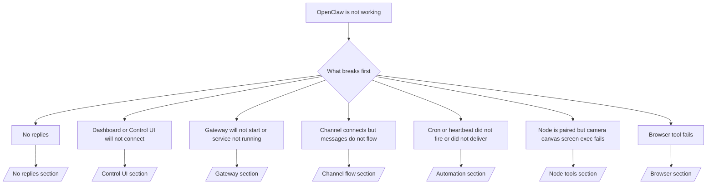

---
read_when:
    - OpenClaw가 작동하지 않으며 가장 빠르게 해결하는 방법이 필요합니다
    - 심층 런북으로 들어가기 전에 먼저 트리아지 흐름이 필요합니다
summary: OpenClaw용 증상 우선 문제 해결 허브
title: 일반 문제 해결
x-i18n:
    generated_at: "2026-04-24T08:58:06Z"
    model: gpt-5.4
    provider: openai
    source_hash: c832c3f7609c56a5461515ed0f693d2255310bf2d3958f69f57c482bcbef97f0
    source_path: help/troubleshooting.md
    workflow: 15
---

2분밖에 없다면 이 페이지를 트리아지 진입점으로 사용하세요.

## 처음 60초

다음 정확한 순서대로 실행하세요.

```bash
openclaw status
openclaw status --all
openclaw gateway probe
openclaw gateway status
openclaw doctor
openclaw channels status --probe
openclaw logs --follow
```

한 줄로 보는 정상 출력:

- `openclaw status` → 구성된 채널이 표시되고 명백한 인증 오류가 없습니다.
- `openclaw status --all` → 전체 보고서가 존재하며 공유할 수 있습니다.
- `openclaw gateway probe` → 예상한 gateway 대상에 도달할 수 있습니다(`Reachable: yes`). `Capability: ...`는 probe가 증명할 수 있었던 인증 수준을 알려주며, `Read probe: limited - missing scope: operator.read`는 연결 실패가 아니라 진단 기능 저하를 의미합니다.
- `openclaw gateway status` → `Runtime: running`, `Connectivity probe: ok`, 그리고 그럴듯한 `Capability: ...` 줄이 표시됩니다. 읽기 범위 RPC 증명도 필요하면 `--require-rpc`를 사용하세요.
- `openclaw doctor` → 차단하는 config/service 오류가 없습니다.
- `openclaw channels status --probe` → gateway에 도달할 수 있으면 계정별 실시간 transport 상태와 `works`, `audit ok` 같은 probe/audit 결과를 반환합니다. gateway에 도달할 수 없으면 이 명령은 config 전용 요약으로 대체됩니다.
- `openclaw logs --follow` → 활동이 안정적으로 이어지고 반복되는 치명적 오류가 없습니다.

## Anthropic 긴 컨텍스트 429

다음이 보이면  
`HTTP 429: rate_limit_error: Extra usage is required for long context requests`,  
[/gateway/troubleshooting#anthropic-429-extra-usage-required-for-long-context](/ko/gateway/troubleshooting#anthropic-429-extra-usage-required-for-long-context)로 이동하세요.

## 로컬 OpenAI 호환 백엔드는 직접 호출하면 되지만 OpenClaw에서는 실패하는 경우

로컬 또는 자체 호스팅한 `/v1` 백엔드가 작은 직접 `/v1/chat/completions` probe에는 응답하지만 `openclaw infer model run` 또는 일반 agent turn에서는 실패한다면:

1. 오류에 `messages[].content`가 문자열이어야 한다고 나오면 `models.providers.<provider>.models[].compat.requiresStringContent: true`를 설정하세요.
2. 백엔드가 여전히 OpenClaw agent turn에서만 실패하면 `models.providers.<provider>.models[].compat.supportsTools: false`를 설정하고 다시 시도하세요.
3. 아주 작은 직접 호출은 계속 동작하지만 더 큰 OpenClaw 프롬프트에서 백엔드가 중단된다면, 남은 문제는 상위 model/server의 제한으로 보고 심층 런북을 계속 진행하세요.  
   [/gateway/troubleshooting#local-openai-compatible-backend-passes-direct-probes-but-agent-runs-fail](/ko/gateway/troubleshooting#local-openai-compatible-backend-passes-direct-probes-but-agent-runs-fail)

## openclaw extensions 누락으로 Plugin 설치 실패

설치 중 `package.json missing openclaw.extensions` 오류가 발생하면, 해당 plugin 패키지가 OpenClaw에서 더 이상 허용하지 않는 오래된 형식을 사용 중인 것입니다.

plugin 패키지에서 다음을 수정하세요.

1. `package.json`에 `openclaw.extensions`를 추가합니다.
2. 항목이 빌드된 런타임 파일(보통 `./dist/index.js`)을 가리키도록 합니다.
3. plugin을 다시 배포한 뒤 `openclaw plugins install <package>`를 다시 실행합니다.

예시:

```json
{
  "name": "@openclaw/my-plugin",
  "version": "1.2.3",
  "openclaw": {
    "extensions": ["./dist/index.js"]
  }
}
```

참고: [Plugin 아키텍처](/ko/plugins/architecture)

## 의사결정 트리



<AccordionGroup>
  <Accordion title="응답이 없음">
    ```bash
    openclaw status
    openclaw gateway status
    openclaw channels status --probe
    openclaw pairing list --channel <channel> [--account <id>]
    openclaw logs --follow
    ```

    정상 출력 예시:

    - `Runtime: running`
    - `Connectivity probe: ok`
    - `Capability: read-only`, `write-capable`, 또는 `admin-capable`
    - 채널에 transport connected가 표시되고, 지원되는 경우 `channels status --probe`에 `works` 또는 `audit ok`가 표시됨
    - 발신자가 승인된 상태로 표시됨(또는 DM 정책이 open/allowlist임)

    흔한 로그 시그니처:

    - `drop guild message (mention required` → Discord에서 mention 게이팅 때문에 메시지가 차단되었습니다.
    - `pairing request` → 발신자가 승인되지 않아 DM pairing 승인을 기다리는 중입니다.
    - 채널 로그의 `blocked` / `allowlist` → 발신자, room, 또는 group이 필터링되고 있습니다.

    심층 페이지:

    - [/gateway/troubleshooting#no-replies](/ko/gateway/troubleshooting#no-replies)
    - [/channels/troubleshooting](/ko/channels/troubleshooting)
    - [/channels/pairing](/ko/channels/pairing)

  </Accordion>

  <Accordion title="Dashboard 또는 Control UI가 연결되지 않음">
    ```bash
    openclaw status
    openclaw gateway status
    openclaw logs --follow
    openclaw doctor
    openclaw channels status --probe
    ```

    정상 출력 예시:

    - `openclaw gateway status`에 `Dashboard: http://...`가 표시됨
    - `Connectivity probe: ok`
    - `Capability: read-only`, `write-capable`, 또는 `admin-capable`
    - 로그에 auth loop가 없음

    흔한 로그 시그니처:

    - `device identity required` → HTTP/비보안 컨텍스트에서는 device auth를 완료할 수 없습니다.
    - `origin not allowed` → browser `Origin`이 Control UI gateway 대상에서 허용되지 않습니다.
    - 재시도 힌트가 포함된 `AUTH_TOKEN_MISMATCH`(`canRetryWithDeviceToken=true`) → 신뢰된 device-token 재시도 1회가 자동으로 발생할 수 있습니다.
    - 이 cached-token 재시도는 paired device token과 함께 저장된 cached scope 집합을 재사용합니다. 명시적 `deviceToken` / 명시적 `scopes` 호출자는 대신 자신이 요청한 scope 집합을 유지합니다.
    - 비동기 Tailscale Serve Control UI 경로에서는 같은 `{scope, ip}`에 대한 실패 시도가 limiter가 실패를 기록하기 전에 직렬화되므로, 동시에 두 번째 잘못된 재시도는 이미 `retry later`를 표시할 수 있습니다.
    - localhost browser origin에서의 `too many failed authentication attempts (retry later)` → 동일한 `Origin`에서 반복된 실패로 인해 일시적으로 잠금 상태입니다. 다른 localhost origin은 별도의 버킷을 사용합니다.
    - 그 재시도 이후에도 반복되는 `unauthorized` → 잘못된 token/password, auth 모드 불일치, 또는 오래된 paired device token입니다.
    - `gateway connect failed:` → UI가 잘못된 URL/포트를 가리키고 있거나 gateway에 도달할 수 없습니다.

    심층 페이지:

    - [/gateway/troubleshooting#dashboard-control-ui-connectivity](/ko/gateway/troubleshooting#dashboard-control-ui-connectivity)
    - [/web/control-ui](/ko/web/control-ui)
    - [/gateway/authentication](/ko/gateway/authentication)

  </Accordion>

  <Accordion title="Gateway가 시작되지 않거나 service는 설치되었지만 실행 중이 아님">
    ```bash
    openclaw status
    openclaw gateway status
    openclaw logs --follow
    openclaw doctor
    openclaw channels status --probe
    ```

    정상 출력 예시:

    - `Service: ... (loaded)`
    - `Runtime: running`
    - `Connectivity probe: ok`
    - `Capability: read-only`, `write-capable`, 또는 `admin-capable`

    흔한 로그 시그니처:

    - `Gateway start blocked: set gateway.mode=local` 또는 `existing config is missing gateway.mode` → gateway mode가 remote이거나, config 파일에 local-mode 표시가 없어 복구가 필요합니다.
    - `refusing to bind gateway ... without auth` → 유효한 gateway auth 경로(token/password 또는 구성된 경우 trusted-proxy) 없이 non-loopback bind를 거부했습니다.
    - `another gateway instance is already listening` 또는 `EADDRINUSE` → 포트가 이미 사용 중입니다.

    심층 페이지:

    - [/gateway/troubleshooting#gateway-service-not-running](/ko/gateway/troubleshooting#gateway-service-not-running)
    - [/gateway/background-process](/ko/gateway/background-process)
    - [/gateway/configuration](/ko/gateway/configuration)

  </Accordion>

  <Accordion title="채널은 연결되지만 메시지가 흐르지 않음">
    ```bash
    openclaw status
    openclaw gateway status
    openclaw logs --follow
    openclaw doctor
    openclaw channels status --probe
    ```

    정상 출력 예시:

    - 채널 transport가 connected 상태입니다.
    - Pairing/allowlist 검사를 통과합니다.
    - 필요한 경우 mention이 감지됩니다.

    흔한 로그 시그니처:

    - `mention required` → group mention 게이팅 때문에 처리가 차단되었습니다.
    - `pairing` / `pending` → DM 발신자가 아직 승인되지 않았습니다.
    - `not_in_channel`, `missing_scope`, `Forbidden`, `401/403` → 채널 권한 token 문제입니다.

    심층 페이지:

    - [/gateway/troubleshooting#channel-connected-messages-not-flowing](/ko/gateway/troubleshooting#channel-connected-messages-not-flowing)
    - [/channels/troubleshooting](/ko/channels/troubleshooting)

  </Accordion>

  <Accordion title="Cron 또는 Heartbeat가 실행되지 않았거나 전달되지 않음">
    ```bash
    openclaw status
    openclaw gateway status
    openclaw cron status
    openclaw cron list
    openclaw cron runs --id <jobId> --limit 20
    openclaw logs --follow
    ```

    정상 출력 예시:

    - `cron.status`에 enabled와 다음 wake가 표시됩니다.
    - `cron runs`에 최근 `ok` 항목이 표시됩니다.
    - Heartbeat가 활성화되어 있고 active hours 밖이 아닙니다.

    흔한 로그 시그니처:

    - `cron: scheduler disabled; jobs will not run automatically` → Cron이 비활성화되어 있습니다.
    - `heartbeat skipped`와 `reason=quiet-hours` → 구성된 active hours 밖입니다.
    - `heartbeat skipped`와 `reason=empty-heartbeat-file` → `HEARTBEAT.md`가 존재하지만 빈 내용이거나 헤더만 있는 골격만 포함합니다.
    - `heartbeat skipped`와 `reason=no-tasks-due` → `HEARTBEAT.md` task 모드가 활성화되어 있지만 아직 도래한 task interval이 없습니다.
    - `heartbeat skipped`와 `reason=alerts-disabled` → Heartbeat 가시성 옵션이 모두 비활성화되어 있습니다(`showOk`, `showAlerts`, `useIndicator`가 모두 꺼짐).
    - `requests-in-flight` → 메인 레인이 바빠서 Heartbeat wake가 연기되었습니다.
    - `unknown accountId` → Heartbeat 전달 대상 account가 존재하지 않습니다.

    심층 페이지:

    - [/gateway/troubleshooting#cron-and-heartbeat-delivery](/ko/gateway/troubleshooting#cron-and-heartbeat-delivery)
    - [/automation/cron-jobs#troubleshooting](/ko/automation/cron-jobs#troubleshooting)
    - [/gateway/heartbeat](/ko/gateway/heartbeat)

  </Accordion>

  <Accordion title="Node는 pairing되었지만 tool에서 camera canvas screen exec가 실패함">
    ```bash
    openclaw status
    openclaw gateway status
    openclaw nodes status
    openclaw nodes describe --node <idOrNameOrIp>
    openclaw logs --follow
    ```

    정상 출력 예시:

    - Node가 connected 상태로 나열되고 `node` 역할로 pairing되어 있습니다.
    - 호출하려는 명령에 필요한 capability가 존재합니다.
    - tool에 필요한 permission 상태가 granted입니다.

    흔한 로그 시그니처:

    - `NODE_BACKGROUND_UNAVAILABLE` → node 앱을 foreground로 가져오세요.
    - `*_PERMISSION_REQUIRED` → OS permission이 거부되었거나 누락되었습니다.
    - `SYSTEM_RUN_DENIED: approval required` → exec 승인이 대기 중입니다.
    - `SYSTEM_RUN_DENIED: allowlist miss` → 명령이 exec allowlist에 없습니다.

    심층 페이지:

    - [/gateway/troubleshooting#node-paired-tool-fails](/ko/gateway/troubleshooting#node-paired-tool-fails)
    - [/nodes/troubleshooting](/ko/nodes/troubleshooting)
    - [/tools/exec-approvals](/ko/tools/exec-approvals)

  </Accordion>

  <Accordion title="Exec가 갑자기 승인을 요청함">
    ```bash
    openclaw config get tools.exec.host
    openclaw config get tools.exec.security
    openclaw config get tools.exec.ask
    openclaw gateway restart
    ```

    무엇이 바뀌었는지:

    - `tools.exec.host`가 설정되지 않은 경우 기본값은 `auto`입니다.
    - `host=auto`는 sandbox 런타임이 활성화되어 있으면 `sandbox`로, 그렇지 않으면 `gateway`로 해석됩니다.
    - `host=auto`는 라우팅만 담당합니다. 프롬프트 없는 "YOLO" 동작은 gateway/node에서 `security=full`과 `ask=off` 조합으로 결정됩니다.
    - `gateway`와 `node`에서는 `tools.exec.security`가 설정되지 않으면 기본값은 `full`입니다.
    - `tools.exec.ask`가 설정되지 않으면 기본값은 `off`입니다.
    - 결과적으로 승인을 요구받고 있다면, 일부 호스트 로컬 또는 세션별 정책이 현재 기본값보다 더 엄격하게 exec를 제한한 것입니다.

    현재 기본 no-approval 동작으로 복원:

    ```bash
    openclaw config set tools.exec.host gateway
    openclaw config set tools.exec.security full
    openclaw config set tools.exec.ask off
    openclaw gateway restart
    ```

    더 안전한 대안:

    - 안정적인 호스트 라우팅만 원한다면 `tools.exec.host=gateway`만 설정합니다.
    - 호스트 exec를 사용하되 allowlist 미스 시 검토도 원한다면 `security=allowlist`와 `ask=on-miss`를 사용합니다.
    - `host=auto`가 다시 `sandbox`로 해석되게 하려면 sandbox 모드를 활성화합니다.

    흔한 로그 시그니처:

    - `Approval required.` → 명령이 `/approve ...`를 기다리고 있습니다.
    - `SYSTEM_RUN_DENIED: approval required` → node-host exec 승인이 대기 중입니다.
    - `exec host=sandbox requires a sandbox runtime for this session` → 암시적 또는 명시적으로 sandbox가 선택되었지만 sandbox 모드가 꺼져 있습니다.

    심층 페이지:

    - [/tools/exec](/ko/tools/exec)
    - [/tools/exec-approvals](/ko/tools/exec-approvals)
    - [/gateway/security#what-the-audit-checks-high-level](/ko/gateway/security#what-the-audit-checks-high-level)

  </Accordion>

  <Accordion title="Browser 도구가 실패함">
    ```bash
    openclaw status
    openclaw gateway status
    openclaw browser status
    openclaw logs --follow
    openclaw doctor
    ```

    정상 출력 예시:

    - Browser status에 `running: true`와 선택된 browser/profile이 표시됩니다.
    - `openclaw`가 시작되거나 `user`가 로컬 Chrome 탭을 볼 수 있습니다.

    흔한 로그 시그니처:

    - `unknown command "browser"` 또는 `unknown command 'browser'` → `plugins.allow`가 설정되어 있고 `browser`를 포함하지 않습니다.
    - `Failed to start Chrome CDP on port` → 로컬 browser 시작에 실패했습니다.
    - `browser.executablePath not found` → 설정된 바이너리 경로가 잘못되었습니다.
    - `browser.cdpUrl must be http(s) or ws(s)` → 설정된 CDP URL이 지원되지 않는 스킴을 사용합니다.
    - `browser.cdpUrl has invalid port` → 설정된 CDP URL에 잘못되었거나 범위를 벗어난 포트가 있습니다.
    - `No Chrome tabs found for profile="user"` → Chrome MCP attach profile에 열려 있는 로컬 Chrome 탭이 없습니다.
    - `Remote CDP for profile "<name>" is not reachable` → 설정된 원격 CDP endpoint에 이 호스트에서 도달할 수 없습니다.
    - `Browser attachOnly is enabled ... not reachable` 또는 `Browser attachOnly is enabled and CDP websocket ... is not reachable` → attach-only profile에 활성 CDP 대상이 없습니다.
    - attach-only 또는 원격 CDP profile에서 오래된 viewport / dark-mode / locale / offline override가 남아 있는 경우 → gateway를 재시작하지 말고 `openclaw browser stop --browser-profile <name>`을 실행해 현재 제어 세션을 종료하고 에뮬레이션 상태를 해제하세요.

    심층 페이지:

    - [/gateway/troubleshooting#browser-tool-fails](/ko/gateway/troubleshooting#browser-tool-fails)
    - [/tools/browser#missing-browser-command-or-tool](/ko/tools/browser#missing-browser-command-or-tool)
    - [/tools/browser-linux-troubleshooting](/ko/tools/browser-linux-troubleshooting)
    - [/tools/browser-wsl2-windows-remote-cdp-troubleshooting](/ko/tools/browser-wsl2-windows-remote-cdp-troubleshooting)

  </Accordion>

</AccordionGroup>

## 관련 항목

- [FAQ](/ko/help/faq) — 자주 묻는 질문
- [Gateway 문제 해결](/ko/gateway/troubleshooting) — gateway 관련 문제
- [Doctor](/ko/gateway/doctor) — 자동 상태 점검 및 복구
- [채널 문제 해결](/ko/channels/troubleshooting) — 채널 연결 문제
- [자동화 문제 해결](/ko/automation/cron-jobs#troubleshooting) — Cron 및 Heartbeat 문제
