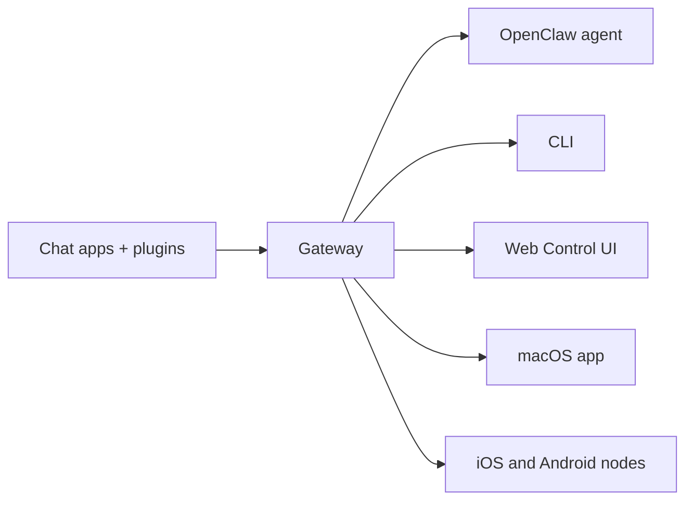

---
read_when:
    - OpenClaw을 처음 접하는 사람들에게 소개하기
summary: OpenClaw는 모든 OS에서 실행되는 AI 에이전트용 멀티채널 Gateway입니다.
title: OpenClaw
x-i18n:
    generated_at: "2026-06-27T17:35:12Z"
    model: gpt-5.5
    postprocess_version: locale-links-v1
    provider: openai
    source_hash: fcaa54a0a6d7aa62193fd9f03428bbcbfdcb2c00a184bcd6f49e4e093fefc473
    source_path: index.md
    workflow: 16
---

# OpenClaw 🦞

<p align="center">
    
    
</p>

> _"각질 제거! 각질 제거!"_ — 아마도 우주 바닷가재

<p align="center">
  <strong>Discord, Google Chat, iMessage, Matrix, Microsoft Teams, Signal, Slack, Telegram, WhatsApp, Zalo 등에서 AI 에이전트를 위한 모든 OS용 Gateway입니다.</strong><br />
  메시지를 보내고, 주머니 속 기기에서 에이전트 응답을 받으세요. 기본 제공 채널, 번들 채널 Plugin, WebChat, 모바일 노드를 아우르는 하나의 Gateway를 실행하세요.
</p>

<Columns>
  <Card title="시작하기" href="/ko/start/getting-started" icon="rocket">
    OpenClaw를 설치하고 몇 분 안에 Gateway를 실행하세요.
  </Card>
  <Card title="온보딩 실행" href="/ko/start/wizard" icon="list-checks">
    `openclaw onboard`와 페어링 흐름으로 안내되는 설정입니다.
  </Card>
  <Card title="Control UI 열기" href="/ko/web/control-ui" icon="layout-dashboard">
    채팅, 설정, 세션을 위한 브라우저 대시보드를 실행하세요.
  </Card>
</Columns>

## OpenClaw란 무엇인가요?

OpenClaw는 즐겨 쓰는 채팅 앱과 채널 표면을 AI 코딩 에이전트에 연결하는 **셀프 호스팅 Gateway**입니다. 기본 제공 채널과 Discord, Google Chat, iMessage, Matrix, Microsoft Teams, Signal, Slack, Telegram, WhatsApp, Zalo 등과 같은 번들 또는 외부 채널 Plugin을 지원합니다. 사용자는 자신의 머신이나 서버에서 단일 Gateway 프로세스를 실행하며, 이 프로세스가 메시징 앱과 항상 사용 가능한 AI 어시스턴트 사이의 다리가 됩니다.

**누구를 위한 것인가요?** 데이터 제어권을 포기하거나 호스팅 서비스에 의존하지 않고, 어디서나 메시지를 보낼 수 있는 개인 AI 어시스턴트를 원하는 개발자와 고급 사용자입니다.

**무엇이 다른가요?**

- **셀프 호스팅**: 사용자의 하드웨어와 규칙에 따라 실행됩니다
- **멀티채널**: 하나의 Gateway가 기본 제공 채널과 번들 또는 외부 채널 Plugin을 동시에 제공합니다
- **에이전트 네이티브**: 도구 사용, 세션, 메모리, 멀티 에이전트 라우팅을 갖춘 코딩 에이전트를 위해 구축되었습니다
- **오픈 소스**: MIT 라이선스, 커뮤니티 주도

**무엇이 필요한가요?** Node 24(권장) 또는 호환성을 위한 Node 22 LTS(`22.19+`), 선택한 제공자의 API 키, 그리고 5분이면 됩니다. 최고의 품질과 보안을 위해 사용 가능한 가장 강력한 최신 세대 모델을 사용하세요.

## 작동 방식



Gateway는 세션, 라우팅, 채널 연결의 단일 진실 공급원입니다.

## 주요 기능

<Columns>
  <Card title="멀티채널 Gateway" icon="network" href="/ko/channels">
    단일 Gateway 프로세스로 Discord, iMessage, Signal, Slack, Telegram, WhatsApp, WebChat 등을 사용할 수 있습니다.
  </Card>
  <Card title="Plugin 채널" icon="plug" href="/ko/tools/plugin">
    번들 Plugin은 일반적인 최신 릴리스에서 Matrix, Nostr, Twitch, Zalo 등을 추가합니다.
  </Card>
  <Card title="멀티 에이전트 라우팅" icon="route" href="/ko/concepts/multi-agent">
    에이전트, 워크스페이스 또는 발신자별 격리된 세션입니다.
  </Card>
  <Card title="미디어 지원" icon="image" href="/ko/nodes/images">
    이미지, 오디오, 문서를 보내고 받을 수 있습니다.
  </Card>
  <Card title="Web Control UI" icon="monitor" href="/ko/web/control-ui">
    채팅, 설정, 세션, 노드를 위한 브라우저 대시보드입니다.
  </Card>
  <Card title="모바일 노드" icon="smartphone" href="/ko/nodes">
    Canvas, 카메라, 음성 지원 워크플로를 위해 iOS 및 Android 노드를 페어링하세요.
  </Card>
</Columns>

## 빠른 시작

<Steps>
  <Step title="OpenClaw 설치">
    ```bash
    npm install -g openclaw@latest
    ```
  </Step>
  <Step title="온보딩 및 서비스 설치">
    ```bash
    openclaw onboard --install-daemon
    ```
  </Step>
  <Step title="채팅">
    브라우저에서 Control UI를 열고 메시지를 보내세요.

    ```bash
    openclaw dashboard
    ```

    또는 채널을 연결하고([Telegram](/ko/channels/telegram)이 가장 빠릅니다) 휴대폰에서 채팅하세요.

  </Step>
</Steps>

전체 설치 및 개발 설정이 필요하신가요? [시작하기](/ko/start/getting-started)를 참조하세요.

## 대시보드

Gateway가 시작된 후 브라우저 Control UI를 여세요.

- 로컬 기본값: [http://127.0.0.1:18789/](http://127.0.0.1:18789/)
- 원격 액세스: [웹 표면](/ko/web) 및 [Tailscale](/ko/gateway/tailscale)

<p align="center">
  
</p>

## 구성(선택 사항)

구성은 `~/.openclaw/openclaw.json`에 있습니다.

- **아무것도 하지 않으면**, OpenClaw는 발신자별 세션과 함께 번들 OpenClaw 에이전트 런타임을 사용합니다.
- 잠그고 싶다면 `channels.whatsapp.allowFrom`부터 시작하고, 그룹의 경우 멘션 규칙을 설정하세요.

예시:

```json5
{
  channels: {
    whatsapp: {
      allowFrom: ["+15555550123"],
      groups: { "*": { requireMention: true } },
    },
  },
  messages: { groupChat: { mentionPatterns: ["@openclaw"] } },
}
```

## 여기서 시작하세요

<Columns>
  <Card title="문서 허브" href="/ko/start/hubs" icon="book-open">
    사용 사례별로 정리된 모든 문서와 가이드입니다.
  </Card>
  <Card title="구성" href="/ko/gateway/configuration" icon="settings">
    핵심 Gateway 설정, 토큰, 제공자 구성입니다.
  </Card>
  <Card title="원격 액세스" href="/ko/gateway/remote" icon="globe">
    SSH 및 tailnet 액세스 패턴입니다.
  </Card>
  <Card title="채널" href="/ko/channels/telegram" icon="message-square">
    Feishu, Microsoft Teams, WhatsApp, Telegram, Discord 등을 위한 채널별 설정입니다.
  </Card>
  <Card title="노드" href="/ko/nodes" icon="smartphone">
    페어링, Canvas, 카메라, 기기 작업을 지원하는 iOS 및 Android 노드입니다.
  </Card>
  <Card title="도움말" href="/ko/help" icon="life-buoy">
    일반적인 수정 방법과 문제 해결 진입점입니다.
  </Card>
</Columns>

## 더 알아보기

<Columns>
  <Card title="전체 기능 목록" href="/ko/concepts/features" icon="list">
    완전한 채널, 라우팅, 미디어 기능입니다.
  </Card>
  <Card title="멀티 에이전트 라우팅" href="/ko/concepts/multi-agent" icon="route">
    워크스페이스 격리 및 에이전트별 세션입니다.
  </Card>
  <Card title="보안" href="/ko/gateway/security" icon="shield">
    토큰, 허용 목록, 안전 제어입니다.
  </Card>
  <Card title="문제 해결" href="/ko/gateway/troubleshooting" icon="wrench">
    Gateway 진단 및 일반적인 오류입니다.
  </Card>
  <Card title="정보 및 크레딧" href="/ko/reference/credits" icon="info">
    프로젝트 기원, 기여자, 라이선스입니다.
  </Card>
</Columns>
