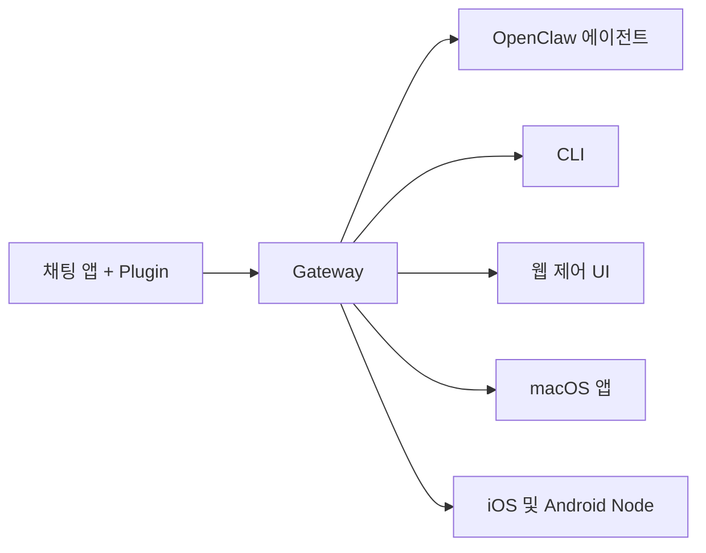

---
read_when:
    - 신규 사용자에게 OpenClaw 소개하기
summary: OpenClaw은 모든 OS에서 실행되는 AI 에이전트용 멀티채널 Gateway입니다.
title: OpenClaw
x-i18n:
    generated_at: "2026-07-12T15:22:36Z"
    model: gpt-5.6
    postprocess_version: locale-links-v1
    prompt_version: 15
    provider: openai
    source_hash: 2b87c2a9ce06f110bda45709fb6055ed8000f73993793ea7386db2a47a782828
    source_path: index.md
    workflow: 16
---

# OpenClaw 🦞

<p align="center">
    
    
</p>

> _"탈피하라! 탈피하라!"_ — 아마도 우주 바닷가재

<p align="center">
  <strong>Discord, Google Chat, iMessage, Matrix, Microsoft Teams, Signal, Slack, Telegram, WhatsApp, Zalo 등을 통해 AI 에이전트를 사용할 수 있는 모든 OS용 Gateway입니다.</strong><br />
  메시지를 보내면 어디서든 에이전트의 응답을 받을 수 있습니다. 하나의 Gateway로 채널 Plugin, WebChat, 모바일 Node를 운영하십시오.
</p>

<Columns>
  <Card title="시작하기" href="/ko/start/getting-started" icon="rocket">
    OpenClaw를 설치하고 몇 분 안에 Gateway를 실행하십시오.
  </Card>
  <Card title="온보딩 실행" href="/ko/start/wizard" icon="list-checks">
    `openclaw onboard` 및 페어링 흐름을 사용하는 안내식 설정입니다.
  </Card>
  <Card title="채널 연결" href="/ko/channels" icon="message-circle">
    어디서든 채팅할 수 있도록 Discord, Signal, Telegram, WhatsApp 등을 연결하십시오.
  </Card>
  <Card title="제어 UI 열기" href="/ko/web/control-ui" icon="layout-dashboard">
    채팅, 구성, 세션을 위한 브라우저 대시보드를 실행하십시오.
  </Card>
</Columns>

## 문서 찾아보기

모바일 브라우저에서는 전체 데스크톱 탭 표시줄 없이 섹션 메뉴만 표시될 수 있습니다. 페이지 본문에서
동일한 최상위 문서 영역으로 이동하려면 다음 허브 링크를 사용하십시오.

<Columns>
  <Card title="시작하기" href="/ko" icon="rocket">
    개요, 활용 사례, 첫 단계, 설정 가이드입니다.
  </Card>
  <Card title="설치" href="/ko/install" icon="download">
    설치 경로, 업데이트, 컨테이너, 호스팅, 고급 설정입니다.
  </Card>
  <Card title="채널" href="/ko/channels" icon="messages-square">
    메시징 채널, 페어링, 라우팅, 접근 그룹, 채널 QA입니다.
  </Card>
  <Card title="에이전트" href="/ko/concepts/architecture" icon="bot">
    아키텍처, 세션, 컨텍스트, 메모리, 다중 에이전트 라우팅입니다.
  </Card>
  <Card title="기능" href="/ko/tools" icon="wand-sparkles">
    도구, Skills, Cron, Webhook, 자동화 기능입니다.
  </Card>
  <Card title="ClawHub" href="/ko/clawhub" icon="store">
    Plugin 마켓플레이스, 게시, 선별, 신뢰 지침입니다.
  </Card>
  <Card title="모델" href="/ko/providers" icon="brain">
    제공자, 모델 구성, 장애 조치, 로컬 모델 서비스입니다.
  </Card>
  <Card title="플랫폼" href="/ko/platforms" icon="monitor-smartphone">
    macOS, Windows, iOS, Android, Node, 웹 인터페이스입니다.
  </Card>
  <Card title="Gateway 및 운영" href="/ko/gateway" icon="server">
    Gateway 구성, 보안, 진단, 운영입니다.
  </Card>
  <Card title="참조" href="/ko/cli" icon="terminal">
    CLI 참조, 스키마, RPC, 릴리스 노트, 템플릿입니다.
  </Card>
  <Card title="도움말" href="/ko/help" icon="life-buoy">
    문제 해결, 자주 묻는 질문, 테스트, 진단, 환경 점검입니다.
  </Card>
</Columns>

## OpenClaw란 무엇인가요?

OpenClaw는 채널 Plugin을 통해 자주 사용하는 채팅 앱(Discord, Google Chat, iMessage, Matrix, Microsoft Teams, Signal, Slack, Telegram, WhatsApp, Zalo 등)을 AI 코딩 에이전트에 연결하는 **셀프 호스팅 Gateway**입니다. 사용자의 컴퓨터(또는 서버)에서 단일 Gateway 프로세스를 실행하면 메시징 앱과 언제든 사용할 수 있는 AI 어시스턴트를 연결하는 다리가 됩니다.

**누구를 위한 것인가요?** 데이터에 대한 통제권을 포기하거나 호스팅 서비스에 의존하지 않고 어디서든 메시지를 보낼 수 있는 개인 AI 어시스턴트를 원하는 개발자와 고급 사용자에게 적합합니다.

**어떤 점이 다른가요?**

- **셀프 호스팅**: 사용자의 하드웨어에서 사용자의 규칙에 따라 실행됩니다
- **다중 채널**: 하나의 Gateway가 구성된 모든 채널 Plugin을 동시에 지원합니다
- **에이전트 네이티브**: 도구 사용, 세션, 메모리, 다중 에이전트 라우팅을 사용하는 코딩 에이전트용으로 구축되었습니다
- **오픈 소스**: MIT 라이선스로 제공되며 커뮤니티가 주도합니다

**무엇이 필요한가요?** Node 24(권장) 또는 호환성을 위한 Node 22 LTS(`22.19+`), 선택한 제공자의 API 키, 그리고 5분이 필요합니다. 최상의 품질과 보안을 위해 사용 가능한 가장 강력한 최신 세대 모델을 사용하십시오.

## 작동 방식



Gateway는 세션, 라우팅, 채널 연결을 위한 단일 정보 원천입니다.

## 주요 기능

<Columns>
  <Card title="다중 채널 Gateway" icon="network" href="/ko/channels">
    단일 Gateway 프로세스로 Discord, iMessage, Signal, Slack, Telegram, WhatsApp, WebChat 등을 지원합니다.
  </Card>
  <Card title="Plugin 채널" icon="plug" href="/ko/tools/plugin">
    채널 Plugin으로 Matrix, Nostr, Twitch, Zalo 등을 추가할 수 있으며, 공식 Plugin은 필요할 때 설치됩니다.
  </Card>
  <Card title="다중 에이전트 라우팅" icon="route" href="/ko/concepts/multi-agent">
    에이전트, 워크스페이스 또는 발신자별로 격리된 세션을 제공합니다.
  </Card>
  <Card title="미디어 지원" icon="image" href="/ko/nodes/images">
    이미지, 오디오, 문서를 주고받을 수 있습니다.
  </Card>
  <Card title="웹 제어 UI" icon="monitor" href="/ko/web/control-ui">
    채팅, 구성, 세션, Node를 위한 브라우저 대시보드입니다.
  </Card>
  <Card title="모바일 Node" icon="smartphone" href="/ko/nodes">
    Canvas, 카메라, 음성 지원 워크플로를 위해 iOS 및 Android Node를 페어링합니다.
  </Card>
</Columns>

## 빠른 시작

<Steps>
  <Step title="OpenClaw 설치">
    ```bash
    npm install -g openclaw@latest
    ```
  </Step>
  <Step title="온보딩 및 서비스 설치">
    ```bash
    openclaw onboard --install-daemon
    ```
  </Step>
  <Step title="채팅">
    브라우저에서 제어 UI를 열고 메시지를 보내십시오.

    ```bash
    openclaw dashboard
    ```

    또는 채널을 연결하고([Telegram](/ko/channels/telegram)이 가장 빠릅니다) 휴대전화에서 채팅하십시오.

  </Step>
</Steps>

전체 설치 및 개발 환경 설정이 필요하신가요? [시작하기](/ko/start/getting-started)를 참조하십시오.

## 대시보드

Gateway가 시작된 후 브라우저 제어 UI를 여십시오.

- 로컬 기본값: [http://127.0.0.1:18789/](http://127.0.0.1:18789/)
- 원격 접근: [웹 인터페이스](/ko/web) 및 [Tailscale](/ko/gateway/tailscale)

<p align="center">
  
</p>

## 구성(선택 사항)

구성은 `~/.openclaw/openclaw.json`에 저장됩니다.

- **아무것도 하지 않으면** OpenClaw는 번들로 제공되는 OpenClaw 에이전트 런타임을 사용합니다. DM은 에이전트의 기본 세션을 공유하며 각 그룹 채팅에는 별도의 세션이 할당됩니다.
- 접근을 제한하려면 `channels.whatsapp.allowFrom`과 그룹의 경우 멘션 규칙부터 설정하십시오.

예시:

```json5
{
  channels: {
    whatsapp: {
      allowFrom: ["+15555550123"],
      groups: { "*": { requireMention: true } },
    },
  },
  messages: { groupChat: { mentionPatterns: ["@openclaw"] } },
}
```

## 여기서 시작하기

<Columns>
  <Card title="문서 허브" href="/ko/start/hubs" icon="book-open">
    사용 사례별로 정리된 모든 문서와 가이드입니다.
  </Card>
  <Card title="구성" href="/ko/gateway/configuration" icon="settings">
    핵심 Gateway 설정, 토큰, 제공자 구성입니다.
  </Card>
  <Card title="원격 접근" href="/ko/gateway/remote" icon="globe">
    SSH 및 tailnet 접근 패턴입니다.
  </Card>
  <Card title="채널" href="/ko/channels/telegram" icon="message-square">
    Discord, Feishu, Microsoft Teams, Telegram, WhatsApp 등의 채널별 설정입니다.
  </Card>
  <Card title="Node" href="/ko/nodes" icon="smartphone">
    페어링, Canvas, 카메라, 기기 작업을 지원하는 iOS 및 Android Node입니다.
  </Card>
  <Card title="도움말" href="/ko/help" icon="life-buoy">
    일반적인 해결 방법과 문제 해결의 시작점입니다.
  </Card>
</Columns>

## 더 알아보기

<Columns>
  <Card title="전체 기능 목록" href="/ko/concepts/features" icon="list">
    전체 채널, 라우팅, 미디어 기능입니다.
  </Card>
  <Card title="다중 에이전트 라우팅" href="/ko/concepts/multi-agent" icon="route">
    워크스페이스 격리 및 에이전트별 세션입니다.
  </Card>
  <Card title="보안" href="/ko/gateway/security" icon="shield">
    토큰, 허용 목록, 안전 제어 기능입니다.
  </Card>
  <Card title="문제 해결" href="/ko/gateway/troubleshooting" icon="wrench">
    Gateway 진단 및 일반적인 오류입니다.
  </Card>
  <Card title="프로젝트 소개 및 감사의 말" href="/ko/reference/credits" icon="info">
    프로젝트의 기원, 기여자, 라이선스입니다.
  </Card>
</Columns>
