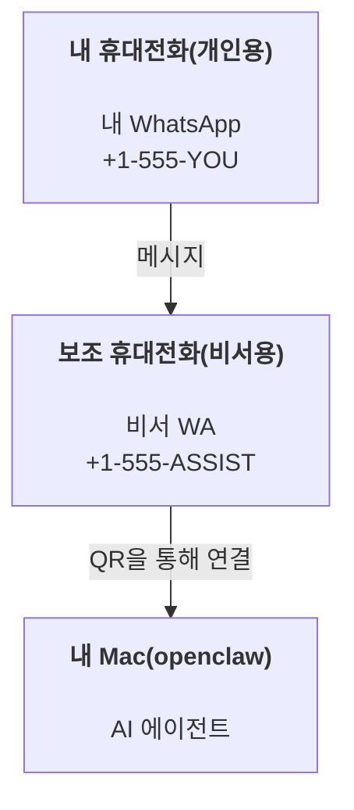

---
read_when:
    - 새 어시스턴트 인스턴스 온보딩
    - 안전성/권한 관련 영향 검토
summary: 안전 주의 사항을 포함하여 OpenClaw를 개인 비서로 실행하는 방법을 설명하는 종합 가이드
title: 개인 비서 설정
x-i18n:
    generated_at: "2026-07-12T15:47:18Z"
    model: gpt-5.6
    postprocess_version: locale-links-v1
    prompt_version: 15
    provider: openai
    source_hash: e8c34e31314f55647059fd600935330110add27b338a675bc0ce1529bebb207d
    source_path: start/openclaw.md
    workflow: 16
---

OpenClaw은 Discord, Google Chat, iMessage, Matrix, Microsoft Teams, Signal, Slack, Telegram, WhatsApp, Zalo 등을 AI 에이전트에 연결하는 자체 호스팅 Gateway입니다. 이 가이드에서는 항상 사용 가능한 AI 비서처럼 작동하는 전용 WhatsApp 번호를 설정하는 "개인 비서" 구성을 설명합니다.

## 안전을 최우선으로 고려하십시오

에이전트에 채널을 제공하면 에이전트가 도구 정책에 따라 컴퓨터에서 명령을 실행하고, 작업 공간의 파일을 읽고 쓰며, 연결된 모든 채널을 통해 메시지를 다시 보낼 수 있습니다. 처음에는 보수적으로 설정하십시오.

- 항상 `channels.whatsapp.allowFrom`을 설정하십시오. 개인 Mac에서 누구나 접근할 수 있도록 실행해서는 안 됩니다.
- 비서 전용 WhatsApp 번호를 사용하십시오.
- Heartbeat의 기본 간격은 30분입니다. 설정을 신뢰할 수 있을 때까지 `agents.defaults.heartbeat.every: "0m"`으로 설정하여 비활성화하십시오.

## 사전 요구 사항

- OpenClaw 설치 및 온보딩 완료 - 아직 완료하지 않았다면 [시작하기](/ko/start/getting-started)를 참조하십시오
- 비서용 보조 전화번호(SIM/eSIM/선불 번호)

## 두 대의 휴대전화 구성(권장)

목표 구성은 다음과 같습니다.



개인 WhatsApp을 OpenClaw에 연결하면 나에게 전송되는 모든 메시지가 "에이전트 입력"이 됩니다. 일반적으로 원하는 동작은 아닙니다.

## 5분 빠른 시작

1. WhatsApp Web을 페어링합니다(QR 코드가 표시되면 비서용 휴대전화로 스캔하십시오).

```bash
openclaw channels login
```

2. Gateway를 시작하고 계속 실행해 둡니다.

```bash
openclaw gateway --port 18789
```

3. `~/.openclaw/openclaw.json`에 최소 구성을 입력합니다.

```json5
{
  gateway: { mode: "local" },
  channels: { whatsapp: { allowFrom: ["+15555550123"] } },
}
```

이제 허용 목록에 등록된 휴대전화에서 비서 번호로 메시지를 보내십시오.

온보딩이 완료되면 OpenClaw이 대시보드를 자동으로 열고 토큰이 포함되지 않은 깔끔한 링크를 출력합니다. 대시보드에서 인증을 요구하면 구성된 공유 비밀을 Control UI 설정에 붙여 넣으십시오. 온보딩에서는 기본적으로 토큰(`gateway.auth.token`)을 사용하지만, `gateway.auth.mode`를 `password`로 변경했다면 비밀번호 인증도 사용할 수 있습니다. 나중에 다시 열려면 `openclaw dashboard`를 실행하십시오.

## 에이전트에 작업 공간 제공하기(AGENTS)

OpenClaw은 작업 공간 디렉터리에서 운영 지침과 "메모리"를 읽습니다.

기본적으로 OpenClaw은 `~/.openclaw/workspace`를 에이전트 작업 공간으로 사용하며, 온보딩 또는 첫 에이전트 실행 시 이 디렉터리와 초기 `AGENTS.md`, `SOUL.md`, `TOOLS.md`, `IDENTITY.md`, `USER.md`, `HEARTBEAT.md` 파일을 자동으로 생성합니다. `BOOTSTRAP.md`는 완전히 새로운 작업 공간에만 생성되며, 삭제한 후에는 다시 생성되지 않아야 합니다. `MEMORY.md`는 선택 사항이며 자동으로 생성되지 않습니다. 이 파일이 있으면 일반 세션에서 로드됩니다. 하위 에이전트 세션에는 `AGENTS.md`와 `TOOLS.md`만 주입됩니다.

<Tip>
이 폴더를 OpenClaw의 메모리처럼 취급하고 git 저장소로 만드십시오. 가능하면 비공개 저장소를 사용하여 `AGENTS.md`와 메모리 파일을 백업하십시오. git이 설치되어 있으면 완전히 새로운 작업 공간은 `git init`으로 자동 초기화됩니다.
</Tip>

전체 온보딩 마법사를 실행하지 않고 작업 공간과 구성 폴더를 생성하려면 다음 명령을 실행하십시오.

```bash
openclaw setup --baseline
```

(인자 없는 `openclaw setup`은 `openclaw onboard`의 별칭이며 전체 대화형 마법사를 실행합니다.)

전체 작업 공간 구조 및 백업 가이드: [에이전트 작업 공간](/ko/concepts/agent-workspace)
메모리 워크플로: [메모리](/ko/concepts/memory)

선택 사항: `agents.defaults.workspace`를 사용하여 다른 작업 공간을 선택할 수 있습니다(`~` 지원).

```json5
{
  agents: {
    defaults: {
      workspace: "~/.openclaw/workspace",
    },
  },
}
```

이미 저장소에서 자체 워크스페이스 파일을 제공하고 있다면 부트스트랩 파일 생성을 완전히 비활성화할 수 있습니다.

```json5
{
  agents: {
    defaults: {
      skipBootstrap: true,
    },
  },
}
```

## "어시스턴트"로 만드는 구성

OpenClaw는 기본적으로 유용한 어시스턴트 설정을 사용하지만, 일반적으로 다음 항목을 조정하는 것이 좋습니다.

- [`SOUL.md`](/ko/concepts/soul)의 페르소나/지침
- 사고 기본값(필요한 경우)
- Heartbeat(신뢰할 수 있게 된 후)

예:

```json5
{
  logging: { level: "info" },
  agents: {
    defaults: {
      model: { primary: "anthropic/claude-opus-4-8" },
      workspace: "~/.openclaw/workspace",
      thinkingDefault: "high",
      timeoutSeconds: 1800,
      // 처음에는 0으로 시작하고 나중에 활성화합니다.
      heartbeat: { every: "0m" },
    },
    list: [
      {
        id: "main",
        default: true,
        groupChat: {
          mentionPatterns: ["@openclaw", "openclaw"],
        },
      },
    ],
  },
  channels: {
    whatsapp: {
      allowFrom: ["+15555550123"],
      groups: {
        "*": { requireMention: true },
      },
    },
  },
  session: {
    scope: "per-sender",
    resetTriggers: ["/new", "/reset"],
    reset: {
      mode: "daily",
      atHour: 4,
      idleMinutes: 10080,
    },
  },
}
```

## 세션 및 메모리

- 세션 행, 트랜스크립트 행 및 메타데이터(토큰 사용량, 마지막 경로 등): `~/.openclaw/agents/<agentId>/agent/openclaw-agent.sqlite`
- 레거시/아카이브 트랜스크립트 아티팩트: `~/.openclaw/agents/<agentId>/sessions/`
- 레거시 행 마이그레이션 원본: `~/.openclaw/agents/<agentId>/sessions/sessions.json`
- `/new` 또는 `/reset`은 해당 채팅의 새 세션을 시작합니다(`session.resetTriggers`를 통해 구성 가능). 단독으로 전송하면 OpenClaw는 모델을 호출하지 않고 재설정을 확인합니다.
- `/compact [instructions]`는 세션 컨텍스트를 압축하고 남은 컨텍스트 예산을 보고합니다.

## Heartbeat(선제적 모드)

기본적으로 OpenClaw는 다음 프롬프트를 사용하여 30분마다 Heartbeat를 실행합니다.
`Read HEARTBEAT.md if it exists (workspace context). Follow it strictly. Do not infer or repeat old tasks from prior chats. If nothing needs attention, reply HEARTBEAT_OK.`
비활성화하려면 `agents.defaults.heartbeat.every: "0m"`로 설정하십시오.

- `HEARTBEAT.md`가 존재하지만 사실상 비어 있는 경우(빈 줄, Markdown/HTML 주석, `# Heading` 같은 Markdown 제목, 펜스 마커 또는 빈 체크리스트 스텁만 포함), OpenClaw는 API 호출을 줄이기 위해 Heartbeat 실행을 건너뜁니다.
- 파일이 없더라도 Heartbeat는 계속 실행되며 모델이 수행할 작업을 결정합니다.
- 에이전트가 `HEARTBEAT_OK`로 응답하면(선택적으로 짧은 덧붙임 포함, `agents.defaults.heartbeat.ackMaxChars` 참조), OpenClaw는 해당 Heartbeat의 외부 전달을 억제합니다.
- 기본적으로 DM 형식의 `user:<id>` 대상에 대한 Heartbeat 전달이 허용됩니다. Heartbeat 실행을 활성 상태로 유지하면서 직접 대상 전달을 억제하려면 `agents.defaults.heartbeat.directPolicy: "block"`을 설정하십시오.
- Heartbeat는 전체 에이전트 턴을 실행하므로 간격이 짧을수록 더 많은 토큰을 소모합니다.

```json5
{
  agents: {
    defaults: {
      heartbeat: { every: "30m" },
    },
  },
}
```

## 미디어 입력 및 출력

인바운드 첨부 파일(이미지/오디오/문서)은 템플릿을 통해 명령에 제공할 수 있습니다.

- `{{MediaPath}}` (로컬 임시 파일 경로)
- `{{MediaUrl}}` (의사 URL)
- `{{Transcript}}` (오디오 전사가 활성화된 경우)

에이전트의 아웃바운드 첨부 파일은 메시지 도구 또는 응답 페이로드의 구조화된 미디어 필드(예: `media`, `mediaUrl`, `mediaUrls`, `path`, `filePath`)를 사용합니다. 메시지 도구 인수 예시는 다음과 같습니다.

```json
{
  "message": "스크린샷입니다.",
  "mediaUrl": "https://example.com/screenshot.png"
}
```

OpenClaw는 구조화된 미디어를 텍스트와 함께 전송합니다. 이전 형식의 최종 어시스턴트 응답은 호환성을 위해 계속 정규화될 수 있지만, 도구 출력, 브라우저 출력, 스트리밍 블록 및 메시지 작업은 텍스트를 첨부 파일 명령으로 파싱하지 않습니다.

로컬 경로 동작은 에이전트와 동일한 파일 읽기 신뢰 모델을 따릅니다.

- `tools.fs.workspaceOnly`가 `true`이면 아웃바운드 로컬 미디어 경로는 OpenClaw 임시 루트, 미디어 캐시, 에이전트 작업 공간 경로 및 샌드박스에서 생성된 파일로 제한됩니다.
- `tools.fs.workspaceOnly`가 `false`이면 아웃바운드 로컬 미디어에서 에이전트가 이미 읽을 수 있는 호스트 로컬 파일을 사용할 수 있습니다.
- 로컬 경로는 절대 경로, 작업 공간 기준 상대 경로 또는 `~/`를 사용하는 홈 기준 상대 경로일 수 있습니다.
- 호스트 로컬 전송은 미디어와 안전한 문서 유형(이미지, 오디오, 동영상, PDF, Office 문서 및 Markdown/MD, TXT, JSON, YAML, YML과 같이 검증된 텍스트 문서)만 계속 허용합니다. 이는 기존 호스트 읽기 신뢰 경계를 확장한 것이며 비밀 스캐너가 아닙니다. 에이전트가 호스트 로컬 `secret.txt` 또는 `config.json`을 읽을 수 있다면, 확장자와 콘텐츠 검증이 일치할 때 해당 파일을 첨부할 수 있습니다.

민감한 파일은 에이전트가 읽을 수 있는 파일 시스템 외부에 보관하거나, 로컬 경로 전송을 더 엄격하게 제한하려면 `tools.fs.workspaceOnly: true`를 유지하십시오.

## 운영 체크리스트

```bash
openclaw status          # 로컬 상태(자격 증명, 세션, 대기 중인 이벤트)
openclaw status --all    # 전체 진단(읽기 전용, 붙여넣기 가능)
openclaw status --deep   # 채널 검사(WhatsApp Web + Telegram + Discord + Slack + Signal)
openclaw health --json   # WS 연결을 통한 Gateway 상태 스냅샷
```

로그는 `/tmp/openclaw/` 아래에 저장됩니다(기본값: `openclaw-YYYY-MM-DD.log`).

## 다음 단계

- WebChat: [WebChat](/ko/web/webchat)
- Gateway 운영: [Gateway 운영 가이드](/ko/gateway)
- Cron + 깨우기: [Cron 작업](/ko/automation/cron-jobs)
- macOS 메뉴 막대 컴패니언: [OpenClaw macOS 앱](/ko/platforms/macos)
- iOS Node 앱: [iOS 앱](/ko/platforms/ios)
- Android Node 앱: [Android 앱](/ko/platforms/android)
- Windows Hub: [Windows](/ko/platforms/windows)
- Linux 상태: [Linux 앱](/ko/platforms/linux)
- 보안: [보안](/ko/gateway/security)

## 관련 문서

- [시작하기](/ko/start/getting-started)
- [설정](/ko/start/setup)
- [채널 개요](/ko/channels)
