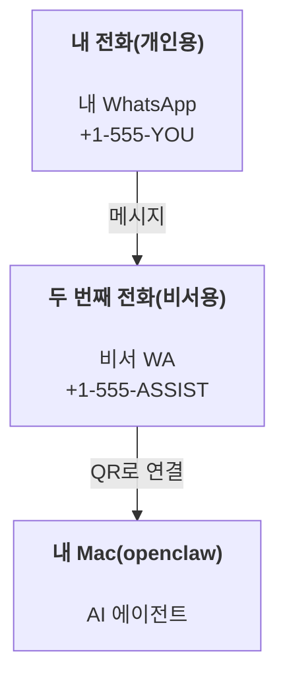

---
read_when:
    - 새 assistant 인스턴스 온보딩
    - 안전 및 권한 영향 검토
summary: 안전 주의사항과 함께 OpenClaw를 개인 비서로 실행하기 위한 엔드투엔드 가이드
title: 개인 비서 설정
x-i18n:
    generated_at: "2026-06-27T18:11:09Z"
    model: gpt-5.5
    postprocess_version: locale-links-v1
    provider: openai
    source_hash: b0cd640872a2a60fd88d2dc3df6d038ef8574163430d8683ef9b67921b0c87f4
    source_path: start/openclaw.md
    workflow: 16
---

OpenClaw는 Discord, Google Chat, iMessage, Matrix, Microsoft Teams, Signal, Slack, Telegram, WhatsApp, Zalo 등을 AI 에이전트에 연결하는 자체 호스팅 Gateway입니다. 이 가이드는 "개인 비서" 설정을 다룹니다. 항상 켜져 있는 AI 비서처럼 동작하는 전용 WhatsApp 번호를 사용하는 방식입니다.

## ⚠️ 안전 우선

에이전트에게 다음을 수행할 수 있는 위치를 부여하게 됩니다.

- 머신에서 명령 실행(도구 정책에 따라 다름)
- 작업 공간의 파일 읽기/쓰기
- WhatsApp/Telegram/Discord/Mattermost 및 기타 번들 채널을 통해 메시지 다시 보내기

보수적으로 시작하세요.

- 항상 `channels.whatsapp.allowFrom`을 설정하세요(개인 Mac에서 전 세계에 열어 둔 상태로 실행하지 마세요).
- 비서용 전용 WhatsApp 번호를 사용하세요.
- Heartbeat는 이제 기본값이 30분마다 실행입니다. 설정을 신뢰할 때까지 `agents.defaults.heartbeat.every: "0m"`로 설정해 비활성화하세요.

## 사전 요구 사항

- OpenClaw 설치 및 온보딩 완료 - 아직 하지 않았다면 [시작하기](/ko/start/getting-started)를 참조하세요
- 비서용 두 번째 전화번호(SIM/eSIM/선불)

## 두 대의 전화 설정(권장)

원하는 구성은 다음과 같습니다.



개인 WhatsApp을 OpenClaw에 연결하면, 나에게 오는 모든 메시지가 "에이전트 입력"이 됩니다. 대개 원하는 동작이 아닙니다.

## 5분 빠른 시작

1. WhatsApp Web 페어링(QR 표시, 비서 전화로 스캔):

```bash
openclaw channels login
```

2. Gateway 시작(계속 실행해 둠):

```bash
openclaw gateway --port 18789
```

3. `~/.openclaw/openclaw.json`에 최소 설정을 넣습니다.

```json5
{
  gateway: { mode: "local" },
  channels: { whatsapp: { allowFrom: ["+15555550123"] } },
}
```

이제 허용 목록에 있는 전화에서 비서 번호로 메시지를 보내세요.

온보딩이 끝나면 OpenClaw가 대시보드를 자동으로 열고 깔끔한(토큰화되지 않은) 링크를 출력합니다. 대시보드에서 인증을 요구하면 구성된 공유 비밀을 Control UI 설정에 붙여 넣으세요. 온보딩은 기본적으로 토큰(`gateway.auth.token`)을 사용하지만, `gateway.auth.mode`를 `password`로 전환했다면 비밀번호 인증도 동작합니다. 나중에 다시 열려면 `openclaw dashboard`를 사용하세요.

## 에이전트에 작업 공간 제공(AGENTS)

OpenClaw는 작업 공간 디렉터리에서 작동 지침과 "메모리"를 읽습니다.

기본적으로 OpenClaw는 `~/.openclaw/workspace`를 에이전트 작업 공간으로 사용하며, 설정/첫 에이전트 실행 시 이를 자동으로 생성하고 시작용 `AGENTS.md`, `SOUL.md`, `TOOLS.md`, `IDENTITY.md`, `USER.md`, `HEARTBEAT.md`도 함께 만듭니다. `BOOTSTRAP.md`는 작업 공간이 완전히 새로울 때만 생성됩니다(삭제한 뒤 다시 생기면 안 됩니다). `MEMORY.md`는 선택 사항입니다(자동 생성되지 않음). 존재하면 일반 세션에서 로드됩니다. 하위 에이전트 세션에는 `AGENTS.md`와 `TOOLS.md`만 주입됩니다.

<Tip>
이 폴더를 OpenClaw의 메모리처럼 취급하고 git 저장소(이상적으로는 비공개)로 만들어 `AGENTS.md`와 메모리 파일을 백업하세요. git이 설치되어 있으면 완전히 새 작업 공간은 자동으로 초기화됩니다.
</Tip>

```bash
openclaw setup
```

전체 작업 공간 레이아웃 + 백업 가이드: [에이전트 작업 공간](/ko/concepts/agent-workspace)
메모리 워크플로: [메모리](/ko/concepts/memory)

선택 사항: `agents.defaults.workspace`로 다른 작업 공간을 선택할 수 있습니다(`~` 지원).

```json5
{
  agents: {
    defaults: {
      workspace: "~/.openclaw/workspace",
    },
  },
}
```

이미 저장소에서 자체 작업 공간 파일을 제공하고 있다면 bootstrap 파일 생성을 완전히 비활성화할 수 있습니다.

```json5
{
  agents: {
    defaults: {
      skipBootstrap: true,
    },
  },
}
```

## 이를 "비서"로 바꾸는 설정

OpenClaw는 좋은 비서 설정을 기본값으로 제공하지만, 보통 다음을 조정하게 됩니다.

- [`SOUL.md`](/ko/concepts/soul)의 페르소나/지침
- 사고 기본값(원하는 경우)
- Heartbeat(신뢰할 수 있게 된 후)

예:

```json5
{
  logging: { level: "info" },
  agents: {
    defaults: {
      model: { primary: "anthropic/claude-opus-4-6" },
      workspace: "~/.openclaw/workspace",
      thinkingDefault: "high",
      timeoutSeconds: 1800,
      // 0으로 시작하고, 나중에 활성화하세요.
      heartbeat: { every: "0m" },
    },
    list: [
      {
        id: "main",
        default: true,
        groupChat: {
          mentionPatterns: ["@openclaw", "openclaw"],
        },
      },
    ],
  },
  channels: {
    whatsapp: {
      allowFrom: ["+15555550123"],
      groups: {
        "*": { requireMention: true },
      },
    },
  },
  session: {
    scope: "per-sender",
    resetTriggers: ["/new", "/reset"],
    reset: {
      mode: "daily",
      atHour: 4,
      idleMinutes: 10080,
    },
  },
}
```

## 세션과 메모리

- 세션 파일: `~/.openclaw/agents/<agentId>/sessions/{{SessionId}}.jsonl`
- 세션 메타데이터(토큰 사용량, 마지막 라우트 등): `~/.openclaw/agents/<agentId>/sessions/sessions.json`(레거시: `~/.openclaw/sessions/sessions.json`)
- `/new` 또는 `/reset`은 해당 채팅에 대해 새 세션을 시작합니다(`resetTriggers`로 구성 가능). 단독으로 전송하면 OpenClaw는 모델을 호출하지 않고 재설정을 확인합니다.
- `/compact [instructions]`는 세션 컨텍스트를 압축하고 남은 컨텍스트 예산을 보고합니다.

## Heartbeat(능동 모드)

기본적으로 OpenClaw는 30분마다 다음 프롬프트로 Heartbeat를 실행합니다.
`Read HEARTBEAT.md if it exists (workspace context). Follow it strictly. Do not infer or repeat old tasks from prior chats. If nothing needs attention, reply HEARTBEAT_OK.`
비활성화하려면 `agents.defaults.heartbeat.every: "0m"`로 설정하세요.

- `HEARTBEAT.md`가 존재하지만 사실상 비어 있는 경우(빈 줄, Markdown/HTML 주석, `# Heading` 같은 Markdown 제목, fence 마커, 빈 체크리스트 스텁만 있는 경우) OpenClaw는 API 호출을 절약하기 위해 Heartbeat 실행을 건너뜁니다.
- 파일이 없으면 Heartbeat는 계속 실행되고 모델이 무엇을 할지 결정합니다.
- 에이전트가 `HEARTBEAT_OK`로 답하면(짧은 패딩 선택 가능, `agents.defaults.heartbeat.ackMaxChars` 참조) OpenClaw는 해당 Heartbeat의 외부 전달을 억제합니다.
- 기본적으로 DM 스타일 `user:<id>` 대상에 대한 Heartbeat 전달은 허용됩니다. Heartbeat 실행은 유지하되 직접 대상 전달을 억제하려면 `agents.defaults.heartbeat.directPolicy: "block"`으로 설정하세요.
- Heartbeat는 전체 에이전트 턴을 실행합니다 - 간격이 짧을수록 더 많은 토큰을 소모합니다.

```json5
{
  agents: {
    defaults: {
      heartbeat: { every: "30m" },
    },
  },
}
```

## 미디어 입력 및 출력

인바운드 첨부 파일(이미지/오디오/문서)은 템플릿을 통해 명령에 노출될 수 있습니다.

- `{{MediaPath}}`(로컬 임시 파일 경로)
- `{{MediaUrl}}`(의사 URL)
- `{{Transcript}}`(오디오 전사가 활성화된 경우)

에이전트의 아웃바운드 첨부 파일은 `media`, `mediaUrl`, `mediaUrls`, `path`, `filePath` 같은 메시지 도구 또는 응답 페이로드의 구조화된 미디어 필드를 사용합니다. 메시지 도구 인수 예:

```json
{
  "message": "Here's the screenshot.",
  "mediaUrl": "https://example.com/screenshot.png"
}
```

OpenClaw는 텍스트와 함께 구조화된 미디어를 보냅니다. 레거시 최종 비서 응답은 호환성을 위해 여전히 정규화될 수 있지만, 도구 출력, 브라우저 출력, 스트리밍 블록, 메시지 액션은 텍스트를 첨부 파일 명령으로 파싱하지 않습니다.

로컬 경로 동작은 에이전트와 동일한 파일 읽기 신뢰 모델을 따릅니다.

- `tools.fs.workspaceOnly`가 `true`이면, 아웃바운드 로컬 미디어 경로는 OpenClaw 임시 루트, 미디어 캐시, 에이전트 작업 공간 경로, 샌드박스가 생성한 파일로 제한됩니다.
- `tools.fs.workspaceOnly`가 `false`이면, 아웃바운드 로컬 미디어는 에이전트가 이미 읽을 수 있는 호스트 로컬 파일을 사용할 수 있습니다.
- 로컬 경로는 절대 경로, 작업 공간 상대 경로, 또는 `~/`를 사용한 홈 상대 경로일 수 있습니다.
- 호스트 로컬 전송은 여전히 미디어와 안전한 문서 유형(이미지, 오디오, 비디오, PDF, Office 문서, 그리고 Markdown/MD, TXT, JSON, YAML, YML 같은 검증된 텍스트 문서)만 허용합니다. 이는 기존 호스트 읽기 신뢰 경계의 확장이지 비밀 스캐너가 아닙니다. 에이전트가 호스트 로컬 `secret.txt` 또는 `config.json`을 읽을 수 있고 확장자와 콘텐츠 검증이 일치하면, 그 파일을 첨부할 수 있습니다.

즉, fs 정책이 이미 해당 읽기를 허용한다면 작업 공간 밖에서 생성된 이미지/파일도 이제 전송할 수 있으며, 임의의 호스트 로컬 텍스트 확장자는 계속 차단됩니다. 민감한 파일은 에이전트가 읽을 수 있는 파일 시스템 밖에 두거나, 더 엄격한 로컬 경로 전송을 위해 `tools.fs.workspaceOnly=true`를 유지하세요.

## 운영 체크리스트

```bash
openclaw status          # 로컬 상태(creds, sessions, queued events)
openclaw status --all    # 전체 진단(읽기 전용, 붙여넣기 가능)
openclaw status --deep   # 지원되는 경우 채널 probe와 함께 실시간 상태 probe를 Gateway에 요청
openclaw health --json   # Gateway 상태 스냅샷(WS; 기본값은 새 캐시된 스냅샷을 반환할 수 있음)
```

로그는 `/tmp/openclaw/` 아래에 있습니다(기본값: `openclaw-YYYY-MM-DD.log`).

## 다음 단계

- WebChat: [WebChat](/ko/web/webchat)
- Gateway 운영: [Gateway 런북](/ko/gateway)
- Cron + wakeups: [Cron 작업](/ko/automation/cron-jobs)
- macOS 메뉴 막대 컴패니언: [OpenClaw macOS 앱](/ko/platforms/macos)
- iOS 노드 앱: [iOS 앱](/ko/platforms/ios)
- Android 노드 앱: [Android 앱](/ko/platforms/android)
- Windows Hub: [Windows](/ko/platforms/windows)
- Linux 상태: [Linux 앱](/ko/platforms/linux)
- 보안: [보안](/ko/gateway/security)

## 관련 항목

- [시작하기](/ko/start/getting-started)
- [설정](/ko/start/setup)
- [채널 개요](/ko/channels)
