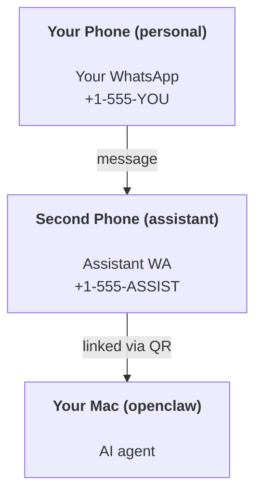

---
read_when:
    - 새 어시스턴트 인스턴스 온보딩
    - 안전/권한 관련 영향 검토
summary: 안전 주의사항과 함께 OpenClaw를 개인 비서로 실행하기 위한 엔드투엔드 가이드
title: 개인 어시스턴트 설정
x-i18n:
    generated_at: "2026-04-30T06:51:39Z"
    model: gpt-5.5
    provider: openai
    source_hash: b0614272f9a2b30e0900c55b39a8bd6a2b71b9f5d5fbf0fe00c534b91193e6a0
    source_path: start/openclaw.md
    workflow: 16
---

# OpenClaw로 개인 비서 만들기

OpenClaw는 Discord, Google Chat, iMessage, Matrix, Microsoft Teams, Signal, Slack, Telegram, WhatsApp, Zalo 등을 AI 에이전트에 연결하는 셀프 호스팅 Gateway입니다. 이 가이드는 "개인 비서" 설정, 즉 항상 켜져 있는 AI 비서처럼 동작하는 전용 WhatsApp 번호 구성을 다룹니다.

## ⚠️ 안전 우선

에이전트에게 다음을 할 수 있는 위치를 부여하게 됩니다.

- 머신에서 명령 실행(도구 정책에 따라 다름)
- 워크스페이스에서 파일 읽기/쓰기
- WhatsApp/Telegram/Discord/Mattermost 및 기타 번들 채널을 통해 메시지 다시 보내기

보수적으로 시작하세요.

- 항상 `channels.whatsapp.allowFrom`을 설정하세요(개인 Mac에서 전 세계에 열어 두고 실행하지 마세요).
- 비서용 전용 WhatsApp 번호를 사용하세요.
- Heartbeat는 이제 기본적으로 30분마다 실행됩니다. 설정을 신뢰하기 전까지는 `agents.defaults.heartbeat.every: "0m"`을 설정해 비활성화하세요.

## 전제 조건

- OpenClaw 설치 및 온보딩 완료 — 아직 하지 않았다면 [시작하기](/ko/start/getting-started)를 참조하세요.
- 비서용 두 번째 전화번호(SIM/eSIM/선불)

## 두 대의 전화 설정(권장)

원하는 구성은 다음과 같습니다.



개인 WhatsApp을 OpenClaw에 연결하면, 당신에게 오는 모든 메시지가 “에이전트 입력”이 됩니다. 이는 대개 원하는 동작이 아닙니다.

## 5분 빠른 시작

1. WhatsApp Web을 페어링합니다(QR 표시, 비서 전화로 스캔).

```bash
openclaw channels login
```

2. Gateway를 시작합니다(계속 실행 상태로 둡니다).

```bash
openclaw gateway --port 18789
```

3. `~/.openclaw/openclaw.json`에 최소 구성을 넣습니다.

```json5
{
  gateway: { mode: "local" },
  channels: { whatsapp: { allowFrom: ["+15555550123"] } },
}
```

이제 허용 목록에 있는 전화에서 비서 번호로 메시지를 보내세요.

온보딩이 끝나면 OpenClaw가 대시보드를 자동으로 열고 깔끔한(토큰화되지 않은) 링크를 출력합니다. 대시보드에서 인증을 요구하면 구성된 공유 비밀을 Control UI 설정에 붙여 넣으세요. 온보딩은 기본적으로 토큰(`gateway.auth.token`)을 사용하지만, `gateway.auth.mode`를 `password`로 전환했다면 비밀번호 인증도 동작합니다. 나중에 다시 열려면 `openclaw dashboard`를 사용하세요.

## 에이전트에 워크스페이스 제공하기(AGENTS)

OpenClaw는 워크스페이스 디렉터리에서 운영 지침과 “메모리”를 읽습니다.

기본적으로 OpenClaw는 `~/.openclaw/workspace`를 에이전트 워크스페이스로 사용하며, 설정/첫 에이전트 실행 시 이를 자동으로 생성하고 시작용 `AGENTS.md`, `SOUL.md`, `TOOLS.md`, `IDENTITY.md`, `USER.md`, `HEARTBEAT.md`도 함께 만듭니다. `BOOTSTRAP.md`는 워크스페이스가 완전히 새로울 때만 생성됩니다(삭제한 뒤 다시 생기지 않아야 합니다). `MEMORY.md`는 선택 사항이며(자동 생성되지 않음), 존재하면 일반 세션에서 로드됩니다. 하위 에이전트 세션은 `AGENTS.md`와 `TOOLS.md`만 주입합니다.

<Tip>
이 폴더를 OpenClaw의 메모리처럼 다루고 git 리포지토리(가능하면 비공개)로 만들어 `AGENTS.md`와 메모리 파일이 백업되도록 하세요. git이 설치되어 있으면 완전히 새로운 워크스페이스는 자동으로 초기화됩니다.
</Tip>

```bash
openclaw setup
```

전체 워크스페이스 레이아웃 및 백업 가이드: [에이전트 워크스페이스](/ko/concepts/agent-workspace)
메모리 워크플로: [메모리](/ko/concepts/memory)

선택 사항: `agents.defaults.workspace`로 다른 워크스페이스를 선택할 수 있습니다(`~` 지원).

```json5
{
  agents: {
    defaults: {
      workspace: "~/.openclaw/workspace",
    },
  },
}
```

이미 자체 워크스페이스 파일을 리포지토리에서 제공하고 있다면, 부트스트랩 파일 생성을 완전히 비활성화할 수 있습니다.

```json5
{
  agents: {
    defaults: {
      skipBootstrap: true,
    },
  },
}
```

## "비서"로 바꾸는 구성

OpenClaw는 기본적으로 좋은 비서 설정을 제공하지만, 일반적으로 다음을 조정하게 됩니다.

- [`SOUL.md`](/ko/concepts/soul)의 페르소나/지침
- 사고 기본값(원하는 경우)
- Heartbeat(설정을 신뢰하게 된 뒤)

예:

```json5
{
  logging: { level: "info" },
  agent: {
    model: "anthropic/claude-opus-4-6",
    workspace: "~/.openclaw/workspace",
    thinkingDefault: "high",
    timeoutSeconds: 1800,
    // Start with 0; enable later.
    heartbeat: { every: "0m" },
  },
  channels: {
    whatsapp: {
      allowFrom: ["+15555550123"],
      groups: {
        "*": { requireMention: true },
      },
    },
  },
  routing: {
    groupChat: {
      mentionPatterns: ["@openclaw", "openclaw"],
    },
  },
  session: {
    scope: "per-sender",
    resetTriggers: ["/new", "/reset"],
    reset: {
      mode: "daily",
      atHour: 4,
      idleMinutes: 10080,
    },
  },
}
```

## 세션과 메모리

- 세션 파일: `~/.openclaw/agents/<agentId>/sessions/{{SessionId}}.jsonl`
- 세션 메타데이터(토큰 사용량, 마지막 라우트 등): `~/.openclaw/agents/<agentId>/sessions/sessions.json`(레거시: `~/.openclaw/sessions/sessions.json`)
- `/new` 또는 `/reset`은 해당 채팅의 새 세션을 시작합니다(`resetTriggers`를 통해 구성 가능). 단독으로 보내면 OpenClaw는 모델을 호출하지 않고 재설정을 확인합니다.
- `/compact [instructions]`는 세션 컨텍스트를 Compaction하고 남은 컨텍스트 예산을 보고합니다.

## Heartbeat(능동 모드)

기본적으로 OpenClaw는 다음 프롬프트로 30분마다 Heartbeat를 실행합니다.
`Read HEARTBEAT.md if it exists (workspace context). Follow it strictly. Do not infer or repeat old tasks from prior chats. If nothing needs attention, reply HEARTBEAT_OK.`
비활성화하려면 `agents.defaults.heartbeat.every: "0m"`을 설정하세요.

- `HEARTBEAT.md`가 존재하지만 사실상 비어 있는 경우(빈 줄과 `# Heading` 같은 마크다운 헤더만 있는 경우), OpenClaw는 API 호출을 아끼기 위해 Heartbeat 실행을 건너뜁니다.
- 파일이 없으면 Heartbeat는 여전히 실행되고, 모델이 무엇을 할지 결정합니다.
- 에이전트가 `HEARTBEAT_OK`로 응답하면(짧은 패딩 포함 가능, `agents.defaults.heartbeat.ackMaxChars` 참조), OpenClaw는 해당 Heartbeat의 외부 전달을 억제합니다.
- 기본적으로 DM 스타일 `user:<id>` 대상에 대한 Heartbeat 전달은 허용됩니다. Heartbeat 실행은 활성 상태로 유지하면서 직접 대상 전달을 억제하려면 `agents.defaults.heartbeat.directPolicy: "block"`을 설정하세요.
- Heartbeat는 전체 에이전트 턴을 실행합니다. 간격이 짧을수록 더 많은 토큰을 소모합니다.

```json5
{
  agent: {
    heartbeat: { every: "30m" },
  },
}
```

## 미디어 입력 및 출력

인바운드 첨부 파일(이미지/오디오/문서)은 템플릿을 통해 명령에 노출될 수 있습니다.

- `{{MediaPath}}`(로컬 임시 파일 경로)
- `{{MediaUrl}}`(의사 URL)
- `{{Transcript}}`(오디오 전사가 활성화된 경우)

에이전트의 아웃바운드 첨부 파일: 자체 줄에 `MEDIA:<path-or-url>`을 포함하세요(공백 없음). 예:

```
Here’s the screenshot.
MEDIA:https://example.com/screenshot.png
```

OpenClaw는 이를 추출해 텍스트와 함께 미디어로 전송합니다.

로컬 경로 동작은 에이전트와 동일한 파일 읽기 신뢰 모델을 따릅니다.

- `tools.fs.workspaceOnly`가 `true`이면, 아웃바운드 `MEDIA:` 로컬 경로는 OpenClaw 임시 루트, 미디어 캐시, 에이전트 워크스페이스 경로, 샌드박스에서 생성된 파일로 제한됩니다.
- `tools.fs.workspaceOnly`가 `false`이면, 아웃바운드 `MEDIA:`는 에이전트가 이미 읽을 수 있도록 허용된 호스트 로컬 파일을 사용할 수 있습니다.
- 호스트 로컬 전송은 여전히 미디어와 안전한 문서 유형(이미지, 오디오, 동영상, PDF, Office 문서)만 허용합니다. 일반 텍스트 및 비밀처럼 보이는 파일은 전송 가능한 미디어로 취급되지 않습니다.

즉, fs 정책이 이미 해당 읽기를 허용한다면 이제 워크스페이스 외부에서 생성된 이미지/파일도 전송할 수 있으며, 임의의 호스트 텍스트 첨부 파일 유출을 다시 열지 않습니다.

## 운영 체크리스트

```bash
openclaw status          # local status (creds, sessions, queued events)
openclaw status --all    # full diagnosis (read-only, pasteable)
openclaw status --deep   # asks the gateway for a live health probe with channel probes when supported
openclaw health --json   # gateway health snapshot (WS; default can return a fresh cached snapshot)
```

로그는 `/tmp/openclaw/` 아래에 있습니다(기본값: `openclaw-YYYY-MM-DD.log`).

## 다음 단계

- WebChat: [WebChat](/ko/web/webchat)
- Gateway 운영: [Gateway 런북](/ko/gateway)
- Cron + 깨우기: [Cron 작업](/ko/automation/cron-jobs)
- macOS 메뉴 막대 companion: [OpenClaw macOS 앱](/ko/platforms/macos)
- iOS 노드 앱: [iOS 앱](/ko/platforms/ios)
- Android 노드 앱: [Android 앱](/ko/platforms/android)
- Windows 상태: [Windows (WSL2)](/ko/platforms/windows)
- Linux 상태: [Linux 앱](/ko/platforms/linux)
- 보안: [보안](/ko/gateway/security)

## 관련 항목

- [시작하기](/ko/start/getting-started)
- [설정](/ko/start/setup)
- [채널 개요](/ko/channels)
