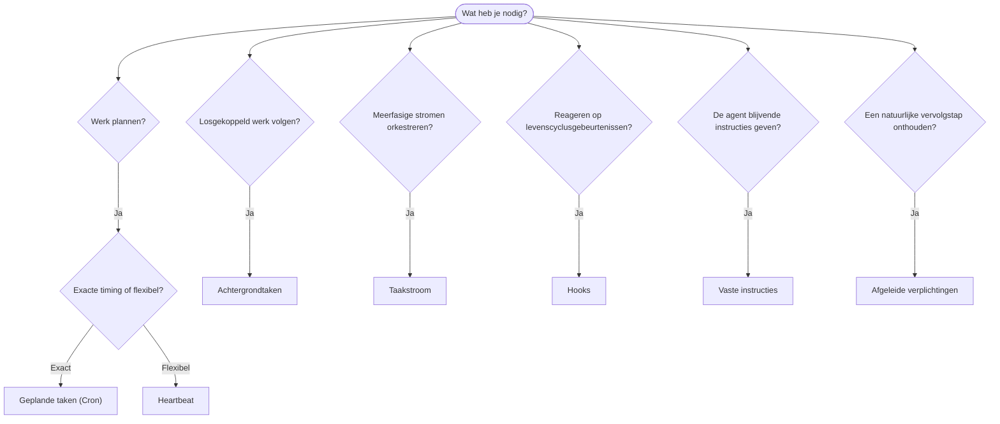

---
read_when:
    - Bepalen hoe je werk automatiseert met OpenClaw
    - Kiezen tussen Heartbeat, Cron, toezeggingen, hooks en vaste opdrachten
    - Het juiste automatiseringsingangspunt zoeken
summary: 'Overzicht van automatiseringsmechanismen: taken, Cron, hooks, vaste opdrachten en Task Flow'
title: Automatisering en taken
x-i18n:
    generated_at: "2026-05-06T09:02:26Z"
    model: gpt-5.5
    provider: openai
    source_hash: ee7f34fa4840c0e43e50d09e415b2529ef0c8bc3ccb6e3546b8a873c9458832d
    source_path: automation/index.md
    workflow: 16
---

OpenClaw voert werk op de achtergrond uit via taken, geplande jobs, afgeleide
verplichtingen, event-hooks en vaste instructies. Deze pagina helpt je het juiste
mechanisme te kiezen en te begrijpen hoe ze samenhangen.

## Snelle beslisgids

| Gebruikssituatie                                      | Aanbevolen                 | Waarom                                           |
| ----------------------------------------------------- | -------------------------- | ------------------------------------------------ |
| Dagelijks rapport stipt om 9:00 verzenden             | Geplande taken (Cron)      | Exacte timing, geïsoleerde uitvoering            |
| Herinner me over 20 minuten                           | Geplande taken (Cron)      | Eenmalig met precieze timing (`--at`)            |
| Wekelijkse diepgaande analyse uitvoeren               | Geplande taken (Cron)      | Zelfstandige taak, kan een ander model gebruiken |
| Inbox elke 30 min controleren                         | Heartbeat                  | Bundelt met andere controles, contextbewust      |
| Agenda bewaken op aankomende gebeurtenissen           | Heartbeat                  | Natuurlijke keuze voor periodiek bewustzijn      |
| Terugkomen na een genoemd interview                   | Afgeleide verplichtingen   | Geheugenachtige opvolging, geen exacte herinneringsaanvraag |
| Zorgzame check-in na gebruikerscontext                | Afgeleide verplichtingen   | Beperkt tot dezelfde agent en hetzelfde kanaal   |
| Status van een subagent of ACP-run inspecteren        | Achtergrondtaken           | Takenlogboek volgt al het losgekoppelde werk     |
| Controleren wat wanneer is uitgevoerd                 | Achtergrondtaken           | `openclaw tasks list` en `openclaw tasks audit`  |
| Meerfasig onderzoek en daarna samenvatten             | Taakstroom                 | Duurzame orkestratie met revisietracking         |
| Een script uitvoeren bij sessiereset                  | Hooks                      | Event-gestuurd, wordt geactiveerd bij levenscyclusgebeurtenissen |
| Code uitvoeren bij elke tool-aanroep                  | Plugin-hooks               | In-process hooks kunnen tool-aanroepen onderscheppen |
| Altijd compliance controleren voordat wordt geantwoord | Vaste instructies          | Automatisch in elke sessie geïnjecteerd          |

### Geplande taken (Cron) versus Heartbeat

| Dimensie       | Geplande taken (Cron)              | Heartbeat                             |
| -------------- | ---------------------------------- | ------------------------------------- |
| Timing         | Exact (cron-expressies, eenmalig)  | Bij benadering (standaard elke 30 min) |
| Sessiecontext  | Nieuw (geïsoleerd) of gedeeld      | Volledige hoofd-sessiecontext         |
| Taakrecords    | Altijd aangemaakt                  | Nooit aangemaakt                      |
| Levering       | Kanaal, Webhook of stil            | Inline in de hoofdsessie              |
| Beste voor     | Rapporten, herinneringen, achtergrondjobs | Inboxcontroles, agenda, meldingen |

Gebruik geplande taken (Cron) wanneer je precieze timing of geïsoleerde uitvoering nodig hebt. Gebruik Heartbeat wanneer het werk baat heeft bij volledige sessiecontext en timing bij benadering voldoende is.

## Kernconcepten

### Geplande taken (cron)

Cron is de ingebouwde planner van de Gateway voor precieze timing. Het bewaart jobs, wekt de agent op het juiste moment en kan output afleveren aan een chatkanaal of Webhook-eindpunt. Ondersteunt eenmalige herinneringen, terugkerende expressies en inkomende Webhook-triggers.

Zie [Geplande taken](/nl/automation/cron-jobs).

### Taken

Het achtergrondtakenlogboek volgt al het losgekoppelde werk: ACP-runs, subagent-starts, geïsoleerde cron-uitvoeringen en CLI-bewerkingen. Taken zijn records, geen planners. Gebruik `openclaw tasks list` en `openclaw tasks audit` om ze te inspecteren.

Zie [Achtergrondtaken](/nl/automation/tasks).

### Afgeleide verplichtingen

Verplichtingen zijn opt-in, kortlevende opvolgingsherinneringen. OpenClaw leidt ze af
uit normale gesprekken, beperkt ze tot dezelfde agent en hetzelfde kanaal, en
levert verschuldigde check-ins via Heartbeat. Exacte door de gebruiker gevraagde herinneringen horen nog steeds
bij Cron.

Zie [Afgeleide verplichtingen](/nl/concepts/commitments).

### Taakstroom

Taakstroom is de flow-orkestratielaag boven achtergrondtaken. Deze beheert duurzame meerfasige stromen met beheerde en gespiegelde synchronisatiemodi, revisietracking en `openclaw tasks flow list|show|cancel` voor inspectie.

Zie [Taakstroom](/nl/automation/taskflow).

### Vaste instructies

Vaste instructies geven de agent permanente operationele bevoegdheid voor gedefinieerde programma's. Ze staan in werkruimtebestanden (meestal `AGENTS.md`) en worden in elke sessie geïnjecteerd. Combineer met Cron voor tijdgebaseerde handhaving.

Zie [Vaste instructies](/nl/automation/standing-orders).

### Hooks

Interne hooks zijn event-gestuurde scripts die worden geactiveerd door levenscyclusgebeurtenissen van de agent
(`/new`, `/reset`, `/stop`), sessie-Compaction, het starten van de Gateway en de berichtenstroom.
Ze worden automatisch ontdekt vanuit mappen en kunnen worden beheerd
met `openclaw hooks`. Gebruik voor onderschepping van in-process tool-aanroepen
[Plugin-hooks](/nl/plugins/hooks).

Zie [Hooks](/nl/automation/hooks).

### Heartbeat

Heartbeat is een periodieke hoofd-sessiebeurt (standaard elke 30 minuten). Het bundelt meerdere controles (inbox, agenda, meldingen) in één agentbeurt met volledige sessiecontext. Heartbeat-beurten maken geen taakrecords aan en verlengen de versheid van dagelijkse/inactieve sessieresets niet. Gebruik `HEARTBEAT.md` voor een kleine checklist, of een `tasks:`-blok wanneer je alleen-vervallen periodieke controles binnen Heartbeat zelf wilt. Lege Heartbeat-bestanden worden overgeslagen als `empty-heartbeat-file`; de taakmodus met alleen vervallen taken wordt overgeslagen als `no-tasks-due`. Heartbeats worden uitgesteld terwijl Cron-werk actief is of in de wachtrij staat, en `heartbeat.skipWhenBusy` kan ze ook uitstellen terwijl subagent- of geneste lanes bezet zijn.

Zie [Heartbeat](/nl/gateway/heartbeat).

## Hoe ze samenwerken

- **Cron** verwerkt precieze planningen (dagelijkse rapporten, wekelijkse reviews) en eenmalige herinneringen. Alle Cron-uitvoeringen maken taakrecords aan.
- **Heartbeat** verwerkt routinematige monitoring (inbox, agenda, meldingen) in één gebundelde beurt elke 30 minuten.
- **Hooks** reageren op specifieke gebeurtenissen (sessieresets, Compaction, berichtenstroom) met aangepaste scripts. Plugin-hooks dekken tool-aanroepen af.
- **Vaste instructies** geven de agent blijvende context en bevoegdheidsgrenzen.
- **Taakstroom** coördineert meerfasige stromen boven individuele taken.
- **Taken** volgen automatisch al het losgekoppelde werk, zodat je het kunt inspecteren en auditen.

## Gerelateerd

- [Geplande taken](/nl/automation/cron-jobs) — precieze planning en eenmalige herinneringen
- [Afgeleide verplichtingen](/nl/concepts/commitments) — geheugenachtige opvolg-check-ins
- [Achtergrondtaken](/nl/automation/tasks) — takenlogboek voor al het losgekoppelde werk
- [Taakstroom](/nl/automation/taskflow) — duurzame orkestratie van meerfasige stromen
- [Hooks](/nl/automation/hooks) — event-gestuurde levenscyclusscripts
- [Plugin-hooks](/nl/plugins/hooks) — in-process tool-, prompt-, bericht- en levenscyclus-hooks
- [Vaste instructies](/nl/automation/standing-orders) — blijvende agentinstructies
- [Heartbeat](/nl/gateway/heartbeat) — periodieke hoofd-sessiebeurten
- [Configuratiereferentie](/nl/gateway/configuration-reference) — alle configuratiesleutels
