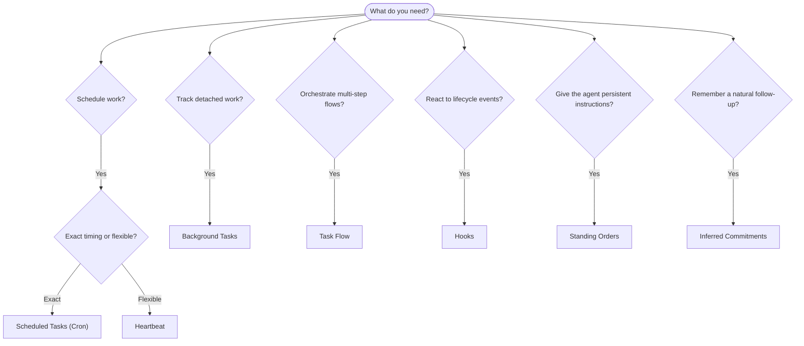

OpenClaw voert werk op de achtergrond uit via taken, geplande jobs, afgeleide
toezeggingen, event hooks en vaste instructies. Deze pagina helpt je het juiste
mechanisme te kiezen en te begrijpen hoe ze samenhangen.

## Snelle beslisgids

| Gebruikssituatie                              | Aanbevolen             | Waarom                                             |
| --------------------------------------------- | ---------------------- | -------------------------------------------------- |
| Dagelijks rapport exact om 9:00 verzenden     | Geplande taken (Cron)  | Exacte timing, geïsoleerde uitvoering              |
| Herinner me over 20 minuten                   | Geplande taken (Cron)  | Eenmalig met precieze timing (`--at`)              |
| Wekelijkse diepgaande analyse uitvoeren       | Geplande taken (Cron)  | Zelfstandige taak, kan een ander model gebruiken   |
| Inbox elke 30 min controleren                 | Heartbeat              | Bundelt met andere controles, contextbewust        |
| Agenda monitoren op komende gebeurtenissen    | Heartbeat              | Natuurlijke keuze voor periodiek bewustzijn        |
| Opvolgen na een genoemd sollicitatiegesprek   | Afgeleide toezeggingen | Geheugenachtige opvolging, geen exact herinneringsverzoek |
| Zorgzame check-in na gebruikerscontext        | Afgeleide toezeggingen | Beperkt tot dezelfde agent en hetzelfde kanaal     |
| Status van een subagent of ACP-run bekijken   | Achtergrondtaken       | Takenregister houdt al het losgekoppelde werk bij  |
| Controleren wat draaide en wanneer            | Achtergrondtaken       | `openclaw tasks list` en `openclaw tasks audit`    |
| Meerfasig onderzoek en daarna samenvatten     | Task Flow              | Duurzame orkestratie met revisietracking           |
| Een script uitvoeren bij sessiereset          | Hooks                  | Eventgestuurd, wordt geactiveerd bij levenscyclusgebeurtenissen |
| Code uitvoeren bij elke toolaanroep           | Plugin hooks           | In-process hooks kunnen toolaanroepen onderscheppen |
| Altijd compliance controleren voor antwoorden | Vaste instructies      | Automatisch in elke sessie geïnjecteerd            |

### Geplande taken (Cron) vs Heartbeat

| Dimensie        | Geplande taken (Cron)                | Heartbeat                             |
| --------------- | ------------------------------------ | ------------------------------------- |
| Timing          | Exact (cron-expressies, eenmalig)    | Bij benadering (standaard elke 30 min) |
| Sessiecontext   | Nieuw (geïsoleerd) of gedeeld        | Volledige hoofdsessiecontext          |
| Taakrecords     | Altijd aangemaakt                    | Nooit aangemaakt                      |
| Levering        | Kanaal, webhook of stil              | Inline in de hoofdsessie              |
| Beste voor      | Rapporten, herinneringen, achtergrondjobs | Inboxcontroles, agenda, meldingen |

Gebruik geplande taken (Cron) wanneer je precieze timing of geïsoleerde uitvoering nodig hebt. Gebruik Heartbeat wanneer het werk baat heeft bij volledige sessiecontext en timing bij benadering voldoende is.

## Kernconcepten

### Geplande taken (cron)

Cron is de ingebouwde planner van de Gateway voor precieze timing. Het bewaart jobs, wekt de agent op het juiste moment en kan output afleveren in een chatkanaal of webhook-eindpunt. Ondersteunt eenmalige herinneringen, terugkerende expressies en inkomende webhooktriggers.

Zie [Geplande taken](/nl/automation/cron-jobs).

### Taken

Het achtergrondtakenregister houdt al het losgekoppelde werk bij: ACP-runs, gestarte subagents, geïsoleerde cron-uitvoeringen en CLI-bewerkingen. Taken zijn records, geen planners. Gebruik `openclaw tasks list` en `openclaw tasks audit` om ze te bekijken.

Zie [Achtergrondtaken](/nl/automation/tasks).

### Afgeleide toezeggingen

Toezeggingen zijn opt-in, kortlevende opvolgingsherinneringen. OpenClaw leidt ze af
uit normale gesprekken, beperkt ze tot dezelfde agent en hetzelfde kanaal, en
levert verschuldigde check-ins via Heartbeat. Exacte door de gebruiker gevraagde herinneringen horen nog steeds
bij cron.

Zie [Afgeleide toezeggingen](/nl/concepts/commitments).

### Task Flow

Task Flow is het flow-orkestratiesubstraat boven achtergrondtaken. Het beheert duurzame meerfasige flows met beheerde en gespiegeld gesynchroniseerde modi, revisietracking en `openclaw tasks flow list|show|cancel` voor inspectie.

Zie [Task Flow](/nl/automation/taskflow).

### Vaste instructies

Vaste instructies geven de agent permanente operationele bevoegdheid voor gedefinieerde programma's. Ze staan in werkruimtebestanden (meestal `AGENTS.md`) en worden in elke sessie geïnjecteerd. Combineer met cron voor tijdgebaseerde handhaving.

Zie [Vaste instructies](/nl/automation/standing-orders).

### Hooks

Interne hooks zijn eventgestuurde scripts die worden geactiveerd door levenscyclusgebeurtenissen
van agents (`/new`, `/reset`, `/stop`), sessie-Compaction, Gateway-start en berichtstroom.
Ze worden automatisch uit mappen ontdekt en kunnen worden beheerd
met `openclaw hooks`. Gebruik voor in-process onderschepping van toolaanroepen
[Plugin hooks](/nl/plugins/hooks).

Zie [Hooks](/nl/automation/hooks).

### Heartbeat

Heartbeat is een periodieke beurt in de hoofdsessie (standaard elke 30 minuten). Het bundelt meerdere controles (inbox, agenda, meldingen) in één agentbeurt met volledige sessiecontext. Heartbeat-beurten maken geen taakrecords aan en verlengen de versheid van dagelijkse/inactieve sessieresets niet. Gebruik `HEARTBEAT.md` voor een kleine checklist, of een `tasks:`-blok wanneer je verschuldigde periodieke controles binnen Heartbeat zelf wilt. Lege Heartbeat-bestanden worden overgeslagen als `empty-heartbeat-file`; de modus met alleen verschuldigde taken wordt overgeslagen als `no-tasks-due`. Heartbeats worden uitgesteld terwijl cron-werk actief is of in de wachtrij staat, en `heartbeat.skipWhenBusy` kan een agent ook uitstellen terwijl de sessiesleutelgebonden subagent of geneste lanes van diezelfde agent bezig zijn.

Zie [Heartbeat](/nl/gateway/heartbeat).

## Hoe ze samenwerken

- **Cron** verwerkt precieze schema's (dagelijkse rapporten, wekelijkse reviews) en eenmalige herinneringen. Alle cron-uitvoeringen maken taakrecords aan.
- **Heartbeat** verwerkt routinematige monitoring (inbox, agenda, meldingen) in één gebundelde beurt elke 30 minuten.
- **Hooks** reageren op specifieke events (sessieresets, Compaction, berichtstroom) met aangepaste scripts. Plugin hooks dekken toolaanroepen.
- **Vaste instructies** geven de agent permanente context en bevoegdheidsgrenzen.
- **Task Flow** coördineert meerfasige flows boven individuele taken.
- **Taken** houden automatisch al het losgekoppelde werk bij, zodat je het kunt bekijken en auditen.

## Gerelateerd

- [Geplande taken](/nl/automation/cron-jobs) — precieze planning en eenmalige herinneringen
- [Afgeleide toezeggingen](/nl/concepts/commitments) — geheugenachtige opvolg-check-ins
- [Achtergrondtaken](/nl/automation/tasks) — taakregister voor al het losgekoppelde werk
- [Task Flow](/nl/automation/taskflow) — duurzame meerfasige flow-orkestratie
- [Hooks](/nl/automation/hooks) — eventgestuurde levenscyclusscripts
- [Plugin hooks](/nl/plugins/hooks) — in-process hooks voor tools, prompts, berichten en levenscyclus
- [Vaste instructies](/nl/automation/standing-orders) — permanente agentinstructies
- [Heartbeat](/nl/gateway/heartbeat) — periodieke beurten in de hoofdsessie
- [Configuratiereferentie](/nl/gateway/configuration-reference) — alle configuratiesleutels
