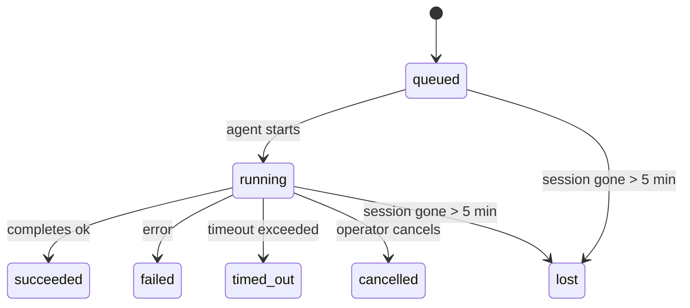

---
read_when:
    - Lopend of recent voltooid achtergrondwerk inspecteren
    - Afleveringsfouten bij losgekoppelde agentuitvoeringen debuggen
    - Inzicht in hoe achtergronduitvoeringen samenhangen met sessies, Cron en Heartbeat
sidebarTitle: Background tasks
summary: Bijhouden van achtergrondtaken voor ACP-uitvoeringen, subagenten, geïsoleerde Cron-taken en CLI-bewerkingen
title: Achtergrondtaken
x-i18n:
    generated_at: "2026-05-07T13:13:42Z"
    model: gpt-5.5
    provider: openai
    source_hash: a91a04ef6142e488d2fbc459d2c663afb93816a58fe9f52e0a51420703ea2d4d
    source_path: automation/tasks.md
    workflow: 16
---

<Note>
Op zoek naar planning? Zie [Automatisering en taken](/nl/automation) om het juiste mechanisme te kiezen. Deze pagina is het activiteitenlogboek voor achtergrondwerk, niet de planner.
</Note>

Achtergrondtaken volgen werk dat **buiten je hoofdgesprekssessie** draait: ACP-runs, het starten van subagents, geïsoleerde cron-taakuitvoeringen en door de CLI gestarte bewerkingen.

Taken vervangen **geen** sessies, cron-taken of heartbeats - ze zijn het **activiteitenlogboek** dat vastlegt welk losgekoppeld werk is gebeurd, wanneer, en of het is geslaagd.

<Note>
Niet elke agent-run maakt een taak aan. Heartbeat-beurten en normale interactieve chat doen dat niet. Alle cron-uitvoeringen, ACP-starts, subagent-starts en CLI-agentopdrachten doen dat wel.
</Note>

## TL;DR

- Taken zijn **records**, geen planners - cron en heartbeat bepalen _wanneer_ werk draait, taken volgen _wat er is gebeurd_.
- ACP, subagents, alle cron-taken en CLI-bewerkingen maken taken aan. Heartbeat-beurten doen dat niet.
- Elke taak doorloopt `queued → running → terminal` (succeeded, failed, timed_out, cancelled of lost).
- Cron-taken blijven live zolang de cron-runtime de taak nog bezit; als de
  runtime-status in het geheugen weg is, controleert taakonderhoud eerst de duurzame cron-
  uitvoeringsgeschiedenis voordat een taak als lost wordt gemarkeerd.
- Voltooiing is push-gestuurd: losgekoppeld werk kan rechtstreeks melden of de
  aanvragende sessie/Heartbeat wekken wanneer het klaar is, dus statuspolling-loops zijn
  meestal de verkeerde vorm.
- Geïsoleerde cron-runs en subagent-voltooiingen ruimen naar beste vermogen bijgehouden browsertabbladen/processen voor hun kindsessie op vóór de definitieve opruimboekhouding.
- Geïsoleerde cron-bezorging onderdrukt verouderde tussentijdse bovenliggende antwoorden terwijl afstammend subagent-werk nog aan het leeglopen is, en geeft de voorkeur aan definitieve afstammende uitvoer wanneer die vóór bezorging arriveert.
- Voltooiingsmeldingen worden rechtstreeks aan een kanaal geleverd of in de wachtrij gezet voor de volgende Heartbeat.
- `openclaw tasks list` toont alle taken; `openclaw tasks audit` brengt problemen naar voren.
- Terminale records worden 7 dagen bewaard en daarna automatisch opgeschoond.

## Snelstart

<Tabs>
  <Tab title="Weergeven en filteren">
    ```bash
    # List all tasks (newest first)
    openclaw tasks list

    # Filter by runtime or status
    openclaw tasks list --runtime acp
    openclaw tasks list --status running
    ```

  </Tab>
  <Tab title="Inspecteren">
    ```bash
    # Show details for a specific task (by ID, run ID, or session key)
    openclaw tasks show <lookup>
    ```
  </Tab>
  <Tab title="Annuleren en melden">
    ```bash
    # Cancel a running task (kills the child session)
    openclaw tasks cancel <lookup>

    # Change notification policy for a task
    openclaw tasks notify <lookup> state_changes
    ```

  </Tab>
  <Tab title="Audit en onderhoud">
    ```bash
    # Run a health audit
    openclaw tasks audit

    # Preview or apply maintenance
    openclaw tasks maintenance
    openclaw tasks maintenance --apply
    ```

  </Tab>
  <Tab title="Taakstroom">
    ```bash
    # Inspect TaskFlow state
    openclaw tasks flow list
    openclaw tasks flow show <lookup>
    openclaw tasks flow cancel <lookup>
    ```
  </Tab>
</Tabs>

## Wat maakt een taak aan

| Bron                   | Runtime-type | Wanneer een taakrecord wordt aangemaakt                 | Standaard meldingsbeleid |
| ---------------------- | ------------ | ------------------------------------------------------- | ------------------------ |
| ACP-achtergrondruns    | `acp`        | Een ACP-kindsessie starten                              | `done_only`              |
| Subagent-orkestratie   | `subagent`   | Een subagent starten via `sessions_spawn`               | `done_only`              |
| Cron-taken (alle typen) | `cron`      | Elke cron-uitvoering (hoofdsessie en geïsoleerd)        | `silent`                 |
| CLI-bewerkingen        | `cli`        | `openclaw agent`-opdrachten die via de gateway draaien  | `silent`                 |
| Agent-mediataken       | `cli`        | Sessiegedragen `music_generate`/`video_generate`-runs   | `silent`                 |

<AccordionGroup>
  <Accordion title="Standaardmeldingen voor cron en media">
    Cron-taken in de hoofdsessie gebruiken standaard het meldingsbeleid `silent` - ze maken records aan voor tracking, maar genereren geen meldingen. Geïsoleerde cron-taken staan ook standaard op `silent`, maar zijn zichtbaarder omdat ze in hun eigen sessie draaien.

    Sessiegedragen `music_generate`- en `video_generate`-runs gebruiken ook het meldingsbeleid `silent`. Ze maken nog steeds taakrecords aan, maar voltooiing wordt als interne wake teruggegeven aan de oorspronkelijke agentsessie zodat de agent het vervolgbericht kan schrijven en de voltooide media zelf kan bijvoegen. Voltooiingen in groepen/kanalen volgen het normale beleid voor zichtbare antwoorden, zodat de agent de berichttool gebruikt wanneer bronbezorging dat vereist. Als de voltooiingsagent geen bewijs voor bezorging via de berichttool produceert in een route met alleen tools, stuurt OpenClaw de voltooiingsfallback rechtstreeks naar het oorspronkelijke kanaal in plaats van de media privé te laten.

  </Accordion>
  <Accordion title="Beveiliging tegen gelijktijdige video_generate">
    Terwijl een sessiegedragen `video_generate`-taak nog actief is, fungeert de tool ook als vangrail: herhaalde `video_generate`-aanroepen in diezelfde sessie geven de actieve taakstatus terug in plaats van een tweede gelijktijdige generatie te starten. Gebruik `action: "status"` wanneer je expliciet voortgang/status wilt opvragen vanaf de agentkant.
  </Accordion>
  <Accordion title="Wat maakt geen taken aan">
    - Heartbeat-beurten - hoofdsessie; zie [Heartbeat](/nl/gateway/heartbeat)
    - Normale interactieve chatbeurten
    - Rechtstreekse `/command`-antwoorden

  </Accordion>
</AccordionGroup>

## Taaklevenscyclus



| Status      | Wat het betekent                                                          |
| ----------- | -------------------------------------------------------------------------- |
| `queued`    | Aangemaakt, wacht tot de agent start                                       |
| `running`   | Agent-beurt wordt actief uitgevoerd                                       |
| `succeeded` | Succesvol voltooid                                                        |
| `failed`    | Voltooid met een fout                                                     |
| `timed_out` | De geconfigureerde timeout overschreden                                   |
| `cancelled` | Gestopt door de operator via `openclaw tasks cancel`                      |
| `lost`      | De runtime verloor gezaghebbende ondersteunende status na een respijtperiode van 5 minuten |

Overgangen gebeuren automatisch - wanneer de bijbehorende agent-run eindigt, wordt de taakstatus bijgewerkt om daarmee overeen te komen.

Voltooiing van de agent-run is gezaghebbend voor actieve taakrecords. Een geslaagde losgekoppelde run wordt afgerond als `succeeded`, gewone run-fouten worden afgerond als `failed`, en timeout- of afbreekuitkomsten worden afgerond als `timed_out`. Als een operator de taak al heeft geannuleerd, of de runtime al een sterkere terminale status heeft geregistreerd, zoals `failed`, `timed_out` of `lost`, verlaagt een later successignaal die terminale status niet.

`lost` is runtime-bewust:

- ACP-taken: metadata van de ondersteunende ACP-kindsessie is verdwenen.
- Subagent-taken: ondersteunende kindsessie is verdwenen uit de doelagent-store.
- Cron-taken: de cron-runtime volgt de taak niet langer als actief en duurzame
  cron-uitvoeringsgeschiedenis toont geen terminal resultaat voor die run. Offline CLI-
  audit behandelt zijn eigen lege in-process cron-runtimestatus niet als gezaghebbend.
- CLI-taken: taken met een run-id/source-id gebruiken de live runcontext, zodat
  achterblijvende kindsessie- of chatsessierijen ze niet levend houden nadat de
  door de Gateway beheerde run is verdwenen. Verouderde CLI-taken zonder runidentiteit vallen nog steeds
  terug op de kindsessie. Gateway-gedragen `openclaw agent`-runs worden ook afgerond
  op basis van hun runresultaat, zodat voltooide runs niet actief blijven totdat de sweeper
  ze als `lost` markeert.

## Bezorging en meldingen

Wanneer een taak een terminale status bereikt, meldt OpenClaw je dat. Er zijn twee bezorgpaden:

**Rechtstreekse bezorging** - als de taak een kanaaldoel heeft (de `requesterOrigin`), gaat het voltooiingsbericht rechtstreeks naar dat kanaal (Telegram, Discord, Slack, enz.). Voor subagent-voltooiingen behoudt OpenClaw ook gebonden thread/topic-routering wanneer beschikbaar en kan het een ontbrekende `to` / account aanvullen vanuit de opgeslagen route van de aanvragende sessie (`lastChannel` / `lastTo` / `lastAccountId`) voordat directe bezorging wordt opgegeven.

**Sessiegewachtrijde bezorging** - als directe bezorging mislukt of er geen origin is ingesteld, wordt de update als systeemgebeurtenis in de sessie van de aanvrager in de wachtrij geplaatst en verschijnt die bij de volgende Heartbeat.

<Tip>
Taakvoltooiing triggert onmiddellijk een Heartbeat-wake zodat je het resultaat snel ziet - je hoeft niet te wachten op de volgende geplande Heartbeat-tick.
</Tip>

Dat betekent dat de gebruikelijke workflow push-gebaseerd is: start losgekoppeld werk één keer en laat de runtime je bij voltooiing wekken of melden. Poll de taakstatus alleen wanneer je debugging, ingrijpen of een expliciete audit nodig hebt.

### Meldingsbeleid

Bepaal hoeveel je over elke taak hoort:

| Beleid                | Wat wordt geleverd                                                     |
| --------------------- | ----------------------------------------------------------------------- |
| `done_only` (standaard) | Alleen terminale status (succeeded, failed, enz.) - **dit is de standaard** |
| `state_changes`       | Elke statusovergang en voortgangsupdate                                 |
| `silent`              | Helemaal niets                                                          |

Wijzig het beleid terwijl een taak draait:

```bash
openclaw tasks notify <lookup> state_changes
```

## CLI-referentie

<AccordionGroup>
  <Accordion title="tasks list">
    ```bash
    openclaw tasks list [--runtime <acp|subagent|cron|cli>] [--status <status>] [--json]
    ```

    Uitvoerkolommen: taak-ID, soort, status, bezorging, run-ID, kindsessie, samenvatting.

  </Accordion>
  <Accordion title="tasks show">
    ```bash
    openclaw tasks show <lookup>
    ```

    Het opzoektoken accepteert een taak-ID, run-ID of sessiesleutel. Toont het volledige record, inclusief timing, bezorgstatus, fout en terminale samenvatting.

  </Accordion>
  <Accordion title="tasks cancel">
    ```bash
    openclaw tasks cancel <lookup>
    ```

    Voor ACP- en subagent-taken doodt dit de kindsessie. Voor door de CLI gevolgde taken wordt annulering geregistreerd in het taakregister (er is geen aparte runtime-handle voor een kind). Status gaat over naar `cancelled` en er wordt een bezorgmelding gestuurd wanneer van toepassing.

  </Accordion>
  <Accordion title="tasks notify">
    ```bash
    openclaw tasks notify <lookup> <done_only|state_changes|silent>
    ```
  </Accordion>
  <Accordion title="tasks audit">
    ```bash
    openclaw tasks audit [--json]
    ```

    Brengt operationele problemen naar voren. Bevindingen verschijnen ook in `openclaw status` wanneer problemen worden gedetecteerd.

    | Bevinding                 | Ernst      | Trigger                                                                                                                 |
    | ------------------------- | ---------- | ----------------------------------------------------------------------------------------------------------------------- |
    | `stale_queued`            | warn       | Meer dan 10 minuten in wachtrij                                                                                         |
    | `stale_running`           | error      | Meer dan 30 minuten actief                                                                                              |
    | `lost`                    | warn/error | Door runtime ondersteund taakeigendom is verdwenen; bewaarde verloren taken waarschuwen tot `cleanupAfter` en worden daarna fouten |
    | `delivery_failed`         | warn       | Bezorging is mislukt en het meldingsbeleid is niet `silent`                                                             |
    | `missing_cleanup`         | warn       | Terminale taak zonder opschoontijdstempel                                                                               |
    | `inconsistent_timestamps` | warn       | Tijdlijnovertreding (bijvoorbeeld beëindigd vóór gestart)                                                               |

  </Accordion>
  <Accordion title="tasks maintenance">
    ```bash
    openclaw tasks maintenance [--json]
    openclaw tasks maintenance --apply [--json]
    ```

    Gebruik dit om reconciliatie, opschoonstempeling en opschoning voor taken en Task Flow-status vooraf te bekijken of toe te passen.

    Reconciliatie is runtime-bewust:

    - ACP-/subagent-taken controleren hun onderliggende kindsessie.
    - Subagent-taken waarvan de kindsessie een restart-recovery-tombstone heeft, worden als verloren gemarkeerd in plaats van behandeld als herstelbare onderliggende sessies.
    - Cron-taken controleren of de cron-runtime de job nog steeds bezit, en herstellen daarna de terminale status uit opgeslagen cron-runlogs/jobstatus voordat ze terugvallen op `lost`. Alleen het Gateway-proces is gezaghebbend voor de in-memory set met actieve cron-jobs; offline CLI-audit gebruikt duurzame geschiedenis maar markeert een cron-taak niet uitsluitend als verloren omdat die lokale Set leeg is.
    - CLI-taken met run-identiteit controleren de eigenaar-live-runcontext, niet alleen kindsessie- of chatsessierijen.

    Voltooiingsopschoning is ook runtime-bewust:

    - Subagent-voltooiing sluit op best-effort-basis bijgehouden browsertabbladen/processen voor de kindsessie voordat aankondigingsopschoning doorgaat.
    - Geïsoleerde cron-voltooiing sluit op best-effort-basis bijgehouden browsertabbladen/processen voor de cron-sessie voordat de run volledig wordt afgebroken.
    - Geïsoleerde cron-bezorging wacht waar nodig op vervolgacties van afstammende subagents en onderdrukt verouderde bevestigingstekst van de ouder in plaats van die aan te kondigen.
    - Bezorging van subagent-voltooiing geeft de voorkeur aan de nieuwste zichtbare assistenttekst; als die leeg is, valt dit terug op gesaneerde nieuwste tool-/toolResult-tekst, en runs met alleen een timeout bij tool-calls kunnen samenvallen tot een korte samenvatting van gedeeltelijke voortgang. Terminale mislukte runs kondigen de foutstatus aan zonder vastgelegde antwoordtekst opnieuw af te spelen.
    - Opschoonfouten maskeren het werkelijke taakresultaat niet.

  </Accordion>
  <Accordion title="tasks flow list | show | cancel">
    ```bash
    openclaw tasks flow list [--status <status>] [--json]
    openclaw tasks flow show <lookup> [--json]
    openclaw tasks flow cancel <lookup>
    ```

    Gebruik deze wanneer de orkestrerende Task Flow is waar u om geeft in plaats van één individuele achtergrondtaakrecord.

  </Accordion>
</AccordionGroup>

## Chattaakbord (`/tasks`)

Gebruik `/tasks` in elke chatsessie om achtergrondtaken te zien die aan die sessie zijn gekoppeld. Het bord toont actieve en recent voltooide taken met runtime, status, timing en voortgangs- of foutdetails.

Wanneer de huidige sessie geen zichtbare gekoppelde taken heeft, valt `/tasks` terug op agent-lokale taaktellingen, zodat u nog steeds een overzicht krijgt zonder details van andere sessies te lekken.

Gebruik de CLI voor het volledige operatorlogboek: `openclaw tasks list`.

## Statusintegratie (taakdruk)

`openclaw status` bevat een taakoverzicht in één oogopslag:

```
Tasks: 3 queued · 2 running · 1 issues
```

De samenvatting rapporteert:

- **active** - aantal `queued` + `running`
- **failures** - aantal `failed` + `timed_out` + `lost`
- **byRuntime** - uitsplitsing per `acp`, `subagent`, `cron`, `cli`

Zowel `/status` als de tool `session_status` gebruiken een opschoonbewuste taaksnapshot: actieve taken krijgen de voorkeur, verouderde voltooide rijen worden verborgen en recente fouten worden alleen getoond wanneer er geen actief werk meer overblijft. Dit houdt de statuskaart gericht op wat er nu toe doet.

## Opslag en onderhoud

### Waar taken staan

Taakrecords blijven bewaard in SQLite op:

```
$OPENCLAW_STATE_DIR/tasks/runs.sqlite
```

Het register wordt bij het starten van de Gateway in het geheugen geladen en synchroniseert schrijfacties naar SQLite voor duurzaamheid over herstarts heen.
De Gateway houdt de write-ahead log van SQLite begrensd door SQLite's standaard
autocheckpoint-drempel plus periodieke en afsluitende `TRUNCATE`-checkpoints te gebruiken.

### Automatisch onderhoud

Elke **60 seconden** draait er een sweeper die vier dingen afhandelt:

<Steps>
  <Step title="Reconciliatie">
    Controleert of actieve taken nog gezaghebbende runtime-ondersteuning hebben. ACP-/subagent-taken gebruiken kindsessiestatus, cron-taken gebruiken active-job-eigendom en CLI-taken met run-identiteit gebruiken de eigenaar-runcontext. Als die onderliggende status meer dan 5 minuten verdwenen is, wordt de taak gemarkeerd als `lost`.
  </Step>
  <Step title="ACP-sessiereparatie">
    Sluit terminale of verweesde door ouders beheerde eenmalige ACP-sessies, en sluit verouderde terminale of verweesde persistente ACP-sessies alleen wanneer er geen actieve gespreksbinding overblijft.
  </Step>
  <Step title="Opschoonstempeling">
    Zet een `cleanupAfter`-tijdstempel op terminale taken (endedAt + 7 dagen). Tijdens retentie verschijnen verloren taken nog steeds in audit als waarschuwingen; nadat `cleanupAfter` verloopt of wanneer opschoonmetadata ontbreekt, zijn het fouten.
  </Step>
  <Step title="Opschoning">
    Verwijdert records na hun `cleanupAfter`-datum.
  </Step>
</Steps>

<Note>
**Retentie:** terminale taakrecords worden **7 dagen** bewaard en daarna automatisch opgeschoond. Geen configuratie nodig.
</Note>

## Hoe taken zich verhouden tot andere systemen

<AccordionGroup>
  <Accordion title="Taken en Task Flow">
    [Task Flow](/nl/automation/taskflow) is de flow-orkestratielaag boven achtergrondtaken. Eén flow kan gedurende zijn levensduur meerdere taken coördineren met beheerde of gespiegelde synchronisatiemodi. Gebruik `openclaw tasks` om individuele taakrecords te inspecteren en `openclaw tasks flow` om de orkestrerende flow te inspecteren.

    Zie [Task Flow](/nl/automation/taskflow) voor details.

  </Accordion>
  <Accordion title="Taken en cron">
    Een cron-job**definitie** staat in `~/.openclaw/cron/jobs.json`; runtime-uitvoeringsstatus staat ernaast in `~/.openclaw/cron/jobs-state.json`. **Elke** cron-uitvoering maakt een taakrecord aan - zowel hoofdsessie als geïsoleerd. Cron-taken in de hoofdsessie gebruiken standaard het meldingsbeleid `silent`, zodat ze volgen zonder meldingen te genereren.

    Zie [Cron Jobs](/nl/automation/cron-jobs).

  </Accordion>
  <Accordion title="Taken en Heartbeat">
    Heartbeat-runs zijn hoofdsessiebeurten - ze maken geen taakrecords aan. Wanneer een taak is voltooid, kan die een Heartbeat-wake activeren zodat u het resultaat snel ziet.

    Zie [Heartbeat](/nl/gateway/heartbeat).

  </Accordion>
  <Accordion title="Taken en sessies">
    Een taak kan verwijzen naar een `childSessionKey` (waar het werk draait) en een `requesterSessionKey` (wie het startte). Sessies zijn gesprekscontext; taken zijn activiteitenregistratie daarbovenop.
  </Accordion>
  <Accordion title="Taken en agent-runs">
    De `runId` van een taak koppelt naar de agent-run die het werk doet. Agent-levenscyclusgebeurtenissen (start, einde, fout) werken de taakstatus automatisch bij - u hoeft de levenscyclus niet handmatig te beheren.
  </Accordion>
</AccordionGroup>

## Gerelateerd

- [Automatisering en taken](/nl/automation) - alle automatiseringsmechanismen in één oogopslag
- [CLI: Taken](/nl/cli/tasks) - CLI-opdrachtreferentie
- [Heartbeat](/nl/gateway/heartbeat) - periodieke hoofdsessiebeurten
- [Geplande taken](/nl/automation/cron-jobs) - achtergrondwerk plannen
- [Task Flow](/nl/automation/taskflow) - flow-orkestratie boven taken
