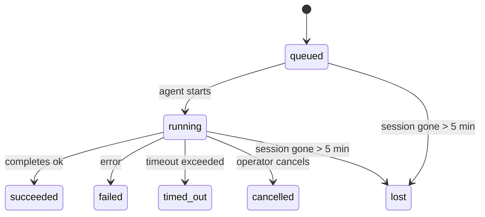

---
read_when:
    - Achtergrondwerk inspecteren dat bezig is of onlangs is voltooid
    - Afleveringsfouten voor losgekoppelde agentuitvoeringen debuggen
    - Begrijpen hoe uitvoeringen op de achtergrond zich verhouden tot sessies, Cron en Heartbeat
sidebarTitle: Background tasks
summary: Bijhouden van achtergrondtaken voor ACP-uitvoeringen, subagenten, geïsoleerde Cron-taken en CLI-bewerkingen
title: Achtergrondtaken
x-i18n:
    generated_at: "2026-04-30T16:28:13Z"
    model: gpt-5.5
    provider: openai
    source_hash: 999653c9360323d5135e33193c76458cba8c288227de46a6217f1ccbed2a6d34
    source_path: automation/tasks.md
    workflow: 16
---

<Note>
Zoek je planning? Zie [Automatisering en taken](/nl/automation) om het juiste mechanisme te kiezen. Deze pagina is het activiteitenlogboek voor achtergrondwerk, niet de planner.
</Note>

Achtergrondtaken volgen werk dat **buiten je hoofdgesprekssessie** wordt uitgevoerd: ACP-runs, subagent-starts, geïsoleerde Cron-jobuitvoeringen en door de CLI gestarte bewerkingen.

Taken vervangen **geen** sessies, Cron-jobs of Heartbeats — ze zijn het **activiteitenlogboek** dat vastlegt welk losgekoppeld werk is gebeurd, wanneer, en of het is gelukt.

<Note>
Niet elke agent-run maakt een taak aan. Heartbeat-beurten en normale interactieve chat doen dat niet. Alle Cron-uitvoeringen, ACP-starts, subagent-starts en CLI-agentcommando's doen dat wel.
</Note>

## TL;DR

- Taken zijn **records**, geen planners — Cron en Heartbeat bepalen _wanneer_ werk wordt uitgevoerd, taken volgen _wat er is gebeurd_.
- ACP, subagents, alle Cron-jobs en CLI-bewerkingen maken taken aan. Heartbeat-beurten doen dat niet.
- Elke taak doorloopt `queued → running → terminal` (succeeded, failed, timed_out, cancelled of lost).
- Cron-taken blijven live zolang de Cron-runtime de job nog bezit; als de
  in-memory runtimestatus verdwenen is, controleert taakonderhoud eerst de duurzame Cron-
  runhistorie voordat een taak als lost wordt gemarkeerd.
- Afronding is push-gestuurd: losgekoppeld werk kan direct melden of de
  aanvragersessie/Heartbeat wekken wanneer het klaar is, dus statuspolling-loops hebben
  meestal de verkeerde vorm.
- Geïsoleerde Cron-runs en afrondingen van subagents proberen op best-effort-basis bijgehouden browsertabs/processen voor hun child-sessie op te ruimen vóór de definitieve opruimboekhouding.
- Geïsoleerde Cron-bezorging onderdrukt verouderde tussentijdse bovenliggende antwoorden terwijl afstammend subagent-werk nog wordt afgehandeld, en geeft de voorkeur aan definitieve afstammende output wanneer die vóór bezorging binnenkomt.
- Afrondingsmeldingen worden direct aan een kanaal bezorgd of in de wachtrij geplaatst voor de volgende Heartbeat.
- `openclaw tasks list` toont alle taken; `openclaw tasks audit` brengt problemen naar boven.
- Terminal-records worden 7 dagen bewaard en daarna automatisch opgeschoond.

## Snelstart

<Tabs>
  <Tab title="Weergeven en filteren">
    ```bash
    # List all tasks (newest first)
    openclaw tasks list

    # Filter by runtime or status
    openclaw tasks list --runtime acp
    openclaw tasks list --status running
    ```

  </Tab>
  <Tab title="Inspecteren">
    ```bash
    # Show details for a specific task (by ID, run ID, or session key)
    openclaw tasks show <lookup>
    ```
  </Tab>
  <Tab title="Annuleren en melden">
    ```bash
    # Cancel a running task (kills the child session)
    openclaw tasks cancel <lookup>

    # Change notification policy for a task
    openclaw tasks notify <lookup> state_changes
    ```

  </Tab>
  <Tab title="Audit en onderhoud">
    ```bash
    # Run a health audit
    openclaw tasks audit

    # Preview or apply maintenance
    openclaw tasks maintenance
    openclaw tasks maintenance --apply
    ```

  </Tab>
  <Tab title="Taakflow">
    ```bash
    # Inspect TaskFlow state
    openclaw tasks flow list
    openclaw tasks flow show <lookup>
    openclaw tasks flow cancel <lookup>
    ```
  </Tab>
</Tabs>

## Wat een taak aanmaakt

| Bron                   | Runtimetype | Wanneer een taakrecord wordt aangemaakt                | Standaard meldingsbeleid |
| ---------------------- | ------------ | ------------------------------------------------------ | ------------------------ |
| ACP-achtergrondruns    | `acp`        | Een child-ACP-sessie starten                           | `done_only`              |
| Subagent-orkestratie   | `subagent`   | Een subagent starten via `sessions_spawn`              | `done_only`              |
| Cron-jobs (alle typen) | `cron`       | Elke Cron-uitvoering (hoofdsessie en geïsoleerd)       | `silent`                 |
| CLI-bewerkingen        | `cli`        | `openclaw agent`-commando's die via de Gateway lopen   | `silent`                 |
| Agent-mediajobs        | `cli`        | Sessie-ondersteunde `video_generate`-runs              | `silent`                 |

<AccordionGroup>
  <Accordion title="Meldingsstandaarden voor Cron en media">
    Cron-taken in de hoofdsessie gebruiken standaard het meldingsbeleid `silent` — ze maken records aan voor tracking maar genereren geen meldingen. Geïsoleerde Cron-taken gebruiken ook standaard `silent`, maar zijn zichtbaarder omdat ze in hun eigen sessie draaien.

    Sessie-ondersteunde `video_generate`-runs gebruiken ook het meldingsbeleid `silent`. Ze maken nog steeds taakrecords aan, maar afronding wordt als interne wake teruggegeven aan de oorspronkelijke agentsessie, zodat de agent zelf het vervolgbericht kan schrijven en de voltooide video kan bijvoegen. Als je `tools.media.asyncCompletion.directSend` inschakelt, proberen async `music_generate`- en `video_generate`-afrondingen eerst directe kanaalbezorging voordat ze terugvallen op het wake-pad van de aanvragersessie.

  </Accordion>
  <Accordion title="Guardrail voor gelijktijdige video_generate">
    Zolang een sessie-ondersteunde `video_generate`-taak nog actief is, werkt de tool ook als guardrail: herhaalde `video_generate`-aanroepen in diezelfde sessie geven de actieve taakstatus terug in plaats van een tweede gelijktijdige generatie te starten. Gebruik `action: "status"` wanneer je vanaf de agentkant een expliciete voortgangs-/statusopvraag wilt.
  </Accordion>
  <Accordion title="Wat geen taken aanmaakt">
    - Heartbeat-beurten — hoofdsessie; zie [Heartbeat](/nl/gateway/heartbeat)
    - Normale interactieve chatbeurten
    - Directe `/command`-antwoorden

  </Accordion>
</AccordionGroup>

## Taaklevenscyclus



| Status      | Wat het betekent                                                         |
| ----------- | ------------------------------------------------------------------------ |
| `queued`    | Aangemaakt, wacht totdat de agent start                                  |
| `running`   | Agent-beurt wordt actief uitgevoerd                                      |
| `succeeded` | Succesvol voltooid                                                       |
| `failed`    | Voltooid met een fout                                                    |
| `timed_out` | Heeft de geconfigureerde time-out overschreden                           |
| `cancelled` | Gestopt door de operator via `openclaw tasks cancel`                     |
| `lost`      | De runtime verloor gezaghebbende onderliggende status na een respijtperiode van 5 minuten |

Overgangen gebeuren automatisch — wanneer de gekoppelde agent-run eindigt, wordt de taakstatus bijgewerkt om daarmee overeen te komen.

Afronding van agent-runs is gezaghebbend voor actieve taakrecords. Een succesvolle losgekoppelde run wordt afgerond als `succeeded`, gewone runfouten worden afgerond als `failed`, en time-out- of afbreekuitkomsten worden afgerond als `timed_out`. Als een operator de taak al heeft geannuleerd, of de runtime al een sterkere terminal-status zoals `failed`, `timed_out` of `lost` heeft vastgelegd, verlaagt een later successignaal die terminal-status niet.

`lost` is runtime-bewust:

- ACP-taken: onderliggende ACP-child-sessiemetadata is verdwenen.
- Subagent-taken: onderliggende child-sessie is verdwenen uit de doel-agentstore.
- Cron-taken: de Cron-runtime volgt de job niet meer als actief en duurzame
  Cron-runhistorie toont geen terminal-resultaat voor die run. Offline CLI-
  audit behandelt zijn eigen lege in-process Cron-runtimestatus niet als gezaghebbend.
- CLI-taken: geïsoleerde child-sessietaken gebruiken de child-sessie; chat-ondersteunde
  CLI-taken gebruiken in plaats daarvan de live runcontext, dus achterblijvende
  kanaal-/groep-/directe sessierijen houden ze niet in leven. Gateway-ondersteunde
  `openclaw agent`-runs worden ook afgerond op basis van hun runresultaat, zodat voltooide runs
  niet actief blijven totdat de sweeper ze als `lost` markeert.

## Bezorging en meldingen

Wanneer een taak een terminal-status bereikt, meldt OpenClaw je dat. Er zijn twee bezorgpaden:

**Directe bezorging** — als de taak een kanaaldoel heeft (de `requesterOrigin`), gaat het afrondingsbericht rechtstreeks naar dat kanaal (Telegram, Discord, Slack, enz.). Voor subagent-afrondingen behoudt OpenClaw ook gebonden thread-/topic-routering wanneer die beschikbaar is en kan het een ontbrekende `to` / account invullen vanuit de opgeslagen route van de aanvragersessie (`lastChannel` / `lastTo` / `lastAccountId`) voordat directe bezorging wordt opgegeven.

**In sessie wachtrij geplaatste bezorging** — als directe bezorging mislukt of geen origin is ingesteld, wordt de update als systeemevent in de sessie van de aanvrager in de wachtrij geplaatst en verschijnt die bij de volgende Heartbeat.

<Tip>
Taakafronding activeert een directe Heartbeat-wake zodat je het resultaat snel ziet — je hoeft niet te wachten op de volgende geplande Heartbeat-tick.
</Tip>

Dat betekent dat de gebruikelijke workflow push-gebaseerd is: start losgekoppeld werk één keer en laat de runtime je vervolgens wekken of melden bij afronding. Poll taakstatus alleen wanneer je debugging, ingrijpen of een expliciete audit nodig hebt.

### Meldingsbeleid

Bepaal hoeveel je over elke taak hoort:

| Beleid                | Wat wordt bezorgd                                                       |
| --------------------- | ---------------------------------------------------------------------- |
| `done_only` (standaard) | Alleen terminal-status (succeeded, failed, enz.) — **dit is de standaard** |
| `state_changes`       | Elke statusovergang en voortgangsupdate                                |
| `silent`              | Helemaal niets                                                          |

Wijzig het beleid terwijl een taak draait:

```bash
openclaw tasks notify <lookup> state_changes
```

## CLI-referentie

<AccordionGroup>
  <Accordion title="taken weergeven">
    ```bash
    openclaw tasks list [--runtime <acp|subagent|cron|cli>] [--status <status>] [--json]
    ```

    Uitvoerkolommen: Taak-ID, Soort, Status, Bezorging, Run-ID, Child-sessie, Samenvatting.

  </Accordion>
  <Accordion title="taken tonen">
    ```bash
    openclaw tasks show <lookup>
    ```

    Het opzoektoken accepteert een taak-ID, run-ID of sessiesleutel. Toont het volledige record inclusief timing, bezorgstatus, fout en terminal-samenvatting.

  </Accordion>
  <Accordion title="taken annuleren">
    ```bash
    openclaw tasks cancel <lookup>
    ```

    Voor ACP- en subagent-taken doodt dit de child-sessie. Voor door CLI gevolgde taken wordt annulering vastgelegd in het taakregister (er is geen afzonderlijke child-runtimehandle). Status gaat over naar `cancelled` en er wordt een bezorgmelding gestuurd wanneer van toepassing.

  </Accordion>
  <Accordion title="taken melden">
    ```bash
    openclaw tasks notify <lookup> <done_only|state_changes|silent>
    ```
  </Accordion>
  <Accordion title="taken auditen">
    ```bash
    openclaw tasks audit [--json]
    ```

    Brengt operationele problemen naar boven. Bevindingen verschijnen ook in `openclaw status` wanneer problemen worden gedetecteerd.

    | Bevinding                 | Ernst      | Trigger                                                                                                      |
    | ------------------------- | ---------- | ------------------------------------------------------------------------------------------------------------ |
    | `stale_queued`            | warn       | Meer dan 10 minuten in de wachtrij                                                                           |
    | `stale_running`           | error      | Langer dan 30 minuten actief                                                                                 |
    | `lost`                    | warn/error | Runtime-ondersteund taakeigendom is verdwenen; behouden verloren taken waarschuwen tot `cleanupAfter`, daarna worden ze fouten |
    | `delivery_failed`         | warn       | Levering is mislukt en het meldingsbeleid is niet `silent`                                                   |
    | `missing_cleanup`         | warn       | Terminale taak zonder opschoontijdstempel                                                                    |
    | `inconsistent_timestamps` | warn       | Tijdlijnschending (bijvoorbeeld beëindigd vóór gestart)                                                      |

  </Accordion>
  <Accordion title="taken onderhoud">
    ```bash
    openclaw tasks maintenance [--json]
    openclaw tasks maintenance --apply [--json]
    ```

    Gebruik dit om reconciliatie, opschoonstempeling en snoeien voor taken en Task Flow-status vooraf te bekijken of toe te passen.

    Reconciliatie houdt rekening met de runtime:

    - ACP-/subagenttaken controleren hun onderliggende child session.
    - Subagenttaken waarvan de child session een tombstone voor herstart-herstel heeft, worden als verloren gemarkeerd in plaats van behandeld als herstelbare onderliggende sessies.
    - Cron-taken controleren of de cron-runtime de taak nog bezit en herstellen daarna de terminale status uit bewaarde cron-uitvoeringslogs/taakstatus voordat ze terugvallen op `lost`. Alleen het Gateway-proces is gezaghebbend voor de actieve in-memory cron-taakset; een offline CLI-audit gebruikt duurzame geschiedenis maar markeert een cron-taak niet alleen als verloren omdat die lokale Set leeg is.
    - Chat-ondersteunde CLI-taken controleren de eigenaar-live-uitvoeringscontext, niet alleen de chat-sessierij.

    Voltooiingsopschoning houdt ook rekening met de runtime:

    - Subagent-voltooiing sluit best-effort bijgehouden browsertabs/processen voor de child session voordat aankondigingsopschoning doorgaat.
    - Geïsoleerde cron-voltooiing sluit best-effort bijgehouden browsertabs/processen voor de cron-sessie voordat de uitvoering volledig wordt afgebroken.
    - Geïsoleerde cron-levering wacht waar nodig op vervolgacties van afstammende subagents en onderdrukt verouderde bevestigingstekst van de bovenliggende taak in plaats van die aan te kondigen.
    - Levering van subagent-voltooiing geeft de voorkeur aan de nieuwste zichtbare assistenttekst; als die leeg is, valt deze terug op opgeschoonde nieuwste tool-/toolResult-tekst, en uitvoeringen met alleen een timeout op tool-calls kunnen worden samengevouwen tot een korte samenvatting van gedeeltelijke voortgang. Terminale mislukte uitvoeringen kondigen de foutstatus aan zonder vastgelegde antwoordtekst opnieuw af te spelen.
    - Opschoonfouten verbergen de werkelijke taakuitkomst niet.

  </Accordion>
  <Accordion title="taken flow list | show | cancel">
    ```bash
    openclaw tasks flow list [--status <status>] [--json]
    openclaw tasks flow show <lookup> [--json]
    openclaw tasks flow cancel <lookup>
    ```

    Gebruik deze wanneer de orkestrerende Task Flow belangrijker is dan één individuele achtergrondtaakrecord.

  </Accordion>
</AccordionGroup>

## Chat-taakbord (`/tasks`)

Gebruik `/tasks` in een chatsessie om achtergrondtaken te bekijken die aan die sessie zijn gekoppeld. Het bord toont actieve en recent voltooide taken met runtime, status, timing en voortgangs- of foutdetails.

Wanneer de huidige sessie geen zichtbare gekoppelde taken heeft, valt `/tasks` terug op agentlokale taakaantallen, zodat je nog steeds een overzicht krijgt zonder details uit andere sessies te lekken.

Gebruik de CLI voor het volledige operatorlogboek: `openclaw tasks list`.

## Statusintegratie (taakdruk)

`openclaw status` bevat een taakoverzicht in één oogopslag:

```
Tasks: 3 queued · 2 running · 1 issues
```

De samenvatting rapporteert:

- **actief** — aantal `queued` + `running`
- **mislukkingen** — aantal `failed` + `timed_out` + `lost`
- **byRuntime** — uitsplitsing per `acp`, `subagent`, `cron`, `cli`

Zowel `/status` als de tool `session_status` gebruiken een opschoonbewuste taaksnapshot: actieve taken krijgen de voorkeur, verouderde voltooide rijen worden verborgen en recente mislukkingen verschijnen alleen wanneer er geen actief werk meer over is. Zo blijft de statuskaart gericht op wat nu belangrijk is.

## Opslag en onderhoud

### Waar taken staan

Taakrecords blijven bewaard in SQLite op:

```
$OPENCLAW_STATE_DIR/tasks/runs.sqlite
```

Het register wordt bij het starten van de Gateway in het geheugen geladen en synchroniseert schrijfacties naar SQLite voor duurzaamheid tussen herstarts.
De Gateway houdt het write-ahead log van SQLite begrensd door SQLite's standaard
autocheckpoint-drempel plus periodieke en afsluitende `TRUNCATE`-checkpoints te gebruiken.

### Automatisch onderhoud

Een sweeper draait elke **60 seconden** en handelt vier dingen af:

<Steps>
  <Step title="Reconciliatie">
    Controleert of actieve taken nog steeds gezaghebbende runtime-ondersteuning hebben. ACP-/subagenttaken gebruiken child-sessionstatus, cron-taken gebruiken eigendom van actieve taken en chat-ondersteunde CLI-taken gebruiken de eigenaar-uitvoeringscontext. Als die onderliggende status langer dan 5 minuten verdwenen is, wordt de taak als `lost` gemarkeerd.
  </Step>
  <Step title="ACP-sessieherstel">
    Sluit terminale of verweesde, door de bovenliggende eigenaar beheerde eenmalige ACP-sessies, en sluit verouderde terminale of verweesde persistente ACP-sessies alleen wanneer er geen actieve gespreksbinding meer bestaat.
  </Step>
  <Step title="Opschoonstempeling">
    Zet een `cleanupAfter`-tijdstempel op terminale taken (endedAt + 7 dagen). Tijdens retentie verschijnen verloren taken nog steeds als waarschuwingen in audits; nadat `cleanupAfter` verloopt of wanneer opschoonmetadata ontbreken, zijn het fouten.
  </Step>
  <Step title="Snoeien">
    Verwijdert records waarvan de `cleanupAfter`-datum is verstreken.
  </Step>
</Steps>

<Note>
**Retentie:** terminale taakrecords worden **7 dagen** bewaard en daarna automatisch gesnoeid. Geen configuratie nodig.
</Note>

## Hoe taken zich verhouden tot andere systemen

<AccordionGroup>
  <Accordion title="Taken en Task Flow">
    [Task Flow](/nl/automation/taskflow) is de flow-orkestratielaag boven achtergrondtaken. Eén flow kan tijdens zijn levensduur meerdere taken coördineren met beheerde of gespiegeldesynchronisatiemodi. Gebruik `openclaw tasks` om individuele taakrecords te inspecteren en `openclaw tasks flow` om de orkestrerende flow te inspecteren.

    Zie [Task Flow](/nl/automation/taskflow) voor details.

  </Accordion>
  <Accordion title="Taken en cron">
    Een cron-taak**definitie** staat in `~/.openclaw/cron/jobs.json`; de uitvoeringsstatus tijdens runtime staat ernaast in `~/.openclaw/cron/jobs-state.json`. **Elke** cron-uitvoering maakt een taakrecord aan — zowel main-session als geïsoleerd. Main-session cron-taken gebruiken standaard het meldingsbeleid `silent`, zodat ze worden gevolgd zonder meldingen te genereren.

    Zie [Cron-taken](/nl/automation/cron-jobs).

  </Accordion>
  <Accordion title="Taken en heartbeat">
    Heartbeat-uitvoeringen zijn main-session beurten — ze maken geen taakrecords aan. Wanneer een taak voltooit, kan die een heartbeat-wake activeren zodat je het resultaat snel ziet.

    Zie [Heartbeat](/nl/gateway/heartbeat).

  </Accordion>
  <Accordion title="Taken en sessies">
    Een taak kan verwijzen naar een `childSessionKey` (waar het werk draait) en een `requesterSessionKey` (wie het heeft gestart). Sessies zijn gesprekscontext; taken zijn activiteitstracking daarbovenop.
  </Accordion>
  <Accordion title="Taken en agentuitvoeringen">
    De `runId` van een taak koppelt naar de agentuitvoering die het werk doet. Lifecycle-events van agents (start, einde, fout) werken automatisch de taakstatus bij — je hoeft de lifecycle niet handmatig te beheren.
  </Accordion>
</AccordionGroup>

## Gerelateerd

- [Automatisering en taken](/nl/automation) — alle automatiseringsmechanismen in één oogopslag
- [CLI: Taken](/nl/cli/tasks) — CLI-commandoreferentie
- [Heartbeat](/nl/gateway/heartbeat) — periodieke main-session beurten
- [Geplande taken](/nl/automation/cron-jobs) — achtergrondwerk plannen
- [Task Flow](/nl/automation/taskflow) — flow-orkestratie boven taken
