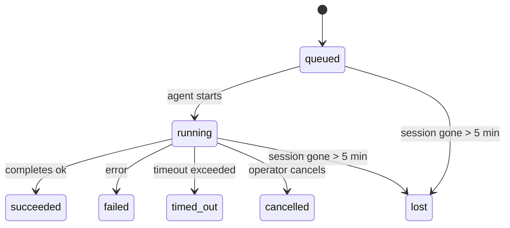

---
read_when:
    - Achtergrondwerk in uitvoering of onlangs voltooid inspecteren
    - Afleveringsfouten opsporen voor losgekoppelde agentuitvoeringen
    - Begrijpen hoe uitvoeringen op de achtergrond zich verhouden tot sessies, Cron en Heartbeat
sidebarTitle: Background tasks
summary: Tracking van achtergrondtaken voor ACP-uitvoeringen, subagenten, geïsoleerde Cron-taken en CLI-bewerkingen
title: Achtergrondtaken
x-i18n:
    generated_at: "2026-04-29T22:23:56Z"
    model: gpt-5.5
    provider: openai
    source_hash: 4bbf74f3aeea532738b56b83cd2e1a0a3734bfd453da6636b8be985a28ccc027
    source_path: automation/tasks.md
    workflow: 16
---

<Note>
Op zoek naar planning? Zie [Automatisering en taken](/nl/automation) om het juiste mechanisme te kiezen. Deze pagina is het activiteitenlogboek voor achtergrondwerk, niet de planner.
</Note>

Achtergrondtaken volgen werk dat **buiten je hoofdgesprekssessie** wordt uitgevoerd: ACP-runs, subagent-starts, geïsoleerde cron-jobuitvoeringen en door de CLI gestarte bewerkingen.

Taken vervangen sessies, cron-jobs of heartbeats **niet** — ze zijn het **activiteitenlogboek** dat vastlegt welk losgekoppeld werk is gebeurd, wanneer, en of het is geslaagd.

<Note>
Niet elke agent-run maakt een taak aan. Heartbeat-beurten en normale interactieve chat doen dat niet. Alle cron-uitvoeringen, ACP-starts, subagent-starts en CLI-agentcommando's doen dat wel.
</Note>

## TL;DR

- Taken zijn **records**, geen planners — cron en heartbeat bepalen _wanneer_ werk wordt uitgevoerd, taken volgen _wat er is gebeurd_.
- ACP, subagents, alle cron-jobs en CLI-bewerkingen maken taken aan. Heartbeat-beurten doen dat niet.
- Elke taak doorloopt `queued → running → terminal` (succeeded, failed, timed_out, cancelled of lost).
- Cron-taken blijven actief zolang de cron-runtime nog eigenaar is van de job; als de
  runtime-status in het geheugen verdwenen is, controleert taakonderhoud eerst de duurzame cron-
  run-geschiedenis voordat een taak als verloren wordt gemarkeerd.
- Voltooiing is push-gestuurd: losgekoppeld werk kan direct melden of de
  aanvragersessie/heartbeat wekken wanneer het klaar is, dus statuspollinglussen hebben
  meestal de verkeerde vorm.
- Geïsoleerde cron-runs en subagent-voltooiingen ruimen naar beste vermogen gevolgde browsertabbladen/processen voor hun kindsessie op voordat de laatste opschoningsboekhouding plaatsvindt.
- Geïsoleerde cron-bezorging onderdrukt verouderde tussentijdse bovenliggende antwoorden terwijl afstammend subagent-werk nog wordt afgehandeld, en geeft de voorkeur aan uiteindelijke afstammende uitvoer wanneer die vóór bezorging binnenkomt.
- Voltooiingsmeldingen worden direct aan een kanaal bezorgd of in de wachtrij gezet voor de volgende heartbeat.
- `openclaw tasks list` toont alle taken; `openclaw tasks audit` brengt problemen naar voren.
- Terminal-records worden 7 dagen bewaard en daarna automatisch opgeschoond.

## Snel starten

<Tabs>
  <Tab title="Weergeven en filteren">
    ```bash
    # List all tasks (newest first)
    openclaw tasks list

    # Filter by runtime or status
    openclaw tasks list --runtime acp
    openclaw tasks list --status running
    ```

  </Tab>
  <Tab title="Inspecteren">
    ```bash
    # Show details for a specific task (by ID, run ID, or session key)
    openclaw tasks show <lookup>
    ```
  </Tab>
  <Tab title="Annuleren en melden">
    ```bash
    # Cancel a running task (kills the child session)
    openclaw tasks cancel <lookup>

    # Change notification policy for a task
    openclaw tasks notify <lookup> state_changes
    ```

  </Tab>
  <Tab title="Audit en onderhoud">
    ```bash
    # Run a health audit
    openclaw tasks audit

    # Preview or apply maintenance
    openclaw tasks maintenance
    openclaw tasks maintenance --apply
    ```

  </Tab>
  <Tab title="Taakstroom">
    ```bash
    # Inspect TaskFlow state
    openclaw tasks flow list
    openclaw tasks flow show <lookup>
    openclaw tasks flow cancel <lookup>
    ```
  </Tab>
</Tabs>

## Wat een taak aanmaakt

| Bron                   | Runtime-type | Wanneer een taakrecord wordt aangemaakt                | Standaard meldingsbeleid |
| ---------------------- | ------------ | ------------------------------------------------------ | ------------------------ |
| ACP-achtergrondruns    | `acp`        | Een ACP-kindsessie starten                             | `done_only`              |
| Subagent-orkestratie   | `subagent`   | Een subagent starten via `sessions_spawn`              | `done_only`              |
| Cron-jobs (alle typen) | `cron`       | Elke cron-uitvoering (hoofdsessie en geïsoleerd)       | `silent`                 |
| CLI-bewerkingen        | `cli`        | `openclaw agent`-commando's die via de gateway lopen   | `silent`                 |
| Agent-mediataken       | `cli`        | Sessiegebaseerde `video_generate`-runs                 | `silent`                 |

<AccordionGroup>
  <Accordion title="Meldingsstandaarden voor cron en media">
    Cron-taken in de hoofdsessie gebruiken standaard het meldingsbeleid `silent` — ze maken records aan voor tracking, maar genereren geen meldingen. Geïsoleerde cron-taken gebruiken ook standaard `silent`, maar zijn zichtbaarder omdat ze in hun eigen sessie worden uitgevoerd.

    Sessiegebaseerde `video_generate`-runs gebruiken ook het meldingsbeleid `silent`. Ze maken nog steeds taakrecords aan, maar voltooiing wordt als interne wake teruggegeven aan de oorspronkelijke agentsessie, zodat de agent het vervolbericht kan schrijven en de voltooide video zelf kan bijvoegen. Als je kiest voor `tools.media.asyncCompletion.directSend`, proberen asynchrone `music_generate`- en `video_generate`-voltooiingen eerst directe kanaalbezorging voordat ze terugvallen op het wake-pad van de aanvragersessie.

  </Accordion>
  <Accordion title="Vangrail voor gelijktijdige video_generate">
    Terwijl een sessiegebaseerde `video_generate`-taak nog actief is, fungeert de tool ook als vangrail: herhaalde `video_generate`-aanroepen in dezelfde sessie retourneren de actieve taakstatus in plaats van een tweede gelijktijdige generatie te starten. Gebruik `action: "status"` wanneer je expliciet voortgang/status wilt opvragen vanaf de agentkant.
  </Accordion>
  <Accordion title="Wat geen taken aanmaakt">
    - Heartbeat-beurten — hoofdsessie; zie [Heartbeat](/nl/gateway/heartbeat)
    - Normale interactieve chatbeurten
    - Directe `/command`-antwoorden

  </Accordion>
</AccordionGroup>

## Taaklevenscyclus



| Status      | Wat het betekent                                                          |
| ----------- | -------------------------------------------------------------------------- |
| `queued`    | Aangemaakt, wacht tot de agent start                                       |
| `running`   | Agent-beurt wordt actief uitgevoerd                                        |
| `succeeded` | Succesvol voltooid                                                         |
| `failed`    | Voltooid met een fout                                                      |
| `timed_out` | De geconfigureerde time-out is overschreden                                |
| `cancelled` | Gestopt door de operator via `openclaw tasks cancel`                       |
| `lost`      | De runtime verloor gezaghebbende onderliggende status na een respijtperiode van 5 minuten |

Overgangen gebeuren automatisch — wanneer de gekoppelde agent-run eindigt, wordt de taakstatus bijgewerkt om daarmee overeen te komen.

Voltooiing van agent-runs is gezaghebbend voor actieve taakrecords. Een succesvolle losgekoppelde run wordt afgerond als `succeeded`, gewone run-fouten worden afgerond als `failed`, en time-out- of afbreekuitkomsten worden afgerond als `timed_out`. Als een operator de taak al heeft geannuleerd, of de runtime al een sterkere terminal-status zoals `failed`, `timed_out` of `lost` heeft vastgelegd, verlaagt een later successignaal die terminal-status niet.

`lost` is runtime-bewust:

- ACP-taken: onderliggende metadata van de ACP-kindsessie is verdwenen.
- Subagent-taken: de onderliggende kindsessie is verdwenen uit de doelagentopslag.
- Cron-taken: de cron-runtime volgt de job niet langer als actief en duurzame
  cron-run-geschiedenis toont geen terminal-resultaat voor die run. Offline CLI-
  audit behandelt zijn eigen lege in-proces cron-runtime-status niet als gezaghebbend.
- CLI-taken: geïsoleerde kindsessietaken gebruiken de kindsessie; chatgebaseerde
  CLI-taken gebruiken in plaats daarvan de live run-context, zodat achterblijvende
  kanaal-/groep-/directe sessierijen ze niet actief houden. Gateway-gebaseerde
  `openclaw agent`-runs worden ook afgerond op basis van hun run-resultaat, zodat voltooide runs
  niet actief blijven totdat de sweeper ze als `lost` markeert.

## Bezorging en meldingen

Wanneer een taak een terminal-status bereikt, meldt OpenClaw dat aan je. Er zijn twee bezorgpaden:

**Directe bezorging** — als de taak een kanaaldoel heeft (de `requesterOrigin`), gaat het voltooiingsbericht rechtstreeks naar dat kanaal (Telegram, Discord, Slack, enz.). Voor subagent-voltooiingen behoudt OpenClaw ook gebonden thread-/topic-routering wanneer beschikbaar en kan het een ontbrekende `to` / account aanvullen vanuit de opgeslagen route van de aanvragersessie (`lastChannel` / `lastTo` / `lastAccountId`) voordat directe bezorging wordt opgegeven.

**Sessiewachtrijbezorging** — als directe bezorging mislukt of er geen origin is ingesteld, wordt de update als systeemevent in de sessie van de aanvrager in de wachtrij gezet en verschijnt die bij de volgende heartbeat.

<Tip>
Taakvoltooiing triggert een directe heartbeat-wake, zodat je het resultaat snel ziet — je hoeft niet te wachten op de volgende geplande heartbeat-tick.
</Tip>

Dat betekent dat de gebruikelijke workflow push-gebaseerd is: start losgekoppeld werk één keer en laat de runtime je wekken of melden bij voltooiing. Poll de taakstatus alleen wanneer je debugging, interventie of een expliciete audit nodig hebt.

### Meldingsbeleid

Bepaal hoeveel je over elke taak hoort:

| Beleid                | Wat wordt bezorgd                                                     |
| --------------------- | --------------------------------------------------------------------- |
| `done_only` (standaard) | Alleen terminal-status (succeeded, failed, enz.) — **dit is de standaard** |
| `state_changes`       | Elke statusovergang en voortgangsupdate                               |
| `silent`              | Helemaal niets                                                        |

Wijzig het beleid terwijl een taak loopt:

```bash
openclaw tasks notify <lookup> state_changes
```

## CLI-referentie

<AccordionGroup>
  <Accordion title="tasks list">
    ```bash
    openclaw tasks list [--runtime <acp|subagent|cron|cli>] [--status <status>] [--json]
    ```

    Uitvoerkolommen: taak-ID, soort, status, bezorging, run-ID, kindsessie, samenvatting.

  </Accordion>
  <Accordion title="tasks show">
    ```bash
    openclaw tasks show <lookup>
    ```

    Het opzoektoken accepteert een taak-ID, run-ID of sessiesleutel. Toont het volledige record, inclusief timing, bezorgstatus, fout en terminal-samenvatting.

  </Accordion>
  <Accordion title="tasks cancel">
    ```bash
    openclaw tasks cancel <lookup>
    ```

    Voor ACP- en subagent-taken stopt dit de kindsessie. Voor door de CLI gevolgde taken wordt annulering vastgelegd in het taakregister (er is geen aparte runtime-handle voor een kind). De status gaat over naar `cancelled` en er wordt een bezorgmelding verzonden wanneer van toepassing.

  </Accordion>
  <Accordion title="tasks notify">
    ```bash
    openclaw tasks notify <lookup> <done_only|state_changes|silent>
    ```
  </Accordion>
  <Accordion title="tasks audit">
    ```bash
    openclaw tasks audit [--json]
    ```

    Brengt operationele problemen naar voren. Bevindingen verschijnen ook in `openclaw status` wanneer problemen worden gedetecteerd.

    | Bevinding                 | Ernst      | Aanleiding                                                                                                            |
    | ------------------------- | ---------- | --------------------------------------------------------------------------------------------------------------------- |
    | `stale_queued`            | warn       | Langer dan 10 minuten in wachtrij                                                                                     |
    | `stale_running`           | error      | Langer dan 30 minuten actief                                                                                          |
    | `lost`                    | warn/error | Runtime-ondersteund taakeigenaarschap is verdwenen; behouden verloren taken waarschuwen tot `cleanupAfter`, daarna worden het fouten |
    | `delivery_failed`         | warn       | Bezorging mislukt en meldingsbeleid is niet `silent`                                                                  |
    | `missing_cleanup`         | warn       | Terminale taak zonder opruimtijdstempel                                                                               |
    | `inconsistent_timestamps` | warn       | Tijdlijnschending (bijvoorbeeld beëindigd voordat deze was gestart)                                                    |

  </Accordion>
  <Accordion title="takenonderhoud">
    ```bash
    openclaw tasks maintenance [--json]
    openclaw tasks maintenance --apply [--json]
    ```

    Gebruik dit om reconciliatie, opruimstempeling en opschoning voor taken en Task Flow-status vooraf te bekijken of toe te passen.

    Reconciliatie is runtime-bewust:

    - ACP-/subagent-taken controleren hun onderliggende child session.
    - Cron-taken controleren of de cron-runtime de taak nog steeds bezit, en herstellen daarna de terminale status uit bewaarde cron-uitvoeringslogs/taakstatus voordat ze terugvallen op `lost`. Alleen het Gateway-proces is gezaghebbend voor de actieve cron-taakset in het geheugen; offline CLI-audit gebruikt duurzame geschiedenis maar markeert een cron-taak niet als verloren alleen omdat die lokale Set leeg is.
    - Chat-ondersteunde CLI-taken controleren de eigenaar-live-runcontext, niet alleen de chat-sessierij.

    Voltooiingsopruiming is ook runtime-bewust:

    - Subagent-voltooiing sluit best-effort bijgehouden browsertabs/processen voor de child session voordat meldingsopruiming verdergaat.
    - Geisoleerde cron-voltooiing sluit best-effort bijgehouden browsertabs/processen voor de cron-sessie voordat de uitvoering volledig wordt afgebroken.
    - Geisoleerde cron-bezorging wacht indien nodig opvolging door afstammende subagents af en onderdrukt verouderde tekst voor bovenliggende bevestiging in plaats van die aan te kondigen.
    - Bezorging van subagent-voltooiing geeft de voorkeur aan de nieuwste zichtbare assistenttekst; als die leeg is, valt deze terug op opgeschoonde nieuwste tool-/toolResult-tekst, en uitvoeringen met alleen time-out-toolaanroepen kunnen worden ingeklapt tot een korte samenvatting van gedeeltelijke voortgang. Terminale mislukte uitvoeringen kondigen de foutstatus aan zonder vastgelegde antwoordtekst opnieuw af te spelen.
    - Opruimfouten maskeren de echte taakuitkomst niet.

  </Accordion>
  <Accordion title="tasks flow list | show | cancel">
    ```bash
    openclaw tasks flow list [--status <status>] [--json]
    openclaw tasks flow show <lookup> [--json]
    openclaw tasks flow cancel <lookup>
    ```

    Gebruik deze wanneer de orchestrerende Task Flow is waar u om geeft, in plaats van een afzonderlijk achtergrondtaakrecord.

  </Accordion>
</AccordionGroup>

## Chat-taakbord (`/tasks`)

Gebruik `/tasks` in elke chatsessie om achtergrondtaken te zien die aan die sessie zijn gekoppeld. Het bord toont actieve en recent voltooide taken met runtime, status, timing en voortgangs- of foutdetails.

Wanneer de huidige sessie geen zichtbare gekoppelde taken heeft, valt `/tasks` terug op agent-lokale taakaantallen, zodat u nog steeds een overzicht krijgt zonder details uit andere sessies te lekken.

Gebruik voor het volledige operatorlogboek de CLI: `openclaw tasks list`.

## Statusintegratie (taakdruk)

`openclaw status` bevat een taaksamenvatting in een oogopslag:

```
Tasks: 3 queued · 2 running · 1 issues
```

De samenvatting rapporteert:

- **active** — aantal `queued` + `running`
- **failures** — aantal `failed` + `timed_out` + `lost`
- **byRuntime** — uitsplitsing per `acp`, `subagent`, `cron`, `cli`

Zowel `/status` als de tool `session_status` gebruiken een opruimbewuste taaksnapshot: actieve taken krijgen de voorkeur, verouderde voltooide rijen worden verborgen en recente fouten verschijnen alleen wanneer er geen actief werk meer over is. Zo blijft de statuskaart gericht op wat nu belangrijk is.

## Opslag en onderhoud

### Waar taken staan

Taakrecords blijven bewaard in SQLite op:

```
$OPENCLAW_STATE_DIR/tasks/runs.sqlite
```

Het register wordt bij het starten van de Gateway in het geheugen geladen en synchroniseert schrijfbewerkingen naar SQLite voor duurzaamheid over herstarts heen.
De Gateway houdt het write-ahead-log van SQLite begrensd door SQLite's standaard
autocheckpoint-drempel plus periodieke en afsluitende `TRUNCATE`-checkpoints te gebruiken.

### Automatisch onderhoud

Elke **60 seconden** draait een sweeper die vier dingen afhandelt:

<Steps>
  <Step title="Reconciliatie">
    Controleert of actieve taken nog steeds gezaghebbende runtime-ondersteuning hebben. ACP-/subagent-taken gebruiken child-session-status, cron-taken gebruiken actief-taakeigenaarschap en chat-ondersteunde CLI-taken gebruiken de eigenaar-runcontext. Als die onderliggende status langer dan 5 minuten verdwenen is, wordt de taak gemarkeerd als `lost`.
  </Step>
  <Step title="ACP-sessieherstel">
    Sluit terminale of verweesde parent-owned eenmalige ACP-sessies, en sluit verouderde terminale of verweesde persistente ACP-sessies alleen wanneer er geen actieve gespreksbinding meer over is.
  </Step>
  <Step title="Opruimstempeling">
    Stelt een `cleanupAfter`-tijdstempel in op terminale taken (endedAt + 7 dagen). Tijdens de retentie verschijnen verloren taken nog steeds in audit als waarschuwingen; nadat `cleanupAfter` is verlopen of wanneer opruimmetadata ontbreken, zijn het fouten.
  </Step>
  <Step title="Opschoning">
    Verwijdert records na hun `cleanupAfter`-datum.
  </Step>
</Steps>

<Note>
**Retentie:** terminale taakrecords worden **7 dagen** bewaard en daarna automatisch opgeschoond. Geen configuratie nodig.
</Note>

## Hoe taken zich verhouden tot andere systemen

<AccordionGroup>
  <Accordion title="Taken en Task Flow">
    [Task Flow](/nl/automation/taskflow) is de flow-orchestreringslaag boven achtergrondtaken. Een enkele flow kan gedurende zijn levensduur meerdere taken coordineren met beheerde of gespiegelde synchronisatiemodi. Gebruik `openclaw tasks` om afzonderlijke taakrecords te inspecteren en `openclaw tasks flow` om de orchestrerende flow te inspecteren.

    Zie [Task Flow](/nl/automation/taskflow) voor details.

  </Accordion>
  <Accordion title="Taken en cron">
    Een cron-taak**definitie** staat in `~/.openclaw/cron/jobs.json`; runtime-uitvoeringsstatus staat ernaast in `~/.openclaw/cron/jobs-state.json`. **Elke** cron-uitvoering maakt een taakrecord aan — zowel hoofd-sessie als geisoleerd. Cron-taken in de hoofd-sessie gebruiken standaard het meldingsbeleid `silent`, zodat ze volgen zonder meldingen te genereren.

    Zie [Cron Jobs](/nl/automation/cron-jobs).

  </Accordion>
  <Accordion title="Taken en Heartbeat">
    Heartbeat-uitvoeringen zijn hoofd-sessiebeurten — ze maken geen taakrecords aan. Wanneer een taak is voltooid, kan deze een Heartbeat-wake activeren zodat u het resultaat snel ziet.

    Zie [Heartbeat](/nl/gateway/heartbeat).

  </Accordion>
  <Accordion title="Taken en sessies">
    Een taak kan verwijzen naar een `childSessionKey` (waar werk wordt uitgevoerd) en een `requesterSessionKey` (wie deze heeft gestart). Sessies zijn gesprekscontext; taken zijn activiteitsregistratie daarbovenop.
  </Accordion>
  <Accordion title="Taken en agent-uitvoeringen">
    De `runId` van een taak koppelt naar de agent-uitvoering die het werk doet. Agent-levenscyclusgebeurtenissen (start, einde, fout) werken de taakstatus automatisch bij — u hoeft de levenscyclus niet handmatig te beheren.
  </Accordion>
</AccordionGroup>

## Gerelateerd

- [Automatisering en taken](/nl/automation) — alle automatiseringsmechanismen in een oogopslag
- [CLI: Taken](/nl/cli/tasks) — CLI-opdrachtreferentie
- [Heartbeat](/nl/gateway/heartbeat) — periodieke hoofd-sessiebeurten
- [Geplande taken](/nl/automation/cron-jobs) — achtergrondwerk plannen
- [Task Flow](/nl/automation/taskflow) — flow-orchestrering boven taken
