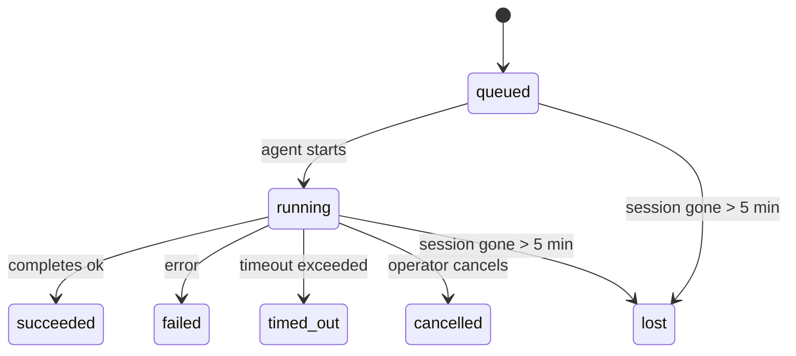

---
read_when:
    - Lopend of recent voltooid achtergrondwerk inspecteren
    - Fouten bij aflevering voor losgekoppelde agentuitvoeringen opsporen
    - Begrijpen hoe achtergrondruns zich verhouden tot sessies, Cron en Heartbeat
sidebarTitle: Background tasks
summary: Achtergrondtaaktracking voor ACP-runs, subagents, geïsoleerde cronjobs en CLI-bewerkingen
title: Achtergrondtaken
x-i18n:
    generated_at: "2026-06-27T17:09:08Z"
    model: gpt-5.5
    postprocess_version: locale-links-v1
    provider: openai
    source_hash: 4a630a52d0d6bfd387a37415dd63fc4bfbce23f99eaa8cb780c3d6f8913675fd
    source_path: automation/tasks.md
    workflow: 16
---

<Note>
Zoek je planning? Zie [Automation](/nl/automation) om het juiste mechanisme te kiezen. Deze pagina is het activiteitenlogboek voor achtergrondwerk, niet de planner.
</Note>

Achtergrondtaken volgen werk dat **buiten je hoofdgesprekssessie** draait: ACP-runs, het starten van subagents, geïsoleerde uitvoeringen van Cron-taken en bewerkingen die via de CLI zijn gestart.

Taken vervangen **geen** sessies, Cron-taken of Heartbeats - ze zijn het **activiteitenlogboek** dat vastlegt welk losgekoppeld werk is uitgevoerd, wanneer, en of het is geslaagd.

<Note>
Niet elke agent-run maakt een taak aan. Heartbeat-beurten en normale interactieve chat doen dat niet. Alle Cron-uitvoeringen, ACP-starts, subagent-starts en CLI-agentopdrachten doen dat wel.
</Note>

## TL;DR

- Taken zijn **records**, geen planners - Cron en Heartbeat bepalen _wanneer_ werk wordt uitgevoerd, taken volgen _wat er is gebeurd_.
- ACP, subagents, alle Cron-taken en CLI-bewerkingen maken taken aan. Heartbeat-beurten doen dat niet.
- Elke taak doorloopt `queued → running → terminal` (succeeded, failed, timed_out, cancelled of lost).
- Cron-taken blijven live zolang de Cron-runtime de taak nog bezit; als de
  runtime-status in het geheugen verdwenen is, controleert taakonderhoud eerst de duurzame
  Cron-runhistorie voordat een taak als verloren wordt gemarkeerd.
- Voltooiing is push-gestuurd: losgekoppeld werk kan rechtstreeks melden of de
  aanvragende sessie/Heartbeat wekken wanneer het klaar is, waardoor statuspollinglussen
  meestal de verkeerde vorm zijn.
- Geïsoleerde Cron-runs en subagent-voltooiingen ruimen zo goed mogelijk bijgehouden browsertabbladen/processen voor hun kindsessie op voordat de uiteindelijke opruimboekhouding plaatsvindt.
- Geïsoleerde Cron-aflevering onderdrukt verouderde tussentijdse ouderantwoorden terwijl onderliggend subagent-werk nog wordt afgehandeld, en geeft de voorkeur aan uiteindelijke onderliggende uitvoer wanneer die vóór aflevering arriveert.
- Voltooiingsmeldingen worden rechtstreeks naar een kanaal afgeleverd of in de wachtrij gezet voor de volgende Heartbeat.
- `openclaw tasks list` toont alle taken; `openclaw tasks audit` brengt problemen aan het licht.
- Eindrecords worden 7 dagen bewaard en daarna automatisch opgeschoond.

## Snel aan de slag

<Tabs>
  <Tab title="Weergeven en filteren">
    ```bash
    # List all tasks (newest first)
    openclaw tasks list

    # Filter by runtime or status
    openclaw tasks list --runtime acp
    openclaw tasks list --status running
    ```

  </Tab>
  <Tab title="Inspecteren">
    ```bash
    # Show details for a specific task (by ID, run ID, or session key)
    openclaw tasks show <lookup>
    ```
  </Tab>
  <Tab title="Annuleren en melden">
    ```bash
    # Cancel a running task (kills the child session)
    openclaw tasks cancel <lookup>

    # Change notification policy for a task
    openclaw tasks notify <lookup> state_changes
    ```

  </Tab>
  <Tab title="Audit en onderhoud">
    ```bash
    # Run a health audit
    openclaw tasks audit

    # Preview or apply maintenance
    openclaw tasks maintenance
    openclaw tasks maintenance --apply
    ```

  </Tab>
  <Tab title="Taakstroom">
    ```bash
    # Inspect TaskFlow state
    openclaw tasks flow list
    openclaw tasks flow show <lookup>
    openclaw tasks flow cancel <lookup>
    ```
  </Tab>
</Tabs>

## Wat maakt een taak aan

| Bron                   | Runtimetype | Wanneer een taakrecord wordt aangemaakt                                 | Standaard meldingsbeleid |
| ---------------------- | ------------ | ----------------------------------------------------------------------- | ------------------------ |
| ACP-achtergrondruns    | `acp`        | Een ACP-kindsessie starten                                              | `done_only`              |
| Subagent-orkestratie   | `subagent`   | Een subagent starten via `sessions_spawn`                               | `done_only`              |
| Cron-taken (alle typen)| `cron`       | Elke Cron-uitvoering (hoofdsessie en geïsoleerd)                        | `silent`                 |
| CLI-bewerkingen        | `cli`        | `openclaw agent`-opdrachten die via de Gateway worden uitgevoerd        | `silent`                 |
| Agent-mediataken       | `cli`        | Sessiegebonden `image_generate`/`music_generate`/`video_generate`-runs  | `silent`                 |

<AccordionGroup>
  <Accordion title="Meldingsstandaarden voor Cron en media">
    Cron-taken in de hoofdsessie gebruiken standaard het meldingsbeleid `silent` - ze maken records aan voor tracking, maar genereren geen meldingen. Geïsoleerde Cron-taken gebruiken ook standaard `silent`, maar zijn zichtbaarder omdat ze in hun eigen sessie draaien.

    Sessiegebonden `image_generate`-, `music_generate`- en `video_generate`-runs gebruiken ook het meldingsbeleid `silent`. Ze maken nog steeds taakrecords aan, maar voltooiing wordt als interne wake teruggegeven aan de oorspronkelijke agentsessie, zodat de agent het vervolgbericht kan schrijven en de voltooide media zelf kan bijvoegen. De aanvragende agent volgt zijn normale contract voor zichtbare antwoorden: automatisch eindantwoord wanneer geconfigureerd, of `message(action="send")` plus `NO_REPLY` wanneer de sessie antwoorden via de berichttool vereist. Als de aanvragende sessie niet meer actief is of de actieve wake mislukt, en de voltooiingsagent sommige of alle gegenereerde media mist, stuurt OpenClaw een idempotente rechtstreekse fallback met alleen de ontbrekende media naar het oorspronkelijke kanaaldoel.

  </Accordion>
  <Accordion title="Beveiliging voor gelijktijdige mediageneratie">
    Zolang een sessiegebonden mediageneratietaak nog actief is, fungeren mediatools ook als beveiliging tegen onbedoelde nieuwe pogingen. Herhaalde `image_generate`-aanroepen voor dezelfde prompt geven de bijbehorende actieve taakstatus terug, terwijl een andere afbeeldingsprompt een eigen taak kan starten. `music_generate`- en `video_generate`-aanroepen geven nog steeds de actieve taakstatus voor die sessie terug in plaats van een tweede gelijktijdige generatie te starten. Gebruik `action: "status"` wanneer je expliciet een voortgangs-/statusopzoeking vanaf de agentzijde wilt.
  </Accordion>
  <Accordion title="Wat geen taken aanmaakt">
    - Heartbeat-beurten - hoofdsessie; zie [Heartbeat](/nl/gateway/heartbeat)
    - Normale interactieve chatbeurten
    - Rechtstreekse `/command`-antwoorden

  </Accordion>
</AccordionGroup>

## Taaklevenscyclus



| Status      | Wat het betekent                                                          |
| ----------- | -------------------------------------------------------------------------- |
| `queued`    | Aangemaakt, wacht tot de agent start                                       |
| `running`   | Agent-beurt wordt actief uitgevoerd                                        |
| `succeeded` | Succesvol voltooid                                                         |
| `failed`    | Voltooid met een fout                                                      |
| `timed_out` | De geconfigureerde time-out is overschreden                                |
| `cancelled` | Gestopt door de operator via `openclaw tasks cancel`                       |
| `lost`      | De runtime verloor gezaghebbende ondersteunende status na een respijtperiode van 5 minuten |

Overgangen gebeuren automatisch - wanneer de gekoppelde agent-run eindigt, wordt de taakstatus bijgewerkt om daarmee overeen te komen.

Voltooiing van de agent-run is gezaghebbend voor actieve taakrecords. Een geslaagde losgekoppelde run wordt afgerond als `succeeded`, gewone runfouten worden afgerond als `failed`, en time-out- of afbreekuitkomsten worden afgerond als `timed_out`. Als een operator de taak al heeft geannuleerd, of de runtime al een sterkere eindstatus zoals `failed`, `timed_out` of `lost` heeft vastgelegd, verlaagt een later successignaal die eindstatus niet.

`lost` is runtime-bewust:

- ACP-taken: ondersteunende ACP-kindsessiemetadata is verdwenen.
- Subagent-taken: ondersteunende kindsessie is verdwenen uit de doelagentstore.
- Cron-taken: de Cron-runtime volgt de taak niet langer als actief en duurzame
  Cron-runhistorie toont geen eindresultaat voor die run. Offline CLI-
  audit behandelt zijn eigen lege in-process Cron-runtimestatus niet als gezaghebbend.
- CLI-taken: taken met een run-id/bron-id gebruiken de live runcontext, zodat
  achterblijvende kindsessie- of chatsessierijen ze niet levend houden nadat de
  run die eigendom is van de Gateway verdwijnt. Verouderde CLI-taken zonder runidentiteit vallen nog steeds
  terug op de kindsessie. Door de Gateway ondersteunde `openclaw agent`-runs worden ook afgerond
  vanuit hun runresultaat, zodat voltooide runs niet actief blijven tot de sweeper
  ze als `lost` markeert.

## Aflevering en meldingen

Wanneer een taak een eindstatus bereikt, meldt OpenClaw je dat. Er zijn twee afleverpaden:

**Rechtstreekse aflevering** - als de taak een kanaaldoel heeft (de `requesterOrigin`), gaat het voltooiingsbericht rechtstreeks naar dat kanaal (Telegram, Discord, Slack, enz.). Voltooiingen van groeps- en kanaaltaken worden in plaats daarvan via de aanvragende sessie gerouteerd, zodat de ouderagent het zichtbare antwoord kan schrijven. Voor subagent-voltooiingen bewaart OpenClaw ook gebonden thread-/topic-routering wanneer beschikbaar, en kan het een ontbrekende `to` / account aanvullen vanuit de opgeslagen route van de aanvragende sessie (`lastChannel` / `lastTo` / `lastAccountId`) voordat rechtstreekse aflevering wordt opgegeven.

**Aflevering via sessiewachtrij** - als rechtstreekse aflevering mislukt of geen origin is ingesteld, wordt de update als systeemevent in de sessie van de aanvrager in de wachtrij gezet en verschijnt die bij de volgende Heartbeat.

<Tip>
Taakvoltooiing triggert een onmiddellijke Heartbeat-wake zodat je het resultaat snel ziet - je hoeft niet te wachten op de volgende geplande Heartbeat-tick.
</Tip>

Dat betekent dat de gebruikelijke workflow push-gebaseerd is: start losgekoppeld werk één keer en laat de runtime je vervolgens wekken of melden bij voltooiing. Poll taakstatus alleen wanneer je debugging, ingrijpen of een expliciete audit nodig hebt.

### Meldingsbeleid

Bepaal hoeveel je over elke taak hoort:

| Beleid                | Wat wordt afgeleverd                                                     |
| --------------------- | ------------------------------------------------------------------------ |
| `done_only` (standaard) | Alleen eindstatus (succeeded, failed, enz.) - **dit is de standaard**  |
| `state_changes`       | Elke statusovergang en voortgangsupdate                                  |
| `silent`              | Helemaal niets                                                           |

Wijzig het beleid terwijl een taak draait:

```bash
openclaw tasks notify <lookup> state_changes
```

## CLI-referentie

<AccordionGroup>
  <Accordion title="tasks list">
    ```bash
    openclaw tasks list [--runtime <acp|subagent|cron|cli>] [--status <status>] [--json]
    ```

    Uitvoerkolommen: taak-ID, soort, status, aflevering, run-ID, kindsessie, samenvatting.

  </Accordion>
  <Accordion title="tasks show">
    ```bash
    openclaw tasks show <lookup>
    ```

    Het opzoektoken accepteert een taak-ID, run-ID of sessiesleutel. Toont het volledige record inclusief timing, afleverstatus, fout en eindsamenvatting.

  </Accordion>
  <Accordion title="tasks cancel">
    ```bash
    openclaw tasks cancel <lookup>
    ```

    Voor ACP- en subagent-taken beëindigt dit de kindsessie. Voor door CLI bijgehouden taken wordt annulering vastgelegd in het taakregister (er is geen aparte runtime-handle voor het kind). De status gaat over naar `cancelled` en er wordt een aflevermelding verzonden wanneer van toepassing.

  </Accordion>
  <Accordion title="tasks notify">
    ```bash
    openclaw tasks notify <lookup> <done_only|state_changes|silent>
    ```
  </Accordion>
  <Accordion title="tasks audit">
    ```bash
    openclaw tasks audit [--json]
    ```

    Brengt operationele problemen aan het licht. Bevindingen verschijnen ook in `openclaw status` wanneer problemen worden gedetecteerd.

    | Bevinding                 | Ernst      | Trigger                                                                                                      |
    | ------------------------- | ---------- | ------------------------------------------------------------------------------------------------------------ |
    | `stale_queued`            | warn       | Langer dan 10 minuten in de wachtrij                                                                         |
    | `stale_running`           | error      | Langer dan 30 minuten actief                                                                                 |
    | `lost`                    | warn/error | Runtime-ondersteund taakeigenaarschap is verdwenen; behouden verloren taken waarschuwen tot `cleanupAfter` en worden daarna fouten |
    | `delivery_failed`         | warn       | Levering is mislukt en meldingsbeleid is niet `silent`                                                       |
    | `missing_cleanup`         | warn       | Terminale taak zonder opschoontijdstempel                                                                    |
    | `inconsistent_timestamps` | warn       | Tijdlijnschending (bijvoorbeeld beëindigd vóór gestart)                                                      |

  </Accordion>
  <Accordion title="takenonderhoud">
    ```bash
    openclaw tasks maintenance [--json]
    openclaw tasks maintenance --apply [--json]
    ```

    Gebruik dit om reconciliatie, opschoonstempeling en pruning voor taken, Task Flow-status en verouderde sessieregisterrijen van cron-runs vooraf te bekijken of toe te passen.

    Reconciliatie is runtime-bewust:

    - ACP-/subagent-taken controleren hun ondersteunende kindsessie.
    - Subagent-taken waarvan de kindsessie een tombstone voor herstel na herstart heeft, worden als verloren gemarkeerd in plaats van als herstelbare ondersteunende sessies te worden behandeld.
    - Cron-taken controleren of de cron-runtime de taak nog bezit en herstellen daarna de terminale status uit bewaarde cron-runlogs/taakstatus voordat ze terugvallen op `lost`. Alleen het Gateway-proces is gezaghebbend voor de in-memory actieve-taakset van cron; offline CLI-audit gebruikt duurzame geschiedenis maar markeert een cron-taak niet als verloren enkel omdat die lokale Set leeg is.
    - CLI-taken met run-identiteit controleren de eigenaar-live-runcontext, niet alleen kindsessie- of chatsessierijen.

    Voltooiingsopschoning is ook runtime-bewust:

    - Subagent-voltooiing sluit naar beste vermogen bijgehouden browsertabbladen/processen voor de kindsessie voordat aankondigingsopschoning doorgaat.
    - Geïsoleerde cron-voltooiing sluit naar beste vermogen bijgehouden browsertabbladen/processen voor de cron-sessie voordat de run volledig wordt afgebroken.
    - Geïsoleerde cron-levering wacht zo nodig afstammende subagent-opvolging af en onderdrukt verouderde bevestigingstekst van de ouder in plaats van die aan te kondigen.
    - Subagent-voltooiingslevering gebruikt alleen de nieuwste zichtbare assistenttekst van het kind. Tool-/toolResult-uitvoer wordt niet gepromoveerd naar resultaattekst van het kind. Terminale mislukte runs kondigen de foutstatus aan zonder vastgelegde antwoordtekst opnieuw af te spelen.
    - Opschoonfouten verhullen de echte taakuitkomst niet.

    Bij het toepassen van onderhoud verwijdert OpenClaw ook verouderde `cron:<jobId>:run:<uuid>`-sessieregisterrijen ouder dan 7 dagen, terwijl rijen voor momenteel actieve cron-taken behouden blijven en niet-cron-sessierijen ongemoeid blijven.

  </Accordion>
  <Accordion title="takenflow list | show | cancel">
    ```bash
    openclaw tasks flow list [--status <status>] [--json]
    openclaw tasks flow show <lookup> [--json]
    openclaw tasks flow cancel <lookup>
    ```

    Gebruik deze wanneer de orkestrerende Task Flow is waar u om geeft, in plaats van één afzonderlijk achtergrondtaakrecord.

  </Accordion>
</AccordionGroup>

## Chattaakbord (`/tasks`)

Gebruik `/tasks` in elke chatsessie om achtergrondtaken te zien die aan die sessie zijn gekoppeld. Het bord toont actieve en recent voltooide taken met runtime, status, timing en voortgangs- of foutdetails.

Wanneer de huidige sessie geen zichtbare gekoppelde taken heeft, valt `/tasks` terug op agent-lokale taaktellingen, zodat u toch een overzicht krijgt zonder details van andere sessies te lekken.

Gebruik de CLI voor het volledige operatorlogboek: `openclaw tasks list`.

## Statusintegratie (taakdruk)

`openclaw status` bevat een taakoverzicht in één oogopslag:

```
Tasks: 3 queued · 2 running · 1 issues
```

Het overzicht rapporteert:

- **active** - aantal `queued` + `running`
- **failures** - aantal `failed` + `timed_out` + `lost`
- **byRuntime** - uitsplitsing per `acp`, `subagent`, `cron`, `cli`

Zowel `/status` als de tool `session_status` gebruiken een opschoonbewuste taaksnapshot: actieve taken krijgen voorrang, verouderde voltooide rijen worden verborgen en recente fouten verschijnen alleen wanneer er geen actief werk meer over is. Hierdoor blijft de statuskaart gericht op wat nu belangrijk is.

## Opslag en onderhoud

### Waar taken leven

Taakrecords blijven bewaard in SQLite op:

```
$OPENCLAW_STATE_DIR/tasks/runs.sqlite
```

Het register wordt bij het starten van de Gateway in het geheugen geladen en schrijft wijzigingen naar SQLite voor duurzaamheid over herstarts heen.
De Gateway houdt het SQLite write-ahead log begrensd met de standaard
autocheckpoint-drempel van SQLite plus periodieke `PASSIVE`-checkpoints. Afsluiten en
expliciete onderhoudscheckpoints gebruiken nog steeds `TRUNCATE`, zodat normale afsluitingen
WAL-ruimte kunnen terugwinnen zonder dat de achtergrond-sweeper op actieve lezers hoeft te wachten.

### Automatisch onderhoud

Een sweeper draait elke **60 seconden** en handelt vier zaken af:

<Steps>
  <Step title="Reconciliatie">
    Controleert of actieve taken nog gezaghebbende runtime-ondersteuning hebben. ACP-/subagent-taken gebruiken kindsessiestatus, cron-taken gebruiken actief-taakeigenaarschap en CLI-taken met run-identiteit gebruiken de eigenaar-runcontext. Als die ondersteunende status langer dan 5 minuten verdwenen is, wordt de taak gemarkeerd als `lost`.
  </Step>
  <Step title="ACP-sessieherstel">
    Sluit terminale of verweesde, door de ouder beheerde eenmalige ACP-sessies, en sluit verouderde terminale of verweesde persistente ACP-sessies alleen wanneer er geen actieve gespreksbinding overblijft.
  </Step>
  <Step title="Opschoonstempeling">
    Zet een `cleanupAfter`-tijdstempel op terminale taken (endedAt + 7 dagen). Tijdens retentie verschijnen verloren taken nog steeds in audit als waarschuwingen; nadat `cleanupAfter` verloopt of wanneer opschoonmetadata ontbreekt, zijn het fouten.
  </Step>
  <Step title="Pruning">
    Verwijdert records na hun `cleanupAfter`-datum.
  </Step>
</Steps>

<Note>
**Retentie:** terminale taakrecords worden **7 dagen** bewaard en daarna automatisch gepruned. Geen configuratie nodig.
</Note>

## Hoe taken zich verhouden tot andere systemen

<AccordionGroup>
  <Accordion title="Taken en Task Flow">
    [Task Flow](/nl/automation/taskflow) is de laag voor flow-orkestratie boven achtergrondtaken. Eén flow kan gedurende zijn levensduur meerdere taken coördineren met beheerde of gespiegelde synchronisatiemodi. Gebruik `openclaw tasks` om afzonderlijke taakrecords te inspecteren en `openclaw tasks flow` om de orkestrerende flow te inspecteren.

    Zie [Task Flow](/nl/automation/taskflow) voor details.

  </Accordion>
  <Accordion title="Taken en cron">
    Cron-taakdefinities, runtime-uitvoeringsstatus en runhistorie leven in de gedeelde SQLite-statusdatabase van OpenClaw. **Elke** cron-uitvoering maakt een taakrecord aan - zowel hoofd-sessie als geïsoleerd. Cron-taken in de hoofdsessie gebruiken standaard het meldingsbeleid `silent`, zodat ze volgen zonder meldingen te genereren.

    Zie [Cron-taken](/nl/automation/cron-jobs).

  </Accordion>
  <Accordion title="Taken en heartbeat">
    Heartbeat-runs zijn hoofdsessiebeurten - ze maken geen taakrecords aan. Wanneer een taak wordt voltooid, kan die een Heartbeat-wake triggeren zodat u het resultaat snel ziet.

    Zie [Heartbeat](/nl/gateway/heartbeat).

  </Accordion>
  <Accordion title="Taken en sessies">
    Een taak kan verwijzen naar een `childSessionKey` (waar het werk draait) en een `requesterSessionKey` (wie het heeft gestart). De `agentId` identificeert de agent die het werk uitvoert, terwijl de aanvrager- en eigenaarsvelden de start- en besturingscontext behouden. Sessies zijn gesprekscontext; taken zijn activiteitstracking daarbovenop.
  </Accordion>
  <Accordion title="Taken en agent-runs">
    De `runId` van een taak koppelt naar de agent-run die het werk uitvoert. Agent-levenscyclusgebeurtenissen (start, einde, fout) werken automatisch de taakstatus bij - u hoeft de levenscyclus niet handmatig te beheren.
  </Accordion>
</AccordionGroup>

## Gerelateerd

- [Automatisering](/nl/automation) - alle automatiseringsmechanismen in één oogopslag
- [CLI: Taken](/nl/cli/tasks) - CLI-opdrachtreferentie
- [Heartbeat](/nl/gateway/heartbeat) - periodieke hoofdsessiebeurten
- [Geplande taken](/nl/automation/cron-jobs) - achtergrondwerk plannen
- [Task Flow](/nl/automation/taskflow) - flow-orkestratie boven taken
