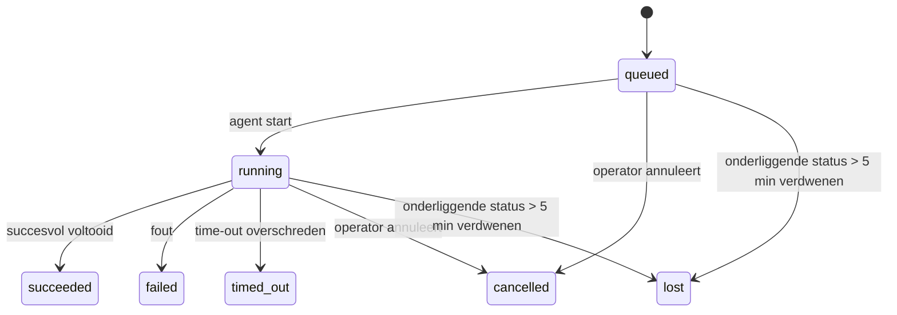

---
read_when:
    - Achtergrondwerk inspecteren dat wordt uitgevoerd of onlangs is voltooid
    - Fouten bij de aflevering van losgekoppelde agentuitvoeringen opsporen
    - Begrijpen hoe achtergrondruns samenhangen met sessies, Cron en Heartbeat
sidebarTitle: Background tasks
summary: Achtergrondtaaktracking voor ACP-runs, subagenten, Cron-uitvoeringen en CLI-bewerkingen
title: Achtergrondtaken
x-i18n:
    generated_at: "2026-07-12T08:35:06Z"
    model: gpt-5.6
    postprocess_version: locale-links-v1
    provider: openai
    source_hash: 0a945e8103c5df5a64785f326a9d0b08784ac32a2ca6fa3d4c399d75fc54be2b
    source_path: automation/tasks.md
    workflow: 16
---

<Note>
Op zoek naar planning? Zie [Automatisering](/nl/automation) om het juiste mechanisme te kiezen. Deze pagina is het activiteitenlogboek voor achtergrondwerk, niet de planner.
</Note>

Achtergrondtaken houden werk bij dat **buiten je hoofdgesprekssessie** wordt uitgevoerd: ACP-uitvoeringen, het starten van subagents, uitvoeringen van cron-taken en via de CLI gestarte bewerkingen.

Taken vervangen **geen** sessies, cron-taken of heartbeats: ze vormen het **activiteitenlogboek** waarin wordt vastgelegd welk losgekoppeld werk is uitgevoerd, wanneer dat gebeurde en of het is geslaagd.

<Note>
Niet elke agentuitvoering maakt een taak aan. Heartbeat-beurten en normale interactieve chats doen dat niet. Alle cron-uitvoeringen, gestarte ACP-sessies, gestarte subagents en door de Gateway doorgegeven CLI-agentopdrachten doen dat wel.
</Note>

## Kort samengevat

- Taken zijn **registraties**, geen planners: cron en heartbeat bepalen _wanneer_ werk wordt uitgevoerd; taken houden bij _wat er is gebeurd_.
- ACP, subagents, alle cron-taken en CLI-bewerkingen maken taken aan. Heartbeat-beurten doen dat niet.
- Elke taak doorloopt `queued → running → terminal` (geslaagd, mislukt, verlopen, geannuleerd of verloren).
- Cron-taken blijven actief zolang de cron-runtime de taak nog beheert. Als de runtimestatus in het geheugen verdwenen is, controleert taakonderhoud eerst de duurzame uitvoeringsgeschiedenis van cron voordat een taak als verloren wordt gemarkeerd.
- Voltooiing wordt via push gemeld: losgekoppeld werk kan rechtstreeks een melding sturen of de sessie/heartbeat van de aanvrager activeren wanneer het is voltooid. Daarom hebben lussen die de status herhaaldelijk opvragen meestal de verkeerde opzet.
- Geïsoleerde cron-uitvoeringen en voltooide subagents proberen vóór de definitieve administratieve opschoning de bijgehouden browsertabbladen en processen van hun kindsessie op te ruimen.
- Bij geïsoleerde cron-bezorging worden verouderde tussentijdse antwoorden van de bovenliggende sessie onderdrukt zolang werk van onderliggende subagents nog wordt afgehandeld. Als de definitieve uitvoer van een onderliggende subagent vóór de bezorging arriveert, krijgt die de voorkeur.
- Voltooiingsmeldingen worden rechtstreeks bij een kanaal bezorgd of voor de volgende heartbeat in de wachtrij geplaatst.
- `openclaw tasks list` toont alle taken; `openclaw tasks audit` brengt problemen aan het licht.
- Definitieve registraties worden 7 dagen bewaard (`lost`-registraties 24 uur) en daarna automatisch verwijderd.

## Snel aan de slag

<Tabs>
  <Tab title="Weergeven en filteren">
    ```bash
    # Alle taken weergeven (nieuwste eerst)
    openclaw tasks list

    # Filteren op runtime of status
    openclaw tasks list --runtime acp
    openclaw tasks list --status running
    ```

  </Tab>
  <Tab title="Inspecteren">
    ```bash
    # Details van een specifieke taak tonen (op taak-ID, uitvoerings-ID of sessiesleutel)
    openclaw tasks show <lookup>
    ```
  </Tab>
  <Tab title="Annuleren en meldingen instellen">
    ```bash
    # Een actieve taak annuleren (beëindigt de kindsessie)
    openclaw tasks cancel <lookup>

    # Het meldingsbeleid voor een taak wijzigen
    openclaw tasks notify <lookup> state_changes
    ```

  </Tab>
  <Tab title="Controle en onderhoud">
    ```bash
    # Een statuscontrole uitvoeren
    openclaw tasks audit

    # Onderhoud bekijken of toepassen
    openclaw tasks maintenance
    openclaw tasks maintenance --apply
    ```

  </Tab>
  <Tab title="Taakstroom">
    ```bash
    # TaskFlow-status inspecteren
    openclaw tasks flow list
    openclaw tasks flow show <lookup>
    openclaw tasks flow cancel <lookup>
    ```
  </Tab>
</Tabs>

## Wat een taak aanmaakt

| Bron                    | Runtimetype | Wanneer een taakregistratie wordt aangemaakt                              | Standaardmeldingsbeleid |
| ----------------------- | ----------- | ------------------------------------------------------------------------- | ----------------------- |
| ACP-achtergronduitvoeringen | `acp`   | Bij het starten van een onderliggende ACP-sessie                          | `done_only`             |
| Subagent-orkestratie    | `subagent`  | Bij het starten van een subagent via `sessions_spawn`                     | `done_only`             |
| Cron-taken (alle typen) | `cron`      | Bij elke cron-uitvoering (hoofdsessie en geïsoleerd)                      | `silent`                |
| CLI-bewerkingen         | `cli`       | Bij `openclaw agent`-opdrachten die via de Gateway worden uitgevoerd      | `silent`                |
| Agent-mediataken        | `cli`       | Bij sessiegebonden uitvoeringen van `image_generate`/`music_generate`/`video_generate` | `silent`      |

<AccordionGroup>
  <Accordion title="Standaardmeldingen voor cron en media">
    Cron-taken (in de hoofdsessie en geïsoleerd) gebruiken het meldingsbeleid `silent`: ze maken registraties aan voor het bijhouden, maar genereren zelf geen taakmeldingen; cron beheert het eigen bezorgingspad.

    Sessiegebonden uitvoeringen van `image_generate`, `music_generate` en `video_generate` gebruiken eveneens het meldingsbeleid `silent`. Ze maken nog steeds taakregistraties aan, maar bij voltooiing wordt de oorspronkelijke agentsessie intern geactiveerd, zodat de agent het vervolgbericht kan schrijven en de voltooide media zelf kan bijvoegen. De aanvragende agent volgt het normale contract voor zichtbare antwoorden: een automatisch definitief antwoord indien geconfigureerd, of `message(action="send")` gevolgd door `NO_REPLY` wanneer de sessie antwoorden via het berichtgereedschap vereist. Als de aanvragende sessie niet meer actief is of de actieve activering mislukt, en de voltooiingsagent een deel van of alle gegenereerde media mist, stuurt OpenClaw een idempotente rechtstreekse terugvalbezorging met uitsluitend de ontbrekende media naar het oorspronkelijke kanaaldoel.

  </Accordion>
  <Accordion title="Beveiliging tegen gelijktijdige mediageneratie">
    Zolang een sessiegebonden mediageneratietaak nog actief is, voorkomen `image_generate`, `music_generate` en `video_generate` onbedoelde nieuwe pogingen: als dezelfde aanroep voor dezelfde prompt/aanvraag wordt herhaald, wordt de status van de overeenkomende actieve taak geretourneerd in plaats van een duplicaat te starten. Een andere prompt kan wel een eigen taak starten. Gebruik `action: "status"` wanneer je vanaf de agentzijde expliciet de voortgang of status wilt opvragen.
  </Accordion>
  <Accordion title="Wat geen taken aanmaakt">
    - Heartbeat-beurten in de hoofdsessie; zie [Heartbeat](/nl/gateway/heartbeat)
    - Normale interactieve chatbeurten
    - Rechtstreekse antwoorden op `/command`

  </Accordion>
</AccordionGroup>

## Levenscyclus van taken



| Status      | Betekenis                                                                    |
| ----------- | ---------------------------------------------------------------------------- |
| `queued`    | Aangemaakt en wacht totdat de agent start                                    |
| `running`   | De agentbeurt wordt actief uitgevoerd                                        |
| `succeeded` | Succesvol voltooid                                                           |
| `failed`    | Voltooid met een fout                                                        |
| `timed_out` | De geconfigureerde time-out overschreden                                     |
| `cancelled` | Door de operator gestopt via `openclaw tasks cancel`, of de uitvoering is afgebroken |
| `lost`      | De runtime verloor de gezaghebbende onderliggende status na een respijtperiode van 5 minuten |

Overgangen vinden automatisch plaats: levenscyclusgebeurtenissen van agentuitvoeringen (start, einde en fout) werken de taakstatus bij; je beheert deze niet handmatig.

De voltooiing van een agentuitvoering is gezaghebbend voor actieve taakregistraties. Een geslaagde losgekoppelde uitvoering wordt definitief als `succeeded`, gewone uitvoeringsfouten als `failed`, time-outs als `timed_out` en annuleringen of afbrekingen als `cancelled`. Zodra een taak definitief is, wordt de status niet door latere levenscyclussignalen afgewaardeerd: een door de operator geannuleerde taak of een taak die al `failed`/`timed_out`/`lost` is, behoudt die status, zelfs als daarna een successignaal binnenkomt.

`lost` houdt rekening met de runtime:

- ACP-taken: alleen een actieve ACP-beurt binnen hetzelfde Gateway-proces bewijst dat de uitvoering nog actief is; uitsluitend opgeslagen sessiemetagegevens doen dat niet. Een offline CLI-controle blijft voorzichtig en vordert ACP-taken nooit terug.
- Subagenttaken: de onderliggende kindsessie is uit de opslag van de doelagent verdwenen (of bevat een grafsteen voor herstel na opnieuw starten).
- Cron-taken: de cron-runtime houdt de taak niet langer als actief bij en de duurzame uitvoeringsgeschiedenis van cron bevat geen definitief resultaat voor die uitvoering. Een offline CLI-controle beschouwt de eigen lege cron-runtimestatus in het proces niet als gezaghebbend.
- CLI-taken: taken met een uitvoerings-ID/bron-ID gebruiken de actieve uitvoeringscontext. Daardoor houden achtergebleven rijen voor kindsessies of chatsessies ze niet actief nadat de door de Gateway beheerde uitvoering verdwijnt. Verouderde CLI-taken zonder uitvoeringsidentiteit vallen nog steeds terug op de kindsessie. Door de Gateway ondersteunde `openclaw agent`-uitvoeringen worden ook definitief gemaakt op basis van hun uitvoeringsresultaat, zodat voltooide uitvoeringen niet actief blijven totdat het opschoningsproces ze als `lost` markeert.

## Bezorging en meldingen

Wanneer een taak een definitieve status bereikt, stelt OpenClaw je hiervan op de hoogte. Er zijn twee bezorgingspaden:

**Rechtstreekse bezorging**: als de taak een kanaaldoel heeft (de `requesterOrigin`), gaat het voltooiingsbericht rechtstreeks naar dat kanaal (Discord, Slack, Telegram enzovoort). Taakvoltooiingen voor groepen en kanalen worden daarentegen via de sessie van de aanvrager geleid, zodat de bovenliggende agent het zichtbare antwoord kan schrijven. Voor voltooide subagents behoudt OpenClaw waar mogelijk ook de gekoppelde thread-/onderwerproutering. Daarnaast kan het vóór het opgeven van rechtstreekse bezorging een ontbrekende `to` of account invullen met de opgeslagen route van de aanvragende sessie (`lastChannel` / `lastTo` / `lastAccountId`).

**Bezorging via de sessiewachtrij**: als rechtstreekse bezorging mislukt of geen oorsprong is ingesteld, wordt de update als systeemgebeurtenis in de sessie van de aanvrager in de wachtrij geplaatst en verschijnt deze bij de volgende heartbeat.

<Tip>
Taakvoltooiingen in de sessiewachtrij activeren onmiddellijk een heartbeat, zodat je het resultaat snel ziet. Je hoeft niet op de volgende geplande heartbeat te wachten.
</Tip>

Dit betekent dat de gebruikelijke werkstroom op push is gebaseerd: start losgekoppeld werk eenmaal en laat de runtime je bij voltooiing activeren of een melding sturen. Vraag de taakstatus alleen op wanneer je fouten wilt opsporen, wilt ingrijpen of een expliciete controle nodig hebt.

### Meldingsbeleid

Bepaal hoeveel meldingen je over elke taak ontvangt:

| Beleid                | Wat wordt bezorgd                                                |
| --------------------- | ---------------------------------------------------------------- |
| `done_only` (standaard) | Alleen de definitieve status (geslaagd, mislukt enzovoort)     |
| `state_changes`       | Elke statusovergang en voortgangsupdate                           |
| `silent`              | Helemaal niets (standaard voor cron-, CLI- en mediataken)         |

Wijzig het beleid terwijl een taak actief is:

```bash
openclaw tasks notify <lookup> state_changes
```

## CLI-referentie

<AccordionGroup>
  <Accordion title="tasks list">
    ```bash
    openclaw tasks list [--runtime <acp|subagent|cron|cli>] [--status <status>] [--json]
    ```

    Uitvoerkolommen: Taak, Soort, Status, Bezorging, Uitvoering, Kindsessie, Samenvatting. `openclaw tasks` zonder argumenten gedraagt zich als `openclaw tasks list`.

  </Accordion>
  <Accordion title="tasks show">
    ```bash
    openclaw tasks show <lookup> [--json]
    ```

    Het opzoektoken accepteert een taak-ID, uitvoerings-ID of sessiesleutel. Toont de volledige registratie, inclusief timing, bezorgingsstatus, fout en definitieve samenvatting.

  </Accordion>
  <Accordion title="tasks cancel">
    ```bash
    openclaw tasks cancel <lookup>
    ```

    Voor ACP- en subagenttaken beëindigt dit de kindsessie; annuleringen van ACP en cron worden via de actieve Gateway geleid (`tasks.cancel`). Voor door de CLI bijgehouden taken wordt de annulering in het taakregister vastgelegd (er is geen afzonderlijke runtime-handle voor de kindsessie). De status gaat over naar `cancelled` en waar van toepassing wordt een bezorgingsmelding verzonden.

  </Accordion>
  <Accordion title="tasks notify">
    ```bash
    openclaw tasks notify <lookup> <done_only|state_changes|silent>
    ```
  </Accordion>
  <Accordion title="tasks audit">
    ```bash
    openclaw tasks audit [--severity <warn|error>] [--code <name>] [--limit <n>] [--json]
    ```

    Brengt operationele problemen voor taken **en** TaskFlows in één rapport aan het licht. Bevindingen verschijnen ook in `openclaw status` wanneer problemen worden gedetecteerd.

    Taakbevindingen:

    | Bevinding                 | Ernst                 | Aanleiding                                                                                                                        |
    | ------------------------- | --------------------- | --------------------------------------------------------------------------------------------------------------------------------- |
    | `stale_queued`            | waarschuwing          | Staat langer dan 10 minuten in de wachtrij                                                                                        |
    | `stale_running`           | fout                  | Wordt langer dan 30 minuten uitgevoerd                                                                                            |
    | `lost`                    | waarschuwing/fout     | Taakeigenaarschap met runtime-ondersteuning is verdwenen; behouden verloren taken geven waarschuwingen tot `cleanupAfter` en worden daarna fouten |
    | `delivery_failed`         | waarschuwing          | Aflevering is mislukt en het meldingsbeleid is niet `silent`                                                                      |
    | `missing_cleanup`         | waarschuwing          | Beëindigde taak zonder tijdstempel voor opschoning                                                                                 |
    | `inconsistent_timestamps` | waarschuwing          | Schending van de tijdlijn (bijvoorbeeld beëindigd vóór gestart)                                                                   |

    TaskFlow-bevindingen:

    | Bevinding              | Ernst                 | Aanleiding                                                                        |
    | ---------------------- | --------------------- | --------------------------------------------------------------------------------- |
    | `restore_failed`       | fout                  | Herstel van het stroomregister vanuit SQLite is mislukt                            |
    | `stale_running`        | fout                  | Uitgevoerde stroom is al meer dan 30 minuten niet gevorderd                        |
    | `stale_waiting`        | waarschuwing          | Wachtende stroom is al meer dan 30 minuten niet gevorderd                          |
    | `stale_blocked`        | waarschuwing          | Geblokkeerde stroom is al meer dan 30 minuten niet gevorderd                       |
    | `cancel_stuck`         | waarschuwing          | Annulering is meer dan 5 minuten geleden aangevraagd, er zijn geen actieve onderliggende taken en de stroom is nog steeds niet beëindigd |
    | `missing_linked_tasks` | waarschuwing/fout     | Verouderde beheerde stroom zonder gekoppelde taken of wachtstatus                  |
    | `blocked_task_missing` | waarschuwing          | Geblokkeerde stroom verwijst naar een taak-id die niet meer bestaat                |

  </Accordion>
  <Accordion title="taken onderhouden">
    ```bash
    openclaw tasks maintenance [--json]
    openclaw tasks maintenance --apply [--json]
    ```

    Gebruik dit om afstemming, vastlegging van opschoning en verwijdering vooraf te bekijken of toe te passen voor taken, TaskFlow-status en verouderde registerrijen van Cron-uitvoersessies.

    Afstemming houdt rekening met de runtime:

    - ACP-taken vereisen een actieve interne beurt in de Gateway; subagenttaken controleren hun onderliggende onderliggende sessie.
    - Subagenttaken waarvan de onderliggende sessie een grafsteen voor herstel na herstart heeft, worden als verloren gemarkeerd in plaats van als herstelbare onderliggende sessies te worden behandeld.
    - Cron-taken controleren of de Cron-runtime nog eigenaar is van de taak en herstellen vervolgens de eindstatus uit permanente Cron-uitvoerlogboeken/taakstatus voordat ze terugvallen op `lost`. Alleen het Gateway-proces is gezaghebbend voor de actieve Cron-taakverzameling in het geheugen; een offline CLI-audit gebruikt permanente geschiedenis, maar markeert een Cron-taak niet als verloren uitsluitend omdat die lokale verzameling leeg is.
    - CLI-taken met een uitvoeridentiteit controleren de actieve uitvoercontext die eigenaar is, niet alleen rijen voor onderliggende sessies of chatsessies.

    Opschoning na voltooiing houdt ook rekening met de runtime:

    - Bij voltooiing van een subagent worden bijgehouden browsertabbladen en -processen voor de onderliggende sessie zo goed mogelijk gesloten voordat de opschoning voor de aankondiging doorgaat.
    - Bij voltooiing van een geïsoleerde Cron-uitvoering worden bijgehouden browsertabbladen en -processen voor de Cron-sessie zo goed mogelijk gesloten voordat de uitvoering volledig wordt afgebroken.
    - Aflevering van een geïsoleerde Cron-uitvoering wacht waar nodig op vervolgwerk van afstammende subagents en onderdrukt verouderde bevestigingstekst van de bovenliggende taak in plaats van deze aan te kondigen.
    - Aflevering bij voltooiing van een subagent gebruikt alleen de laatst zichtbare assistenttekst van de onderliggende sessie. Uitvoer van `tool`/`toolResult` wordt niet opgewaardeerd tot resultaattekst van de onderliggende sessie. Beëindigde mislukte uitvoeringen kondigen de foutstatus aan zonder vastgelegde antwoordtekst opnieuw af te spelen.
    - Mislukte opschoning maskeert het werkelijke taakresultaat niet.

    Bij het toepassen van onderhoud verwijdert OpenClaw ook verouderde registerrijen van `cron:<jobId>:run:<runId>`-sessies die ouder zijn dan 7 dagen, terwijl rijen voor momenteel uitgevoerde Cron-taken behouden blijven en niet-Cron-sessierijen ongewijzigd blijven.

  </Accordion>
  <Accordion title="takenstroom weergeven | tonen | annuleren">
    ```bash
    openclaw tasks flow list [--status <status>] [--json]
    openclaw tasks flow show <lookup> [--json]
    openclaw tasks flow cancel <lookup>
    ```

    Het opzoektoken voor de stroom accepteert een stroom-id of eigenaarsleutel. Gebruik deze opdrachten wanneer de orkestrerende [Taakstroom](/nl/automation/taskflow) belangrijker voor u is dan één afzonderlijke achtergrondtaakrecord.

  </Accordion>
</AccordionGroup>

## Takenbord in de chat (`/tasks`)

Gebruik `/tasks` in een chatsessie om achtergrondtaken te bekijken die aan die sessie zijn gekoppeld. Het bord toont maximaal vijf actieve en onlangs voltooide taken met runtime, status, timing en details over voortgang of fouten.

Wanneer de huidige sessie geen zichtbare gekoppelde taken heeft, valt `/tasks` terug op lokale taakaantallen van de agent, zodat u toch een overzicht krijgt zonder details uit andere sessies prijs te geven.

Gebruik voor het volledige operatorregister de CLI: `openclaw tasks list`.

### Control UI

De webgebaseerde Control UI heeft een pagina **Taken** in de zijbalk met actuele actieve en recente achtergrondtaken. Gebruik deze om de voortgang te bekijken, gekoppelde sessies te openen, het register te vernieuwen of taken in de wachtrij en uitgevoerde taken te annuleren.

Chatvensters hebben ook een inklapbaar paneel **Achtergrondtaken** dat is beperkt tot de agent van het venster: uitgevoerde taken en subagents met een stopbediening, een sectie met voltooide taken en koppelingen Transcript bekijken naar de onderliggende sessie van elke taak. Open het via de activiteitsschakelaar in de koptekst van het venster (of via de zwevende activiteitenknop in een chat met één venster).

## Statusintegratie (taakdruk)

`openclaw status` bevat een taakregel voor een snel overzicht:

```
Taken    2 actief · 1 in wachtrij · 1 wordt uitgevoerd · 1 probleem · audit schoon · 6 bijgehouden
```

De samenvatting telt actief werk (`queued` + `running`), mislukkingen (`failed` + `timed_out` + `lost`), auditbevindingen en het totale aantal bijgehouden records; de JSON-payload splitst de aantallen ook uit per runtime (`acp`, `subagent`, `cron`, `cli`).

Zowel `/status` als de tool `session_status` gebruiken een taakmomentopname die rekening houdt met opschoning: actieve taken krijgen voorrang, verlopen rijen worden verborgen en beëindigde taken verschijnen slechts gedurende een kort recent tijdsvenster (5 minuten), waarbij mislukkingen centraal staan wanneer er geen actief werk meer is. Zo blijft de statuskaart gericht op wat op dit moment belangrijk is.

## Opslag en onderhoud

### Waar taken worden opgeslagen

Taakrecords en afleveringsstatus worden permanent opgeslagen in de gedeelde OpenClaw SQLite-statusdatabase:

```
~/.openclaw/state/openclaw.sqlite   (tabellen: task_runs, task_delivery_state, flow_runs)
```

Stel `OPENCLAW_STATE_DIR` in om de volledige statushoofdmap (standaard `~/.openclaw`) naar een andere locatie te verplaatsen; het pad van de gedeelde database verhuist mee.

Het register wordt bij het eerste gebruik in het geheugen geladen en elke schrijfbewerking wordt permanent teruggeschreven naar SQLite, zodat records Gateway-herstarts overleven. De WAL-groei blijft begrensd door de standaarddrempel van SQLite voor automatische controlepunten plus periodieke `PASSIVE`-controlepunten; controlepunten bij afsluiten en expliciet onderhoud gebruiken `TRUNCATE`, zodat bij normale afsluiting WAL-ruimte wordt teruggewonnen zonder dat het achtergrondopruimproces op actieve lezers hoeft te wachten.

Verouderde nevenopslag uit oudere installaties (`tasks/runs.sqlite`, `flows/registry.sqlite`) wordt door `openclaw doctor` in de gedeelde database geïmporteerd.

### Automatisch onderhoud

Elke **60 seconden** wordt een opruimproces uitgevoerd (de eerste doorgang ongeveer 5 seconden nadat de Gateway is gestart) dat vier zaken afhandelt:

<Steps>
  <Step title="Afstemming">
    Controleert of actieve taken nog gezaghebbende runtime-ondersteuning hebben. ACP-taken vereisen een actieve interne beurt, subagenttaken gebruiken de status van de onderliggende sessie, Cron-taken gebruiken eigenaarschap van actieve taken plus permanente uitvoergeschiedenis en CLI-taken met een uitvoeridentiteit gebruiken de uitvoercontext die eigenaar is. Als de onderliggende status langer dan 5 minuten verdwenen is (30 minuten voor systeemeigen subagenttaken zonder onderliggende sessie), wordt de taak als `lost` gemarkeerd.
  </Step>
  <Step title="Herstel van ACP-sessies">
    Sluit beëindigde of verweesde eenmalige ACP-sessies die eigendom zijn van de bovenliggende sessie en sluit verouderde beëindigde of verweesde permanente ACP-sessies alleen wanneer er geen actieve gesprekskoppeling meer bestaat.
  </Step>
  <Step title="Vastlegging van opschoning">
    Stelt een `cleanupAfter`-tijdstempel in voor beëindigde taken (eindtijd + bewaartermijn). Tijdens de bewaartermijn verschijnen verloren taken nog als waarschuwingen in de audit; nadat `cleanupAfter` is verlopen of wanneer opschoningsmetadata ontbreekt, worden ze fouten.
  </Step>
  <Step title="Verwijdering">
    Verwijdert records waarvan de `cleanupAfter`-datum is verstreken.
  </Step>
</Steps>

<Note>
**Bewaring:** records van beëindigde taken worden **7 dagen** bewaard (`lost`-records **24 uur**) en daarna automatisch verwijderd. Geen configuratie nodig.
</Note>

## Hoe taken zich tot andere systemen verhouden

<AccordionGroup>
  <Accordion title="Taken en Taakstroom">
    [Taakstroom](/nl/automation/taskflow) is de orkestratielaag voor stromen boven achtergrondtaken. Eén stroom kan gedurende zijn levensduur meerdere taken coördineren via beheerde of gespiegelde synchronisatiemodi. Gebruik `openclaw tasks` om afzonderlijke taakrecords te bekijken en `openclaw tasks flow` om de orkestrerende stroom te bekijken.

  </Accordion>
  <Accordion title="Taken en Cron">
    Cron-taakdefinities, runtime-uitvoeringsstatus en uitvoergeschiedenis bevinden zich in de gedeelde OpenClaw SQLite-statusdatabase. **Elke** Cron-uitvoering maakt een taakrecord aan, zowel voor de hoofdsessie als voor een geïsoleerde sessie, met het meldingsbeleid `silent`, zodat Cron-uitvoeringen worden bijgehouden zonder zelf taakmeldingen te genereren.

    Zie [Cron-taken](/nl/automation/cron-jobs).

  </Accordion>
  <Accordion title="Taken en Heartbeat">
    Heartbeat-uitvoeringen zijn beurten in de hoofdsessie; ze maken geen taakrecords aan. Wanneer een taak is voltooid, kan deze een Heartbeat-activering starten, zodat u het resultaat snel ziet.

    Zie [Heartbeat](/nl/gateway/heartbeat).

  </Accordion>
  <Accordion title="Taken en sessies">
    Een taak kan verwijzen naar een `childSessionKey` (waar het werk wordt uitgevoerd) en een `requesterSessionKey` (wie de taak heeft gestart). De `agentId` identificeert de agent die het werk uitvoert, terwijl de velden voor aanvrager en eigenaar de context voor het starten en beheren behouden. Sessies vormen de gesprekscontext; taken houden activiteiten daarbovenop bij.
  </Accordion>
  <Accordion title="Taken en agentuitvoeringen">
    De `runId` van een taak verwijst naar de agentuitvoering die het werk verricht. Levenscyclusgebeurtenissen van de agent (start, einde, fout) werken de taakstatus automatisch bij; u hoeft de levenscyclus niet handmatig te beheren.
  </Accordion>
</AccordionGroup>

## Gerelateerd

- [Automatisering](/nl/automation) - alle automatiseringsmechanismen in één oogopslag
- [CLI: Taken](/nl/cli/tasks) - naslagwerk voor CLI-opdrachten
- [Heartbeat](/nl/gateway/heartbeat) - periodieke beurten in de hoofdsessie
- [Geplande taken](/nl/automation/cron-jobs) - achtergrondwerk plannen
- [Taakstroom](/nl/automation/taskflow) - stroomorkestratie boven taken
