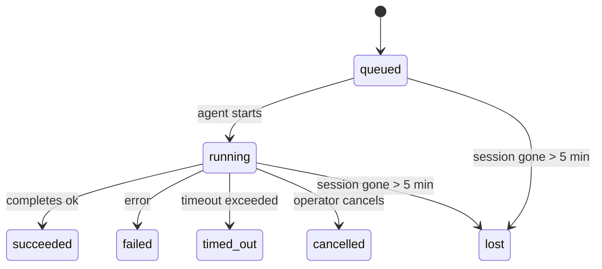

---
read_when:
    - Achtergrondwerk inspecteren dat in uitvoering is of onlangs is voltooid
    - Foutopsporing bij afleveringsfouten voor ontkoppelde agentuitvoeringen
    - Begrijpen hoe achtergrondruns zich verhouden tot sessies, Cron en Heartbeat
sidebarTitle: Background tasks
summary: Bijhouden van achtergrondtaken voor ACP-uitvoeringen, subagenten, geïsoleerde Cron-taken en CLI-bewerkingen
title: Achtergrondtaken
x-i18n:
    generated_at: "2026-05-12T00:56:13Z"
    model: gpt-5.5
    provider: openai
    source_hash: 31cbf09df48bab0686a1350f91aefffffef899c86704bb97b68320fc47e78021
    source_path: automation/tasks.md
    workflow: 16
---

<Note>
Op zoek naar planning? Zie [Automatisering](/nl/automation) om het juiste mechanisme te kiezen. Deze pagina is het activiteitenlogboek voor achtergrondwerk, niet de planner.
</Note>

Achtergrondtaken volgen werk dat **buiten je hoofdgesprekssessie** wordt uitgevoerd: ACP-runs, subagent-spawns, geïsoleerde Cron-taakuitvoeringen en door de CLI gestarte bewerkingen.

Taken vervangen **geen** sessies, Cron-taken of heartbeats - ze zijn het **activiteitenlogboek** dat vastlegt welk losgekoppeld werk is gebeurd, wanneer, en of het is geslaagd.

<Note>
Niet elke agent-run maakt een taak aan. Heartbeat-beurten en normale interactieve chat doen dat niet. Alle Cron-uitvoeringen, ACP-spawns, subagent-spawns en CLI-agentopdrachten doen dat wel.
</Note>

## TL;DR

- Taken zijn **records**, geen planners - Cron en Heartbeat bepalen _wanneer_ werk wordt uitgevoerd, taken volgen _wat er is gebeurd_.
- ACP, subagents, alle Cron-taken en CLI-bewerkingen maken taken aan. Heartbeat-beurten doen dat niet.
- Elke taak doorloopt `queued → running → terminal` (succeeded, failed, timed_out, cancelled of lost).
- Cron-taken blijven actief zolang de Cron-runtime de taak nog beheert; als de
  runtime-status in het geheugen weg is, controleert taakonderhoud eerst de duurzame Cron-
  runhistorie voordat een taak als verloren wordt gemarkeerd.
- Voltooiing is push-gestuurd: losgekoppeld werk kan rechtstreeks melden of de
  aanvragersessie/Heartbeat wekken wanneer het klaar is, waardoor statuspollingloops
  meestal de verkeerde vorm zijn.
- Geïsoleerde Cron-runs en subagent-voltooiingen proberen best-effort gevolgde browsertabs/processen voor hun child-sessie op te ruimen voordat de laatste opschoonboekhouding plaatsvindt.
- Geïsoleerde Cron-levering onderdrukt verouderde tussentijdse bovenliggende antwoorden terwijl descendant-subagentwerk nog wordt afgehandeld, en geeft de voorkeur aan definitieve descendant-uitvoer wanneer die vóór levering arriveert.
- Voltooiingsmeldingen worden rechtstreeks aan een kanaal geleverd of in de wachtrij gezet voor de volgende Heartbeat.
- `openclaw tasks list` toont alle taken; `openclaw tasks audit` brengt problemen naar boven.
- Terminalrecords worden 7 dagen bewaard en daarna automatisch opgeschoond.

## Snel aan de slag

<Tabs>
  <Tab title="List and filter">
    ```bash
    # Alle taken tonen (nieuwste eerst)
    openclaw tasks list

    # Filteren op runtime of status
    openclaw tasks list --runtime acp
    openclaw tasks list --status running
    ```

  </Tab>
  <Tab title="Inspect">
    ```bash
    # Details tonen voor een specifieke taak (op ID, run-ID of sessiesleutel)
    openclaw tasks show <lookup>
    ```
  </Tab>
  <Tab title="Cancel and notify">
    ```bash
    # Een lopende taak annuleren (beëindigt de child-sessie)
    openclaw tasks cancel <lookup>

    # Meldingsbeleid voor een taak wijzigen
    openclaw tasks notify <lookup> state_changes
    ```

  </Tab>
  <Tab title="Audit and maintenance">
    ```bash
    # Een gezondheidsaudit uitvoeren
    openclaw tasks audit

    # Onderhoud vooraf bekijken of toepassen
    openclaw tasks maintenance
    openclaw tasks maintenance --apply
    ```

  </Tab>
  <Tab title="Task flow">
    ```bash
    # TaskFlow-status inspecteren
    openclaw tasks flow list
    openclaw tasks flow show <lookup>
    openclaw tasks flow cancel <lookup>
    ```
  </Tab>
</Tabs>

## Wat maakt een taak aan

| Bron                   | Runtimetype | Wanneer een taakrecord wordt aangemaakt                | Standaard meldingsbeleid |
| ---------------------- | ------------ | ------------------------------------------------------ | ------------------------ |
| ACP-achtergrondruns    | `acp`        | Een child-ACP-sessie spawnen                           | `done_only`              |
| Subagent-orkestratie   | `subagent`   | Een subagent spawnen via `sessions_spawn`              | `done_only`              |
| Cron-taken (alle typen)| `cron`       | Elke Cron-uitvoering (hoofdsessie en geïsoleerd)       | `silent`                 |
| CLI-bewerkingen        | `cli`        | `openclaw agent`-opdrachten die via de Gateway lopen   | `silent`                 |
| Agent-mediataken       | `cli`        | Sessiegebonden `music_generate`/`video_generate`-runs  | `silent`                 |

<AccordionGroup>
  <Accordion title="Notify defaults for cron and media">
    Cron-taken in de hoofdsessie gebruiken standaard het meldingsbeleid `silent` - ze maken records aan voor tracking maar genereren geen meldingen. Geïsoleerde Cron-taken hebben ook standaard `silent`, maar zijn zichtbaarder omdat ze in hun eigen sessie draaien.

    Sessiegebonden `music_generate`- en `video_generate`-runs gebruiken ook het meldingsbeleid `silent`. Ze maken nog steeds taakrecords aan, maar voltooiing wordt teruggegeven aan de oorspronkelijke agentsessie als een interne wake, zodat de agent het vervolgbericht kan schrijven en de voltooide media zelf kan bijvoegen. Voltooiingen in groepen/kanalen volgen het normale beleid voor zichtbare antwoorden, dus de agent gebruikt de berichttool wanneer bronlevering dat vereist. Als de voltooiingsagent geen bewijs van levering via de berichttool produceert in een route met alleen tools, stuurt OpenClaw de voltooiingsfallback rechtstreeks naar het oorspronkelijke kanaal in plaats van de media privé te laten.

  </Accordion>
  <Accordion title="Concurrent video_generate guardrail">
    Terwijl een sessiegebonden `video_generate`-taak nog actief is, fungeert de tool ook als beveiliging: herhaalde `video_generate`-aanroepen in dezelfde sessie geven de actieve taakstatus terug in plaats van een tweede gelijktijdige generatie te starten. Gebruik `action: "status"` wanneer je expliciet voortgang/status wilt opvragen vanaf de agentkant.
  </Accordion>
  <Accordion title="What does not create tasks">
    - Heartbeat-beurten - hoofdsessie; zie [Heartbeat](/nl/gateway/heartbeat)
    - Normale interactieve chatbeurten
    - Rechtstreekse `/command`-antwoorden

  </Accordion>
</AccordionGroup>

## Taaklevenscyclus



| Status      | Wat het betekent                                                         |
| ----------- | ------------------------------------------------------------------------ |
| `queued`    | Aangemaakt, wacht tot de agent start                                     |
| `running`   | Agent-beurt wordt actief uitgevoerd                                      |
| `succeeded` | Succesvol voltooid                                                       |
| `failed`    | Voltooid met een fout                                                    |
| `timed_out` | De geconfigureerde time-out overschreden                                 |
| `cancelled` | Gestopt door de operator via `openclaw tasks cancel`                     |
| `lost`      | De runtime verloor gezaghebbende onderliggende status na een respijtperiode van 5 minuten |

Overgangen gebeuren automatisch - wanneer de bijbehorende agent-run eindigt, wordt de taakstatus bijgewerkt zodat die overeenkomt.

Voltooiing van de agent-run is gezaghebbend voor actieve taakrecords. Een geslaagde losgekoppelde run wordt afgerond als `succeeded`, gewone runfouten worden afgerond als `failed`, en time-out- of afbreekresultaten worden afgerond als `timed_out`. Als een operator de taak al heeft geannuleerd, of als de runtime al een sterkere terminalstatus zoals `failed`, `timed_out` of `lost` heeft vastgelegd, verlaagt een later successignaal die terminalstatus niet.

`lost` is runtime-bewust:

- ACP-taken: onderliggende ACP-child-sessiemetadata is verdwenen.
- Subagent-taken: onderliggende child-sessie is verdwenen uit de doelagentstore.
- Cron-taken: de Cron-runtime volgt de taak niet langer als actief en duurzame
  Cron-runhistorie toont geen terminalresultaat voor die run. Offline CLI-
  audit behandelt de eigen lege in-process Cron-runtime-status niet als autoriteit.
- CLI-taken: taken met een run-ID/source-ID gebruiken de live-runcontext, zodat
  achterblijvende child-sessie- of chatsessierijen ze niet actief houden nadat de
  Gateway-beheerde run verdwijnt. Legacy CLI-taken zonder runidentiteit vallen nog steeds
  terug op de child-sessie. Gateway-ondersteunde `openclaw agent`-runs worden ook afgerond
  op basis van hun runresultaat, zodat voltooide runs niet actief blijven totdat de sweeper
  ze als `lost` markeert.

## Levering en meldingen

Wanneer een taak een terminalstatus bereikt, meldt OpenClaw je dat. Er zijn twee leveringspaden:

**Rechtstreekse levering** - als de taak een kanaaldoel heeft (de `requesterOrigin`), gaat het voltooiingsbericht rechtstreeks naar dat kanaal (Telegram, Discord, Slack, enz.). Voltooiingen van groeps- en kanaaltaken worden in plaats daarvan via de aanvragersessie gerouteerd, zodat de parent-agent het zichtbare antwoord kan schrijven. Voor subagent-voltooiingen behoudt OpenClaw ook gebonden thread-/topic-routering wanneer beschikbaar en kan het een ontbrekende `to` / account invullen uit de opgeslagen route van de aanvragersessie (`lastChannel` / `lastTo` / `lastAccountId`) voordat rechtstreekse levering wordt opgegeven.

**Sessie-gequeueerde levering** - als rechtstreekse levering mislukt of geen origin is ingesteld, wordt de update als systeemgebeurtenis in de sessie van de aanvrager in de wachtrij gezet en verschijnt deze bij de volgende Heartbeat.

<Tip>
Taakvoltooiing triggert een onmiddellijke Heartbeat-wake, zodat je het resultaat snel ziet - je hoeft niet te wachten op de volgende geplande Heartbeat-tick.
</Tip>

Dat betekent dat de gebruikelijke workflow push-gebaseerd is: start losgekoppeld werk één keer en laat de runtime je wekken of melden wanneer het is voltooid. Poll taakstatus alleen wanneer je debugging, interventie of een expliciete audit nodig hebt.

### Meldingsbeleid

Bepaal hoeveel je over elke taak hoort:

| Beleid                | Wat wordt geleverd                                                     |
| --------------------- | ---------------------------------------------------------------------- |
| `done_only` (standaard) | Alleen terminalstatus (succeeded, failed, enz.) - **dit is de standaard** |
| `state_changes`       | Elke statusovergang en voortgangsupdate                                |
| `silent`              | Helemaal niets                                                          |

Wijzig het beleid terwijl een taak draait:

```bash
openclaw tasks notify <lookup> state_changes
```

## CLI-referentie

<AccordionGroup>
  <Accordion title="tasks list">
    ```bash
    openclaw tasks list [--runtime <acp|subagent|cron|cli>] [--status <status>] [--json]
    ```

    Uitvoerkolommen: taak-ID, soort, status, levering, run-ID, child-sessie, samenvatting.

  </Accordion>
  <Accordion title="tasks show">
    ```bash
    openclaw tasks show <lookup>
    ```

    Het lookup-token accepteert een taak-ID, run-ID of sessiesleutel. Toont het volledige record inclusief timing, leveringsstatus, fout en terminalsamenvatting.

  </Accordion>
  <Accordion title="tasks cancel">
    ```bash
    openclaw tasks cancel <lookup>
    ```

    Voor ACP- en subagent-taken beëindigt dit de child-sessie. Voor door CLI gevolgde taken wordt annulering vastgelegd in het taakregister (er is geen afzonderlijke child-runtimehandle). De status gaat over naar `cancelled` en er wordt een leveringsmelding verzonden wanneer van toepassing.

  </Accordion>
  <Accordion title="tasks notify">
    ```bash
    openclaw tasks notify <lookup> <done_only|state_changes|silent>
    ```
  </Accordion>
  <Accordion title="tasks audit">
    ```bash
    openclaw tasks audit [--json]
    ```

    Brengt operationele problemen naar boven. Bevindingen verschijnen ook in `openclaw status` wanneer problemen worden gedetecteerd.

    | Bevinding                 | Ernst      | Trigger                                                                                                                    |
    | ------------------------- | ---------- | -------------------------------------------------------------------------------------------------------------------------- |
    | `stale_queued`            | warn       | Langer dan 10 minuten in de wachtrij                                                                                       |
    | `stale_running`           | error      | Langer dan 30 minuten actief                                                                                               |
    | `lost`                    | warn/error | Runtime-ondersteund taakeigenaarschap is verdwenen; behouden verloren taken waarschuwen tot `cleanupAfter` en worden dan fouten |
    | `delivery_failed`         | warn       | Bezorging is mislukt en het meldingsbeleid is niet `silent`                                                                |
    | `missing_cleanup`         | warn       | Terminale taak zonder opschoontijdstempel                                                                                  |
    | `inconsistent_timestamps` | warn       | Tijdlijnschending (bijvoorbeeld geëindigd vóór gestart)                                                                    |

  </Accordion>
  <Accordion title="tasks maintenance">
    ```bash
    openclaw tasks maintenance [--json]
    openclaw tasks maintenance --apply [--json]
    ```

    Gebruik dit om reconciliatie, opschoonstempeling en snoeien voor taken, Task Flow-status en verouderde sessieregisterrijen van Cron-runs vooraf te bekijken of toe te passen.

    Reconciliatie is runtime-bewust:

    - ACP-/subagent-taken controleren hun onderliggende child-sessie.
    - Subagent-taken waarvan de child-sessie een herstart-herstel-tombstone heeft, worden als verloren gemarkeerd in plaats van behandeld als herstelbare onderliggende sessies.
    - Cron-taken controleren of de Cron-runtime de taak nog steeds bezit, en herstellen vervolgens de terminale status uit bewaarde Cron-runlogs/taakstatus voordat ze terugvallen op `lost`. Alleen het Gateway-proces is gezaghebbend voor de in-memory set met actieve Cron-taken; offline CLI-audit gebruikt duurzame geschiedenis maar markeert een Cron-taak niet als verloren alleen omdat die lokale Set leeg is.
    - CLI-taken met run-identiteit controleren de eigenaar-live-runcontext, niet alleen child-sessie- of chatsessierijen.

    Voltooiingsopschoning is ook runtime-bewust:

    - Voltooiing van subagents sluit naar beste vermogen bijgehouden browsertabs/processen voor de child-sessie voordat aankondigingsopschoning doorgaat.
    - Geïsoleerde Cron-voltooiing sluit naar beste vermogen bijgehouden browsertabs/processen voor de Cron-sessie voordat de run volledig wordt afgebroken.
    - Geïsoleerde Cron-bezorging wacht zo nodig op opvolging door afstammende subagents en onderdrukt verouderde bevestigingstekst van de ouder in plaats van die aan te kondigen.
    - Voltooiingsbezorging van subagents geeft de voorkeur aan de nieuwste zichtbare assistenttekst; als die leeg is, valt deze terug op opgeschoonde nieuwste tool-/toolResult-tekst, en runs met alleen een timeout voor tool-calls kunnen worden samengevouwen tot een korte samenvatting van gedeeltelijke voortgang. Terminale mislukte runs kondigen de mislukte status aan zonder vastgelegde antwoordtekst opnieuw af te spelen.
    - Opschoonfouten maskeren de echte taakuitkomst niet.

    Bij het toepassen van onderhoud verwijdert OpenClaw ook verouderde `cron:<jobId>:run:<uuid>`-sessieregisterrijen ouder dan 7 dagen, terwijl rijen voor momenteel draaiende Cron-taken behouden blijven en niet-Cron-sessierijen ongemoeid blijven.

  </Accordion>
  <Accordion title="tasks flow list | show | cancel">
    ```bash
    openclaw tasks flow list [--status <status>] [--json]
    openclaw tasks flow show <lookup> [--json]
    openclaw tasks flow cancel <lookup>
    ```

    Gebruik deze wanneer de orkestrerende Task Flow is waar u om geeft, in plaats van één afzonderlijk achtergrondtaakrecord.

  </Accordion>
</AccordionGroup>

## Chattaakbord (`/tasks`)

Gebruik `/tasks` in elke chatsessie om achtergrondtaken te zien die aan die sessie zijn gekoppeld. Het bord toont actieve en recent voltooide taken met runtime, status, timing en voortgangs- of foutdetails.

Wanneer de huidige sessie geen zichtbare gekoppelde taken heeft, valt `/tasks` terug op agent-lokale taakaantallen, zodat u toch een overzicht krijgt zonder details uit andere sessies te lekken.

Gebruik voor het volledige operatorlogboek de CLI: `openclaw tasks list`.

## Statusintegratie (taakdruk)

`openclaw status` bevat een taakoverzicht in één oogopslag:

```
Tasks: 3 queued · 2 running · 1 issues
```

Het overzicht rapporteert:

- **actief** - aantal `queued` + `running`
- **mislukkingen** - aantal `failed` + `timed_out` + `lost`
- **byRuntime** - uitsplitsing naar `acp`, `subagent`, `cron`, `cli`

Zowel `/status` als de tool `session_status` gebruiken een opschoonbewuste taaksnapshot: actieve taken krijgen de voorkeur, verouderde voltooide rijen worden verborgen, en recente mislukkingen verschijnen alleen wanneer er geen actief werk overblijft. Zo blijft de statuskaart gericht op wat er nu toe doet.

## Opslag en onderhoud

### Waar taken staan

Taakrecords blijven bestaan in SQLite op:

```
$OPENCLAW_STATE_DIR/tasks/runs.sqlite
```

Het register wordt bij het starten van de Gateway in het geheugen geladen en synchroniseert schrijfbewerkingen naar SQLite voor duurzaamheid over herstarts heen.
De Gateway houdt het SQLite write-ahead log begrensd door SQLite's standaard
autocheckpoint-drempel te gebruiken plus periodieke `TRUNCATE`-checkpoints en checkpoints bij afsluiten.

### Automatisch onderhoud

Elke **60 seconden** draait er een sweeper die vier dingen afhandelt:

<Steps>
  <Step title="Reconciliatie">
    Controleert of actieve taken nog steeds gezaghebbende runtime-ondersteuning hebben. ACP-/subagent-taken gebruiken child-sessiestatus, Cron-taken gebruiken eigenaarschap van actieve taken, en CLI-taken met run-identiteit gebruiken de eigenaar-runcontext. Als die onderliggende status langer dan 5 minuten verdwenen is, wordt de taak gemarkeerd als `lost`.
  </Step>
  <Step title="ACP-sessieherstel">
    Sluit terminale of verweesde, door de ouder beheerde eenmalige ACP-sessies, en sluit verouderde terminale of verweesde persistente ACP-sessies alleen wanneer er geen actieve gespreksbinding overblijft.
  </Step>
  <Step title="Opschoonstempeling">
    Stelt een `cleanupAfter`-tijdstempel in op terminale taken (endedAt + 7 dagen). Tijdens bewaring verschijnen verloren taken nog steeds in audit als waarschuwingen; nadat `cleanupAfter` is verlopen of wanneer opschoonmetadata ontbreekt, zijn het fouten.
  </Step>
  <Step title="Snoeien">
    Verwijdert records na hun `cleanupAfter`-datum.
  </Step>
</Steps>

<Note>
**Bewaring:** terminale taakrecords worden **7 dagen** bewaard en daarna automatisch gesnoeid. Geen configuratie nodig.
</Note>

## Hoe taken zich verhouden tot andere systemen

<AccordionGroup>
  <Accordion title="Taken en Task Flow">
    [Task Flow](/nl/automation/taskflow) is de flow-orkestratielaag boven achtergrondtaken. Eén flow kan gedurende zijn levensduur meerdere taken coördineren met beheerde of gespiegeld gesynchroniseerde modi. Gebruik `openclaw tasks` om afzonderlijke taakrecords te inspecteren en `openclaw tasks flow` om de orkestrerende flow te inspecteren.

    Zie [Task Flow](/nl/automation/taskflow) voor details.

  </Accordion>
  <Accordion title="Taken en Cron">
    Een Cron-taak**definitie** staat in `~/.openclaw/cron/jobs.json`; runtime-uitvoeringsstatus staat ernaast in `~/.openclaw/cron/jobs-state.json`. **Elke** Cron-uitvoering maakt een taakrecord aan - zowel main-session als geïsoleerd. Main-session Cron-taken gebruiken standaard meldingsbeleid `silent`, zodat ze bijhouden zonder meldingen te genereren.

    Zie [Cron-taken](/nl/automation/cron-jobs).

  </Accordion>
  <Accordion title="Taken en Heartbeat">
    Heartbeat-runs zijn main-session-beurten - ze maken geen taakrecords aan. Wanneer een taak voltooid is, kan deze een Heartbeat-wake triggeren zodat u het resultaat snel ziet.

    Zie [Heartbeat](/nl/gateway/heartbeat).

  </Accordion>
  <Accordion title="Taken en sessies">
    Een taak kan verwijzen naar een `childSessionKey` (waar werk draait) en een `requesterSessionKey` (wie het heeft gestart). Sessies zijn gesprekscontext; taken zijn activiteitsregistratie daarbovenop.
  </Accordion>
  <Accordion title="Taken en agent-runs">
    De `runId` van een taak koppelt naar de agent-run die het werk uitvoert. Agent-levenscyclusgebeurtenissen (start, einde, fout) werken de taakstatus automatisch bij - u hoeft de levenscyclus niet handmatig te beheren.
  </Accordion>
</AccordionGroup>

## Gerelateerd

- [Automatisering](/nl/automation) - alle automatiseringsmechanismen in één oogopslag
- [CLI: Tasks](/nl/cli/tasks) - CLI-commandoreferentie
- [Heartbeat](/nl/gateway/heartbeat) - periodieke main-session-beurten
- [Geplande taken](/nl/automation/cron-jobs) - achtergrondwerk plannen
- [Task Flow](/nl/automation/taskflow) - flow-orkestratie boven taken
