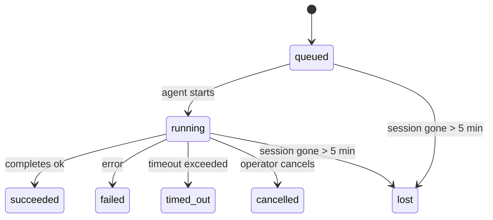

---
read_when:
    - Achtergrondwerk inspecteren dat in uitvoering is of onlangs is voltooid
    - Afleveringsfouten bij losgekoppelde agent-uitvoeringen debuggen
    - Begrijpen hoe achtergrondruns zich verhouden tot sessies, Cron en Heartbeat
sidebarTitle: Background tasks
summary: Bijhouden van achtergrondtaken voor ACP-uitvoeringen, subagenten, geïsoleerde Cron-taken en CLI-bewerkingen
title: Achtergrondtaken
x-i18n:
    generated_at: "2026-05-05T06:16:29Z"
    model: gpt-5.5
    provider: openai
    source_hash: bafd959feaf2e220820ec56bf1ef144207d05757418e9971ebf427844cf30c46
    source_path: automation/tasks.md
    workflow: 16
---

<Note>
Zoek je planning? Zie [Automatisering en taken](/nl/automation) om het juiste mechanisme te kiezen. Deze pagina is het activiteitenlogboek voor achtergrondwerk, niet de planner.
</Note>

Achtergrondtaken volgen werk dat **buiten je hoofdgesprekssessie** wordt uitgevoerd: ACP-runs, het starten van subagents, geïsoleerde Cron-taakuitvoeringen en bewerkingen die vanuit de CLI worden gestart.

Taken vervangen **geen** sessies, Cron-taken of Heartbeats — ze zijn het **activiteitenlogboek** dat vastlegt welk losgekoppeld werk is uitgevoerd, wanneer, en of het is geslaagd.

<Note>
Niet elke agent-run maakt een taak aan. Heartbeat-beurten en normale interactieve chat doen dat niet. Alle Cron-uitvoeringen, ACP-starts, subagent-starts en CLI-agentopdrachten doen dat wel.
</Note>

## TL;DR

- Taken zijn **records**, geen planners — Cron en Heartbeat bepalen _wanneer_ werk wordt uitgevoerd, taken volgen _wat er is gebeurd_.
- ACP, subagents, alle Cron-taken en CLI-bewerkingen maken taken aan. Heartbeat-beurten doen dat niet.
- Elke taak beweegt door `queued → running → terminal` (succeeded, failed, timed_out, cancelled of lost).
- Cron-taken blijven live zolang de Cron-runtime de taak nog bezit; als de
  in-memory runtimestatus weg is, controleert taakonderhoud eerst de duurzame
  Cron-runhistorie voordat een taak als lost wordt gemarkeerd.
- Afronding is push-gestuurd: losgekoppeld werk kan rechtstreeks melden of de
  aanvragende sessie/Heartbeat wekken wanneer het klaar is, waardoor statuspollingloops
  meestal de verkeerde vorm hebben.
- Geïsoleerde Cron-runs en afgeronde subagents ruimen best-effort gevolgde browsertabs/processen voor hun kindsessie op vóór de laatste opruimboekhouding.
- Geïsoleerde Cron-aflevering onderdrukt verouderde tussentijdse ouderantwoorden terwijl afstammend subagentwerk nog wordt afgehandeld, en geeft de voorkeur aan definitieve afstammende uitvoer wanneer die vóór aflevering aankomt.
- Afrondingsmeldingen worden rechtstreeks aan een kanaal geleverd of in de wachtrij gezet voor de volgende Heartbeat.
- `openclaw tasks list` toont alle taken; `openclaw tasks audit` brengt problemen aan het licht.
- Eindrecords worden 7 dagen bewaard en daarna automatisch opgeschoond.

## Snel starten

<Tabs>
  <Tab title="Weergeven en filteren">
    ```bash
    # List all tasks (newest first)
    openclaw tasks list

    # Filter by runtime or status
    openclaw tasks list --runtime acp
    openclaw tasks list --status running
    ```

  </Tab>
  <Tab title="Inspecteren">
    ```bash
    # Show details for a specific task (by ID, run ID, or session key)
    openclaw tasks show <lookup>
    ```
  </Tab>
  <Tab title="Annuleren en melden">
    ```bash
    # Cancel a running task (kills the child session)
    openclaw tasks cancel <lookup>

    # Change notification policy for a task
    openclaw tasks notify <lookup> state_changes
    ```

  </Tab>
  <Tab title="Audit en onderhoud">
    ```bash
    # Run a health audit
    openclaw tasks audit

    # Preview or apply maintenance
    openclaw tasks maintenance
    openclaw tasks maintenance --apply
    ```

  </Tab>
  <Tab title="Taakstroom">
    ```bash
    # Inspect TaskFlow state
    openclaw tasks flow list
    openclaw tasks flow show <lookup>
    openclaw tasks flow cancel <lookup>
    ```
  </Tab>
</Tabs>

## Wat een taak aanmaakt

| Bron                   | Runtimetype | Wanneer een taakrecord wordt aangemaakt                | Standaard meldingsbeleid |
| ---------------------- | ------------ | ------------------------------------------------------ | ------------------------ |
| ACP-achtergrondruns    | `acp`        | Een ACP-kindsessie starten                             | `done_only`              |
| Subagent-orkestratie   | `subagent`   | Een subagent starten via `sessions_spawn`              | `done_only`              |
| Cron-taken (alle typen) | `cron`       | Elke Cron-uitvoering (hoofdsessie en geïsoleerd)       | `silent`                 |
| CLI-bewerkingen        | `cli`        | `openclaw agent`-opdrachten die via de Gateway lopen   | `silent`                 |
| Agent-mediataken       | `cli`        | Sessiegebonden `music_generate`/`video_generate`-runs  | `silent`                 |

<AccordionGroup>
  <Accordion title="Meldingsstandaarden voor Cron en media">
    Cron-taken in de hoofdsessie gebruiken standaard het meldingsbeleid `silent` — ze maken records aan voor tracking, maar genereren geen meldingen. Geïsoleerde Cron-taken hebben ook standaard `silent`, maar zijn zichtbaarder omdat ze in hun eigen sessie draaien.

    Sessiegebonden `music_generate`- en `video_generate`-runs gebruiken ook het meldingsbeleid `silent`. Ze maken nog steeds taakrecords aan, maar afronding wordt als interne wake teruggegeven aan de oorspronkelijke agentsessie zodat de agent het vervolgbericht kan schrijven en de voltooide media zelf kan bijvoegen. Afrondingen in groepen/kanalen volgen het normale beleid voor zichtbare antwoorden, dus de agent gebruikt de berichtentool wanneer bronaflevering dat vereist. Als de afrondingsagent geen bewijs van aflevering via de berichtentool produceert in een route met alleen tools, stuurt OpenClaw de afrondingsfallback rechtstreeks naar het oorspronkelijke kanaal in plaats van de media privé te laten.

  </Accordion>
  <Accordion title="Vangrail voor gelijktijdige video_generate">
    Terwijl een sessiegebonden `video_generate`-taak nog actief is, fungeert de tool ook als vangrail: herhaalde `video_generate`-aanroepen in dezelfde sessie geven de actieve taakstatus terug in plaats van een tweede gelijktijdige generatie te starten. Gebruik `action: "status"` wanneer je vanaf de agentkant expliciet de voortgang/status wilt opvragen.
  </Accordion>
  <Accordion title="Wat geen taken aanmaakt">
    - Heartbeat-beurten — hoofdsessie; zie [Heartbeat](/nl/gateway/heartbeat)
    - Normale interactieve chatbeurten
    - Directe `/command`-antwoorden

  </Accordion>
</AccordionGroup>

## Taaklevenscyclus



| Status      | Wat het betekent                                                          |
| ----------- | -------------------------------------------------------------------------- |
| `queued`    | Aangemaakt, wacht tot de agent start                                      |
| `running`   | Agentbeurt wordt actief uitgevoerd                                       |
| `succeeded` | Succesvol voltooid                                                        |
| `failed`    | Voltooid met een fout                                                     |
| `timed_out` | De geconfigureerde time-out is overschreden                               |
| `cancelled` | Gestopt door de operator via `openclaw tasks cancel`                      |
| `lost`      | De runtime verloor gezaghebbende onderliggende status na een respijtperiode van 5 minuten |

Overgangen gebeuren automatisch — wanneer de bijbehorende agent-run eindigt, wordt de taakstatus bijgewerkt naar de overeenkomende status.

Afronding van een agent-run is gezaghebbend voor actieve taakrecords. Een succesvolle losgekoppelde run wordt afgerond als `succeeded`, gewone runfouten worden afgerond als `failed`, en time-out- of afbreekuitkomsten worden afgerond als `timed_out`. Als een operator de taak al heeft geannuleerd, of als de runtime al een sterkere eindstatus zoals `failed`, `timed_out` of `lost` heeft vastgelegd, verlaagt een later successignaal die eindstatus niet.

`lost` is runtime-bewust:

- ACP-taken: metadata van de onderliggende ACP-kindsessie is verdwenen.
- Subagent-taken: onderliggende kindsessie is verdwenen uit de doelagentstore.
- Cron-taken: de Cron-runtime volgt de taak niet langer als actief en de duurzame
  Cron-runhistorie toont geen eindresultaat voor die run. Offline CLI-audit
  behandelt de eigen lege in-process Cron-runtimestatus niet als gezaghebbend.
- CLI-taken: geïsoleerde kindsessietaken gebruiken de kindsessie; chatgebonden
  CLI-taken gebruiken in plaats daarvan de live runcontext, zodat achterblijvende
  kanaal-/groep-/directe sessierijen ze niet levend houden. Gateway-gebonden
  `openclaw agent`-runs worden ook afgerond op basis van hun runresultaat, zodat voltooide runs
  niet actief blijven totdat de sweeper ze als `lost` markeert.

## Aflevering en meldingen

Wanneer een taak een eindstatus bereikt, meldt OpenClaw dat aan je. Er zijn twee afleverpaden:

**Rechtstreekse aflevering** — als de taak een kanaaldoel heeft (de `requesterOrigin`), gaat het afrondingsbericht rechtstreeks naar dat kanaal (Telegram, Discord, Slack, enzovoort). Voor subagent-afrondingen behoudt OpenClaw ook gebonden thread-/topicroutering wanneer beschikbaar en kan het een ontbrekende `to` / account invullen vanuit de opgeslagen route van de aanvragersessie (`lastChannel` / `lastTo` / `lastAccountId`) voordat rechtstreekse aflevering wordt opgegeven.

**Sessie-wachtrijaflevering** — als rechtstreekse aflevering mislukt of geen origin is ingesteld, wordt de update als systeemgebeurtenis in de sessie van de aanvrager in de wachtrij gezet en verschijnt deze bij de volgende Heartbeat.

<Tip>
Taakafronding activeert een onmiddellijke Heartbeat-wake zodat je het resultaat snel ziet — je hoeft niet te wachten op de volgende geplande Heartbeat-tick.
</Tip>

Dat betekent dat de gebruikelijke workflow push-gebaseerd is: start losgekoppeld werk één keer en laat de runtime je wekken of melden wanneer het is afgerond. Poll de taakstatus alleen wanneer je debugging, interventie of een expliciete audit nodig hebt.

### Meldingsbeleid

Bepaal hoeveel je over elke taak hoort:

| Beleid                | Wat wordt afgeleverd                                                   |
| --------------------- | ----------------------------------------------------------------------- |
| `done_only` (standaard) | Alleen eindstatus (succeeded, failed, enzovoort) — **dit is de standaard** |
| `state_changes`       | Elke statusovergang en voortgangsupdate                                |
| `silent`              | Helemaal niets                                                          |

Wijzig het beleid terwijl een taak draait:

```bash
openclaw tasks notify <lookup> state_changes
```

## CLI-referentie

<AccordionGroup>
  <Accordion title="tasks list">
    ```bash
    openclaw tasks list [--runtime <acp|subagent|cron|cli>] [--status <status>] [--json]
    ```

    Uitvoerkolommen: Taak-ID, Soort, Status, Aflevering, Run-ID, Kindsessie, Samenvatting.

  </Accordion>
  <Accordion title="tasks show">
    ```bash
    openclaw tasks show <lookup>
    ```

    Het opzoektoken accepteert een taak-ID, run-ID of sessiesleutel. Toont het volledige record, inclusief timing, afleverstatus, fout en eindsamenvatting.

  </Accordion>
  <Accordion title="tasks cancel">
    ```bash
    openclaw tasks cancel <lookup>
    ```

    Voor ACP- en subagent-taken beëindigt dit de kindsessie. Voor door CLI gevolgde taken wordt annulering vastgelegd in het taakregister (er is geen afzonderlijke child-runtimehandle). De status gaat over naar `cancelled` en er wordt een aflevermelding verzonden wanneer van toepassing.

  </Accordion>
  <Accordion title="tasks notify">
    ```bash
    openclaw tasks notify <lookup> <done_only|state_changes|silent>
    ```
  </Accordion>
  <Accordion title="tasks audit">
    ```bash
    openclaw tasks audit [--json]
    ```

    Brengt operationele problemen aan het licht. Bevindingen verschijnen ook in `openclaw status` wanneer problemen worden gedetecteerd.

    | Bevinding                 | Ernst      | Trigger                                                                                                      |
    | ------------------------- | ---------- | ------------------------------------------------------------------------------------------------------------ |
    | `stale_queued`            | waarschuwing | Meer dan 10 minuten in wachtrij                                                                              |
    | `stale_running`           | fout       | Meer dan 30 minuten actief                                                                                   |
    | `lost`                    | waarschuwing/fout | Runtime-ondersteund taakeigenaarschap is verdwenen; behouden verloren taken waarschuwen tot `cleanupAfter`, daarna worden ze fouten |
    | `delivery_failed`         | waarschuwing | Bezorging mislukt en meldingsbeleid is niet `silent`                                                         |
    | `missing_cleanup`         | waarschuwing | Terminale taak zonder opschoningstijdstempel                                                                 |
    | `inconsistent_timestamps` | waarschuwing | Tijdlijnschending (bijvoorbeeld geëindigd voordat gestart)                                                   |

  </Accordion>
  <Accordion title="tasks maintenance">
    ```bash
    openclaw tasks maintenance [--json]
    openclaw tasks maintenance --apply [--json]
    ```

    Gebruik dit om reconciliatie, opschoningsstempeling en pruning voor taken en Task Flow-status vooraf te bekijken of toe te passen.

    Reconciliatie is runtime-bewust:

    - ACP-/subagent-taken controleren hun achterliggende child session.
    - Subagent-taken waarvan de child session een restart-recovery-tombstone heeft, worden als verloren gemarkeerd in plaats van als herstelbare achterliggende sessies te worden behandeld.
    - Cron-taken controleren of de cron-runtime de job nog steeds bezit, en herstellen daarna de terminale status uit blijvend opgeslagen cron-runlogs/jobstatus voordat ze terugvallen op `lost`. Alleen het Gateway-proces is gezaghebbend voor de in-memory cron active-job-set; een offline CLI-audit gebruikt duurzame geschiedenis maar markeert een cron-taak niet als verloren alleen omdat die lokale Set leeg is.
    - Chat-ondersteunde CLI-taken controleren de eigenaar live run-context, niet alleen de chat-sessierij.

    Voltooiingsopschoning is ook runtime-bewust:

    - Subagent-voltooiing sluit best-effort bijgehouden browsertabs/processen voor de child session voordat de aankondigingsopschoning doorgaat.
    - Geïsoleerde cron-voltooiing sluit best-effort bijgehouden browsertabs/processen voor de cron-sessie voordat de run volledig wordt afgebroken.
    - Geïsoleerde cron-bezorging wacht indien nodig op vervolgwerk van descendant subagents en onderdrukt verouderde bevestigingstekst van de ouder in plaats van die aan te kondigen.
    - Bezorging van subagent-voltooiing geeft de voorkeur aan de nieuwste zichtbare assistenttekst; als die leeg is, valt dit terug op opgeschoonde nieuwste tool-/toolResult-tekst, en runs met alleen time-out-tool-calls kunnen worden samengevat tot een korte voortgangssamenvatting. Terminale mislukte runs kondigen de foutstatus aan zonder vastgelegde antwoordtekst opnieuw af te spelen.
    - Opschoningsfouten maskeren de echte taakuitkomst niet.

  </Accordion>
  <Accordion title="tasks flow list | show | cancel">
    ```bash
    openclaw tasks flow list [--status <status>] [--json]
    openclaw tasks flow show <lookup> [--json]
    openclaw tasks flow cancel <lookup>
    ```

    Gebruik deze wanneer de orkestrerende Task Flow belangrijk voor je is in plaats van één afzonderlijke achtergrondtaakrecord.

  </Accordion>
</AccordionGroup>

## Chat-taakbord (`/tasks`)

Gebruik `/tasks` in elke chatsessie om achtergrondtaken te bekijken die aan die sessie zijn gekoppeld. Het bord toont actieve en recent voltooide taken met runtime, status, timing en voortgangs- of foutdetails.

Wanneer de huidige sessie geen zichtbare gekoppelde taken heeft, valt `/tasks` terug op agent-lokale taaktellingen, zodat je nog steeds een overzicht krijgt zonder details van andere sessies te lekken.

Gebruik voor het volledige operatorlogboek de CLI: `openclaw tasks list`.

## Statusintegratie (taakdruk)

`openclaw status` bevat een taaksamenvatting in één oogopslag:

```
Tasks: 3 queued · 2 running · 1 issues
```

De samenvatting rapporteert:

- **active** — aantal `queued` + `running`
- **failures** — aantal `failed` + `timed_out` + `lost`
- **byRuntime** — uitsplitsing naar `acp`, `subagent`, `cron`, `cli`

Zowel `/status` als de `session_status`-tool gebruiken een opschoningsbewuste taaksnapshot: actieve taken krijgen de voorkeur, verouderde voltooide rijen worden verborgen, en recente fouten verschijnen alleen wanneer er geen actief werk meer over is. Zo blijft de statuskaart gericht op wat er nu toe doet.

## Opslag en onderhoud

### Waar taken staan

Taakrecords blijven in SQLite staan op:

```
$OPENCLAW_STATE_DIR/tasks/runs.sqlite
```

De registry wordt bij het starten van de Gateway in het geheugen geladen en synchroniseert schrijfacties naar SQLite voor duurzaamheid tussen herstarts.
De Gateway houdt de SQLite write-ahead log begrensd door de standaard
autocheckpoint-drempel van SQLite te gebruiken, plus periodieke en afsluitende `TRUNCATE`-checkpoints.

### Automatisch onderhoud

Een sweeper draait elke **60 seconden** en handelt vier dingen af:

<Steps>
  <Step title="Reconciliatie">
    Controleert of actieve taken nog steeds gezaghebbende runtime-ondersteuning hebben. ACP-/subagent-taken gebruiken child-session-status, cron-taken gebruiken active-job-eigenaarschap, en chat-ondersteunde CLI-taken gebruiken de eigenaar run-context. Als die ondersteuning langer dan 5 minuten weg is, wordt de taak gemarkeerd als `lost`.
  </Step>
  <Step title="ACP-sessieherstel">
    Sluit terminale of verweesde parent-owned eenmalige ACP-sessies, en sluit verouderde terminale of verweesde persistente ACP-sessies alleen wanneer er geen actieve conversatiebinding meer bestaat.
  </Step>
  <Step title="Opschoningsstempeling">
    Stelt een `cleanupAfter`-tijdstempel in op terminale taken (endedAt + 7 dagen). Tijdens de bewaartermijn verschijnen verloren taken nog steeds in de audit als waarschuwingen; nadat `cleanupAfter` verloopt of wanneer opschoningsmetadata ontbreken, zijn het fouten.
  </Step>
  <Step title="Pruning">
    Verwijdert records waarvan de `cleanupAfter`-datum is verstreken.
  </Step>
</Steps>

<Note>
**Bewaartermijn:** terminale taakrecords worden **7 dagen** bewaard en daarna automatisch gepruned. Geen configuratie nodig.
</Note>

## Hoe taken zich verhouden tot andere systemen

<AccordionGroup>
  <Accordion title="Taken en Task Flow">
    [Task Flow](/nl/automation/taskflow) is de flow-orkestratielaag boven achtergrondtaken. Eén flow kan tijdens zijn levensduur meerdere taken coördineren met beheerde of gespiegeld gesynchroniseerde modi. Gebruik `openclaw tasks` om afzonderlijke taakrecords te inspecteren en `openclaw tasks flow` om de orkestrerende flow te inspecteren.

    Zie [Task Flow](/nl/automation/taskflow) voor details.

  </Accordion>
  <Accordion title="Taken en cron">
    Een cron-job**definitie** staat in `~/.openclaw/cron/jobs.json`; runtime-uitvoeringsstatus staat ernaast in `~/.openclaw/cron/jobs-state.json`. **Elke** cron-uitvoering maakt een taakrecord aan — zowel main-session als geïsoleerd. Main-session cron-taken gebruiken standaard het `silent`-meldingsbeleid, zodat ze worden gevolgd zonder meldingen te genereren.

    Zie [Cron Jobs](/nl/automation/cron-jobs).

  </Accordion>
  <Accordion title="Taken en Heartbeat">
    Heartbeat-runs zijn main-session-beurten — ze maken geen taakrecords aan. Wanneer een taak wordt voltooid, kan die een Heartbeat-wake activeren zodat je het resultaat snel ziet.

    Zie [Heartbeat](/nl/gateway/heartbeat).

  </Accordion>
  <Accordion title="Taken en sessies">
    Een taak kan verwijzen naar een `childSessionKey` (waar werk draait) en een `requesterSessionKey` (wie het startte). Sessies zijn conversatiecontext; taken zijn activiteitstracking daarbovenop.
  </Accordion>
  <Accordion title="Taken en agent-runs">
    De `runId` van een taak koppelt aan de agent-run die het werk uitvoert. Agent-lifecycle-events (start, einde, fout) werken de taakstatus automatisch bij — je hoeft de lifecycle niet handmatig te beheren.
  </Accordion>
</AccordionGroup>

## Gerelateerd

- [Automatisering en taken](/nl/automation) — alle automatiseringsmechanismen in één oogopslag
- [CLI: Taken](/nl/cli/tasks) — CLI-commandoreferentie
- [Heartbeat](/nl/gateway/heartbeat) — periodieke main-session-beurten
- [Geplande taken](/nl/automation/cron-jobs) — achtergrondwerk plannen
- [Task Flow](/nl/automation/taskflow) — flow-orkestratie boven taken
