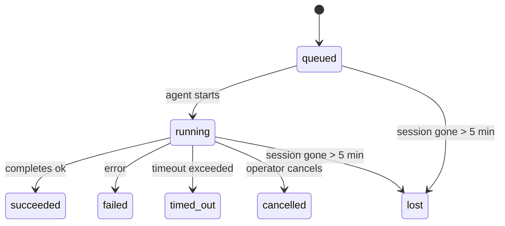

---
read_when:
    - Achtergrondwerk inspecteren dat in uitvoering is of onlangs is voltooid
    - Foutopsporing voor afleveringsfouten bij losgekoppelde agentuitvoeringen
    - Begrijpen hoe uitvoeringen op de achtergrond zich verhouden tot sessies, Cron en Heartbeat
sidebarTitle: Background tasks
summary: Tracking van achtergrondtaken voor ACP-uitvoeringen, subagenten, geïsoleerde Cron-taken en CLI-bewerkingen
title: Achtergrondtaken
x-i18n:
    generated_at: "2026-05-06T09:02:27Z"
    model: gpt-5.5
    provider: openai
    source_hash: 055e16b4f53dbd089cc72eea7fe80bdaee5451dc56fa6e88a742f98e566bb57a
    source_path: automation/tasks.md
    workflow: 16
---

<Note>
Op zoek naar planning? Zie [Automatisering en taken](/nl/automation) om het juiste mechanisme te kiezen. Deze pagina is het activiteitenlogboek voor achtergrondwerk, niet de planner.
</Note>

Achtergrondtaken volgen werk dat **buiten je hoofdgesprekssessie** wordt uitgevoerd: ACP-runs, het starten van subagents, geïsoleerde Cron-taakuitvoeringen en door de CLI gestarte bewerkingen.

Taken vervangen **geen** sessies, Cron-taken of Heartbeats - ze zijn het **activiteitenlogboek** dat vastlegt welk losgekoppeld werk heeft plaatsgevonden, wanneer dat gebeurde en of het is geslaagd.

<Note>
Niet elke agent-run maakt een taak aan. Heartbeat-beurten en normale interactieve chat doen dat niet. Alle Cron-uitvoeringen, ACP-starts, subagent-starts en CLI-agentopdrachten doen dat wel.
</Note>

## TL;DR

- Taken zijn **records**, geen planners - Cron en Heartbeat bepalen _wanneer_ werk wordt uitgevoerd, taken volgen _wat er is gebeurd_.
- ACP, subagents, alle Cron-taken en CLI-bewerkingen maken taken aan. Heartbeat-beurten doen dat niet.
- Elke taak doorloopt `queued → running → terminal` (succeeded, failed, timed_out, cancelled of lost).
- Cron-taken blijven live terwijl de Cron-runtime de taak nog bezit; als de
  in-memory runtimestatus weg is, controleert taakonderhoud eerst de duurzame
  Cron-runhistorie voordat een taak als verloren wordt gemarkeerd.
- Voltooiing is push-gedreven: losgekoppeld werk kan rechtstreeks melden of de
  aanvraagsessie/Heartbeat wekken wanneer het klaar is, dus status-pollinglussen
  hebben meestal de verkeerde vorm.
- Geïsoleerde Cron-runs en subagent-voltooiingen ruimen best-effort bijgehouden browsertabbladen/processen voor hun child-sessie op voordat de uiteindelijke opschoningsboekhouding plaatsvindt.
- Geïsoleerde Cron-aflevering onderdrukt verouderde tussentijdse parent-antwoorden terwijl afstammend subagent-werk nog wordt afgehandeld, en geeft de voorkeur aan uiteindelijke afstammende uitvoer wanneer die vóór aflevering arriveert.
- Voltooiingsmeldingen worden rechtstreeks aan een kanaal afgeleverd of in de wachtrij gezet voor de volgende Heartbeat.
- `openclaw tasks list` toont alle taken; `openclaw tasks audit` brengt problemen naar voren.
- Terminale records worden 7 dagen bewaard en daarna automatisch opgeschoond.

## Snel starten

<Tabs>
  <Tab title="Lijsten en filteren">
    ```bash
    # List all tasks (newest first)
    openclaw tasks list

    # Filter by runtime or status
    openclaw tasks list --runtime acp
    openclaw tasks list --status running
    ```

  </Tab>
  <Tab title="Inspecteren">
    ```bash
    # Show details for a specific task (by ID, run ID, or session key)
    openclaw tasks show <lookup>
    ```
  </Tab>
  <Tab title="Annuleren en melden">
    ```bash
    # Cancel a running task (kills the child session)
    openclaw tasks cancel <lookup>

    # Change notification policy for a task
    openclaw tasks notify <lookup> state_changes
    ```

  </Tab>
  <Tab title="Audit en onderhoud">
    ```bash
    # Run a health audit
    openclaw tasks audit

    # Preview or apply maintenance
    openclaw tasks maintenance
    openclaw tasks maintenance --apply
    ```

  </Tab>
  <Tab title="Taakstroom">
    ```bash
    # Inspect TaskFlow state
    openclaw tasks flow list
    openclaw tasks flow show <lookup>
    openclaw tasks flow cancel <lookup>
    ```
  </Tab>
</Tabs>

## Wat een taak aanmaakt

| Bron                   | Runtimetype | Wanneer een taakrecord wordt aangemaakt                         | Standaard meldingsbeleid |
| ---------------------- | ----------- | --------------------------------------------------------------- | ------------------------ |
| ACP-achtergrondruns    | `acp`       | Een child-ACP-sessie starten                                    | `done_only`              |
| Subagent-orkestratie   | `subagent`  | Een subagent starten via `sessions_spawn`                       | `done_only`              |
| Cron-taken (alle typen) | `cron`     | Elke Cron-uitvoering (hoofdsessie en geïsoleerd)                | `silent`                 |
| CLI-bewerkingen        | `cli`       | `openclaw agent`-opdrachten die via de Gateway worden uitgevoerd | `silent`                 |
| Agent-mediataken       | `cli`       | Sessiegedragen `music_generate`/`video_generate`-runs           | `silent`                 |

<AccordionGroup>
  <Accordion title="Meldingsstandaarden voor Cron en media">
    Cron-taken in de hoofdsessie gebruiken standaard het meldingsbeleid `silent` - ze maken records aan voor tracking, maar genereren geen meldingen. Geïsoleerde Cron-taken gebruiken ook standaard `silent`, maar zijn zichtbaarder omdat ze in hun eigen sessie worden uitgevoerd.

    Sessiegedragen `music_generate`- en `video_generate`-runs gebruiken ook het meldingsbeleid `silent`. Ze maken nog steeds taakrecords aan, maar voltooiing wordt als interne wake teruggegeven aan de oorspronkelijke agentsessie, zodat de agent het vervolgbericht kan schrijven en de voltooide media zelf kan bijvoegen. Groeps-/kanaalvoltooiingen volgen het normale beleid voor zichtbare antwoorden, dus de agent gebruikt de berichttool wanneer bronaflevering dat vereist. Als de voltooiingsagent geen bewijs van aflevering via de berichttool produceert in een route met alleen tools, stuurt OpenClaw de voltooiingsfallback rechtstreeks naar het oorspronkelijke kanaal in plaats van de media privé te laten.

  </Accordion>
  <Accordion title="Guardrail voor gelijktijdige video_generate">
    Terwijl een sessiegedragen `video_generate`-taak nog actief is, werkt de tool ook als guardrail: herhaalde `video_generate`-aanroepen in dezelfde sessie retourneren de actieve taakstatus in plaats van een tweede gelijktijdige generatie te starten. Gebruik `action: "status"` wanneer je expliciet een voortgangs-/statusopvraag vanaf de agentzijde wilt.
  </Accordion>
  <Accordion title="Wat geen taken aanmaakt">
    - Heartbeat-beurten - hoofdsessie; zie [Heartbeat](/nl/gateway/heartbeat)
    - Normale interactieve chatbeurten
    - Rechtstreekse `/command`-antwoorden

  </Accordion>
</AccordionGroup>

## Taaklevenscyclus



| Status      | Wat het betekent                                                        |
| ----------- | ---------------------------------------------------------------------- |
| `queued`    | Aangemaakt, wacht tot de agent start                                   |
| `running`   | Agent-beurt wordt actief uitgevoerd                                    |
| `succeeded` | Succesvol voltooid                                                     |
| `failed`    | Voltooid met een fout                                                  |
| `timed_out` | De geconfigureerde time-out overschreden                               |
| `cancelled` | Gestopt door de operator via `openclaw tasks cancel`                   |
| `lost`      | De runtime verloor gezaghebbende onderliggende status na een respijtperiode van 5 minuten |

Overgangen gebeuren automatisch - wanneer de gekoppelde agent-run eindigt, wordt de taakstatus bijgewerkt zodat die overeenkomt.

Voltooiing van de agent-run is gezaghebbend voor actieve taakrecords. Een succesvolle losgekoppelde run wordt afgerond als `succeeded`, gewone runfouten worden afgerond als `failed`, en time-out- of afbreekuitkomsten worden afgerond als `timed_out`. Als een operator de taak al heeft geannuleerd, of de runtime al een sterkere terminale status heeft vastgelegd zoals `failed`, `timed_out` of `lost`, verlaagt een later successignaal die terminale status niet.

`lost` is runtime-bewust:

- ACP-taken: onderliggende ACP-child-sessiemetadata is verdwenen.
- Subagent-taken: onderliggende child-sessie is verdwenen uit de doelagentstore.
- Cron-taken: de Cron-runtime volgt de taak niet langer als actief en de duurzame
  Cron-runhistorie toont geen terminaal resultaat voor die run. Offline CLI-
  audit beschouwt de eigen lege in-process Cron-runtimestatus niet als gezaghebbend.
- CLI-taken: geïsoleerde child-sessietaken gebruiken de child-sessie; chatgedragen
  CLI-taken gebruiken in plaats daarvan de live runcontext, zodat achterblijvende
  kanaal-/groep-/directe sessierijen ze niet actief houden. Gateway-gedragen
  `openclaw agent`-runs worden ook afgerond op basis van hun runresultaat, zodat voltooide runs
  niet actief blijven totdat de sweeper ze als `lost` markeert.

## Aflevering en meldingen

Wanneer een taak een terminale status bereikt, meldt OpenClaw je dat. Er zijn twee afleverpaden:

**Rechtstreekse aflevering** - als de taak een kanaaldoel heeft (de `requesterOrigin`), gaat het voltooiingsbericht direct naar dat kanaal (Telegram, Discord, Slack, enz.). Voor subagent-voltooiingen behoudt OpenClaw ook gebonden thread-/topic-routering wanneer beschikbaar en kan een ontbrekende `to` / account invullen vanuit de opgeslagen route van de aanvraagsessie (`lastChannel` / `lastTo` / `lastAccountId`) voordat rechtstreekse aflevering wordt opgegeven.

**Sessie-wachtrijaflevering** - als rechtstreekse aflevering mislukt of er geen origin is ingesteld, wordt de update als systeemgebeurtenis in de sessie van de aanvrager in de wachtrij gezet en verschijnt die bij de volgende Heartbeat.

<Tip>
Taakvoltooiing triggert een onmiddellijke Heartbeat-wake, zodat je het resultaat snel ziet - je hoeft niet te wachten op de volgende geplande Heartbeat-tick.
</Tip>

Dat betekent dat de gebruikelijke workflow push-gebaseerd is: start losgekoppeld werk één keer en laat de runtime je vervolgens wekken of melden bij voltooiing. Poll taakstatus alleen wanneer je debugging, ingrijpen of een expliciete audit nodig hebt.

### Meldingsbeleid

Bepaal hoeveel je over elke taak hoort:

| Beleid                | Wat wordt afgeleverd                                                   |
| --------------------- | ---------------------------------------------------------------------- |
| `done_only` (standaard) | Alleen terminale status (succeeded, failed, enz.) - **dit is de standaard** |
| `state_changes`       | Elke statusovergang en voortgangsupdate                                |
| `silent`              | Helemaal niets                                                         |

Wijzig het beleid terwijl een taak actief is:

```bash
openclaw tasks notify <lookup> state_changes
```

## CLI-referentie

<AccordionGroup>
  <Accordion title="tasks list">
    ```bash
    openclaw tasks list [--runtime <acp|subagent|cron|cli>] [--status <status>] [--json]
    ```

    Uitvoerkolommen: Taak-ID, Soort, Status, Aflevering, Run-ID, Child-sessie, Samenvatting.

  </Accordion>
  <Accordion title="tasks show">
    ```bash
    openclaw tasks show <lookup>
    ```

    Het opzoektoken accepteert een taak-ID, run-ID of sessiesleutel. Toont het volledige record, inclusief timing, afleverstatus, fout en terminale samenvatting.

  </Accordion>
  <Accordion title="tasks cancel">
    ```bash
    openclaw tasks cancel <lookup>
    ```

    Voor ACP- en subagent-taken doodt dit de child-sessie. Voor door CLI gevolgde taken wordt annulering vastgelegd in het taakregister (er is geen afzonderlijke child-runtimehandle). De status gaat over naar `cancelled` en er wordt een aflevermelding verzonden wanneer van toepassing.

  </Accordion>
  <Accordion title="tasks notify">
    ```bash
    openclaw tasks notify <lookup> <done_only|state_changes|silent>
    ```
  </Accordion>
  <Accordion title="tasks audit">
    ```bash
    openclaw tasks audit [--json]
    ```

    Brengt operationele problemen naar voren. Bevindingen verschijnen ook in `openclaw status` wanneer problemen worden gedetecteerd.

    | Bevinding                | Ernst      | Aanleiding                                                                                                           |
    | ------------------------- | ---------- | --------------------------------------------------------------------------------------------------------------------- |
    | `stale_queued`            | warn       | Langer dan 10 minuten in wachtrij                                                                                     |
    | `stale_running`           | error      | Langer dan 30 minuten actief                                                                                          |
    | `lost`                    | warn/error | Runtime-ondersteund taakeigenaarschap is verdwenen; behouden verloren taken waarschuwen tot `cleanupAfter` en worden daarna fouten |
    | `delivery_failed`         | warn       | Levering mislukt en meldingsbeleid is niet `silent`                                                                   |
    | `missing_cleanup`         | warn       | Terminale taak zonder opschoontijdstempel                                                                             |
    | `inconsistent_timestamps` | warn       | Tijdlijnschending (bijvoorbeeld geëindigd vóór gestart)                                                               |

  </Accordion>
  <Accordion title="taken onderhoud">
    ```bash
    openclaw tasks maintenance [--json]
    openclaw tasks maintenance --apply [--json]
    ```

    Gebruik dit om reconciliatie, opschoonstempeling en opschoning voor taken en TaskFlow-status te bekijken of toe te passen.

    Reconciliatie is runtime-bewust:

    - ACP/subagent-taken controleren hun onderliggende child-sessie.
    - Subagent-taken waarvan de child-sessie een tombstone voor herstel na herstart heeft, worden als verloren gemarkeerd in plaats van als herstelbare onderliggende sessies behandeld.
    - Cron-taken controleren of de Cron-runtime nog steeds eigenaar is van de job en herstellen daarna de terminale status uit bewaarde Cron-runlogboeken/jobstatus voordat wordt teruggevallen op `lost`. Alleen het Gateway-proces is gezaghebbend voor de actieve Cron-jobset in het geheugen; offline CLI-audit gebruikt duurzame geschiedenis, maar markeert een Cron-taak niet als verloren alleen omdat die lokale Set leeg is.
    - Chat-ondersteunde CLI-taken controleren de eigenaar-live-runcontext, niet alleen de chatsessierij.

    Voltooiingsopschoning is ook runtime-bewust:

    - Subagent-voltooiing sluit naar beste vermogen gevolgde browsertabbladen/processen voor de child-sessie voordat aankondigingsopschoning doorgaat.
    - Geïsoleerde Cron-voltooiing sluit naar beste vermogen gevolgde browsertabbladen/processen voor de Cron-sessie voordat de run volledig wordt afgebroken.
    - Geïsoleerde Cron-levering wacht indien nodig op opvolging door descendant-subagents en onderdrukt verouderde bevestigingstekst van de parent in plaats van die aan te kondigen.
    - Levering van subagent-voltooiing geeft de voorkeur aan de nieuwste zichtbare assistenttekst; als die leeg is, valt dit terug op opgeschoonde nieuwste tool/toolResult-tekst, en runs met alleen een time-out van tool-calls kunnen worden samengevouwen tot een korte samenvatting van gedeeltelijke voortgang. Terminale mislukte runs kondigen de foutstatus aan zonder vastgelegde antwoordtekst opnieuw af te spelen.
    - Opschoonfouten verbergen de echte taakuitkomst niet.

  </Accordion>
  <Accordion title="takenflow list | show | cancel">
    ```bash
    openclaw tasks flow list [--status <status>] [--json]
    openclaw tasks flow show <lookup> [--json]
    openclaw tasks flow cancel <lookup>
    ```

    Gebruik deze wanneer de orkestrerende TaskFlow belangrijk is, in plaats van één individuele achtergrondtaakrecord.

  </Accordion>
</AccordionGroup>

## Chattaakbord (`/tasks`)

Gebruik `/tasks` in elke chatsessie om achtergrondtaken te zien die aan die sessie zijn gekoppeld. Het bord toont actieve en recent voltooide taken met runtime, status, timing en voortgangs- of foutdetails.

Wanneer de huidige sessie geen zichtbare gekoppelde taken heeft, valt `/tasks` terug op agent-lokale taaktellingen, zodat je nog steeds een overzicht krijgt zonder details uit andere sessies te lekken.

Gebruik de CLI voor het volledige operatorlogboek: `openclaw tasks list`.

## Statusintegratie (taakdruk)

`openclaw status` bevat een taaksamenvatting in één oogopslag:

```
Tasks: 3 queued · 2 running · 1 issues
```

De samenvatting rapporteert:

- **active** - aantal `queued` + `running`
- **failures** - aantal `failed` + `timed_out` + `lost`
- **byRuntime** - uitsplitsing per `acp`, `subagent`, `cron`, `cli`

Zowel `/status` als de tool `session_status` gebruiken een opschoonbewuste taaksnapshot: actieve taken krijgen voorrang, verouderde voltooide rijen worden verborgen en recente fouten verschijnen alleen wanneer er geen actief werk meer over is. Zo blijft de statuskaart gericht op wat er nu toe doet.

## Opslag en onderhoud

### Waar taken staan

Taakrecords blijven bewaard in SQLite op:

```
$OPENCLAW_STATE_DIR/tasks/runs.sqlite
```

Het register wordt bij het starten van de Gateway in het geheugen geladen en synchroniseert schrijfacties naar SQLite voor duurzaamheid over herstarts heen.
De Gateway houdt het SQLite write-ahead log begrensd door de standaard autocheckpoint-drempel van SQLite te gebruiken, plus periodieke en afsluitende `TRUNCATE`-checkpoints.

### Automatisch onderhoud

Elke **60 seconden** draait er een sweeper die vier dingen afhandelt:

<Steps>
  <Step title="Reconciliatie">
    Controleert of actieve taken nog steeds gezaghebbende runtime-ondersteuning hebben. ACP/subagent-taken gebruiken child-sessiestatus, Cron-taken gebruiken actief-job-eigenaarschap en chat-ondersteunde CLI-taken gebruiken de eigenaar-runcontext. Als die ondersteunende status meer dan 5 minuten weg is, wordt de taak gemarkeerd als `lost`.
  </Step>
  <Step title="ACP-sessieherstel">
    Sluit terminale of verweesde parent-eigenaar-one-shot-ACP-sessies en sluit verouderde terminale of verweesde persistente ACP-sessies alleen wanneer er geen actieve conversatiebinding meer bestaat.
  </Step>
  <Step title="Opschoonstempeling">
    Stelt een `cleanupAfter`-tijdstempel in op terminale taken (endedAt + 7 dagen). Tijdens retentie verschijnen verloren taken nog steeds in audit als waarschuwingen; nadat `cleanupAfter` verloopt of wanneer opschoonmetadata ontbreekt, zijn het fouten.
  </Step>
  <Step title="Opschoning">
    Verwijdert records na hun `cleanupAfter`-datum.
  </Step>
</Steps>

<Note>
**Retentie:** terminale taakrecords worden **7 dagen** bewaard en daarna automatisch opgeschoond. Geen configuratie nodig.
</Note>

## Hoe taken zich verhouden tot andere systemen

<AccordionGroup>
  <Accordion title="Taken en TaskFlow">
    [TaskFlow](/nl/automation/taskflow) is de flow-orkestratielaag boven achtergrondtaken. Eén flow kan gedurende zijn levensduur meerdere taken coördineren met beheerde of gespiegeldesynchronisatiemodi. Gebruik `openclaw tasks` om individuele taakrecords te inspecteren en `openclaw tasks flow` om de orkestrerende flow te inspecteren.

    Zie [TaskFlow](/nl/automation/taskflow) voor details.

  </Accordion>
  <Accordion title="Taken en Cron">
    Een Cron-job**definitie** staat in `~/.openclaw/cron/jobs.json`; runtime-uitvoeringsstatus staat ernaast in `~/.openclaw/cron/jobs-state.json`. **Elke** Cron-uitvoering maakt een taakrecord aan, zowel main-session als geïsoleerd. Main-session Cron-taken gebruiken standaard het meldingsbeleid `silent`, zodat ze worden gevolgd zonder meldingen te genereren.

    Zie [Cron-jobs](/nl/automation/cron-jobs).

  </Accordion>
  <Accordion title="Taken en Heartbeat">
    Heartbeat-runs zijn main-session beurten; ze maken geen taakrecords aan. Wanneer een taak is voltooid, kan die een Heartbeat-wake activeren zodat je het resultaat snel ziet.

    Zie [Heartbeat](/nl/gateway/heartbeat).

  </Accordion>
  <Accordion title="Taken en sessies">
    Een taak kan verwijzen naar een `childSessionKey` (waar werk draait) en een `requesterSessionKey` (wie deze is gestart). Sessies zijn conversatiecontext; taken zijn activiteitstracking daarbovenop.
  </Accordion>
  <Accordion title="Taken en agent-runs">
    De `runId` van een taak koppelt naar de agent-run die het werk uitvoert. Agent-levenscyclusgebeurtenissen (start, einde, fout) werken de taakstatus automatisch bij; je hoeft de levenscyclus niet handmatig te beheren.
  </Accordion>
</AccordionGroup>

## Gerelateerd

- [Automatisering en taken](/nl/automation) - alle automatiseringsmechanismen in één oogopslag
- [CLI: Taken](/nl/cli/tasks) - CLI-commandoreferentie
- [Heartbeat](/nl/gateway/heartbeat) - periodieke main-session beurten
- [Geplande taken](/nl/automation/cron-jobs) - achtergrondwerk plannen
- [TaskFlow](/nl/automation/taskflow) - flow-orkestratie boven taken
