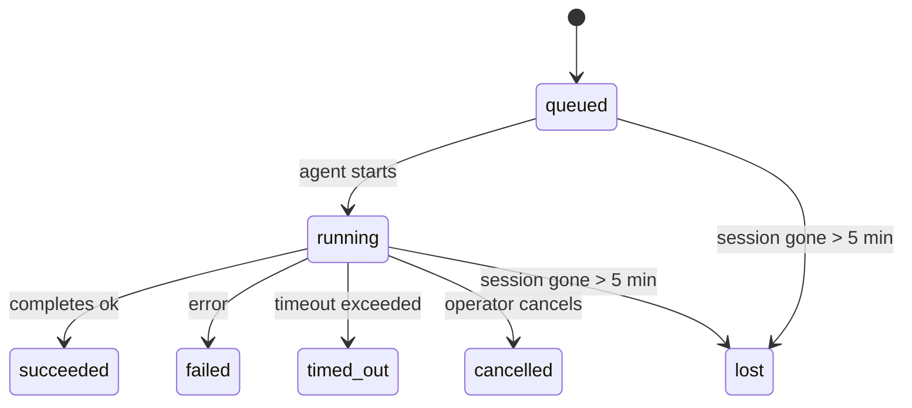

---
read_when:
    - Lopend of onlangs voltooid achtergrondwerk inspecteren
    - Leveringsfouten bij losgekoppelde agentuitvoeringen oplossen
    - Begrijpen hoe achtergronduitvoeringen zich verhouden tot sessies, Cron en Heartbeat
sidebarTitle: Background tasks
summary: Bijhouden van achtergrondtaken voor ACP-uitvoeringen, subagenten, geïsoleerde Cron-taken en CLI-bewerkingen
title: Achtergrondtaken
x-i18n:
    generated_at: "2026-05-01T11:15:19Z"
    model: gpt-5.5
    provider: openai
    source_hash: 8782987a79989264ae3bd1ca4b16755bdfb7e295e4f77933bf3a38c136d837f4
    source_path: automation/tasks.md
    workflow: 16
---

<Note>
Op zoek naar planning? Zie [Automatisering en taken](/nl/automation) om het juiste mechanisme te kiezen. Deze pagina is het activiteitenregister voor achtergrondwerk, niet de planner.
</Note>

Achtergrondtaken volgen werk dat **buiten je hoofdgesprekssessie** draait: ACP-runs, subagent-starts, geïsoleerde cron-jobuitvoeringen en via de CLI gestarte bewerkingen.

Taken vervangen **geen** sessies, cron-jobs of heartbeats — ze zijn het **activiteitenregister** dat vastlegt welk losgekoppeld werk is uitgevoerd, wanneer, en of het is geslaagd.

<Note>
Niet elke agent-run maakt een taak aan. Heartbeat-beurten en normale interactieve chat doen dat niet. Alle cron-uitvoeringen, ACP-starts, subagent-starts en CLI-agentopdrachten doen dat wel.
</Note>

## TL;DR

- Taken zijn **records**, geen planners — cron en heartbeat bepalen _wanneer_ werk draait, taken volgen _wat er is gebeurd_.
- ACP, subagents, alle cron-jobs en CLI-bewerkingen maken taken aan. Heartbeat-beurten doen dat niet.
- Elke taak doorloopt `queued → running → terminal` (succeeded, failed, timed_out, cancelled of lost).
- Cron-taken blijven live zolang de cron-runtime de job nog bezit; als de
  in-memory runtime-status verdwenen is, controleert taakonderhoud eerst de
  duurzame cron-runhistorie voordat een taak als lost wordt gemarkeerd.
- Voltooiing is push-gestuurd: losgekoppeld werk kan direct melden of de
  aanvragende sessie/heartbeat wakker maken wanneer het klaar is, waardoor lussen
  voor statuspolling meestal de verkeerde vorm zijn.
- Geïsoleerde cron-runs en subagent-voltooiingen ruimen naar beste vermogen gevolgde browsertabs/processen voor hun kindsessie op vóór de laatste opschoningsboekhouding.
- Geïsoleerde cron-levering onderdrukt verouderde tussentijdse ouderreacties terwijl afstammend subagent-werk nog wordt afgehandeld, en geeft de voorkeur aan definitieve uitvoer van afstammelingen wanneer die vóór levering binnenkomt.
- Voltooiingsmeldingen worden rechtstreeks aan een kanaal geleverd of in de wachtrij gezet voor de volgende heartbeat.
- `openclaw tasks list` toont alle taken; `openclaw tasks audit` brengt problemen aan het licht.
- Terminale records worden 7 dagen bewaard en daarna automatisch opgeschoond.

## Snelle start

<Tabs>
  <Tab title="List and filter">
    ```bash
    # List all tasks (newest first)
    openclaw tasks list

    # Filter by runtime or status
    openclaw tasks list --runtime acp
    openclaw tasks list --status running
    ```

  </Tab>
  <Tab title="Inspect">
    ```bash
    # Show details for a specific task (by ID, run ID, or session key)
    openclaw tasks show <lookup>
    ```
  </Tab>
  <Tab title="Cancel and notify">
    ```bash
    # Cancel a running task (kills the child session)
    openclaw tasks cancel <lookup>

    # Change notification policy for a task
    openclaw tasks notify <lookup> state_changes
    ```

  </Tab>
  <Tab title="Audit and maintenance">
    ```bash
    # Run a health audit
    openclaw tasks audit

    # Preview or apply maintenance
    openclaw tasks maintenance
    openclaw tasks maintenance --apply
    ```

  </Tab>
  <Tab title="Task flow">
    ```bash
    # Inspect TaskFlow state
    openclaw tasks flow list
    openclaw tasks flow show <lookup>
    openclaw tasks flow cancel <lookup>
    ```
  </Tab>
</Tabs>

## Wat maakt een taak aan

| Bron                   | Runtimetype | Wanneer een taakrecord wordt aangemaakt                | Standaard meldingsbeleid |
| ---------------------- | ------------ | ------------------------------------------------------ | ------------------------ |
| ACP-achtergrondruns    | `acp`        | Bij het starten van een ACP-kindsessie                 | `done_only`              |
| Subagent-orkestratie   | `subagent`   | Bij het starten van een subagent via `sessions_spawn`  | `done_only`              |
| Cron-jobs (alle typen) | `cron`       | Elke cron-uitvoering (hoofdsessie en geïsoleerd)       | `silent`                 |
| CLI-bewerkingen        | `cli`        | `openclaw agent`-opdrachten die via de gateway draaien | `silent`                 |
| Agent-mediajobs        | `cli`        | Sessiegebonden `music_generate`/`video_generate`-runs  | `silent`                 |

<AccordionGroup>
  <Accordion title="Notify defaults for cron and media">
    Cron-taken in de hoofdsessie gebruiken standaard het meldingsbeleid `silent` — ze maken records aan voor tracking, maar genereren geen meldingen. Geïsoleerde cron-taken gebruiken ook standaard `silent`, maar zijn zichtbaarder omdat ze in hun eigen sessie draaien.

    Sessiegebonden `music_generate`- en `video_generate`-runs gebruiken ook het meldingsbeleid `silent`. Ze maken nog steeds taakrecords aan, maar voltooiing wordt als interne wake teruggegeven aan de oorspronkelijke agentsessie, zodat de agent zelf het vervolgbericht kan schrijven en de voltooide media kan bijvoegen. Als je kiest voor `tools.media.asyncCompletion.directSend`, kunnen asynchrone `video_generate`-voltooiingen eerst directe kanaallevering proberen; asynchrone `music_generate`-voltooiingen blijven op het wake-pad van de aanvragende sessie.

  </Accordion>
  <Accordion title="Concurrent video_generate guardrail">
    Terwijl een sessiegebonden `video_generate`-taak nog actief is, fungeert de tool ook als vangrail: herhaalde `video_generate`-aanroepen in dezelfde sessie geven de actieve taakstatus terug in plaats van een tweede gelijktijdige generatie te starten. Gebruik `action: "status"` wanneer je vanaf de agentkant expliciet voortgang/status wilt opvragen.
  </Accordion>
  <Accordion title="What does not create tasks">
    - Heartbeat-beurten — hoofdsessie; zie [Heartbeat](/nl/gateway/heartbeat)
    - Normale interactieve chatbeurten
    - Directe `/command`-antwoorden

  </Accordion>
</AccordionGroup>

## Taaklevenscyclus



| Status      | Wat het betekent                                                          |
| ----------- | -------------------------------------------------------------------------- |
| `queued`    | Aangemaakt, wacht tot de agent start                                      |
| `running`   | Agent-beurt wordt actief uitgevoerd                                       |
| `succeeded` | Succesvol voltooid                                                        |
| `failed`    | Voltooid met een fout                                                     |
| `timed_out` | Geconfigureerde timeout overschreden                                      |
| `cancelled` | Gestopt door de operator via `openclaw tasks cancel`                      |
| `lost`      | De runtime verloor gezaghebbende onderliggende status na een respijtperiode van 5 minuten |

Overgangen gebeuren automatisch — wanneer de gekoppelde agent-run eindigt, wordt de taakstatus overeenkomstig bijgewerkt.

Voltooiing van de agent-run is gezaghebbend voor actieve taakrecords. Een succesvolle losgekoppelde run wordt afgerond als `succeeded`, gewone runfouten worden afgerond als `failed`, en timeout- of afbreekuitkomsten worden afgerond als `timed_out`. Als een operator de taak al heeft geannuleerd, of als de runtime al een sterkere terminale status heeft vastgelegd zoals `failed`, `timed_out` of `lost`, verlaagt een later successignaal die terminale status niet.

`lost` is runtime-bewust:

- ACP-taken: onderliggende metadata van de ACP-kindsessie is verdwenen.
- Subagent-taken: onderliggende kindsessie is verdwenen uit de doelagent-store.
- Cron-taken: de cron-runtime volgt de job niet langer als actief en duurzame
  cron-runhistorie toont geen terminale uitkomst voor die run. Offline CLI-audit
  behandelt zijn eigen lege in-process cron-runtime-status niet als gezaghebbend.
- CLI-taken: geïsoleerde kindsessietaken gebruiken de kindsessie; chatgebonden
  CLI-taken gebruiken in plaats daarvan de live run-context, zodat achterblijvende
  kanaal-/groep-/directe-sessierijen ze niet levend houden. Gateway-gebonden
  `openclaw agent`-runs worden ook afgerond op basis van hun runresultaat, zodat voltooide runs
  niet actief blijven totdat de sweeper ze als `lost` markeert.

## Levering en meldingen

Wanneer een taak een terminale status bereikt, meldt OpenClaw dit aan jou. Er zijn twee leveringspaden:

**Directe levering** — als de taak een kanaaldoel heeft (de `requesterOrigin`), gaat het voltooiingsbericht rechtstreeks naar dat kanaal (Telegram, Discord, Slack, enz.). Voor subagent-voltooiingen behoudt OpenClaw ook gebonden thread-/topic-routering wanneer beschikbaar en kan een ontbrekende `to` / account worden ingevuld vanuit de opgeslagen route van de aanvragende sessie (`lastChannel` / `lastTo` / `lastAccountId`) voordat directe levering wordt opgegeven.

**In sessie wachtrij geplaatste levering** — als directe levering mislukt of geen origin is ingesteld, wordt de update als systeemevent in de sessie van de aanvrager in de wachtrij gezet en verschijnt deze bij de volgende heartbeat.

<Tip>
Taakvoltooiing triggert een onmiddellijke heartbeat-wake, zodat je het resultaat snel ziet — je hoeft niet te wachten op de volgende geplande heartbeat-tick.
</Tip>

Dat betekent dat de gebruikelijke workflow push-gebaseerd is: start losgekoppeld werk één keer en laat de runtime je wekken of melden wanneer het voltooid is. Poll de taakstatus alleen wanneer je debugging, interventie of een expliciete audit nodig hebt.

### Meldingsbeleid

Bepaal hoeveel je over elke taak hoort:

| Beleid                | Wat wordt geleverd                                                       |
| --------------------- | ------------------------------------------------------------------------ |
| `done_only` (standaard) | Alleen terminale status (succeeded, failed, enz.) — **dit is de standaard** |
| `state_changes`       | Elke statusovergang en voortgangsupdate                                  |
| `silent`              | Helemaal niets                                                           |

Wijzig het beleid terwijl een taak draait:

```bash
openclaw tasks notify <lookup> state_changes
```

## CLI-referentie

<AccordionGroup>
  <Accordion title="tasks list">
    ```bash
    openclaw tasks list [--runtime <acp|subagent|cron|cli>] [--status <status>] [--json]
    ```

    Uitvoerkolommen: taak-ID, soort, status, levering, run-ID, kindsessie, samenvatting.

  </Accordion>
  <Accordion title="tasks show">
    ```bash
    openclaw tasks show <lookup>
    ```

    Het opzoektoken accepteert een taak-ID, run-ID of sessiesleutel. Toont het volledige record, inclusief timing, leveringsstatus, fout en terminale samenvatting.

  </Accordion>
  <Accordion title="tasks cancel">
    ```bash
    openclaw tasks cancel <lookup>
    ```

    Voor ACP- en subagent-taken doodt dit de kindsessie. Voor door CLI gevolgde taken wordt annulering vastgelegd in het taakregister (er is geen afzonderlijke handle voor de kindruntime). De status gaat over naar `cancelled` en er wordt een leveringsmelding verzonden wanneer van toepassing.

  </Accordion>
  <Accordion title="tasks notify">
    ```bash
    openclaw tasks notify <lookup> <done_only|state_changes|silent>
    ```
  </Accordion>
  <Accordion title="tasks audit">
    ```bash
    openclaw tasks audit [--json]
    ```

    Brengt operationele problemen aan het licht. Bevindingen verschijnen ook in `openclaw status` wanneer problemen worden gedetecteerd.

    | Bevinding                 | Ernst      | Trigger                                                                                                      |
    | ------------------------- | ---------- | ------------------------------------------------------------------------------------------------------------ |
    | `stale_queued`            | warn       | Meer dan 10 minuten in de wachtrij                                                                           |
    | `stale_running`           | error      | Meer dan 30 minuten actief                                                                                   |
    | `lost`                    | warn/error | Runtime-gesteund taakeigenaarschap is verdwenen; behouden verloren taken waarschuwen tot `cleanupAfter`, daarna worden het fouten |
    | `delivery_failed`         | warn       | Bezorging is mislukt en het meldingsbeleid is niet `silent`                                                  |
    | `missing_cleanup`         | warn       | Terminale taak zonder opschoningstijdstempel                                                                 |
    | `inconsistent_timestamps` | warn       | Tijdlijnschending (bijvoorbeeld geeindigd voor gestart)                                                       |

  </Accordion>
  <Accordion title="tasks onderhoud">
    ```bash
    openclaw tasks maintenance [--json]
    openclaw tasks maintenance --apply [--json]
    ```

    Gebruik dit om reconciliatie, opschoningsstempeling en pruning voor taken en Task Flow-status vooraf te bekijken of toe te passen.

    Reconciliatie is runtime-bewust:

    - ACP/subagent-taken controleren hun onderliggende kindsessie.
    - Subagent-taken waarvan de kindsessie een restart-recovery-tombstone heeft, worden als verloren gemarkeerd in plaats van behandeld als herstelbare onderliggende sessies.
    - Cron-taken controleren of de cron-runtime de taak nog bezit, en herstellen daarna de terminale status uit opgeslagen cron-uitvoerlogs/taakstatus voordat ze terugvallen op `lost`. Alleen het Gateway-proces is gezaghebbend voor de in-memory set met actieve cron-taken; offline CLI-audit gebruikt duurzame geschiedenis maar markeert een cron-taak niet als verloren enkel omdat die lokale Set leeg is.
    - Chat-gesteunde CLI-taken controleren de eigenaar-live-runcontext, niet alleen de chatsessierij.

    Voltooiingsopschoning is ook runtime-bewust:

    - Subagent-voltooiing sluit op best-effort-basis bijgehouden browsertabs/processen voor de kindsessie voordat aankondigingsopschoning doorgaat.
    - Geisoleerde cron-voltooiing sluit op best-effort-basis bijgehouden browsertabs/processen voor de cron-sessie voordat de run volledig wordt afgebroken.
    - Geisoleerde cron-bezorging wacht waar nodig op vervolgacties van descendant subagents en onderdrukt verouderde ouderbevestigingstekst in plaats van die aan te kondigen.
    - Subagent-voltooiingsbezorging geeft de voorkeur aan de laatst zichtbare assistenttekst; als die leeg is, valt deze terug op opgeschoonde meest recente tool/toolResult-tekst, en runs met alleen een timeout-tool-call kunnen samenvallen tot een korte samenvatting van gedeeltelijke voortgang. Terminale mislukte runs kondigen de foutstatus aan zonder vastgelegde antwoordtekst opnieuw af te spelen.
    - Opschoningsfouten verhullen de werkelijke taakuitkomst niet.

  </Accordion>
  <Accordion title="tasks flow list | show | cancel">
    ```bash
    openclaw tasks flow list [--status <status>] [--json]
    openclaw tasks flow show <lookup> [--json]
    openclaw tasks flow cancel <lookup>
    ```

    Gebruik deze wanneer de orkestrerende Task Flow is waar het om gaat, in plaats van een enkele individuele achtergrondtaakrecord.

  </Accordion>
</AccordionGroup>

## Chat-taakbord (`/tasks`)

Gebruik `/tasks` in elke chatsessie om achtergrondtaken te zien die aan die sessie zijn gekoppeld. Het bord toont actieve en recent voltooide taken met runtime, status, timing en voortgangs- of foutdetails.

Wanneer de huidige sessie geen zichtbare gekoppelde taken heeft, valt `/tasks` terug op agent-lokale taakaantallen, zodat je toch een overzicht krijgt zonder details uit andere sessies te lekken.

Gebruik voor het volledige operatorlogboek de CLI: `openclaw tasks list`.

## Statusintegratie (taakdruk)

`openclaw status` bevat een taakoverzicht in een oogopslag:

```
Tasks: 3 queued · 2 running · 1 issues
```

De samenvatting rapporteert:

- **active** — aantal `queued` + `running`
- **failures** — aantal `failed` + `timed_out` + `lost`
- **byRuntime** — uitsplitsing per `acp`, `subagent`, `cron`, `cli`

Zowel `/status` als de `session_status`-tool gebruiken een opschoningsbewuste taaksnapshot: actieve taken krijgen de voorkeur, verouderde voltooide rijen worden verborgen, en recente fouten verschijnen alleen wanneer er geen actief werk overblijft. Zo blijft de statuskaart gericht op wat er nu toe doet.

## Opslag en onderhoud

### Waar taken staan

Taakrecords blijven opgeslagen in SQLite op:

```
$OPENCLAW_STATE_DIR/tasks/runs.sqlite
```

Het register wordt bij het starten van de Gateway in het geheugen geladen en synchroniseert schrijfacties naar SQLite voor duurzaamheid over herstarts heen.
De Gateway houdt het SQLite write-ahead log begrensd door SQLite's standaard
autocheckpoint-drempel plus periodieke en afsluitende `TRUNCATE`-checkpoints te gebruiken.

### Automatisch onderhoud

Elke **60 seconden** wordt een sweeper uitgevoerd die vier dingen afhandelt:

<Steps>
  <Step title="Reconciliatie">
    Controleert of actieve taken nog gezaghebbende runtime-ondersteuning hebben. ACP/subagent-taken gebruiken kindsessiestatus, cron-taken gebruiken eigenaarschap van actieve taken, en chat-gesteunde CLI-taken gebruiken de eigenaar-runcontext. Als die ondersteunende status langer dan 5 minuten weg is, wordt de taak gemarkeerd als `lost`.
  </Step>
  <Step title="ACP-sessieherstel">
    Sluit terminale of verweesde ouder-eigendom eenmalige ACP-sessies, en sluit verouderde terminale of verweesde persistente ACP-sessies alleen wanneer er geen actieve conversatiebinding overblijft.
  </Step>
  <Step title="Opschoningsstempeling">
    Zet een `cleanupAfter`-tijdstempel op terminale taken (endedAt + 7 dagen). Tijdens retentie verschijnen verloren taken nog steeds in audit als waarschuwingen; nadat `cleanupAfter` is verlopen of wanneer opschoningsmetadata ontbreken, zijn het fouten.
  </Step>
  <Step title="Pruning">
    Verwijdert records na hun `cleanupAfter`-datum.
  </Step>
</Steps>

<Note>
**Retentie:** terminale taakrecords worden **7 dagen** bewaard en daarna automatisch gepruned. Geen configuratie nodig.
</Note>

## Hoe taken zich verhouden tot andere systemen

<AccordionGroup>
  <Accordion title="Taken en Task Flow">
    [Task Flow](/nl/automation/taskflow) is de flow-orkestratielaag boven achtergrondtaken. Een enkele flow kan gedurende zijn levensduur meerdere taken coordineren met beheerde of gespiegeld synchronisatiemodi. Gebruik `openclaw tasks` om individuele taakrecords te inspecteren en `openclaw tasks flow` om de orkestrerende flow te inspecteren.

    Zie [Task Flow](/nl/automation/taskflow) voor details.

  </Accordion>
  <Accordion title="Taken en cron">
    Een cron-taak**definitie** staat in `~/.openclaw/cron/jobs.json`; runtime-uitvoeringsstatus staat ernaast in `~/.openclaw/cron/jobs-state.json`. **Elke** cron-uitvoering maakt een taakrecord aan — zowel hoofdsessie als geisoleerd. Hoofdsessie-cron-taken gebruiken standaard het `silent`-meldingsbeleid, zodat ze volgen zonder meldingen te genereren.

    Zie [Cron Jobs](/nl/automation/cron-jobs).

  </Accordion>
  <Accordion title="Taken en Heartbeat">
    Heartbeat-runs zijn hoofdsessiebeurten — ze maken geen taakrecords aan. Wanneer een taak is voltooid, kan deze een Heartbeat-wake triggeren zodat je het resultaat snel ziet.

    Zie [Heartbeat](/nl/gateway/heartbeat).

  </Accordion>
  <Accordion title="Taken en sessies">
    Een taak kan verwijzen naar een `childSessionKey` (waar werk wordt uitgevoerd) en een `requesterSessionKey` (wie deze heeft gestart). Sessies zijn conversatiecontext; taken zijn activiteitsregistratie daarbovenop.
  </Accordion>
  <Accordion title="Taken en agent-runs">
    De `runId` van een taak koppelt naar de agent-run die het werk uitvoert. Agent-levenscyclusgebeurtenissen (start, einde, fout) werken automatisch de taakstatus bij — je hoeft de levenscyclus niet handmatig te beheren.
  </Accordion>
</AccordionGroup>

## Gerelateerd

- [Automatisering en taken](/nl/automation) — alle automatiseringsmechanismen in een oogopslag
- [CLI: Taken](/nl/cli/tasks) — CLI-opdrachtreferentie
- [Heartbeat](/nl/gateway/heartbeat) — periodieke hoofdsessiebeurten
- [Geplande taken](/nl/automation/cron-jobs) — achtergrondwerk plannen
- [Task Flow](/nl/automation/taskflow) — flow-orkestratie boven taken
