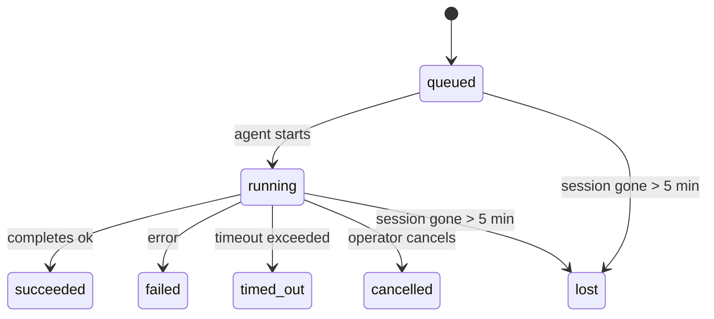

---
read_when:
    - Lopend of onlangs voltooid achtergrondwerk inspecteren
    - Afleveringsfouten voor losgekoppelde agentuitvoeringen debuggen
    - Begrijpen hoe achtergrondruns zich verhouden tot sessies, Cron en Heartbeat
sidebarTitle: Background tasks
summary: Bijhouden van achtergrondtaken voor ACP-runs, subagenten, geïsoleerde Cron-taken en CLI-bewerkingen
title: Achtergrondtaken
x-i18n:
    generated_at: "2026-05-10T19:20:58Z"
    model: gpt-5.5
    provider: openai
    source_hash: 5764a89634f90181d826ff3990ec8dac9538239074934d30fd446c1eb4564869
    source_path: automation/tasks.md
    workflow: 16
---

<Note>
Op zoek naar planning? Zie [Automatisering en taken](/nl/automation) om het juiste mechanisme te kiezen. Deze pagina is het activiteitenlogboek voor achtergrondwerk, niet de planner.
</Note>

Achtergrondtaken volgen werk dat **buiten je hoofdgesprekssessie** wordt uitgevoerd: ACP-runs, subagent-spawns, geïsoleerde cron-taakuitvoeringen en door de CLI gestarte bewerkingen.

Taken vervangen **geen** sessies, cron-taken of heartbeats - ze zijn het **activiteitenlogboek** dat vastlegt welk losgekoppeld werk plaatsvond, wanneer, en of het is geslaagd.

<Note>
Niet elke agent-run maakt een taak aan. Heartbeat-beurten en normale interactieve chat doen dat niet. Alle cron-uitvoeringen, ACP-spawns, subagent-spawns en CLI-agentopdrachten doen dat wel.
</Note>

## TL;DR

- Taken zijn **records**, geen planners - cron en heartbeat bepalen _wanneer_ werk wordt uitgevoerd, taken volgen _wat er is gebeurd_.
- ACP, subagents, alle cron-taken en CLI-bewerkingen maken taken aan. Heartbeat-beurten doen dat niet.
- Elke taak doorloopt `queued → running → terminal` (succeeded, failed, timed_out, cancelled of lost).
- Cron-taken blijven live zolang de cron-runtime de taak nog bezit; als de
  in-memory runtime-status verdwenen is, controleert taakonderhoud eerst de duurzame
  cron-rungeschiedenis voordat een taak als lost wordt gemarkeerd.
- Voltooiing wordt via push afgehandeld: losgekoppeld werk kan direct melden of de
  aanvragende sessie/heartbeat wekken wanneer het klaar is, waardoor statuspolling-loops
  meestal de verkeerde vorm hebben.
- Geïsoleerde cron-runs en subagent-voltooiingen ruimen op best-effortbasis gevolgde browsertabs/processen op voor hun onderliggende sessie vóór de definitieve opschoningsboekhouding.
- Geïsoleerde cron-levering onderdrukt verouderde tussentijdse bovenliggende antwoorden terwijl afstammend subagent-werk nog wordt afgehandeld, en geeft de voorkeur aan definitieve afstammende uitvoer wanneer die vóór levering binnenkomt.
- Voltooiingsmeldingen worden direct aan een kanaal geleverd of in de wachtrij gezet voor de volgende heartbeat.
- `openclaw tasks list` toont alle taken; `openclaw tasks audit` brengt problemen aan het licht.
- Terminale records worden 7 dagen bewaard en daarna automatisch opgeschoond.

## Snel aan de slag

<Tabs>
  <Tab title="Weergeven en filteren">
    ```bash
    # List all tasks (newest first)
    openclaw tasks list

    # Filter by runtime or status
    openclaw tasks list --runtime acp
    openclaw tasks list --status running
    ```

  </Tab>
  <Tab title="Inspecteren">
    ```bash
    # Show details for a specific task (by ID, run ID, or session key)
    openclaw tasks show <lookup>
    ```
  </Tab>
  <Tab title="Annuleren en melden">
    ```bash
    # Cancel a running task (kills the child session)
    openclaw tasks cancel <lookup>

    # Change notification policy for a task
    openclaw tasks notify <lookup> state_changes
    ```

  </Tab>
  <Tab title="Audit en onderhoud">
    ```bash
    # Run a health audit
    openclaw tasks audit

    # Preview or apply maintenance
    openclaw tasks maintenance
    openclaw tasks maintenance --apply
    ```

  </Tab>
  <Tab title="Taakstroom">
    ```bash
    # Inspect TaskFlow state
    openclaw tasks flow list
    openclaw tasks flow show <lookup>
    openclaw tasks flow cancel <lookup>
    ```
  </Tab>
</Tabs>

## Wat maakt een taak aan

| Bron                   | Runtime-type | Wanneer een taakrecord wordt aangemaakt                 | Standaard meldingsbeleid |
| ---------------------- | ------------ | ------------------------------------------------------- | ------------------------ |
| ACP-achtergrondruns    | `acp`        | Een onderliggende ACP-sessie spawnen                    | `done_only`              |
| Subagent-orkestratie   | `subagent`   | Een subagent spawnen via `sessions_spawn`               | `done_only`              |
| Cron-taken (alle typen) | `cron`      | Elke cron-uitvoering (hoofdsessie en geïsoleerd)        | `silent`                 |
| CLI-bewerkingen        | `cli`        | `openclaw agent`-opdrachten die via de Gateway lopen    | `silent`                 |
| Agent-mediataken       | `cli`        | Sessiegedragen `music_generate`/`video_generate`-runs   | `silent`                 |

<AccordionGroup>
  <Accordion title="Standaardmeldingen voor cron en media">
    Cron-taken in de hoofdsessie gebruiken standaard het meldingsbeleid `silent` - ze maken records aan voor tracking, maar genereren geen meldingen. Geïsoleerde cron-taken gebruiken ook standaard `silent`, maar zijn zichtbaarder omdat ze in hun eigen sessie draaien.

    Sessiegedragen `music_generate`- en `video_generate`-runs gebruiken ook het meldingsbeleid `silent`. Ze maken nog steeds taakrecords aan, maar voltooiing wordt teruggegeven aan de oorspronkelijke agentsessie als een interne wake, zodat de agent zelf het vervolgbericht kan schrijven en de voltooide media kan bijvoegen. Voltooiingen in groepen/kanalen volgen het normale beleid voor zichtbare antwoorden, dus de agent gebruikt de berichttool wanneer bronlevering dat vereist. Als de voltooiingsagent geen bewijs van levering via de berichttool produceert in een tool-only route, stuurt OpenClaw de voltooiingsfallback rechtstreeks naar het oorspronkelijke kanaal in plaats van de media privé te laten.

  </Accordion>
  <Accordion title="Guardrail voor gelijktijdige video_generate">
    Terwijl een sessiegedragen `video_generate`-taak nog actief is, fungeert de tool ook als guardrail: herhaalde `video_generate`-aanroepen in dezelfde sessie retourneren de status van de actieve taak in plaats van een tweede gelijktijdige generatie te starten. Gebruik `action: "status"` wanneer je een expliciete voortgangs-/statuslookup vanaf de agentkant wilt.
  </Accordion>
  <Accordion title="Wat geen taken aanmaakt">
    - Heartbeat-beurten - hoofdsessie; zie [Heartbeat](/nl/gateway/heartbeat)
    - Normale interactieve chatbeurten
    - Directe `/command`-antwoorden

  </Accordion>
</AccordionGroup>

## Taaklevenscyclus



| Status      | Wat het betekent                                                          |
| ----------- | -------------------------------------------------------------------------- |
| `queued`    | Aangemaakt, wachtend tot de agent start                                   |
| `running`   | Agent-beurt wordt actief uitgevoerd                                       |
| `succeeded` | Succesvol voltooid                                                        |
| `failed`    | Voltooid met een fout                                                     |
| `timed_out` | Heeft de geconfigureerde timeout overschreden                             |
| `cancelled` | Gestopt door de operator via `openclaw tasks cancel`                      |
| `lost`      | De runtime verloor gezaghebbende onderliggende status na een respijtperiode van 5 minuten |

Overgangen gebeuren automatisch - wanneer de bijbehorende agent-run eindigt, wordt de taakstatus bijgewerkt om daarmee overeen te komen.

Voltooiing van een agent-run is gezaghebbend voor actieve taakrecords. Een succesvolle losgekoppelde run wordt afgerond als `succeeded`, gewone runfouten worden afgerond als `failed`, en timeout- of abort-uitkomsten worden afgerond als `timed_out`. Als een operator de taak al heeft geannuleerd, of de runtime al een sterkere terminale status heeft vastgelegd, zoals `failed`, `timed_out` of `lost`, verlaagt een later successignaal die terminale status niet.

`lost` is runtime-bewust:

- ACP-taken: onderliggende ACP-childsessiemetadata is verdwenen.
- Subagent-taken: onderliggende childsessie is verdwenen uit de doel-agentstore.
- Cron-taken: de cron-runtime volgt de taak niet langer als actief en duurzame
  cron-rungeschiedenis toont geen terminaal resultaat voor die run. Offline CLI-
  audit behandelt de eigen lege in-process cron-runtime-status niet als gezaghebbend.
- CLI-taken: taken met een run-id/bron-id gebruiken de live runcontext, zodat
  achterblijvende childsessie- of chatsessierijen ze niet levend houden nadat de
  door de Gateway beheerde run verdwijnt. Legacy CLI-taken zonder runidentiteit vallen nog steeds
  terug op de childsessie. Gateway-gedragen `openclaw agent`-runs worden ook afgerond
  op basis van hun runresultaat, zodat voltooide runs niet actief blijven totdat de sweeper
  ze als `lost` markeert.

## Levering en meldingen

Wanneer een taak een terminale status bereikt, meldt OpenClaw je dat. Er zijn twee leveringspaden:

**Directe levering** - als de taak een kanaaldoel heeft (de `requesterOrigin`), gaat het voltooiingsbericht rechtstreeks naar dat kanaal (Telegram, Discord, Slack, enz.). Voltooiingen van groeps- en kanaaltaken worden in plaats daarvan via de aanvragende sessie gerouteerd, zodat de bovenliggende agent het zichtbare antwoord kan schrijven. Voor subagent-voltooiingen behoudt OpenClaw ook gebonden thread-/topic-routering wanneer beschikbaar en kan het een ontbrekende `to` / account aanvullen vanuit de opgeslagen route van de aanvragende sessie (`lastChannel` / `lastTo` / `lastAccountId`) voordat directe levering wordt opgegeven.

**In sessie wachtrij geplaatste levering** - als directe levering mislukt of geen origin is ingesteld, wordt de update als systeemevent in de sessie van de aanvrager in de wachtrij gezet en verschijnt die bij de volgende heartbeat.

<Tip>
Taakvoltooiing triggert een onmiddellijke heartbeat-wake, zodat je het resultaat snel ziet - je hoeft niet te wachten op de volgende geplande heartbeat-tick.
</Tip>

Dat betekent dat de gebruikelijke workflow pushgebaseerd is: start losgekoppeld werk één keer en laat de runtime je vervolgens wekken of melden bij voltooiing. Poll taakstatus alleen wanneer je debugging, interventie of een expliciete audit nodig hebt.

### Meldingsbeleid

Bepaal hoeveel je over elke taak hoort:

| Beleid                | Wat wordt geleverd                                                     |
| --------------------- | ---------------------------------------------------------------------- |
| `done_only` (standaard) | Alleen terminale status (succeeded, failed, enz.) - **dit is de standaard** |
| `state_changes`       | Elke statusovergang en voortgangsupdate                                |
| `silent`              | Helemaal niets                                                         |

Wijzig het beleid terwijl een taak draait:

```bash
openclaw tasks notify <lookup> state_changes
```

## CLI-referentie

<AccordionGroup>
  <Accordion title="tasks list">
    ```bash
    openclaw tasks list [--runtime <acp|subagent|cron|cli>] [--status <status>] [--json]
    ```

    Uitvoerkolommen: Taak-ID, Soort, Status, Levering, Run-ID, onderliggende sessie, Samenvatting.

  </Accordion>
  <Accordion title="tasks show">
    ```bash
    openclaw tasks show <lookup>
    ```

    Het lookup-token accepteert een taak-ID, run-ID of sessiesleutel. Toont het volledige record, inclusief timing, leveringsstatus, fout en terminale samenvatting.

  </Accordion>
  <Accordion title="tasks cancel">
    ```bash
    openclaw tasks cancel <lookup>
    ```

    Voor ACP- en subagent-taken doodt dit de childsessie. Voor door CLI gevolgde taken wordt annulering vastgelegd in het taakregister (er is geen aparte child-runtimehandle). Status gaat over naar `cancelled` en er wordt een leveringsmelding verzonden wanneer van toepassing.

  </Accordion>
  <Accordion title="tasks notify">
    ```bash
    openclaw tasks notify <lookup> <done_only|state_changes|silent>
    ```
  </Accordion>
  <Accordion title="tasks audit">
    ```bash
    openclaw tasks audit [--json]
    ```

    Brengt operationele problemen aan het licht. Bevindingen verschijnen ook in `openclaw status` wanneer problemen worden gedetecteerd.

    | Bevinding                 | Ernst      | Trigger                                                                                                      |
    | ------------------------- | ---------- | ------------------------------------------------------------------------------------------------------------ |
    | `stale_queued`            | warn       | Langer dan 10 minuten in de wachtrij                                                                         |
    | `stale_running`           | error      | Langer dan 30 minuten actief                                                                                 |
    | `lost`                    | warn/error | Runtime-ondersteund taakeigendom is verdwenen; behouden verloren taken waarschuwen tot `cleanupAfter` en worden daarna fouten |
    | `delivery_failed`         | warn       | Levering is mislukt en meldingsbeleid is niet `silent`                                                       |
    | `missing_cleanup`         | warn       | Terminale taak zonder opschoontijdstempel                                                                    |
    | `inconsistent_timestamps` | warn       | Tijdlijnovertreding (bijvoorbeeld geeindigd voordat deze begon)                                               |

  </Accordion>
  <Accordion title="takenonderhoud">
    ```bash
    openclaw tasks maintenance [--json]
    openclaw tasks maintenance --apply [--json]
    ```

    Gebruik dit om reconciliatie, opschoonstempeling en pruning voor taken, Task Flow-status en verouderde sessieregisterrijen van cron-runs vooraf te bekijken of toe te passen.

    Reconciliatie is runtime-bewust:

    - ACP-/subagent-taken controleren hun onderliggende kindsessie.
    - Subagent-taken waarvan de kindsessie een herstart-herstel-tombstone heeft, worden als verloren gemarkeerd in plaats van als herstelbare onderliggende sessies te worden behandeld.
    - Cron-taken controleren of de cron-runtime nog eigenaar is van de taak en herstellen daarna de terminale status uit behouden cron-runlogs/taakstatus voordat ze terugvallen naar `lost`. Alleen het Gateway-proces is gezaghebbend voor de in-memory set met actieve cron-taken; offline CLI-audit gebruikt duurzame geschiedenis, maar markeert een cron-taak niet als verloren alleen omdat die lokale Set leeg is.
    - CLI-taken met run-identiteit controleren de eigenaar-live-runcontext, niet alleen kindsessie- of chatsessierijen.

    Voltooiingsopschoning is ook runtime-bewust:

    - Subagent-voltooiing sluit op best-effort-basis gevolgde browsertabbladen/processen voor de kindsessie voordat aankondigingsopschoning doorgaat.
    - Geisoleerde cron-voltooiing sluit op best-effort-basis gevolgde browsertabbladen/processen voor de cron-sessie voordat de run volledig wordt afgebroken.
    - Geisoleerde cron-levering wacht indien nodig op vervolgacties van descendant-subagents en onderdrukt verouderde bevestigingstekst van de ouder in plaats van die aan te kondigen.
    - Levering van subagent-voltooiing geeft de voorkeur aan de nieuwste zichtbare assistenttekst; als die leeg is, valt deze terug op opgeschoonde nieuwste tool-/toolResult-tekst, en runs met alleen time-out-toolcalls kunnen worden samengevouwen tot een korte voortgangssamenvatting. Terminale mislukte runs kondigen de foutstatus aan zonder vastgelegde antwoordtekst opnieuw af te spelen.
    - Opschoonfouten maskeren de echte taakuitkomst niet.

    Bij het toepassen van onderhoud verwijdert OpenClaw ook verouderde `cron:<jobId>:run:<uuid>`-sessieregisterrijen ouder dan 7 dagen, terwijl rijen voor momenteel actieve cron-taken behouden blijven en niet-cron-sessierijen ongemoeid blijven.

  </Accordion>
  <Accordion title="tasks flow list | show | cancel">
    ```bash
    openclaw tasks flow list [--status <status>] [--json]
    openclaw tasks flow show <lookup> [--json]
    openclaw tasks flow cancel <lookup>
    ```

    Gebruik deze wanneer de orkestrerende Task Flow is waar het om gaat, in plaats van een afzonderlijk achtergrondtaakrecord.

  </Accordion>
</AccordionGroup>

## Chattaakbord (`/tasks`)

Gebruik `/tasks` in elke chatsessie om achtergrondtaken te zien die aan die sessie zijn gekoppeld. Het bord toont actieve en recent voltooide taken met runtime, status, timing en voortgangs- of foutdetails.

Wanneer de huidige sessie geen zichtbare gekoppelde taken heeft, valt `/tasks` terug op agent-lokale taakaantallen, zodat je nog steeds een overzicht krijgt zonder details van andere sessies te lekken.

Gebruik de CLI voor het volledige operatorlogboek: `openclaw tasks list`.

## Statusintegratie (taakdruk)

`openclaw status` bevat een taakoverzicht in een oogopslag:

```
Tasks: 3 queued · 2 running · 1 issues
```

De samenvatting rapporteert:

- **actief** - aantal `queued` + `running`
- **mislukkingen** - aantal `failed` + `timed_out` + `lost`
- **byRuntime** - uitsplitsing naar `acp`, `subagent`, `cron`, `cli`

Zowel `/status` als de tool `session_status` gebruiken een opschoonbewuste taaksnapshot: actieve taken krijgen de voorkeur, verouderde voltooide rijen worden verborgen en recente mislukkingen verschijnen alleen wanneer er geen actief werk meer over is. Zo blijft de statuskaart gericht op wat nu belangrijk is.

## Opslag en onderhoud

### Waar taken worden opgeslagen

Taakrecords blijven behouden in SQLite op:

```
$OPENCLAW_STATE_DIR/tasks/runs.sqlite
```

Het register wordt bij het starten van de Gateway in het geheugen geladen en synchroniseert schrijfacties naar SQLite voor duurzaamheid tussen herstarts.
De Gateway houdt het SQLite write-ahead log begrensd door SQLite's standaard
autocheckpoint-drempel plus periodieke en afsluitende `TRUNCATE`-checkpoints te gebruiken.

### Automatisch onderhoud

Elke **60 seconden** draait er een sweeper die vier dingen afhandelt:

<Steps>
  <Step title="Reconciliatie">
    Controleert of actieve taken nog gezaghebbende runtime-ondersteuning hebben. ACP-/subagent-taken gebruiken kindsessiestatus, cron-taken gebruiken actieve-taak-eigendom en CLI-taken met run-identiteit gebruiken de eigenaar-runcontext. Als die onderliggende status langer dan 5 minuten weg is, wordt de taak gemarkeerd als `lost`.
  </Step>
  <Step title="ACP-sessiereparatie">
    Sluit terminale of verweesde ouder-eigen eenmalige ACP-sessies, en sluit verouderde terminale of verweesde persistente ACP-sessies alleen wanneer er geen actieve gespreksbinding meer bestaat.
  </Step>
  <Step title="Opschoonstempeling">
    Stelt een `cleanupAfter`-tijdstempel in op terminale taken (endedAt + 7 dagen). Tijdens retentie verschijnen verloren taken nog steeds in audit als waarschuwingen; nadat `cleanupAfter` verloopt of wanneer opschoonmetadata ontbreekt, zijn het fouten.
  </Step>
  <Step title="Pruning">
    Verwijdert records na hun `cleanupAfter`-datum.
  </Step>
</Steps>

<Note>
**Retentie:** terminale taakrecords worden **7 dagen** bewaard en daarna automatisch gepruned. Geen configuratie nodig.
</Note>

## Hoe taken zich verhouden tot andere systemen

<AccordionGroup>
  <Accordion title="Taken en Task Flow">
    [Task Flow](/nl/automation/taskflow) is de stroomorkestratielaag boven achtergrondtaken. Een enkele stroom kan tijdens zijn levensduur meerdere taken coordineren met beheerde of gespiegelde synchronisatiemodi. Gebruik `openclaw tasks` om afzonderlijke taakrecords te inspecteren en `openclaw tasks flow` om de orkestrerende stroom te inspecteren.

    Zie [Task Flow](/nl/automation/taskflow) voor details.

  </Accordion>
  <Accordion title="Taken en cron">
    Een cron-taak**definitie** staat in `~/.openclaw/cron/jobs.json`; runtime-uitvoeringsstatus staat ernaast in `~/.openclaw/cron/jobs-state.json`. **Elke** cron-uitvoering maakt een taakrecord aan - zowel main-session als geisoleerd. Main-session cron-taken gebruiken standaard het meldingsbeleid `silent`, zodat ze bijhouden zonder meldingen te genereren.

    Zie [Cron-taken](/nl/automation/cron-jobs).

  </Accordion>
  <Accordion title="Taken en heartbeat">
    Heartbeat-runs zijn main-session-beurten - ze maken geen taakrecords aan. Wanneer een taak is voltooid, kan deze een heartbeat-wake triggeren zodat je het resultaat snel ziet.

    Zie [Heartbeat](/nl/gateway/heartbeat).

  </Accordion>
  <Accordion title="Taken en sessies">
    Een taak kan verwijzen naar een `childSessionKey` (waar werk wordt uitgevoerd) en een `requesterSessionKey` (wie het heeft gestart). Sessies zijn gesprekscontext; taken zijn activiteitstracking daarbovenop.
  </Accordion>
  <Accordion title="Taken en agent-runs">
    De `runId` van een taak koppelt naar de agent-run die het werk uitvoert. Agent-levenscyclusgebeurtenissen (start, einde, fout) werken de taakstatus automatisch bij - je hoeft de levenscyclus niet handmatig te beheren.
  </Accordion>
</AccordionGroup>

## Gerelateerd

- [Automatisering en taken](/nl/automation) - alle automatiseringsmechanismen in een oogopslag
- [CLI: taken](/nl/cli/tasks) - CLI-opdrachtreferentie
- [Heartbeat](/nl/gateway/heartbeat) - periodieke main-session-beurten
- [Geplande taken](/nl/automation/cron-jobs) - achtergrondwerk plannen
- [Task Flow](/nl/automation/taskflow) - stroomorkestratie boven taken
