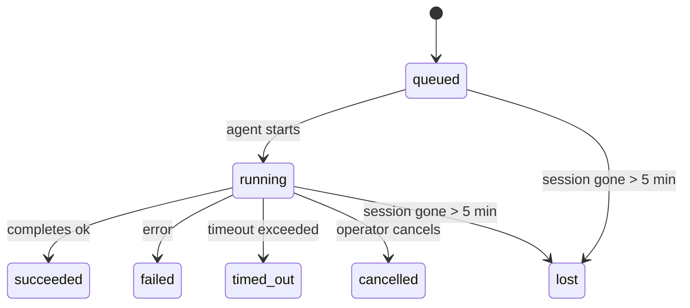

---
read_when:
    - Achtergrondwerk inspecteren dat wordt uitgevoerd of onlangs is voltooid
    - Bezorgingsfouten bij losgekoppelde agentuitvoeringen debuggen
    - Begrijpen hoe achtergronduitvoeringen samenhangen met sessies, Cron en Heartbeat
sidebarTitle: Background tasks
summary: Tracking van achtergrondtaken voor ACP-uitvoeringen, subagenten, geïsoleerde Cron-taken en CLI-bewerkingen
title: Achtergrondtaken
x-i18n:
    generated_at: "2026-05-05T01:44:37Z"
    model: gpt-5.5
    provider: openai
    source_hash: 60d6ea6178535b19b95d761b8e8b05a665234584ae69852fd21097988aa32991
    source_path: automation/tasks.md
    workflow: 16
---

<Note>
Op zoek naar planning? Zie [Automatisering en taken](/nl/automation) om het juiste mechanisme te kiezen. Deze pagina is het activiteitenregister voor achtergrondwerk, niet de planner.
</Note>

Achtergrondtaken houden werk bij dat **buiten je hoofdsessie voor gesprekken** wordt uitgevoerd: ACP-runs, gestarte subagents, geïsoleerde Cron-taakuitvoeringen en door de CLI gestarte bewerkingen.

Taken vervangen **geen** sessies, Cron-taken of heartbeats — ze zijn het **activiteitenregister** dat vastlegt welk losgekoppeld werk is gebeurd, wanneer, en of het is geslaagd.

<Note>
Niet elke agent-run maakt een taak aan. Heartbeat-beurten en normale interactieve chat doen dat niet. Alle Cron-uitvoeringen, ACP-spawns, subagent-spawns en CLI-agentopdrachten doen dat wel.
</Note>

## TL;DR

- Taken zijn **records**, geen planners — Cron en Heartbeat bepalen _wanneer_ werk wordt uitgevoerd, taken houden bij _wat er is gebeurd_.
- ACP, subagents, alle Cron-taken en CLI-bewerkingen maken taken aan. Heartbeat-beurten doen dat niet.
- Elke taak doorloopt `queued → running → terminal` (succeeded, failed, timed_out, cancelled of lost).
- Cron-taken blijven live zolang de Cron-runtime de taak nog bezit; als de
  in-memory runtime-status weg is, controleert taakonderhoud eerst de duurzame Cron-
  runhistorie voordat een taak als verloren wordt gemarkeerd.
- Voltooiing is push-gestuurd: losgekoppeld werk kan direct melden of de
  aanvragende sessie/Heartbeat wekken wanneer het klaar is, waardoor statuspollinglussen
  meestal de verkeerde vorm zijn.
- Geïsoleerde Cron-runs en subagent-voltooiingen ruimen naar beste vermogen bijgehouden browsertabbladen/processen voor hun kindsessie op voordat de uiteindelijke opschoningsadministratie plaatsvindt.
- Geïsoleerde Cron-aflevering onderdrukt verouderde tussentijdse ouderantwoorden terwijl onderliggend subagent-werk nog leegloopt, en geeft de voorkeur aan uiteindelijke onderliggende uitvoer wanneer die vóór aflevering binnenkomt.
- Voltooiingsmeldingen worden direct aan een kanaal geleverd of in de wachtrij gezet voor de volgende Heartbeat.
- `openclaw tasks list` toont alle taken; `openclaw tasks audit` brengt problemen aan het licht.
- Terminale records worden 7 dagen bewaard en daarna automatisch opgeschoond.

## Snel starten

<Tabs>
  <Tab title="Weergeven en filteren">
    ```bash
    # List all tasks (newest first)
    openclaw tasks list

    # Filter by runtime or status
    openclaw tasks list --runtime acp
    openclaw tasks list --status running
    ```

  </Tab>
  <Tab title="Inspecteren">
    ```bash
    # Show details for a specific task (by ID, run ID, or session key)
    openclaw tasks show <lookup>
    ```
  </Tab>
  <Tab title="Annuleren en melden">
    ```bash
    # Cancel a running task (kills the child session)
    openclaw tasks cancel <lookup>

    # Change notification policy for a task
    openclaw tasks notify <lookup> state_changes
    ```

  </Tab>
  <Tab title="Audit en onderhoud">
    ```bash
    # Run a health audit
    openclaw tasks audit

    # Preview or apply maintenance
    openclaw tasks maintenance
    openclaw tasks maintenance --apply
    ```

  </Tab>
  <Tab title="Taakstroom">
    ```bash
    # Inspect TaskFlow state
    openclaw tasks flow list
    openclaw tasks flow show <lookup>
    openclaw tasks flow cancel <lookup>
    ```
  </Tab>
</Tabs>

## Wat een taak aanmaakt

| Bron                   | Runtimetype | Wanneer een taakrecord wordt aangemaakt                      | Standaard meldingsbeleid |
| ---------------------- | ------------ | ------------------------------------------------------------ | ------------------------ |
| ACP-achtergrondruns    | `acp`        | Een kind-ACP-sessie starten                                  | `done_only`              |
| Subagent-orkestratie   | `subagent`   | Een subagent starten via `sessions_spawn`                    | `done_only`              |
| Cron-taken (alle typen) | `cron`       | Elke Cron-uitvoering (hoofdsessie en geïsoleerd)             | `silent`                 |
| CLI-bewerkingen        | `cli`        | `openclaw agent`-opdrachten die via de Gateway lopen         | `silent`                 |
| Agent-mediataken       | `cli`        | Sessie-ondersteunde `music_generate`/`video_generate`-runs   | `silent`                 |

<AccordionGroup>
  <Accordion title="Meldingsstandaarden voor Cron en media">
    Cron-taken in de hoofdsessie gebruiken standaard het meldingsbeleid `silent` — ze maken records aan voor tracking, maar genereren geen meldingen. Geïsoleerde Cron-taken gebruiken ook standaard `silent`, maar zijn zichtbaarder omdat ze in hun eigen sessie worden uitgevoerd.

    Sessie-ondersteunde `music_generate`- en `video_generate`-runs gebruiken ook het meldingsbeleid `silent`. Ze maken nog steeds taakrecords aan, maar voltooiing wordt teruggegeven aan de oorspronkelijke agentsessie als een interne wake, zodat de agent zelf het vervolgbericht kan schrijven en de voltooide media kan bijvoegen. Voltooiingen in groepen/kanalen volgen het normale beleid voor zichtbare antwoorden, dus de agent gebruikt de berichttool wanneer de bronaflevering dat vereist.

  </Accordion>
  <Accordion title="Guardrail voor gelijktijdige video_generate">
    Terwijl een sessie-ondersteunde `video_generate`-taak nog actief is, fungeert de tool ook als guardrail: herhaalde `video_generate`-aanroepen in diezelfde sessie retourneren de actieve taakstatus in plaats van een tweede gelijktijdige generatie te starten. Gebruik `action: "status"` wanneer je een expliciete voortgangs-/statusopvraag vanaf de agentkant wilt.
  </Accordion>
  <Accordion title="Wat geen taken aanmaakt">
    - Heartbeat-beurten — hoofdsessie; zie [Heartbeat](/nl/gateway/heartbeat)
    - Normale interactieve chatbeurten
    - Directe `/command`-antwoorden

  </Accordion>
</AccordionGroup>

## Taaklevenscyclus



| Status      | Wat het betekent                                                         |
| ----------- | ------------------------------------------------------------------------ |
| `queued`    | Aangemaakt, wacht totdat de agent start                                  |
| `running`   | Agent-beurt wordt actief uitgevoerd                                      |
| `succeeded` | Succesvol voltooid                                                       |
| `failed`    | Voltooid met een fout                                                    |
| `timed_out` | Heeft de geconfigureerde time-out overschreden                           |
| `cancelled` | Gestopt door de operator via `openclaw tasks cancel`                     |
| `lost`      | De runtime verloor gezaghebbende onderliggende status na een respijtperiode van 5 minuten |

Overgangen gebeuren automatisch — wanneer de gekoppelde agent-run eindigt, wordt de taakstatus bijgewerkt zodat die overeenkomt.

Voltooiing van de agent-run is gezaghebbend voor actieve taakrecords. Een succesvolle losgekoppelde run wordt afgerond als `succeeded`, gewone runfouten worden afgerond als `failed`, en time-out- of afbreekresultaten worden afgerond als `timed_out`. Als een operator de taak al heeft geannuleerd, of als de runtime al een sterkere terminale status zoals `failed`, `timed_out` of `lost` heeft vastgelegd, verlaagt een later successein die terminale status niet.

`lost` is runtime-bewust:

- ACP-taken: onderliggende metadata van de ACP-kindsessie is verdwenen.
- Subagent-taken: onderliggende kindsessie is verdwenen uit de doelagentstore.
- Cron-taken: de Cron-runtime volgt de taak niet langer als actief en duurzame
  Cron-runhistorie toont geen terminaal resultaat voor die run. Offline CLI-
  audit behandelt zijn eigen lege in-process Cron-runtime-status niet als gezaghebbend.
- CLI-taken: geïsoleerde kindsessietaken gebruiken de kindsessie; chat-ondersteunde
  CLI-taken gebruiken in plaats daarvan de live-runcontext, zodat achterblijvende
  kanaal-/groep-/directe sessierijen ze niet actief houden. Gateway-ondersteunde
  `openclaw agent`-runs worden ook afgerond op basis van hun runresultaat, zodat voltooide runs
  niet actief blijven totdat de sweeper ze als `lost` markeert.

## Aflevering en meldingen

Wanneer een taak een terminale status bereikt, meldt OpenClaw je dat. Er zijn twee afleverpaden:

**Directe aflevering** — als de taak een kanaaldoel heeft (de `requesterOrigin`), gaat het voltooiingsbericht rechtstreeks naar dat kanaal (Telegram, Discord, Slack, enz.). Voor subagent-voltooiingen behoudt OpenClaw ook gebonden thread-/topicroutering wanneer beschikbaar en kan het een ontbrekende `to` / account invullen vanuit de opgeslagen route van de aanvragersessie (`lastChannel` / `lastTo` / `lastAccountId`) voordat directe aflevering wordt opgegeven.

**Sessie-wachtrijaflevering** — als directe aflevering mislukt of geen origin is ingesteld, wordt de update als systeemgebeurtenis in de sessie van de aanvrager in de wachtrij gezet en verschijnt die bij de volgende Heartbeat.

<Tip>
Taakvoltooiing activeert direct een Heartbeat-wake, zodat je het resultaat snel ziet — je hoeft niet te wachten op de volgende geplande Heartbeat-tick.
</Tip>

Dat betekent dat de gebruikelijke workflow push-gebaseerd is: start losgekoppeld werk één keer en laat de runtime je wekken of melden bij voltooiing. Poll de taakstatus alleen wanneer je debugging, ingrijpen of een expliciete audit nodig hebt.

### Meldingsbeleid

Bepaal hoeveel je over elke taak hoort:

| Beleid                | Wat wordt afgeleverd                                                      |
| --------------------- | ------------------------------------------------------------------------- |
| `done_only` (standaard) | Alleen terminale status (succeeded, failed, enz.) — **dit is de standaard** |
| `state_changes`       | Elke statusovergang en voortgangsupdate                                   |
| `silent`              | Helemaal niets                                                            |

Wijzig het beleid terwijl een taak actief is:

```bash
openclaw tasks notify <lookup> state_changes
```

## CLI-referentie

<AccordionGroup>
  <Accordion title="tasks list">
    ```bash
    openclaw tasks list [--runtime <acp|subagent|cron|cli>] [--status <status>] [--json]
    ```

    Uitvoerkolommen: taak-ID, soort, status, aflevering, run-ID, kindsessie, samenvatting.

  </Accordion>
  <Accordion title="tasks show">
    ```bash
    openclaw tasks show <lookup>
    ```

    Het opzoektoken accepteert een taak-ID, run-ID of sessiesleutel. Toont het volledige record, inclusief timing, afleverstatus, fout en terminale samenvatting.

  </Accordion>
  <Accordion title="tasks cancel">
    ```bash
    openclaw tasks cancel <lookup>
    ```

    Voor ACP- en subagent-taken doodt dit de kindsessie. Voor door CLI bijgehouden taken wordt annulering vastgelegd in het taakregister (er is geen aparte runtime-handle voor kinderen). De status gaat over naar `cancelled` en er wordt een aflevermelding verzonden wanneer van toepassing.

  </Accordion>
  <Accordion title="tasks notify">
    ```bash
    openclaw tasks notify <lookup> <done_only|state_changes|silent>
    ```
  </Accordion>
  <Accordion title="tasks audit">
    ```bash
    openclaw tasks audit [--json]
    ```

    Brengt operationele problemen aan het licht. Bevindingen verschijnen ook in `openclaw status` wanneer problemen worden gedetecteerd.

    | Bevinding                 | Ernst      | Trigger                                                                                                                |
    | ------------------------- | ---------- | ---------------------------------------------------------------------------------------------------------------------- |
    | `stale_queued`            | warn       | Langer dan 10 minuten in de wachtrij                                                                                   |
    | `stale_running`           | error      | Langer dan 30 minuten actief                                                                                           |
    | `lost`                    | warn/error | Taakeigenaarschap met runtime-ondersteuning is verdwenen; behouden verloren taken waarschuwen tot `cleanupAfter` en worden daarna fouten |
    | `delivery_failed`         | warn       | Bezorging is mislukt en het meldingsbeleid is niet `silent`                                                            |
    | `missing_cleanup`         | warn       | Terminale taak zonder opschoontijdstempel                                                                              |
    | `inconsistent_timestamps` | warn       | Tijdlijnschending (bijvoorbeeld geëindigd vóór gestart)                                                                |

  </Accordion>
  <Accordion title="tasks maintenance">
    ```bash
    openclaw tasks maintenance [--json]
    openclaw tasks maintenance --apply [--json]
    ```

    Gebruik dit om afstemming, opschoonstempeling en pruning voor taken en de Task Flow-status vooraf te bekijken of toe te passen.

    Afstemming is runtime-bewust:

    - ACP-/subagent-taken controleren hun achterliggende child session.
    - Subagent-taken waarvan de child session een restart-recovery-tombstone heeft, worden als verloren gemarkeerd in plaats van behandeld als herstelbare achterliggende sessies.
    - Cron-taken controleren of de cron-runtime de job nog bezit, en herstellen daarna de terminale status uit vastgelegde cron-runlogs/jobstatus voordat ze terugvallen op `lost`. Alleen het Gateway-proces is gezaghebbend voor de in-memory set met actieve cron-jobs; offline CLI-audit gebruikt duurzame geschiedenis, maar markeert een cron-taak niet als verloren alleen omdat die lokale Set leeg is.
    - Chat-ondersteunde CLI-taken controleren de eigenaar-live-runcontext, niet alleen de chatsessierij.

    Voltooiingsopschoning is ook runtime-bewust:

    - Subagent-voltooiing sluit best-effort bijgehouden browsertabs/processen voor de child session voordat aankondigingsopschoning doorgaat.
    - Geïsoleerde cron-voltooiing sluit best-effort bijgehouden browsertabs/processen voor de cron-sessie voordat de run volledig wordt afgebroken.
    - Geïsoleerde cron-bezorging wacht indien nodig op vervolgwerk van descendant-subagents en onderdrukt verouderde bevestigingstekst van de parent in plaats van die aan te kondigen.
    - Bezorging van subagent-voltooiing geeft de voorkeur aan de nieuwste zichtbare assistenttekst; als die leeg is, valt deze terug op opgeschoonde nieuwste tool-/toolResult-tekst, en runs met alleen een time-out bij tool-calls kunnen worden samengevouwen tot een korte samenvatting van gedeeltelijke voortgang. Terminale mislukte runs kondigen de foutstatus aan zonder vastgelegde antwoordtekst opnieuw af te spelen.
    - Opschoonfouten maskeren de werkelijke taakuitkomst niet.

  </Accordion>
  <Accordion title="tasks flow list | show | cancel">
    ```bash
    openclaw tasks flow list [--status <status>] [--json]
    openclaw tasks flow show <lookup> [--json]
    openclaw tasks flow cancel <lookup>
    ```

    Gebruik deze wanneer de orkestrerende Task Flow is wat belangrijk is, in plaats van één individuele achtergrondtaakrecord.

  </Accordion>
</AccordionGroup>

## Chattaakbord (`/tasks`)

Gebruik `/tasks` in elke chatsessie om achtergrondtaken te zien die aan die sessie zijn gekoppeld. Het bord toont actieve en recent voltooide taken met runtime, status, timing en voortgangs- of foutdetails.

Wanneer de huidige sessie geen zichtbare gekoppelde taken heeft, valt `/tasks` terug op agent-lokale taakaantallen, zodat je toch een overzicht krijgt zonder details uit andere sessies te lekken.

Gebruik de CLI voor het volledige operator-logboek: `openclaw tasks list`.

## Statusintegratie (taakdruk)

`openclaw status` bevat een taaksamenvatting in één oogopslag:

```
Tasks: 3 queued · 2 running · 1 issues
```

De samenvatting rapporteert:

- **active** — aantal `queued` + `running`
- **failures** — aantal `failed` + `timed_out` + `lost`
- **byRuntime** — uitsplitsing naar `acp`, `subagent`, `cron`, `cli`

Zowel `/status` als de tool `session_status` gebruiken een opschoonbewuste taaksnapshot: actieve taken krijgen de voorkeur, verouderde voltooide rijen worden verborgen en recente fouten verschijnen alleen wanneer er geen actief werk meer over is. Zo blijft de statuskaart gericht op wat er nu toe doet.

## Opslag en onderhoud

### Waar taken staan

Taakrecords blijven bewaard in SQLite op:

```
$OPENCLAW_STATE_DIR/tasks/runs.sqlite
```

Het register wordt bij het starten van de Gateway in het geheugen geladen en synchroniseert schrijfbewerkingen naar SQLite voor duurzaamheid over herstarts heen.
De Gateway houdt het write-ahead log van SQLite begrensd door SQLite's standaard
autocheckpoint-drempel te gebruiken plus periodieke en shutdown-`TRUNCATE`-checkpoints.

### Automatisch onderhoud

Een sweeper draait elke **60 seconden** en handelt vier dingen af:

<Steps>
  <Step title="Afstemming">
    Controleert of actieve taken nog gezaghebbende runtime-ondersteuning hebben. ACP-/subagent-taken gebruiken de status van child sessions, cron-taken gebruiken active-job-eigenaarschap en chat-ondersteunde CLI-taken gebruiken de eigenaar-runcontext. Als die achterliggende status langer dan 5 minuten weg is, wordt de taak gemarkeerd als `lost`.
  </Step>
  <Step title="ACP-sessieherstel">
    Sluit terminale of verweesde parent-owned one-shot ACP-sessies, en sluit verouderde terminale of verweesde persistente ACP-sessies alleen wanneer er geen actieve conversatiebinding overblijft.
  </Step>
  <Step title="Opschoonstempeling">
    Stelt een `cleanupAfter`-tijdstempel in op terminale taken (endedAt + 7 dagen). Tijdens retentie verschijnen verloren taken nog steeds in audit als waarschuwingen; nadat `cleanupAfter` verloopt of wanneer opschoonmetadata ontbreken, zijn het fouten.
  </Step>
  <Step title="Pruning">
    Verwijdert records na hun `cleanupAfter`-datum.
  </Step>
</Steps>

<Note>
**Retentie:** terminale taakrecords worden **7 dagen** bewaard en daarna automatisch gepruned. Geen configuratie nodig.
</Note>

## Hoe taken zich verhouden tot andere systemen

<AccordionGroup>
  <Accordion title="Taken en Task Flow">
    [Task Flow](/nl/automation/taskflow) is de flow-orkestratielaag boven achtergrondtaken. Eén flow kan gedurende zijn levensduur meerdere taken coördineren met beheerde of gespiegeld gesynchroniseerde modi. Gebruik `openclaw tasks` om individuele taakrecords te inspecteren en `openclaw tasks flow` om de orkestrerende flow te inspecteren.

    Zie [Task Flow](/nl/automation/taskflow) voor details.

  </Accordion>
  <Accordion title="Taken en cron">
    Een cron-job**definitie** staat in `~/.openclaw/cron/jobs.json`; runtime-uitvoeringsstatus staat ernaast in `~/.openclaw/cron/jobs-state.json`. **Elke** cron-uitvoering maakt een taakrecord aan — zowel main-session als geïsoleerd. Main-session cron-taken gebruiken standaard het meldingsbeleid `silent`, zodat ze worden gevolgd zonder meldingen te genereren.

    Zie [Cron-jobs](/nl/automation/cron-jobs).

  </Accordion>
  <Accordion title="Taken en Heartbeat">
    Heartbeat-runs zijn main-session-beurten — ze maken geen taakrecords aan. Wanneer een taak is voltooid, kan die een Heartbeat-wake triggeren zodat je het resultaat snel ziet.

    Zie [Heartbeat](/nl/gateway/heartbeat).

  </Accordion>
  <Accordion title="Taken en sessies">
    Een taak kan verwijzen naar een `childSessionKey` (waar werk wordt uitgevoerd) en een `requesterSessionKey` (wie die is gestart). Sessies zijn conversatiecontext; taken zijn activiteitstracking daarbovenop.
  </Accordion>
  <Accordion title="Taken en agent-runs">
    De `runId` van een taak koppelt naar de agent-run die het werk doet. Agent-levenscyclusgebeurtenissen (start, einde, fout) werken automatisch de taakstatus bij — je hoeft de levenscyclus niet handmatig te beheren.
  </Accordion>
</AccordionGroup>

## Gerelateerd

- [Automatisering en taken](/nl/automation) — alle automatiseringsmechanismen in één oogopslag
- [CLI: Taken](/nl/cli/tasks) — CLI-opdrachtreferentie
- [Heartbeat](/nl/gateway/heartbeat) — periodieke main-session-beurten
- [Geplande taken](/nl/automation/cron-jobs) — achtergrondwerk plannen
- [Task Flow](/nl/automation/taskflow) — flow-orkestratie boven taken
