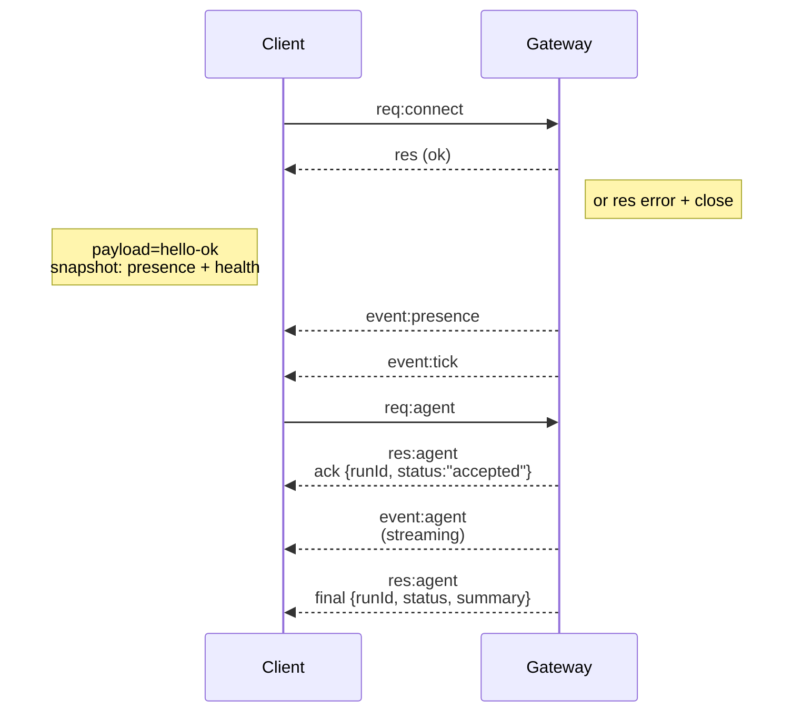

---
read_when:
    - Werken aan Gateway-protocol, clients of transporten
summary: WebSocket-Gateway-architectuur, componenten en clientflows
title: Gateway-architectuur
x-i18n:
    generated_at: "2026-04-29T22:36:43Z"
    model: gpt-5.5
    provider: openai
    source_hash: 91c553489da18b6ad83fc860014f5bfb758334e9789cb7893d4d00f81c650f02
    source_path: concepts/architecture.md
    workflow: 16
---

## Overzicht

- Één langlevende **Gateway** beheert alle berichtenoppervlakken (WhatsApp via
  Baileys, Telegram via grammY, Slack, Discord, Signal, iMessage, WebChat).
- Besturingsvlakclients (macOS-app, CLI, web-UI, automatiseringen) verbinden met de
  Gateway via **WebSocket** op de geconfigureerde bind-host (standaard
  `127.0.0.1:18789`).
- **Nodes** (macOS/iOS/Android/headless) verbinden ook via **WebSocket**, maar
  declareren `role: node` met expliciete caps/opdrachten.
- Eén Gateway per host; dit is de enige plaats die een WhatsApp-sessie opent.
- De **canvas-host** wordt aangeboden door de HTTP-server van de Gateway onder:
  - `/__openclaw__/canvas/` (door agents bewerkbare HTML/CSS/JS)
  - `/__openclaw__/a2ui/` (A2UI-host)
    Deze gebruikt dezelfde poort als de Gateway (standaard `18789`).

## Componenten en flows

### Gateway (daemon)

- Onderhoudt providerverbindingen.
- Biedt een getypeerde WS-API (verzoeken, antwoorden, server-push-events).
- Valideert inkomende frames tegen JSON Schema.
- Zendt events uit zoals `agent`, `chat`, `presence`, `health`, `heartbeat`, `cron`.

### Clients (Mac-app / CLI / webbeheer)

- Eén WS-verbinding per client.
- Verzenden verzoeken (`health`, `status`, `send`, `agent`, `system-presence`).
- Abonneren zich op events (`tick`, `agent`, `presence`, `shutdown`).

### Nodes (macOS / iOS / Android / headless)

- Verbinden met dezelfde **WS-server** met `role: node`.
- Geven een apparaatidentiteit op in `connect`; pairing is **apparaatgebaseerd** (rol `node`) en
  goedkeuring leeft in de apparaat-pairing-store.
- Bieden opdrachten zoals `canvas.*`, `camera.*`, `screen.record`, `location.get`.

Protocoldetails:

- [Gateway-protocol](/nl/gateway/protocol)

### WebChat

- Statische UI die de Gateway WS-API gebruikt voor chatgeschiedenis en verzenden.
- In externe opstellingen verbindt deze via dezelfde SSH/Tailscale-tunnel als andere
  clients.

## Verbindingslevenscyclus (één client)



## Wire-protocol (samenvatting)

- Transport: WebSocket, tekstframes met JSON-payloads.
- Eerste frame **moet** `connect` zijn.
- Na handshake:
  - Verzoeken: `{type:"req", id, method, params}` → `{type:"res", id, ok, payload|error}`
  - Events: `{type:"event", event, payload, seq?, stateVersion?}`
- `hello-ok.features.methods` / `events` zijn discovery-metadata, geen
  gegenereerde dump van elke aanroepbare helperroute.
- Authenticatie met gedeeld geheim gebruikt `connect.params.auth.token` of
  `connect.params.auth.password`, afhankelijk van de geconfigureerde Gateway-authenticatiemodus.
- Modi met identiteit, zoals Tailscale Serve
  (`gateway.auth.allowTailscale: true`) of niet-loopback
  `gateway.auth.mode: "trusted-proxy"`, voldoen aan authenticatie via requestheaders
  in plaats van `connect.params.auth.*`.
- Private-ingress `gateway.auth.mode: "none"` schakelt authenticatie met gedeeld geheim
  volledig uit; houd die modus uit op publieke/niet-vertrouwde ingress.
- Idempotentiesleutels zijn vereist voor methoden met neveneffecten (`send`, `agent`) om
  veilig opnieuw te proberen; de server bewaart een kortlevende deduplicatiecache.
- Nodes moeten `role: "node"` plus caps/opdrachten/machtigingen opnemen in `connect`.

## Pairing + lokaal vertrouwen

- Alle WS-clients (operators + nodes) nemen een **apparaatidentiteit** op bij `connect`.
- Nieuwe apparaat-ID's vereisen pairing-goedkeuring; de Gateway geeft een **apparaat-token**
  uit voor latere verbindingen.
- Directe local loopback-verbindingen kunnen automatisch worden goedgekeurd om de UX op dezelfde host
  soepel te houden.
- OpenClaw heeft ook een smal backend-/containerlokaal zelfverbindingspad voor
  vertrouwde helperflows met gedeeld geheim.
- Tailnet- en LAN-verbindingen, inclusief tailnet-binds op dezelfde host, vereisen nog steeds
  expliciete pairing-goedkeuring.
- Alle verbindingen moeten de `connect.challenge`-nonce ondertekenen.
- Handtekeningpayload `v3` bindt ook `platform` + `deviceFamily`; de gateway
  pint gepairde metadata bij opnieuw verbinden en vereist reparatie-pairing voor metadatawijzigingen.
- **Niet-lokale** verbindingen vereisen nog steeds expliciete goedkeuring.
- Gateway-authenticatie (`gateway.auth.*`) geldt nog steeds voor **alle** verbindingen, lokaal of
  extern.

Details: [Gateway-protocol](/nl/gateway/protocol), [Pairing](/nl/channels/pairing),
[Beveiliging](/nl/gateway/security).

## Protocoltyping en codegen

- TypeBox-schema's definiëren het protocol.
- JSON Schema wordt uit die schema's gegenereerd.
- Swift-modellen worden gegenereerd uit het JSON Schema.

## Externe toegang

- Voorkeur: Tailscale of VPN.
- Alternatief: SSH-tunnel

  ```bash
  ssh -N -L 18789:127.0.0.1:18789 user@host
  ```

- Dezelfde handshake + auth-token gelden via de tunnel.
- TLS + optionele pinning kunnen worden ingeschakeld voor WS in externe opstellingen.

## Operationele momentopname

- Starten: `openclaw gateway` (voorgrond, logs naar stdout).
- Gezondheid: `health` via WS (ook opgenomen in `hello-ok`).
- Supervisie: launchd/systemd voor automatisch herstarten.

## Invarianten

- Precies één Gateway beheert één Baileys-sessie per host.
- Handshake is verplicht; elk eerste frame dat geen JSON of geen connect is, leidt tot een harde sluiting.
- Events worden niet opnieuw afgespeeld; clients moeten vernieuwen bij hiaten.

## Gerelateerd

- [Agent Loop](/nl/concepts/agent-loop) — gedetailleerde uitvoeringscyclus van de agent
- [Gateway Protocol](/nl/gateway/protocol) — WebSocket-protocolcontract
- [Queue](/nl/concepts/queue) — opdrachtenwachtrij en concurrency
- [Security](/nl/gateway/security) — vertrouwensmodel en hardening
