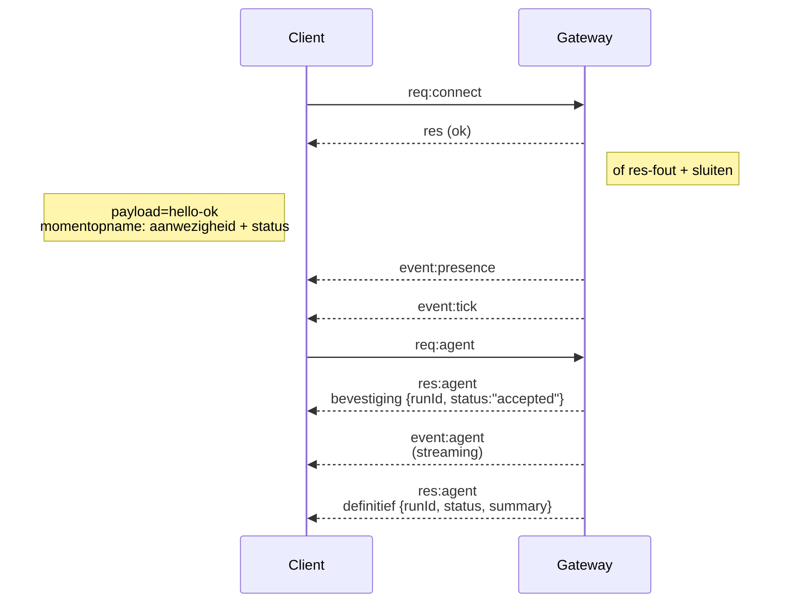

---
read_when:
    - Werken aan het Gateway-protocol, clients of transportlagen
summary: WebSocket-gatewayarchitectuur, componenten en clientstromen
title: Gateway-architectuur
x-i18n:
    generated_at: "2026-07-12T08:45:48Z"
    model: gpt-5.6
    postprocess_version: locale-links-v1
    provider: openai
    source_hash: f8054bd87f738b957c24f8d6965d55365de2293d44902530a9ba778afa597cc7
    source_path: concepts/architecture.md
    workflow: 16
---

## Overzicht

- Eén enkele langlevende **Gateway** beheert alle berichtenkanalen (WhatsApp via
  Baileys, Telegram via grammY, Slack, Discord, Signal, iMessage, WebChat).
- Clients van het besturingsvlak (macOS-app, CLI, webinterface, automatiseringen) maken
  via **WebSocket** verbinding met de Gateway op de geconfigureerde bindhost (standaard
  `127.0.0.1:18789`).
- **Nodes** (macOS/iOS/Android/headless) maken ook via **WebSocket** verbinding, maar
  declareren `role: node` met expliciete capaciteiten/opdrachten.
- Eén Gateway per host; dit is de enige plaats waar een WhatsApp-sessie wordt geopend.
- De **canvashost** wordt aangeboden door de HTTP-server van de Gateway onder:
  - `/__openclaw__/canvas/` (door de agent bewerkbare HTML/CSS/JS)
  - `/__openclaw__/a2ui/` (A2UI-host)

  Deze gebruikt dezelfde poort als de Gateway (standaard `18789`).

## Componenten en stromen

### Gateway (daemon)

- Onderhoudt providerverbindingen.
- Biedt een getypeerde WS-API aan (verzoeken, antwoorden, server-pushgebeurtenissen).
- Valideert inkomende frames aan de hand van JSON Schema.
- Genereert gebeurtenissen zoals `agent`, `chat`, `presence`, `health`, `heartbeat`, `cron`.

### Clients (Mac-app / CLI / webbeheer)

- Eén WS-verbinding per client.
- Verzenden verzoeken (`health`, `status`, `send`, `agent`, `system-presence`).
- Abonneren zich op gebeurtenissen (`tick`, `agent`, `presence`, `shutdown`).

### Nodes (macOS / iOS / Android / headless)

- Maken verbinding met **dezelfde WS-server** met `role: node`.
- Geven een apparaatidentiteit op in `connect`; koppeling is **apparaatgebaseerd** (rol `node`) en
  goedkeuring wordt opgeslagen in het apparaatkoppelingsarchief.
- Bieden opdrachten aan zoals `canvas.*`, `camera.*`, `screen.record`, `location.get`.

Protocoldetails: [Gateway-protocol](/nl/gateway/protocol)

### WebChat

- Statische interface die de WS-API van de Gateway gebruikt voor chatgeschiedenis en het verzenden van berichten.
- In externe configuraties maakt deze verbinding via dezelfde SSH-/Tailscale-tunnel als andere
  clients.

## Verbindingslevenscyclus (één client)



## Draadprotocol (samenvatting)

- Transport: WebSocket, tekstframes met JSON-payloads.
- Het eerste frame **moet** `connect` zijn.
- Na de handshake:
  - Verzoeken: `{type:"req", id, method, params}` → `{type:"res", id, ok, payload|error}`
  - Gebeurtenissen: `{type:"event", event, payload, seq?, stateVersion?}`
- `hello-ok.features.methods` / `events` zijn metagegevens voor detectie, geen
  gegenereerde dump van elke aanroepbare hulproute.
- Authenticatie met een gedeeld geheim gebruikt `connect.params.auth.token` of
  `connect.params.auth.password`, afhankelijk van de geconfigureerde authenticatiemodus van de Gateway.
- Modi die identiteit bevatten, zoals Tailscale Serve
  (`gateway.auth.allowTailscale: true`) of niet-loopback
  `gateway.auth.mode: "trusted-proxy"`, voldoen aan de authenticatievereisten via verzoekheaders
  in plaats van via `connect.params.auth.*`.
- `gateway.auth.mode: "none"` voor privé-inkomend verkeer schakelt authenticatie met een gedeeld geheim
  volledig uit; gebruik die modus niet voor openbaar/niet-vertrouwd inkomend verkeer.
- Idempotentiesleutels zijn vereist voor methoden met neveneffecten (`send`, `agent`) om
  veilig opnieuw te proberen; de server bewaart een kortstondige cache voor deduplicatie.
- Nodes moeten `role: "node"` plus capaciteiten/opdrachten/machtigingen opnemen in `connect`.

## Koppeling en lokaal vertrouwen

- Alle WS-clients (operators + Nodes) nemen een **apparaatidentiteit** op in `connect`.
- Nieuwe apparaat-ID's vereisen goedkeuring voor koppeling; de Gateway verstrekt een **apparaattoken**
  voor volgende verbindingen.
- Directe verbindingen via local loopback kunnen automatisch worden goedgekeurd om de gebruikerservaring
  op dezelfde host soepel te houden.
- OpenClaw heeft ook een beperkt zelfverbindingspad dat lokaal is voor de backend/container, voor
  vertrouwde hulpstromen met een gedeeld geheim.
- Verbindingen via tailnet en LAN, inclusief tailnet-bindings op dezelfde host, vereisen nog steeds
  expliciete goedkeuring voor koppeling.
- Alle verbindingen moeten de nonce `connect.challenge` ondertekenen. Ondertekeningspayload `v3`
  bindt ook `platform` en `deviceFamily`; de Gateway zet gekoppelde metagegevens vast bij
  opnieuw verbinden en vereist herstelkoppeling voor wijzigingen in metagegevens.
- **Niet-lokale** verbindingen vereisen nog steeds expliciete goedkeuring.
- Gateway-authenticatie (`gateway.auth.*`) is nog steeds van toepassing op **alle** verbindingen, lokaal of
  extern.

Details: [Gateway-protocol](/nl/gateway/protocol), [Koppeling](/nl/channels/pairing),
[Beveiliging](/nl/gateway/security).

## Protocoltypering en codegeneratie

- TypeBox-schema's definiëren het protocol.
- JSON Schema wordt uit die schema's gegenereerd.
- Swift-modellen worden uit het JSON Schema gegenereerd.

## Externe toegang

- Bij voorkeur: Tailscale of VPN.
- Alternatief: SSH-tunnel

  ```bash
  ssh -N -L 18789:127.0.0.1:18789 user@gateway-host
  ```

- Dezelfde handshake en hetzelfde authenticatietoken zijn van toepassing via de tunnel.
- TLS en optionele pinning kunnen worden ingeschakeld voor WS in externe configuraties.

## Operationele momentopname

- Starten: `openclaw gateway` (op de voorgrond, logt naar stdout).
- Status: `health` via WS (ook opgenomen in `hello-ok`).
- Procesbewaking: launchd/systemd voor automatisch opnieuw starten.

## Invarianten

- Precies één Gateway beheert per host één Baileys-sessie.
- De handshake is verplicht; elk eerste frame dat geen JSON of geen `connect` is, leidt tot een onmiddellijke sluiting.
- Gebeurtenissen worden niet opnieuw afgespeeld; clients moeten vernieuwen bij hiaten.

## Gerelateerd

- [Agentcyclus](/nl/concepts/agent-loop) — gedetailleerde uitvoeringscyclus van de agent
- [Gateway-protocol](/nl/gateway/protocol) — WebSocket-protocolcontract
- [Wachtrij](/nl/concepts/queue) — opdrachtwachtrij en gelijktijdigheid
- [Beveiliging](/nl/gateway/security) — vertrouwensmodel en versterking
