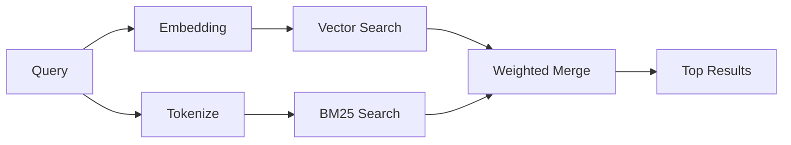

---
read_when:
    - Je wilt begrijpen hoe memory_search werkt
    - Je wilt een embeddingprovider kiezen
    - Je wilt de zoekkwaliteit afstemmen
summary: Hoe geheugenzoekopdrachten relevante notities vinden met embeddings en hybride informatieophaling
title: Geheugen zoeken
x-i18n:
    generated_at: "2026-04-29T22:38:51Z"
    model: gpt-5.5
    provider: openai
    source_hash: 3e6c44d90f49a797bda01b9a575928c128a334f89ae14fc3620e65562a866aa9
    source_path: concepts/memory-search.md
    workflow: 16
---

`memory_search` vindt relevante notities uit je geheugenbestanden, zelfs wanneer de
bewoording afwijkt van de oorspronkelijke tekst. Het werkt door geheugen in kleine
chunks te indexeren en die te doorzoeken met embeddings, trefwoorden of beide.

## Snel aan de slag

Als je een GitHub Copilot-abonnement, of een API-sleutel voor OpenAI, Gemini, Voyage of Mistral
hebt geconfigureerd, werkt geheugenzoekopdracht automatisch. Een provider expliciet instellen:

```json5
{
  agents: {
    defaults: {
      memorySearch: {
        provider: "openai", // or "gemini", "local", "ollama", etc.
      },
    },
  },
}
```

Voor configuraties met meerdere eindpunten kan `provider` ook een aangepaste
`models.providers.<id>`-vermelding zijn, zoals `ollama-5080`, wanneer die provider
`api: "ollama"` of een andere eigenaar van een embeddingadapter instelt.

Voor lokale embeddings zonder API-sleutel installeer je het optionele runtimepakket
`node-llama-cpp` naast OpenClaw en gebruik je `provider: "local"`.

Sommige OpenAI-compatibele embedding-eindpunten vereisen asymmetrische labels zoals
`input_type: "query"` voor zoekopdrachten en `input_type: "document"` of `"passage"`
voor geïndexeerde chunks. Configureer die met `memorySearch.queryInputType` en
`memorySearch.documentInputType`; zie de [referentie voor geheugenconfiguratie](/nl/reference/memory-config#provider-specific-config).

## Ondersteunde providers

| Provider       | ID               | API-sleutel nodig | Opmerkingen                                               |
| -------------- | ---------------- | ----------------- | --------------------------------------------------------- |
| Bedrock        | `bedrock`        | Nee               | Automatisch gedetecteerd wanneer de AWS-credentialketen resolveert |
| Gemini         | `gemini`         | Ja                | Ondersteunt indexering van afbeeldingen/audio             |
| GitHub Copilot | `github-copilot` | Nee               | Automatisch gedetecteerd, gebruikt Copilot-abonnement     |
| Local          | `local`          | Nee               | GGUF-model, download van ~0,6 GB                          |
| Mistral        | `mistral`        | Ja                | Automatisch gedetecteerd                                  |
| Ollama         | `ollama`         | Nee               | Lokaal, moet expliciet worden ingesteld                   |
| OpenAI         | `openai`         | Ja                | Automatisch gedetecteerd, snel                            |
| Voyage         | `voyage`         | Ja                | Automatisch gedetecteerd                                  |

## Hoe zoeken werkt

OpenClaw voert twee ophaalpaden parallel uit en voegt de resultaten samen:



- **Vectorzoekopdracht** vindt notities met vergelijkbare betekenis ("gateway host" komt overeen met
  "de machine waarop OpenClaw draait").
- **BM25-trefwoordzoekopdracht** vindt exacte overeenkomsten (ID's, foutstrings, configuratiesleutels).

Als slechts één pad beschikbaar is (geen embeddings of geen FTS), wordt alleen dat pad uitgevoerd.

Wanneer embeddings niet beschikbaar zijn, gebruikt OpenClaw nog steeds lexicale ranking over FTS-resultaten in plaats van alleen terug te vallen op ruwe volgorde op basis van exacte overeenkomsten. Die gedegradeerde modus geeft chunks met sterkere dekking van zoektermen en relevante bestandspaden een hogere score, waardoor recall bruikbaar blijft, zelfs zonder `sqlite-vec` of een embeddingprovider.

## Zoekkwaliteit verbeteren

Twee optionele functies helpen wanneer je een grote notitiegeschiedenis hebt:

### Temporale verzwakking

Oude notities verliezen geleidelijk rankinggewicht, zodat recente informatie eerst naar voren komt.
Met de standaardhalveringstijd van 30 dagen scoort een notitie van vorige maand op 50% van
het oorspronkelijke gewicht. Evergreen-bestanden zoals `MEMORY.md` worden nooit verzwakt.

<Tip>
Schakel temporale verzwakking in als je agent maanden aan dagelijkse notities heeft en verouderde
informatie recente context blijft overtreffen.
</Tip>

### MMR (diversiteit)

Vermindert redundante resultaten. Als vijf notities allemaal dezelfde routerconfiguratie noemen, zorgt MMR
ervoor dat de bovenste resultaten verschillende onderwerpen dekken in plaats van te herhalen.

<Tip>
Schakel MMR in als `memory_search` bijna-duplicaatfragmenten uit
verschillende dagelijkse notities blijft teruggeven.
</Tip>

### Beide inschakelen

```json5
{
  agents: {
    defaults: {
      memorySearch: {
        query: {
          hybrid: {
            mmr: { enabled: true },
            temporalDecay: { enabled: true },
          },
        },
      },
    },
  },
}
```

## Multimodaal geheugen

Met Gemini Embedding 2 kun je afbeeldingen en audiobestanden naast
Markdown indexeren. Zoekopdrachten blijven tekst, maar ze matchen met visuele en audio-inhoud.
Zie de [referentie voor geheugenconfiguratie](/nl/reference/memory-config) voor
de installatie.

## Zoekopdracht in sessiegeheugen

Je kunt optioneel sessietranscripten indexeren, zodat `memory_search`
eerdere gesprekken kan herinneren. Dit is opt-in via
`memorySearch.experimental.sessionMemory`. Zie de
[configuratiereferentie](/nl/reference/memory-config) voor details.

## Probleemoplossing

**Geen resultaten?** Voer `openclaw memory status` uit om de index te controleren. Als die leeg is, voer je
`openclaw memory index --force` uit.

**Alleen trefwoordovereenkomsten?** Je embeddingprovider is mogelijk niet geconfigureerd. Controleer
`openclaw memory status --deep`.

**Time-out bij lokale embeddings?** `ollama`, `lmstudio` en `local` gebruiken standaard een langere
inline batch-time-out. Als de host gewoon traag is, stel je
`agents.defaults.memorySearch.sync.embeddingBatchTimeoutSeconds` in en voer je opnieuw
`openclaw memory index --force` uit.

**CJK-tekst niet gevonden?** Bouw de FTS-index opnieuw op met
`openclaw memory index --force`.

## Verder lezen

- [Active Memory](/nl/concepts/active-memory) -- subagentgeheugen voor interactieve chatsessies
- [Geheugen](/nl/concepts/memory) -- bestandsindeling, backends, tools
- [Referentie voor geheugenconfiguratie](/nl/reference/memory-config) -- alle configuratieknoppen

## Gerelateerd

- [Geheugenoverzicht](/nl/concepts/memory)
- [Active memory](/nl/concepts/active-memory)
- [Ingebouwde geheugenengine](/nl/concepts/memory-builtin)
